# Lab 16 — Monitoring & Init Containers

## 1. Stack Components

- **Prometheus Operator** manages Prometheus-related custom resources and reconciles Prometheus and Alertmanager deployments.
- **Prometheus** scrapes metrics from the cluster and stores them as time-series data.
- **Alertmanager** receives alerts from Prometheus and shows active alert groups.
- **Grafana** provides dashboards for cluster, node, pod, and alert visualization.
- **kube-state-metrics** exports metrics describing Kubernetes resources such as pods, services, PVCs, and StatefulSets.
- **node-exporter** exports low-level node metrics such as CPU, memory, disk, and networking.

## 2. Installation Evidence

The monitoring stack was installed in the `monitoring` namespace with:

```bash
helm upgrade --install monitoring prometheus-community/kube-prometheus-stack \
  --namespace monitoring
```

Verification was performed with:

```bash
kubectl get po,svc -n monitoring
kubectl get po,sts,svc,pvc,cm -n monitoring
```

The screenshots show the main components in `Running` state, including Grafana, Prometheus, Alertmanager, the Operator, `kube-state-metrics`, and `node-exporter`.

### Screenshot — monitoring stack installation

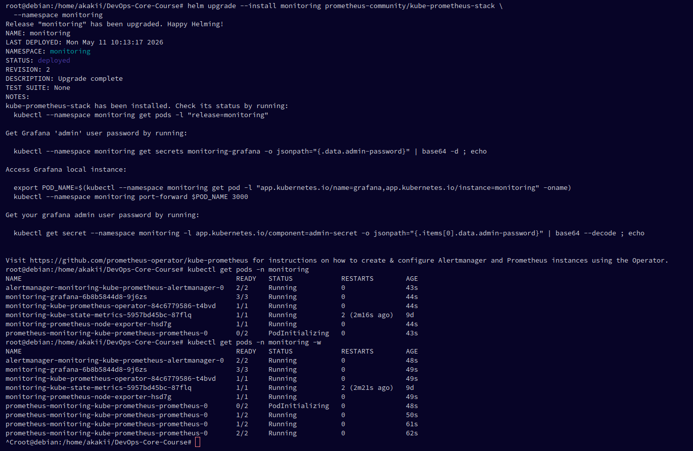

### Screenshot — monitoring resources

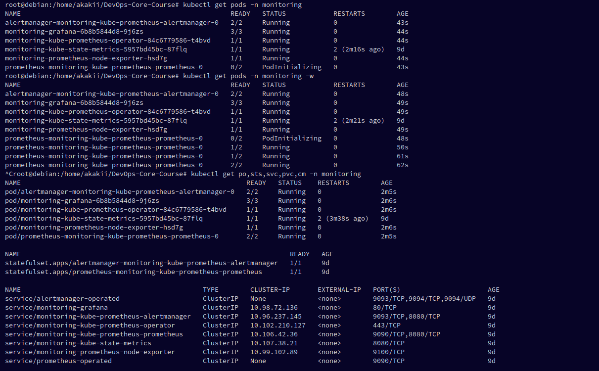

## 3. Dashboard Answers

### 3.1 Pod Resources

The pod dashboard for `app-python-0` shows approximately:

- CPU usage: `0.000600`
- CPU requests: `0.100`
- CPU limits: `0.200`
- memory usage: `27.8 MiB`
- memory request: `128 MiB`
- memory limit: `256 MiB`

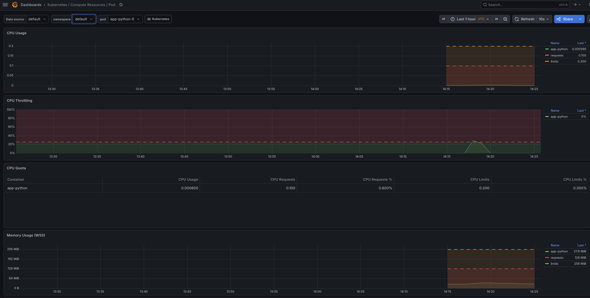

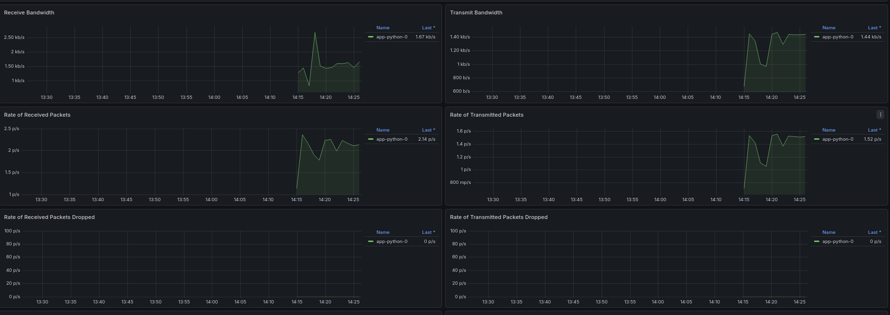

### 3.2 Namespace Analysis

In the `default` namespace:

- highest CPU among application pods: `app-python-2` (`0.000662`)
- lowest CPU among application pods: `app-python-1` (`0.000613`)
- lowest overall CPU: `demo-0` (`0`)

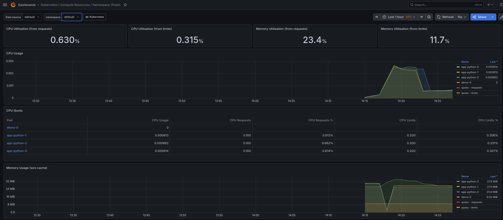

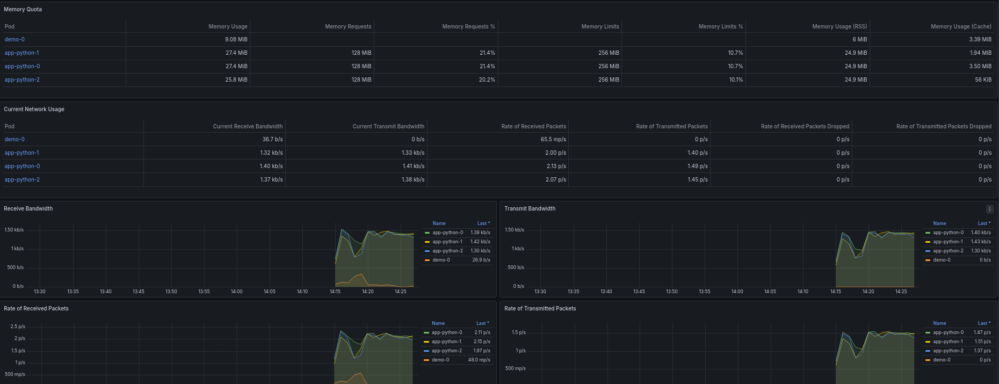

### 3.3 Node Metrics

The node dashboard shows:

- memory usage: `48.8%`
- logical CPU cores: `8`
- approximately half of node RAM in use (`~4.9–5.0 GiB`)

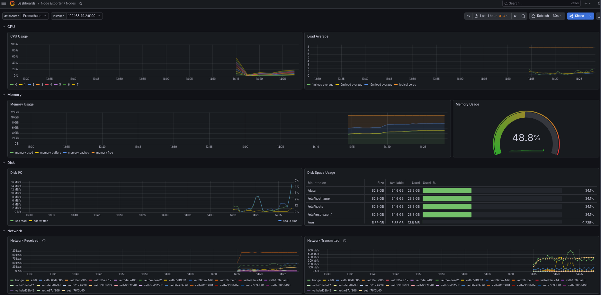

### 3.4 Kubelet

The kubelet dashboard shows:

- Running Pods: `29`
- Running Containers: `64`
- Actual Volume Count: `120`
- Desired Volume Count: `120`

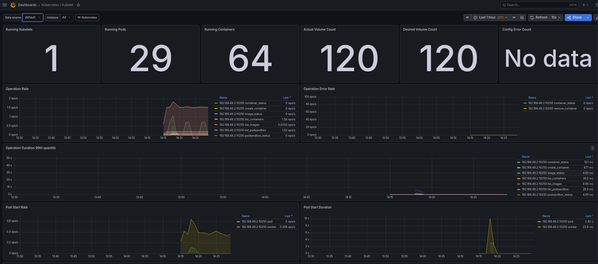

### 3.5 Network

For `app-python-0`:

- receive bandwidth: `1.45 kb/s`
- transmit bandwidth: `1.44 kb/s`
- no packet drops were observed

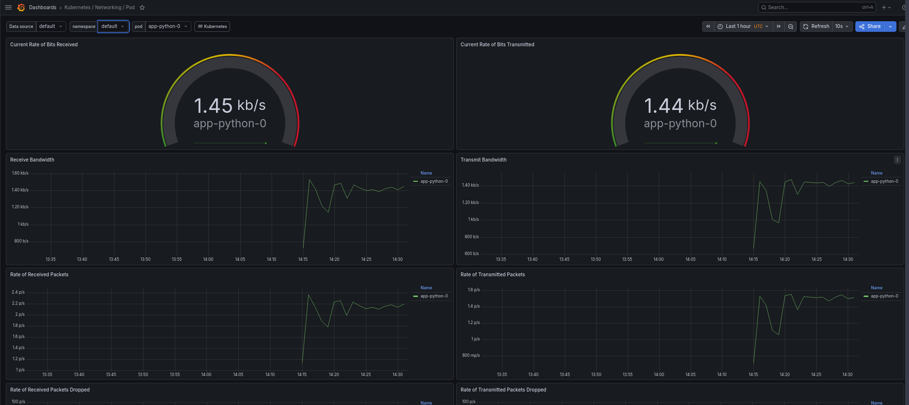

### 3.6 Alerts

Alertmanager showed **5 active alerts**:

- `1` Watchdog alert
- `4` alerts in `kube-system`

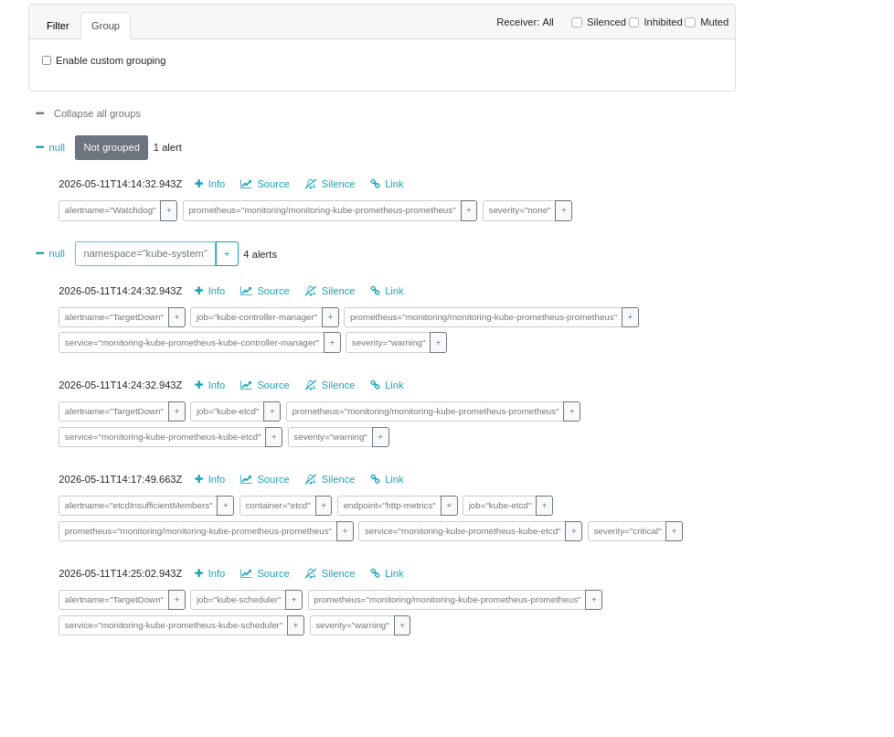

## 4. Init Containers

### 4.1 Download Pattern

A pod with an init container downloaded `http://example.com` into a shared `emptyDir` volume. The main container later accessed the downloaded file.

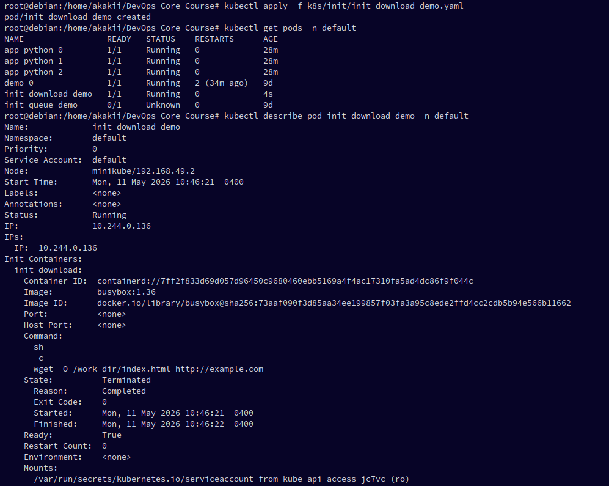

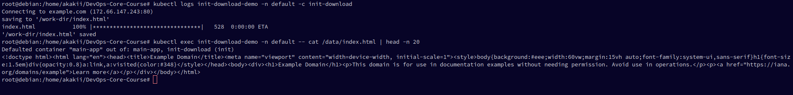

### 4.2 Wait-for-Service Pattern

A separate init container waited until `wait-backend.default.svc.cluster.local` became resolvable. Only after that did the main container start.

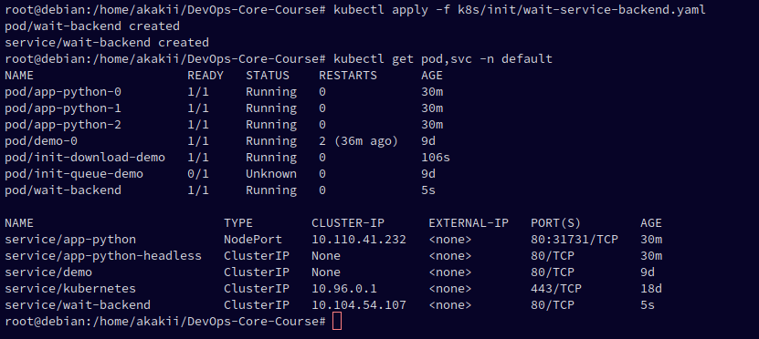

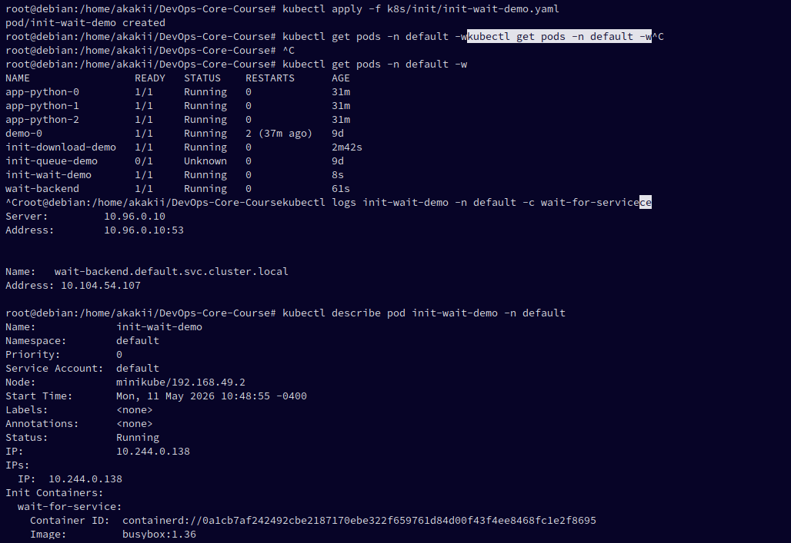

## 5. Bonus Status

The application already exposes `/metrics`, but the provided evidence set does not include a `ServiceMonitor` or Prometheus target validation. Therefore, the bonus task is not claimed here.