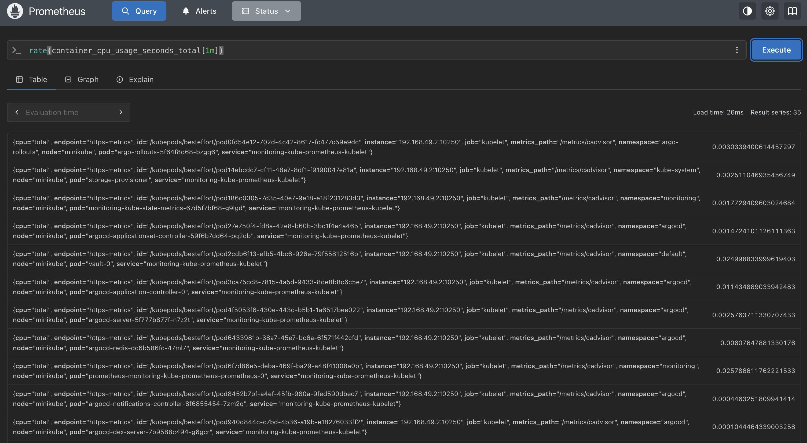
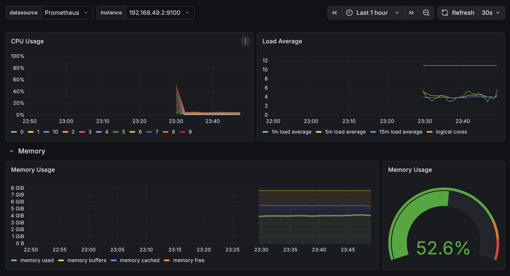
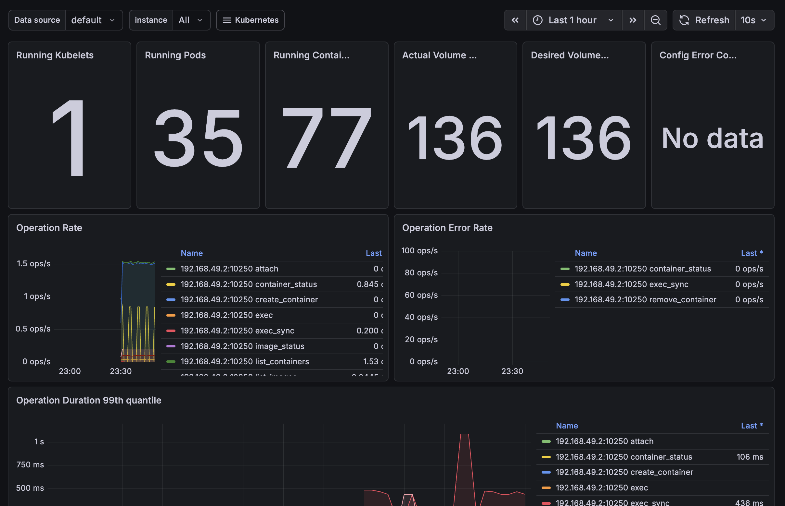
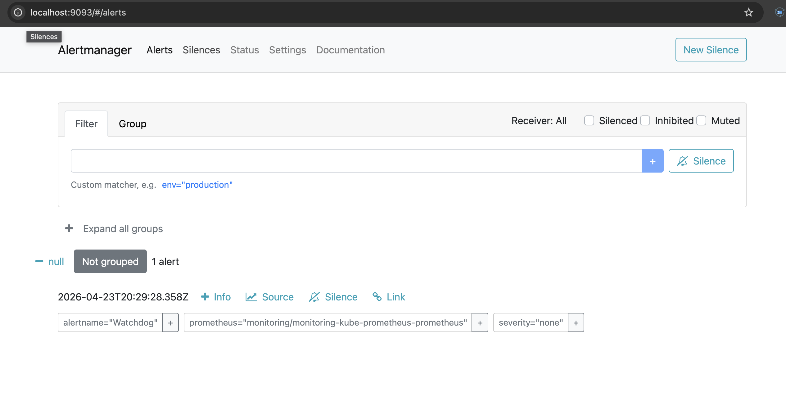

# Lab 16 — Monitoring & Init Containers

## 1. Overview

In this lab, a Kubernetes monitoring stack was deployed using:

- Prometheus
- Grafana
- Alertmanager
- kube-state-metrics
- node-exporter

Additionally, init containers were added to the StatefulSet application.

---

## 2. Monitoring Stack Installation

Installed via Helm:

```
helm upgrade --install monitoring prometheus-community/kube-prometheus-stack \
  --namespace monitoring \
  --create-namespace \
  --version 83.6.0 \
  -f k8s/monitoring-values.yaml
```

---

## 3. Components Verification

```
kubectl get pods -n monitoring
kubectl get svc -n monitoring
```

### Screenshot:


---

## 4. Prometheus

Metrics check:

```
rate(container_cpu_usage_seconds_total[1m])
```

Metrics are successfully collected for all pods.

### Screenshot:


---

## 5. Grafana Dashboards

### 5.1 Pod Metrics

Dashboard:
Kubernetes / Compute Resources / Pod

Observations:

- CPU request: 0.1 core
- CPU limit: 0.3 core
- Actual CPU usage: ~0.01–0.03 core
- Memory request: 128 MiB
- Memory limit: 256 MiB

### Screenshots:


---

### 5.2 Node Metrics

Dashboard:
Node Exporter / Nodes

Observations:

- CPU cores: 11
- Memory usage: ~53%
- Total memory: ~8 GB
- Used memory: ~4–5 GB

### Screenshot:



---

### 5.3 Kubelet Metrics

Dashboard:
Kubernetes / Kubelet

Observations:

- Running pods: 35
- Running containers: 77

### Screenshot:



---

## 6. Network Metrics

Network traffic observed in Pod dashboard:

- Incoming and outgoing traffic present
- Load generated via curl requests

---

## 7. Alerts

Alertmanager доступен по:

http://localhost:9093

Observations:

- 1 active alert: Watchdog
- This is a standard system alert

### Screenshot:



---

## 8. Init Containers

Two init containers were added to the StatefulSet:

### 8.1 init-download

- Downloads a file using wget
- Saves it to a shared volume

### 8.2 wait-for-service

- Waits for headless service availability
- Uses nslookup

---

### Verification

```
kubectl logs python-app-0 -c init-download
```

```
kubectl exec -it python-app-0 -- cat /init-data/index.html
```

```
kubectl exec -it python-app-0 -- cat /data/visits
```

## 9. Persistence

Confirmed:

- each pod has its own PVC
- data persists after pod restart

---

## 10. Conclusion

In this lab:

- a full monitoring stack was deployed
- CPU, memory, and network metrics were collected
- pod, node, and kubelet metrics were analyzed
- init containers were implemented
- StatefulSet persistence was verified

The monitoring system is functioning correctly.