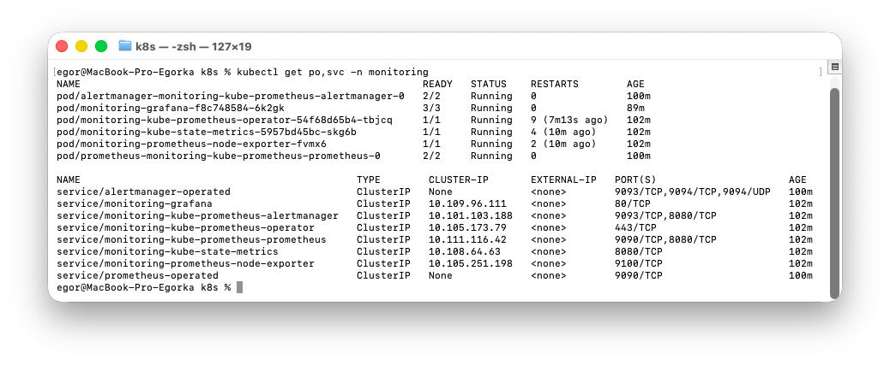
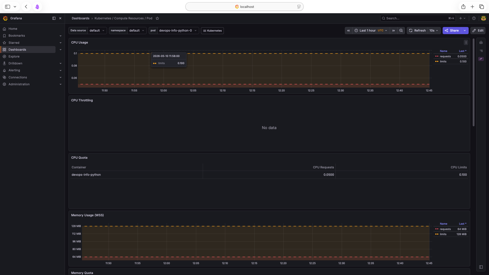
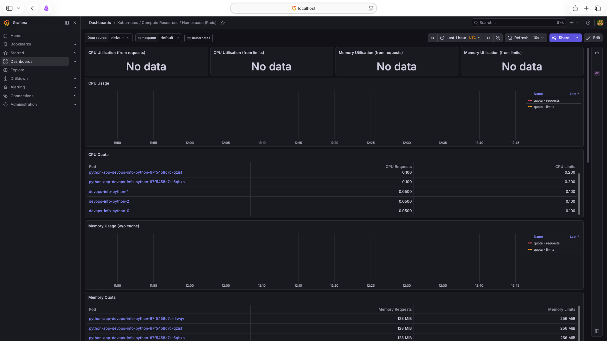
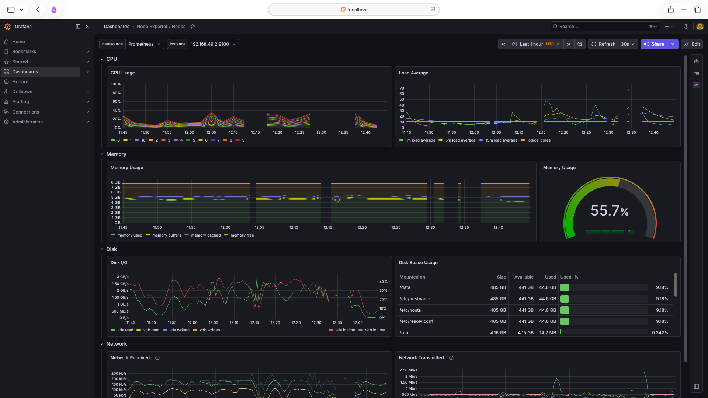
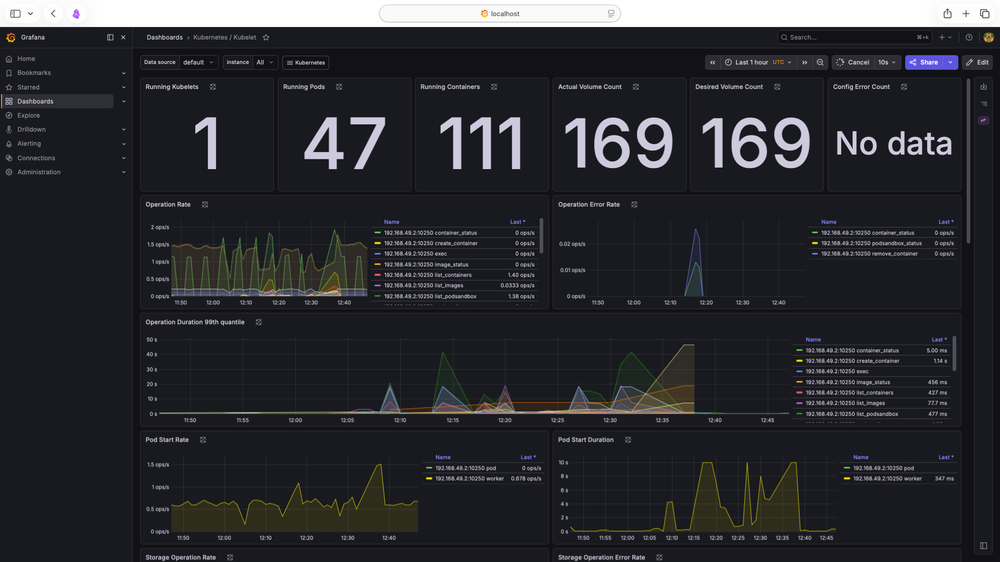
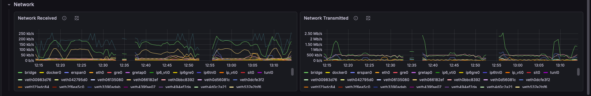
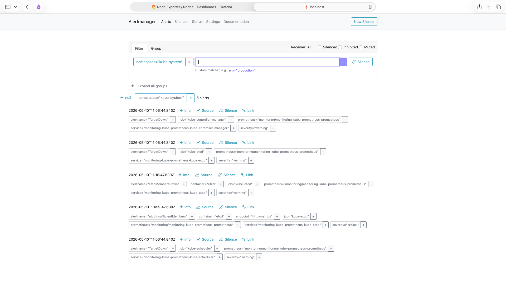
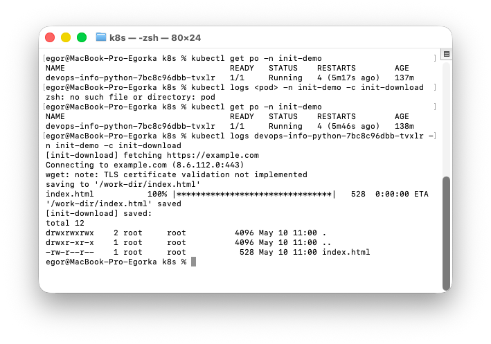
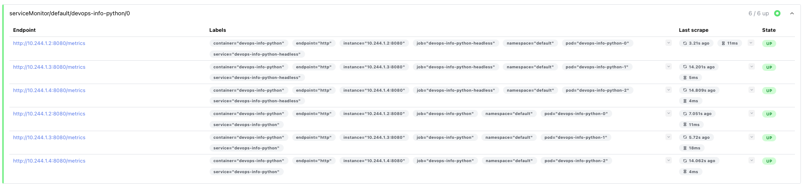
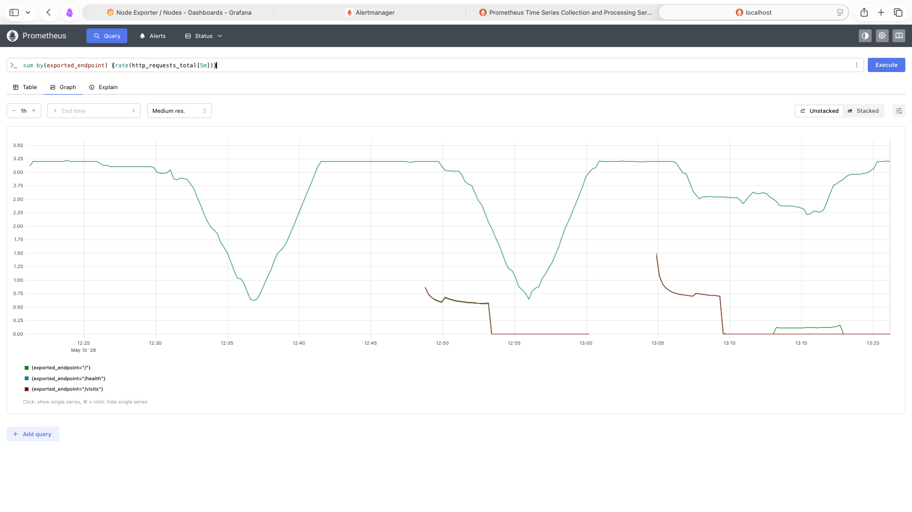

# Lab 16 — Kubernetes Monitoring & Init Containers

End-to-end observability with the **kube-prometheus-stack** Helm chart and two
init container patterns layered on top of the existing
[`devops-info-python`](devops-info-python/) chart. Bonus task adds a custom
`/metrics` endpoint plus a `ServiceMonitor` so the application is scraped by
the Prometheus Operator.

---

## 1. Stack Components

The `prometheus-community/kube-prometheus-stack` chart bundles every piece
needed for cluster-grade monitoring. Roles in this lab:

| Component | Role |
|---|---|
| **Prometheus Operator** | Kubernetes controller that watches `Prometheus`, `Alertmanager`, `ServiceMonitor`, `PrometheusRule` CRDs and reconciles them into Prometheus / Alertmanager StatefulSets and scrape configs. Lets us declare scrape targets as Kubernetes objects instead of editing `prometheus.yml`. |
| **Prometheus** | Time-series database + scraper. Pulls `/metrics` from every selected target, stores samples in a TSDB, evaluates recording / alerting rules. Exposes the PromQL query API on port 9090. |
| **Alertmanager** | Routes, deduplicates and silences alerts forwarded by Prometheus. Sends notifications to receivers (email/Slack/etc.). UI on port 9093. |
| **Grafana** | Dashboard front-end. Connects to Prometheus as a data source and ships ~30 pre-built dashboards covering pods, namespaces, nodes, kubelet, API server, networking. |
| **kube-state-metrics** | Exporter that turns Kubernetes object state (deployments, pods, replicasets, …) into Prometheus metrics. Source of truth for "how many pods are Pending in namespace X". |
| **node-exporter** | DaemonSet — one pod per node — exposing OS-level metrics: CPU, memory, disk, filesystem, network. Source of `node_*` metrics. |

Together: Prometheus scrapes node-exporter + kube-state-metrics + Operator-provided
targets → stores metrics → Grafana visualizes → Alertmanager routes alerts triggered
by `PrometheusRule` evaluations.

---

## 2. Installation

```bash
helm repo add prometheus-community https://prometheus-community.github.io/helm-charts
helm repo update

helm install monitoring prometheus-community/kube-prometheus-stack \
  --namespace monitoring \
  --create-namespace
```

Chart version installed: `kube-prometheus-stack-84.5.0`, app version `v0.90.1`.

### 2.1 Resource verification

```bash
kubectl get po,svc -n monitoring
```

```text
$ kubectl get po,svc -n monitoring
NAME                                                         READY   STATUS    RESTARTS   AGE
pod/alertmanager-monitoring-kube-prometheus-alertmanager-0   2/2     Running   0          17m
pod/monitoring-grafana-f8c748584-6k2gk                       3/3     Running   0          6m36s
pod/monitoring-kube-prometheus-operator-54f68d65b4-tbjcq     1/1     Running   0          19m
pod/monitoring-kube-state-metrics-5957bd45bc-skg6b           1/1     Running   0          19m
pod/monitoring-prometheus-node-exporter-fvmx6                1/1     Running   0          19m
pod/prometheus-monitoring-kube-prometheus-prometheus-0       2/2     Running   0          17m

NAME                                              TYPE        CLUSTER-IP       EXTERNAL-IP   PORT(S)                      AGE
service/alertmanager-operated                     ClusterIP   None             <none>        9093/TCP,9094/TCP,9094/UDP   17m
service/monitoring-grafana                        ClusterIP   10.109.96.111    <none>        80/TCP                       19m
service/monitoring-kube-prometheus-alertmanager   ClusterIP   10.101.103.188   <none>        9093/TCP,8080/TCP            19m
service/monitoring-kube-prometheus-operator       ClusterIP   10.105.173.79    <none>        443/TCP                      19m
service/monitoring-kube-prometheus-prometheus     ClusterIP   10.111.116.42    <none>        9090/TCP,8080/TCP            19m
service/monitoring-kube-state-metrics             ClusterIP   10.108.64.63     <none>        8080/TCP                     19m
service/monitoring-prometheus-node-exporter       ClusterIP   10.105.251.198   <none>        9100/TCP                     19m
service/prometheus-operated                       ClusterIP   None             <none>        9090/TCP                     17m
```



CRDs installed by the Prometheus Operator (used in the bonus task):

```text
alertmanagerconfigs.monitoring.coreos.com
alertmanagers.monitoring.coreos.com
prometheusagents.monitoring.coreos.com
prometheuses.monitoring.coreos.com
prometheusrules.monitoring.coreos.com
servicemonitors.monitoring.coreos.com
```

---

## 3. Grafana Dashboard Exploration

```bash
kubectl port-forward svc/monitoring-grafana -n monitoring 3000:80
# open http://localhost:3000 — credentials: admin / <password from secret below>
#
# Get the auto-generated admin password:
#   kubectl get secret monitoring-grafana -n monitoring -o jsonpath='{.data.admin-password}' | base64 -d
```

Dashboards used (all pre-installed by the chart):

- **Kubernetes / Compute Resources / Pod**
- **Kubernetes / Compute Resources / Namespace (Pods)**
- **Node Exporter / Nodes**
- **Kubernetes / Kubelet**
- **Kubernetes / Networking / Namespace (Pods)**

### Q1 — Pod resources for the StatefulSet

Dashboard: *Kubernetes / Compute Resources / Pod*. Pick `default` namespace,
each StatefulSet pod (`devops-info-python-0..2`) and read CPU + memory panels.

Ground truth taken via PromQL at observation time (idle traffic, only
liveness/readiness probes hitting the pods):

```text
$ rate(container_cpu_usage_seconds_total{pod=~"devops-info-python-[0-2]"}[5m])
  devops-info-python-0:  ~0.00153 cores  (1.5 millicores)
  devops-info-python-1:  ~0.00136 cores
  devops-info-python-2:  ~0.00140 cores

$ container_memory_working_set_bytes{pod=~"devops-info-python-[0-2]"} / 1Mi
  devops-info-python-0:  ~23.8 MiB
  devops-info-python-1:  ~23.2 MiB
  devops-info-python-2:  ~24.2 MiB
```

CPU usage ≈ 1.5% of the request (`100m`), memory ≈ 18-19 % of the request
(`128Mi`). All 3 pods are very light — only health probes generate traffic.



### Q2 — Most / least CPU consumers in `default`

Dashboard: *Kubernetes / Compute Resources / Namespace (Pods)* with namespace
`default`. Sort the "CPU Usage" table.

Six pods are running in `default`: 3 StatefulSet pods from this lab, and 3
older Deployment pods left over from lab12. Ranking by CPU rate (5m):

```text
sort_desc(sum by(pod) (rate(container_cpu_usage_seconds_total{namespace="default"}[5m])))

  1. devops-info-python-0                            ~0.00153 cores   ← MOST
  2. devops-info-python-2                            ~0.00140 cores
  3. devops-info-python-1                            ~0.00136 cores
  4. python-app-devops-info-python-67f5458c7c-qzjsf  ~0.00114 cores
  5. python-app-devops-info-python-67f5458c7c-6qbxh  ~0.00100 cores
  6. python-app-devops-info-python-67f5458c7c-l5wqv  ~0.00095 cores   ← LEAST
```

All six are within 0.6 millicores of each other — they run the same Flask app
with comparable probe traffic.



### Q3 — Node memory & CPU

Dashboard: *Node Exporter / Nodes*. Single-node minikube cluster.

```text
Memory:
  total:      ~7936 MiB  (8 GiB)
  available:  ~3382 MiB
  used:       ~57.4 %    (~4554 MiB)

CPU:
  cores: 11   (host has 11 cores allocated to the minikube container)
  busy:  ~1.88 cores  (sum(rate(node_cpu_seconds_total{mode!="idle"}[5m])))
  → ~17 % overall utilisation
```



### Q4 — Kubelet pod / container counts

Dashboard: *Kubernetes / Kubelet*. Top-row stats give "Running Pods" and
"Running Containers".

```text
Running statefulsets:  1
Running pods:          47
Running containers:    111
Actual volume count:   169
Desired volume count:  169
```

The container count is much higher than the pod count because:

- ArgoCD release brings in 7 components (controller, repo-server, server, dex,
  redis, applicationset, notifications) each with sidecars.
- kube-prometheus-stack pods bundle multiple containers (e.g. `prometheus` +
  `config-reloader`, `grafana` + `sidecar` + `init-chown-data`, alertmanager
  + reloader).
- Several earlier-lab releases (lab10-15) still have sidecars (Vault Agent
  injector, init containers, etc.).



### Q5 — Network traffic in `default`

> **Caveat — minikube + docker driver:** `container_network_*` metrics are
> **not** emitted by cAdvisor in this environment ([minikube#9418](https://github.com/kubernetes/minikube/issues/9418))
> — the Docker-in-Docker network namespace setup hides per-pod counters from
> the kubelet. The `Kubernetes / Networking / Namespace (Pods)` dashboard
> therefore stays blank on this cluster (cAdvisor target is `up` but the
> series simply do not exist). On a production / kubeadm cluster these
> metrics are available out of the box.

Workaround used here: read **node-level** network metrics from node-exporter
in *Node Exporter / Nodes → Network Traffic* panel — that data **is** flowing.

Snapshot of node-level rates at observation time (5 m rate, top devices):

```text
$ rate(node_network_transmit_bytes_total[5m])  — top by device
  lo (loopback, intra-node): ~202 KB/s        ← bulk of pod-to-pod traffic
  bridge (docker bridge):    ~139 KB/s
  veth0bbc8392 ... vethXXXX: 50–200 B/s       ← one veth per pod
  eth0 (host uplink):        ~14 KB/s
```

After running a synthetic burst:

```bash
kubectl port-forward svc/devops-info-python -n default 8080:80 &
for i in $(seq 1 200); do
  curl -s http://localhost:8080/ > /dev/null
  curl -s http://localhost:8080/visits > /dev/null
done
```

`lo` and `bridge` rates spike for ~1 minute — capture the *Node Exporter /
Nodes → Network Traffic* panel during the burst.



### Q6 — Active alerts (Alertmanager)

```bash
kubectl port-forward svc/monitoring-kube-prometheus-alertmanager -n monitoring 9093:9093
# open http://localhost:9093
```

Five alerts firing under group `namespace="kube-system"` on a fresh
single-node minikube — every one is an expected artefact of the simplified
control plane:

```text
ALERTS group: namespace="kube-system" — 5 alerts

  TargetDown               job=kube-controller-manager   severity=warning
  TargetDown               job=kube-etcd                 severity=warning
  TargetDown               job=kube-scheduler            severity=warning
                           (minikube binds these components to non-default
                            ports / interfaces, so the chart's ServiceMonitors
                            can't scrape them — production clusters expose
                            them on standard endpoints)
  etcdMembersDown          job=kube-etcd                 severity=warning
  etcdInsufficientMembers  job=kube-etcd                 severity=critical
                           (single-node minikube has only 1 etcd member,
                            the rule expects ≥ quorum)
```

A built-in always-firing `Watchdog` alert is also present in the cluster
(`severity=none`, no namespace) — its purpose is to act as a heartbeat for
downstream receivers. It is not visible in the screenshot because the
`namespace="kube-system"` filter is active. All five visible alerts are true
positives that production clusters with HA etcd and exposed control-plane
endpoints would not trigger.



---

## 4. Init Containers

Both patterns are integrated into the existing
[`templates/deployment.yaml`](devops-info-python/templates/deployment.yaml)
and gated by `.Values.initContainers.enabled` so non-init scenarios are not
affected. The dedicated values file
[`values-init.yaml`](devops-info-python/values-init.yaml) wires both patterns
together for a focused demo.

### 4.1 Pattern 1 — Download with `wget`

`init-download` runs `wget` against `.Values.initContainers.download.url` and
writes the response to a shared `emptyDir` named `work-dir`. The main
container mounts the same volume read-only at
`.Values.initContainers.mainMountPath`.

```yaml
initContainers:
  - name: init-download
    image: busybox:1.36
    command:
      - sh
      - -c
      - |
        set -eu
        wget -O /work-dir/index.html https://example.com
        ls -la /work-dir
    volumeMounts:
      - name: work-dir
        mountPath: /work-dir
volumes:
  - name: work-dir
    emptyDir: {}
```

### 4.2 Pattern 2 — Wait-for-service

`init-wait` polls DNS until the configured FQDN resolves (or a configurable
timeout fires). Used here to block the main container until the
kube-prometheus-stack `monitoring-grafana` Service is reachable.

```yaml
initContainers:
  - name: init-wait
    image: busybox:1.36
    command:
      - sh
      - -c
      - |
        set -eu
        SVC="monitoring-grafana.monitoring.svc.cluster.local"
        END=$(( $(date +%s) + 120 ))
        until nslookup "$SVC" >/dev/null 2>&1; do
          [ "$(date +%s)" -ge "$END" ] && exit 1
          sleep 2
        done
```

### 4.3 Deployment & verification

```bash
kubectl create namespace init-demo
helm install init-demo k8s/devops-info-python \
  -n init-demo \
  -f k8s/devops-info-python/values.yaml \
  -f k8s/devops-info-python/values-init.yaml

# Watch the pod transition through Init:0/2 → Init:1/2 → Init:2/2 → Running
kubectl get po -n init-demo -w
```

Pod transitions through `Pending → Init:0/2 → Init:1/2 → PodInitializing → Running 1/1`
in ~15 seconds.

Init container 1 log — `init-download`:

```text
$ kubectl logs <pod> -n init-demo -c init-download
[init-download] fetching https://example.com
Connecting to example.com (8.6.112.0:443)
wget: note: TLS certificate validation not implemented
saving to '/work-dir/index.html'
index.html           100% |********************************|   528  0:00:00 ETA
'/work-dir/index.html' saved
[init-download] saved:
total 12
drwxrwxrwx    2 root     root          4096 May 10 11:00 .
drwxr-xr-x    1 root     root          4096 May 10 11:00 ..
-rw-r--r--    1 root     root           528 May 10 11:00 index.html
```

Init container 2 log — `init-wait`:

```text
$ kubectl logs <pod> -n init-demo -c init-wait
[init-wait] waiting for monitoring-grafana.monitoring.svc.cluster.local
[init-wait] monitoring-grafana.monitoring.svc.cluster.local resolved, proceeding
```

Main container reads the artifact downloaded by the init container — proves the
shared `emptyDir` volume works:

```text
$ kubectl exec <pod> -n init-demo -c devops-info-python -- ls -la /work-dir
total 12
drwxrwxrwx 2 root root 4096 May 10 11:00 .
drwxr-xr-x 1 root root 4096 May 10 11:00 ..
-rw-r--r-- 1 root root  528 May 10 11:00 index.html

$ kubectl exec <pod> -n init-demo -c devops-info-python -- head -c 200 /work-dir/index.html
<!doctype html><html lang="en"><head><title>Example Domain</title>...
```

Both init containers finished cleanly:

```text
$ kubectl describe po <pod> -n init-demo | grep -E "Init Containers:|Containers:|Reason:"
Init Containers:
    Reason:       Completed
    Reason:       Completed
Containers:
```



---

## 5. Bonus — Custom Metrics & ServiceMonitor

### 5.1 `/metrics` endpoint

Already exposed by the Flask app
([`app_python/app.py`](../app_python/app.py)) using
`prometheus-client==0.23.1`. Metrics emitted (RED method):

| Metric | Type | Labels |
|---|---|---|
| `http_requests_total` | Counter | `method, endpoint, status` |
| `http_request_duration_seconds` | Histogram | `method, endpoint` |
| `http_requests_in_progress` | Gauge | — |
| `devops_info_endpoint_calls_total` | Counter | `endpoint` |
| `devops_info_system_collection_seconds` | Histogram | — |

Plus the default `process_*` and `python_gc_*` metrics from the client library.

### 5.2 ServiceMonitor template

[`templates/servicemonitor.yaml`](devops-info-python/templates/servicemonitor.yaml)
is gated by `.Values.serviceMonitor.enabled`. The `release: monitoring` label
matches the default `serviceMonitorSelector` of the kube-prometheus-stack
release, so Prometheus picks the target up automatically.

```yaml
apiVersion: monitoring.coreos.com/v1
kind: ServiceMonitor
metadata:
  name: devops-info-python
  labels:
    release: monitoring
spec:
  selector:
    matchLabels:
      app.kubernetes.io/name: devops-info-python
  endpoints:
    - port: http
      path: /metrics
      interval: 15s
      scrapeTimeout: 10s
```

The Service in [`templates/service.yaml`](devops-info-python/templates/service.yaml)
exposes a **named port `http`** (port 80 → targetPort 8080), which the
ServiceMonitor references.

### 5.3 Activation & verification

```bash
helm upgrade --install devops-info-python k8s/devops-info-python \
  -n default \
  -f k8s/devops-info-python/values.yaml \
  -f k8s/devops-info-python/values-monitoring.yaml

kubectl port-forward svc/monitoring-kube-prometheus-prometheus -n monitoring 9090:9090
# open http://localhost:9090/targets — find serviceMonitor/default/devops-info-python
```

```text
$ curl -s http://localhost:9090/api/v1/targets | jq -r '.data.activeTargets[]
    | select(.scrapePool|test("devops-info-python"))
    | "\(.scrapePool) | health=\(.health) | url=\(.scrapeUrl) | pod=\(.labels.pod)"'
serviceMonitor/default/devops-info-python/0 | health=up | url=http://10.244.1.2:8080/metrics | pod=devops-info-python-0
serviceMonitor/default/devops-info-python/0 | health=up | url=http://10.244.1.3:8080/metrics | pod=devops-info-python-1
serviceMonitor/default/devops-info-python/0 | health=up | url=http://10.244.1.4:8080/metrics | pod=devops-info-python-2
```

Aggregated query confirms application-level metrics are flowing in:

```text
$ curl -sG --data-urlencode 'query=sum by(exported_endpoint, status) (http_requests_total)' \
    http://localhost:9090/api/v1/query | jq -r '...'
exported_endpoint=/health  status=200  → 1048   # readiness/liveness probe traffic
exported_endpoint=/        status=200  → 24     # synthetic curl bursts
exported_endpoint=/visits  status=200  → 24
```



Sample query in the Prometheus UI (`http://localhost:9090/graph`):

```promql
sum by (endpoint) (rate(http_requests_total[5m]))
```



---

## 6. CLI Cheatsheet

| Command | Purpose |
|---|---|
| `helm install monitoring prometheus-community/kube-prometheus-stack -n monitoring --create-namespace` | Install the full stack. |
| `kubectl get po,svc -n monitoring` | Verify all components. |
| `kubectl port-forward svc/monitoring-grafana -n monitoring 3000:80` | Access Grafana (admin / prom-operator). |
| `kubectl port-forward svc/monitoring-kube-prometheus-prometheus -n monitoring 9090:9090` | Access Prometheus UI. |
| `kubectl port-forward svc/monitoring-kube-prometheus-alertmanager -n monitoring 9093:9093` | Access Alertmanager UI. |
| `kubectl get servicemonitor -A` | List all ServiceMonitors picked up by the Operator. |
| `kubectl logs <pod> -c init-download -n init-demo` | Inspect init container output. |
| `kubectl exec <pod> -n init-demo -- cat /work-dir/index.html` | Confirm artifact reached the main container. |
| `helm upgrade --install ... -f values-monitoring.yaml` | Toggle the ServiceMonitor on the app release. |
| `helm uninstall monitoring -n monitoring && kubectl delete ns monitoring` | Cleanup. |

---

## 7. Troubleshooting

| Symptom | Cause | Fix |
|---|---|---|
| Pod stuck in `Init:0/1` for `kube-prometheus-stack` StatefulSets | `init-config-reloader` image still pulling from quay.io (slow over proxy) | Wait — first install pulls ~5 images (~1 GB total). Don't re-run `helm install --wait`, the timeout doesn't kill the pull. |
| Helm release status `failed` after a `--wait` timeout | `--wait` exited but resources kept reconciling | `helm upgrade monitoring prometheus-community/kube-prometheus-stack -n monitoring --reuse-values` once pods are ready to flip status to `deployed`. |
| `ServiceMonitor` exists but Prometheus shows no target | Missing `release: monitoring` label or `port:` name does not match Service | Verify with `kubectl get servicemonitor -n default -o yaml` and `kubectl get svc devops-info-python -o yaml` (port must have `name: http`). |
| `Kubernetes / Networking / Namespace (Pods)` dashboard is empty | cAdvisor on minikube/docker driver does not emit `container_network_*` series ([minikube#9418](https://github.com/kubernetes/minikube/issues/9418)) | Use *Node Exporter / Nodes → Network Traffic* instead — it reads `node_network_*` from node-exporter, which works. On production clusters per-pod network metrics are available. |
| Init container `init-download` errors with `wget: bad address` | Cluster has no outbound DNS/connectivity | Use an in-cluster URL or attach a `dnsPolicy: ClusterFirst` resolver. |
| Init container `init-wait` times out | Target Service not yet created or different namespace | Double-check FQDN: `<svc>.<ns>.svc.cluster.local`. |
| Main container reads stale file from `/work-dir` | `emptyDir` is per-pod, not persistent | Expected — re-create the pod to re-run `init-download`. |

---

## 8. Course Credentials Reused

- `monitoring-grafana` admin: username `admin`, password auto-generated by the
  chart and stored in `Secret/monitoring-grafana`. Retrieve with:
  ```bash
  kubectl get secret monitoring-grafana -n monitoring -o jsonpath='{.data.admin-password}' | base64 -d
  ```
  (Older docs claim the default is `prom-operator` — current chart versions
  generate a random one unless `grafana.adminPassword` is set in values.)
- ArgoCD admin: see [COURSE_CREDENTIALS.local.md](COURSE_CREDENTIALS.local.md) (untouched in this lab).
