# Kubernetes Monitoring & Init Containers (Lab 16)

## 1. Stack components (kube-prometheus-stack)

Short descriptions (how each piece fits together):

| Component               | Role                                                                                                                                                                                                                     |
|-------------------------|--------------------------------------------------------------------------------------------------------------------------------------------------------------------------------------------------------------------------|
| **Prometheus Operator** | Kubernetes controller that watches `Prometheus`, `Alertmanager`, `ServiceMonitor`, and related CRDs. It renders Prometheus/Alertmanager configuration and keeps StatefulSets/Secrets in sync with the desired CRD state. |
| **Prometheus**          | Time-series database and scraper. Pulls metrics from ServiceMonitors, kubelet/cAdvisor, node-exporter, and apps, then evaluates recording/alerting rules.                                                                |
| **Alertmanager**        | Receives alerts from Prometheus, deduplicates, groups, routes, and silences them; exposes UI/API on port `9093`.                                                                                                         |
| **Grafana**             | Dashboards on top of Prometheus (bundled datasources + folders). Used here to answer cluster observability questions visually.                                                                                           |
| **kube-state-metrics**  | Exposes Kubernetes API object state as metrics (Pods, Deployments, StatefulSets, …). Powers many “Kubernetes / …” Grafana dashboards.                                                                                    |
| **node-exporter**       | Host-level hardware/OS metrics (CPU, memory, disk, network interfaces) scraped from each node.                                                                                                                           |

---

## 2. Installation (Helm) and verification

### Helm repository and install

```bash
helm repo add prometheus-community https://prometheus-community.github.io/helm-charts
helm repo update

helm upgrade --install monitoring prometheus-community/kube-prometheus-stack \
  --namespace monitoring \
  --create-namespace \
  -f k8s/monitoring/values-kube-prometheus-stack.yaml \
  --wait --timeout 20m
```

Values file used for this lab (smaller requests for Minikube): `k8s/monitoring/values-kube-prometheus-stack.yaml`.

### Evidence — pods and services

```bash
kubectl get pods,svc -n monitoring
```

Result:

```
NAME                                                         READY   STATUS    RESTARTS   AGE
pod/alertmanager-monitoring-kube-prometheus-alertmanager-0   2/2     Running   0          3m43s
pod/monitoring-grafana-57454d54bb-bcjbf                      3/3     Running   0          3m53s
pod/monitoring-kube-prometheus-operator-6b4c47dd76-p89dw     1/1     Running   0          3m54s
pod/monitoring-kube-state-metrics-6694fd7b46-k5ffd           1/1     Running   0          3m54s
pod/monitoring-prometheus-node-exporter-g5rtp                1/1     Running   0          3m54s
pod/prometheus-monitoring-kube-prometheus-prometheus-0       2/2     Running   0          3m43s

NAME                                              TYPE        CLUSTER-IP      EXTERNAL-IP   PORT(S)                      AGE
service/alertmanager-operated                     ClusterIP   None            <none>        9093/TCP,9094/TCP,9094/UDP   3m43s
service/monitoring-grafana                        ClusterIP   10.100.122.38   <none>        80/TCP                       3m54s
service/monitoring-kube-prometheus-alertmanager   ClusterIP   10.99.133.233   <none>        9093/TCP,8080/TCP            3m54s
service/monitoring-kube-prometheus-operator       ClusterIP   10.106.147.18   <none>        443/TCP                      3m54s
service/monitoring-kube-prometheus-prometheus     ClusterIP   10.99.147.77    <none>        9090/TCP,8080/TCP            3m54s
service/monitoring-kube-state-metrics             ClusterIP   10.98.255.112   <none>        8080/TCP                     3m54s
service/monitoring-prometheus-node-exporter       ClusterIP   10.103.0.55     <none>        9100/TCP                     3m54s
service/prometheus-operated                       ClusterIP   None            <none>        9090/TCP                     3m43s
```

### Grafana UI access

```bash
kubectl port-forward svc/monitoring-grafana -n monitoring 3000:80
```

Default credentials for this chart are commonly `admin` / `prom-operator`. To read the generated admin password from the cluster:

```bash
kubectl get secret monitoring-grafana -n monitoring \
  -o jsonpath="{.data.admin-password}" | base64 -d ; echo
```

Result

```
WfJ85J2Asvz8zrkKkNNTpvWPLbPB3quvnoWB0AVV
```

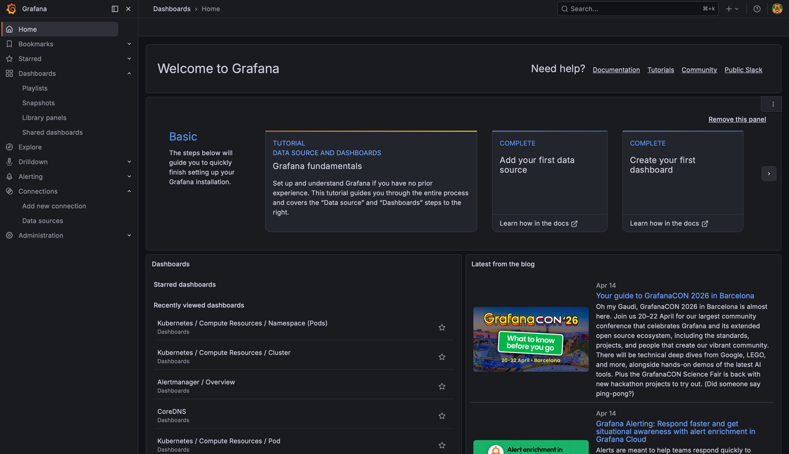

### Prometheus & Alertmanager UI

```bash
kubectl port-forward svc/monitoring-kube-prometheus-prometheus -n monitoring 9090:9090
kubectl port-forward svc/monitoring-kube-prometheus-alertmanager -n monitoring 9093:9093
```

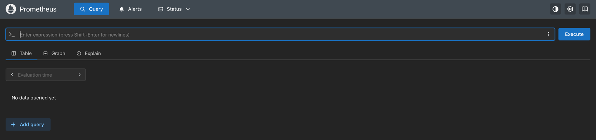
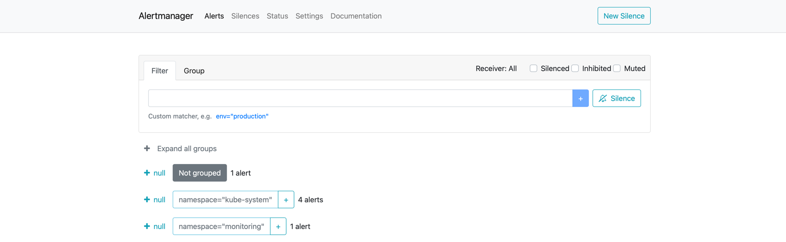
---

## StatefulSet used for Grafana “Pod resources” questions

A dedicated Helm release `lab16-ss` deploys the course chart as a **StatefulSet** (Lab 15 pattern) so dashboards can target a StatefulSet pod (`lab16-ss-0`).

```bash
helm upgrade --install lab16-ss k8s/devops-info-service -n default \
  --set statefulset.enabled=true \
  --set replicaCount=1 \
  --set service.type=ClusterIP \
  --set fullnameOverride=lab16-ss \
  --wait --timeout 5m
```

Evidence:

```bash
kubectl get statefulset,pods,svc -n default | grep lab16
```

Result:

```
statefulset.apps/lab16-ss   1/1     22m
pod/lab16-ss-0                                                1/1     Running   0          22m
service/lab16-ss                                  ClusterIP   10.102.40.164    <none>        80/TCP         22m
service/lab16-ss-headless                         ClusterIP   None             <none>        80/TCP         22m
```

---

## 3. Grafana dashboard answers

### 3.1 Pod resources — CPU/memory of the StatefulSet

- **Grafana:** `Kubernetes / Compute Resources / Pod`.
- **Prometheus:**
  - CPU (cores, 5m rate): `sum(rate(container_cpu_usage_seconds_total{namespace="default",pod="lab16-ss-0"}[5m]))` → ≈ `0.00208`
  - Memory working set: `sum(container_memory_working_set_bytes{namespace="default",pod="lab16-ss-0"})` → `25206784`

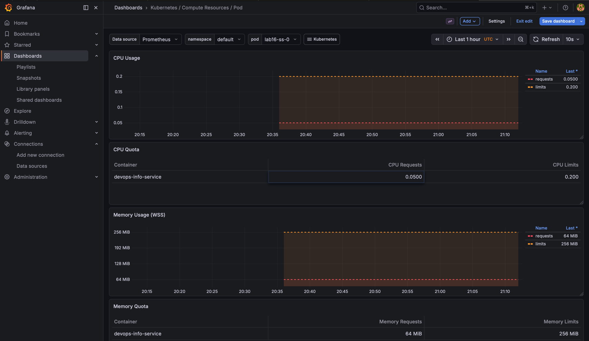
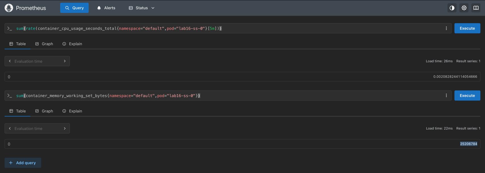

### 3.2 Namespace analysis — which pods use most/least CPU in `default`

- **Grafana:** `Kubernetes / Compute Resources / Namespace (Pods)`.
- **Prometheus:** `sum by (pod)(rate(container_cpu_usage_seconds_total{namespace="default"}[5m]))`
  - **Most CPU:** `lab16-ss-0` (~0.00196 cores).
  - **Least CPU:** `devops-info-service-devops-info-service-9f795d658-swjnd` (~~0.00172 cores), then the other two replicas (~0.00173 / ~0.00177).


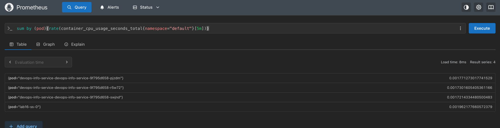

### 3.3 Node metrics — memory %, MB, CPU cores

- **Grafana:** `Node Exporter / Nodes`.
- **Prometheus:**
  - Memory used %: `(1 - (node_memory_MemAvailable_bytes / node_memory_MemTotal_bytes)) * 100` → ≈ `33.088%`
  - Memory total (MiB): `node_memory_MemTotal_bytes / 1024 / 1024` → ≈ `9937.39 MiB`
  - CPU cores: `count(node_cpu_seconds_total{mode="system"})` → `8`

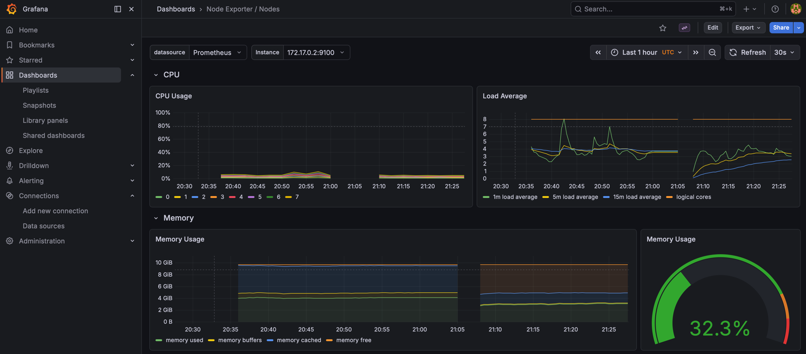
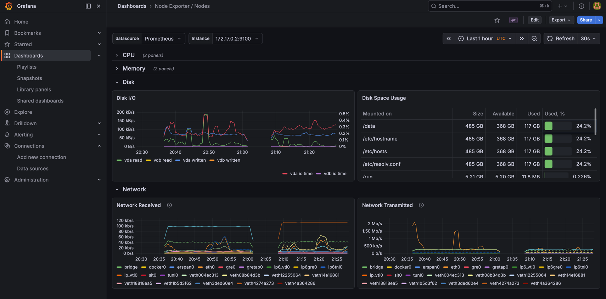
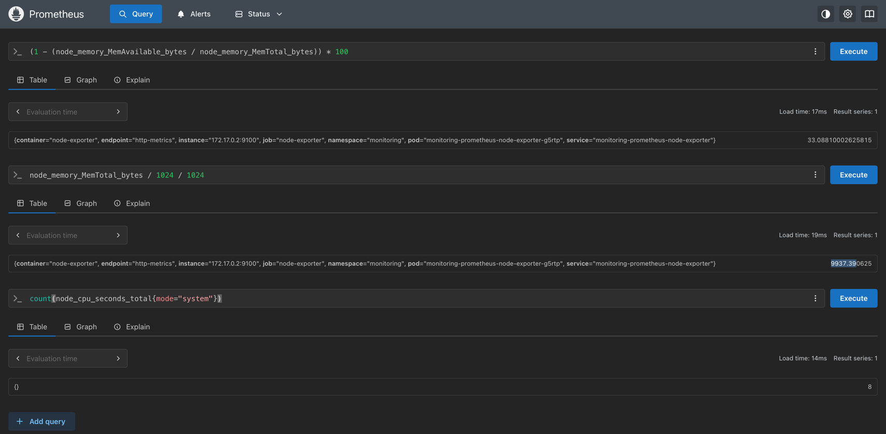

### 3.4 Kubelet — how many pods/containers managed

- **Grafana:** `Kubernetes / Kubelet`.
- **Prometheus:**
  - `kubelet_running_pods` → `25`
  - `sum(kubelet_running_containers{container_state="running"})` → `29`

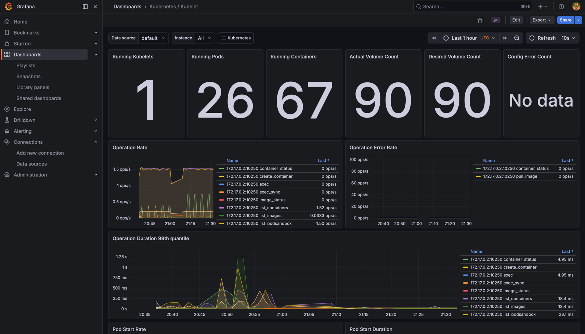
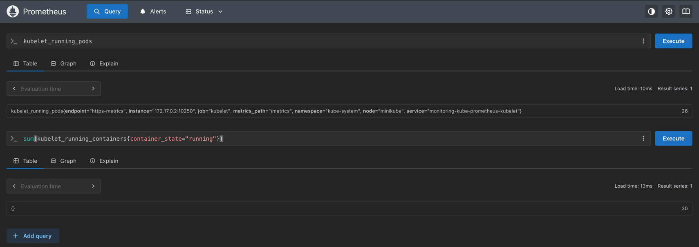

### 3.5 Network — traffic for pods in `default`

- **Grafana:** `Kubernetes / Networking / Namespace (Pods)`.
- **(cluster-specific):** Prometheus did not expose `container_network_receive_bytes_total` time series for pods on my Minikube/CRI setup, so per-pod container network rates were not available via the usual cAdvisor query path.

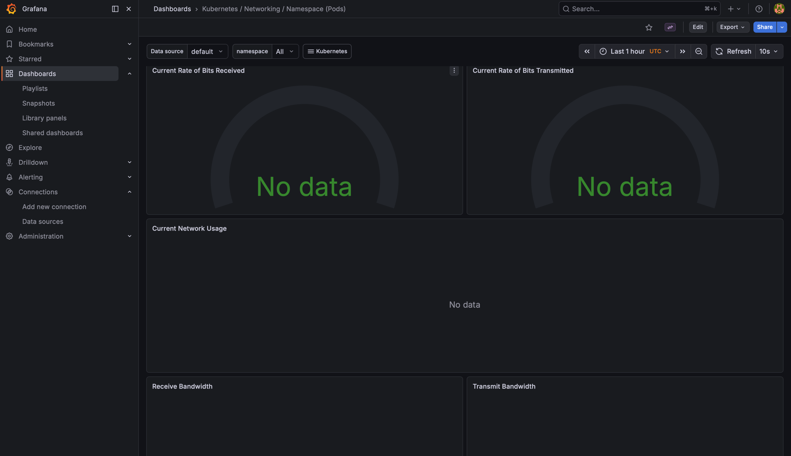

### 3.6 Alerts — how many active alerts

- **Grafana:** alerting views / linked Alertmanager.
- **Alertmanager**


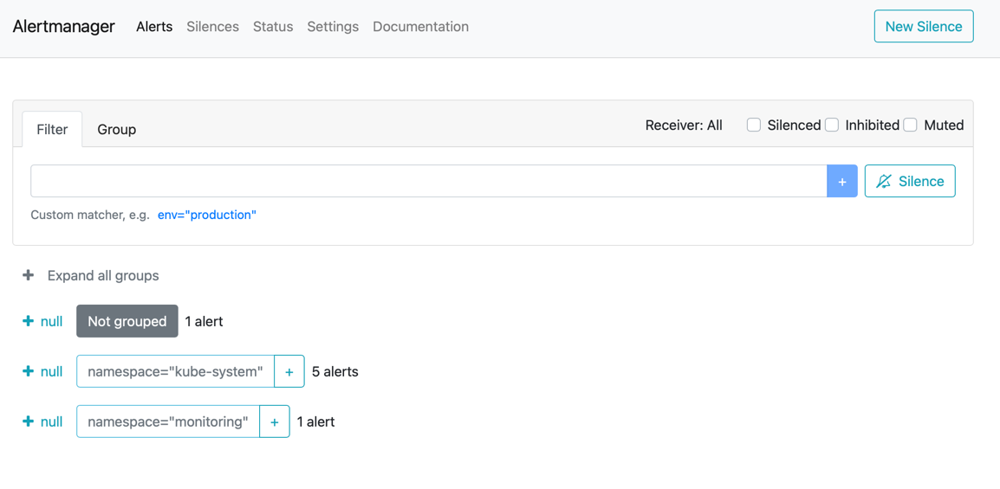

---

## 4. Init containers

### Manifests

All resources are declared in:

- `k8s/lab16-init-containers.yaml`

This file creates:

- Namespace `lab16-init`
- `lab16-dependency` (nginx) + `Service` `lab16-dependency`
- `lab16-download-demo` — `wget` init + shared `emptyDir` + main `busybox` reading `/data`
- `lab16-wait-demo` — init waits for the dependency `Service` before starting the main container

### Apply / verify

```bash
kubectl apply -f k8s/lab16-init-containers.yaml
kubectl rollout status deployment/lab16-download-demo deployment/lab16-wait-demo deployment/lab16-dependency -n lab16-init --timeout=120s
kubectl get pods -n lab16-init
```

Evidence (`kubectl get pods -n lab16-init`):

```
NAME                                   READY   STATUS    RESTARTS   AGE
lab16-dependency-5f6cb55954-xwmvg      1/1     Running   0          2m42s
lab16-download-demo-5d946dbd6f-blxh6   1/1     Running   0          2m42s
lab16-wait-demo-cdf869b4-9m2dt         1/1     Running   0          2m41s
```

### Proof — wget init wrote HTML readable by the main container

```bash
POD=$(kubectl get pod -n lab16-init -l app.kubernetes.io/name=lab16-download-demo -o jsonpath='{.items[0].metadata.name}')
kubectl exec -n lab16-init "$POD" -c main-app -- head -c 120 /data/index.html
kubectl logs -n lab16-init deploy/lab16-download-demo -c init-download
```

Observed:

```
<!doctype html><html lang="en"><head><title>Example Domain</title><meta name="viewport" content="width=device-width, ini
wget: note: TLS certificate validation not implemented
```

- `/data/index.html` begins with `<!doctype html>…` (Example Domain HTML).
- Init logs include `wget: note: TLS certificate validation not implemented` (expected for busybox `wget`).


### Proof — wait-for-service pattern

```bash
kubectl logs -n lab16-init deploy/lab16-wait-demo -c wait-for-service
```

Observed log tail:

```
dependency is ready
```

---

## 6. Bonus — `/metrics`, `ServiceMonitor`, Prometheus scrape proof

The Python service already exposes `/metrics` via `prometheus_client`.

### ServiceMonitor manifest

- `k8s/monitoring/servicemonitor-devops-info-service.yaml`

Important details:

- `metadata.labels.release: monitoring` matches the kube-prometheus-stack Helm release name (`monitoring`), which is how the chart’s Prometheus instance selects `ServiceMonitor` objects.
- The chart’s headless `Service` shares the same `app.kubernetes.io/*` labels as the main `Service`, which would create duplicate scrape targets. The Helm chart adds `app.kubernetes.io/component: headless` only to the headless `Service`, and the `ServiceMonitor` uses `matchExpressions` (`app.kubernetes.io/component` **DoesNotExist**) to select **only** the ClusterIP `Service`.

### Apply

```bash
kubectl apply -f k8s/monitoring/servicemonitor-devops-info-service.yaml
```

### Prometheus target health

After the selector fix, Prometheus shows the target as **up**:

```bash
kubectl port-forward svc/monitoring-kube-prometheus-prometheus -n monitoring 9090:9090
```

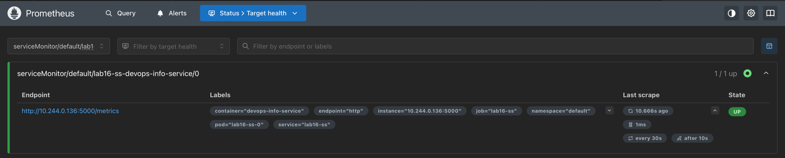

### Metrics visible in Prometheus (example series)

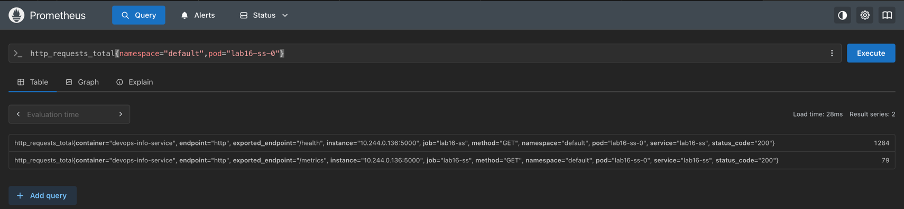