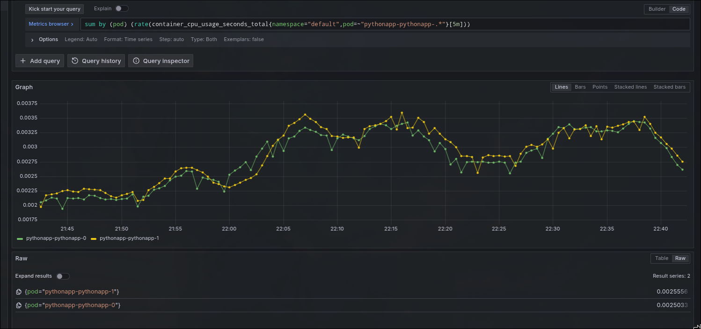
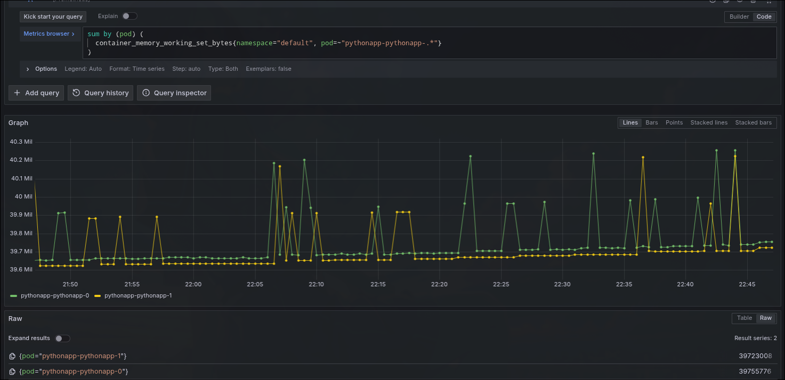
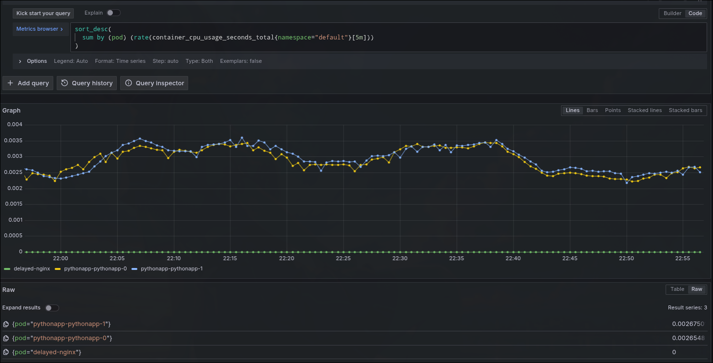
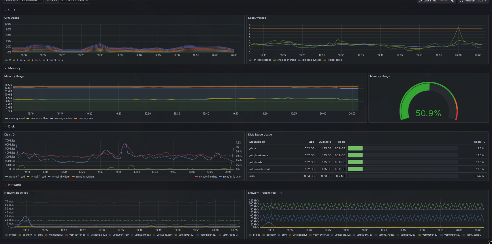
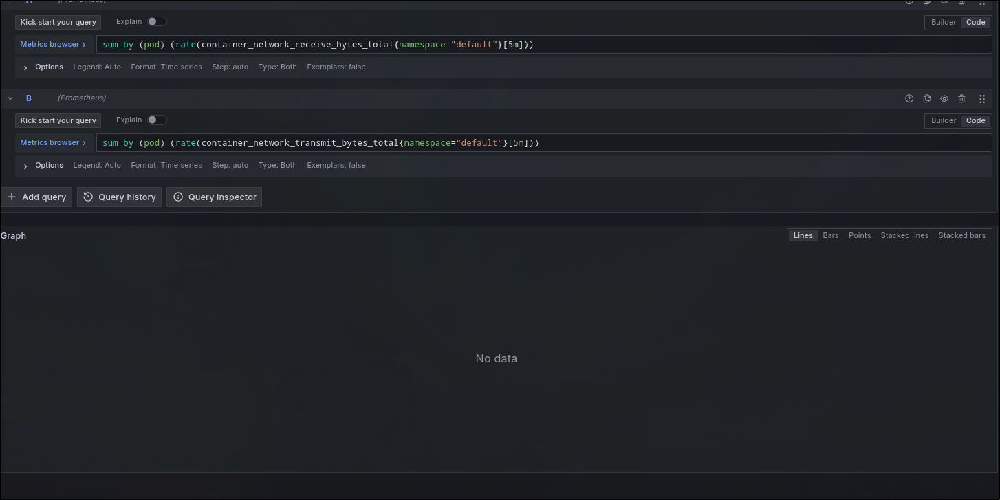
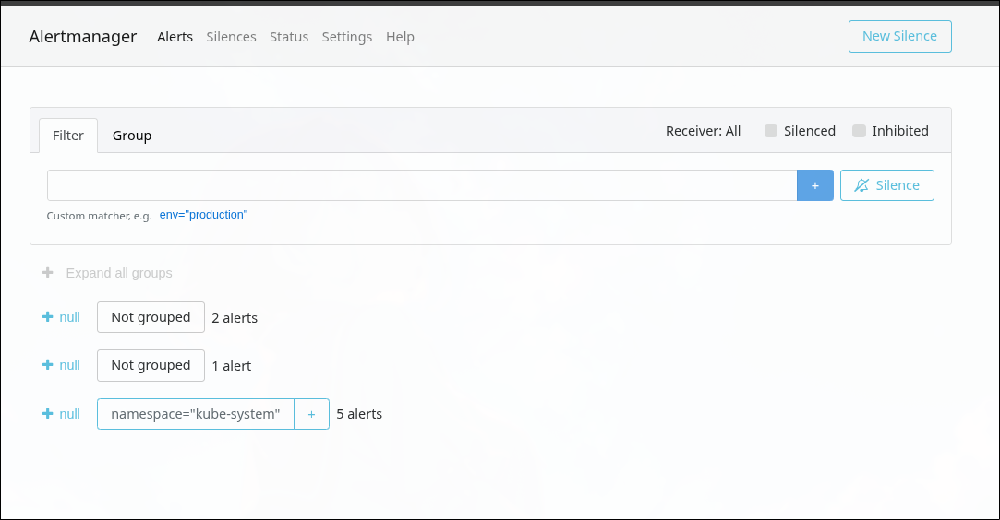

# Lab 16 - Kubernetes Monitoring and Init Containers

## 1) Kube-Prometheus Stack Components

- **Prometheus Operator**: Kubernetes controller that manages Prometheus ecosystem CRDs and reconciles Prometheus/Alertmanager rules and configs.
- **Prometheus**: Time-series database and scraper that pulls metrics from Kubernetes targets and evaluates alerting/recording rules.
- **Alertmanager**: Receives alerts from Prometheus, groups/deduplicates them, and routes notifications.
- **Grafana**: Visualization layer for metrics dashboards and ad-hoc analysis.
- **kube-state-metrics**: Exposes Kubernetes object state (deployments, pods, nodes, etc.) as metrics.
- **node-exporter**: Exposes host/node-level metrics (CPU, memory, disk, network).

## 2) Installation Steps

> Note: direct Helm repo endpoint timed out in this environment, so installation was completed via OCI chart source.

```bash
mkdir -p .helm/config .helm/cache .helm/data

HELM_CONFIG_HOME=$PWD/.helm/config \
HELM_CACHE_HOME=$PWD/.helm/cache \
HELM_DATA_HOME=$PWD/.helm/data \
helm install monitoring oci://ghcr.io/prometheus-community/charts/kube-prometheus-stack \
  --version 65.8.1 \
  --namespace monitoring \
  --create-namespace
```

## 3) Installation Evidence

Command:

```bash
kubectl get po,svc -n monitoring
```

Output snapshot:

```text
NAME                                                         READY   STATUS    RESTARTS   AGE
pod/alertmanager-monitoring-kube-prometheus-alertmanager-0   2/2     Running   0          2m40s
pod/monitoring-grafana-69db76f9b4-46dnl                      3/3     Running   0          3m6s
pod/monitoring-kube-prometheus-operator-d5dbb45f9-g2v6x      1/1     Running   0          3m6s
pod/monitoring-kube-state-metrics-75c9d8f7c7-hn7kr           1/1     Running   0          3m6s
pod/monitoring-prometheus-node-exporter-rmk2g                1/1     Running   0          3m6s
pod/prometheus-monitoring-kube-prometheus-prometheus-0       2/2     Running   0          2m40s

NAME                                              TYPE        CLUSTER-IP       EXTERNAL-IP   PORT(S)                      AGE
service/alertmanager-operated                     ClusterIP   None             <none>        9093/TCP,9094/TCP,9094/UDP   2m40s
service/monitoring-grafana                        ClusterIP   10.106.162.222   <none>        80/TCP                       3m6s
service/monitoring-kube-prometheus-alertmanager   ClusterIP   10.99.248.249    <none>        9093/TCP,8080/TCP            3m6s
service/monitoring-kube-prometheus-operator       ClusterIP   10.101.104.249   <none>        443/TCP                      3m6s
service/monitoring-kube-prometheus-prometheus     ClusterIP   10.108.157.193   <none>        9090/TCP,8080/TCP            3m6s
service/monitoring-kube-state-metrics             ClusterIP   10.99.102.127    <none>        8080/TCP                     3m6s
service/monitoring-prometheus-node-exporter       ClusterIP   10.105.50.0      <none>        9100/TCP                     3m6s
service/prometheus-operated                       ClusterIP   None             <none>        9090/TCP                     2m40s
```

## 4) Grafana — lab questions and screenshots

Access:

```bash
kubectl port-forward svc/monitoring-grafana -n monitoring 3000:80

kubectl port-forward svc/monitoring-kube-prometheus-alertmanager -n monitoring 9093:9093
```

The bundled **Kubernetes / Compute Resources / Namespace (Pods)** and **Node (Pods)** dashboards showed **resource requests/limits** but left **usage** panels empty on Minikube. **Grafana Explore** (Prometheus datasource) and the dashboards below still provide evidence.

### 1) Pod resources (StatefulSet)

**CPU usage** for `pythonapp-pythonapp-0` and `pythonapp-pythonapp-1` is shown in Grafana Explore (namespace `default`, rates by pod). Read approximate usage from the graph or Raw values (values are per capture).



**Memory** (working set) for the same StatefulSet pods:



### 2) Namespace analysis (default)

Pods in `default` ranked by CPU usage so you can name which use the most and least CPU at the time of the screenshot.



### 3) Node metrics

**Node Exporter / Nodes** for node `minikube`: memory use (percent and absolute), CPU core count, and related node panels as shown on the dashboard.



### 4) Kubelet

**Kubernetes / Kubelet** dashboard: running pods and containers managed by the kubelet (use the values visible on the panels).


### 5) Network (default namespace)

Grafana Explore with receive/transmit rate queries scoped to `namespace="default"`. On this cluster there was **no data** (common on Docker/Minikube when pod-level `container_network_*` series are not exposed the same way). The screenshot still documents the check.



### 6) Alerts

**Alertmanager**: count firing alerts from the groups shown.



## 5) Init Containers

### A) Download file before app start

Manifest: `k8s/init-download-pod.yaml`

- Init container downloads `https://example.com` to shared `emptyDir`.
- Main container reads file from mounted shared volume.

Verification:

```bash
kubectl apply -f k8s/init-download-pod.yaml
kubectl logs init-download-demo -c init-download -n default
kubectl exec -n default init-download-demo -- cat /data/index.html
```

Proof excerpt:

```text
'/work-dir/index.html' saved
...
<h1>Example Domain</h1>
```

### B) Wait-for-service pattern

Manifest: `k8s/init-wait-service.yaml`

- Pod `delayed-nginx` starts with delayed init.
- Pod `init-wait-service-demo` init container loops until `http://delayed-nginx` responds.
- Main container starts only after dependency is reachable.

Verification:

```bash
kubectl apply -f k8s/init-wait-service.yaml
kubectl wait --for=condition=Ready pod/init-wait-service-demo -n default --timeout=240s
kubectl exec -n default init-wait-service-demo -- wget -qO- http://delayed-nginx
```

Proof excerpt:

```text
<title>Welcome to nginx!</title>
<h1>Welcome to nginx!</h1>
```

## 6) Files Added for This Lab

- `k8s/MONITORING.md`
- `k8s/init-download-pod.yaml`
- `k8s/init-wait-service.yaml`
