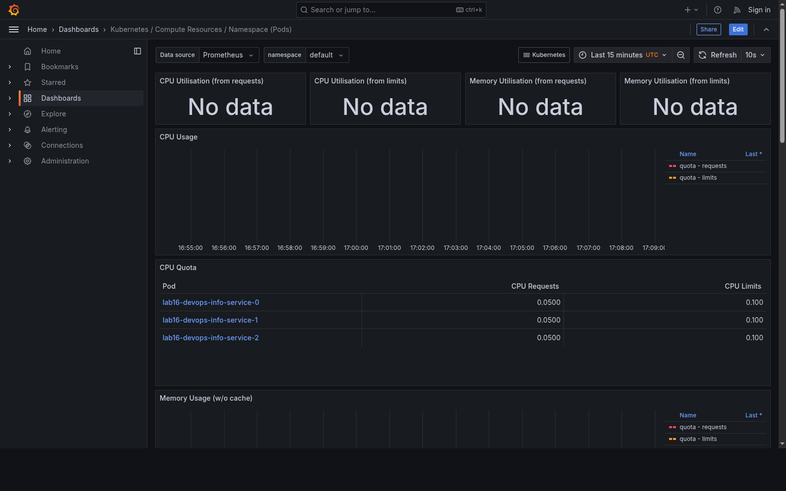
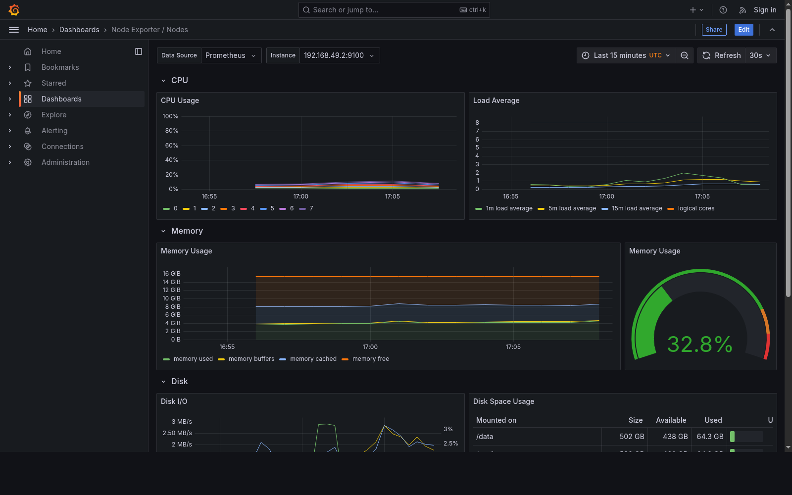
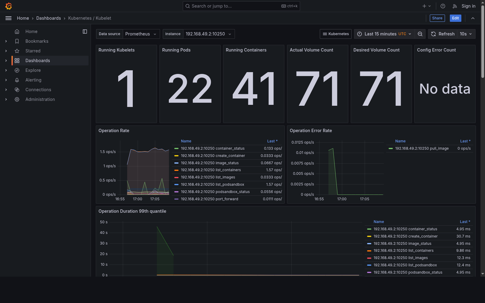
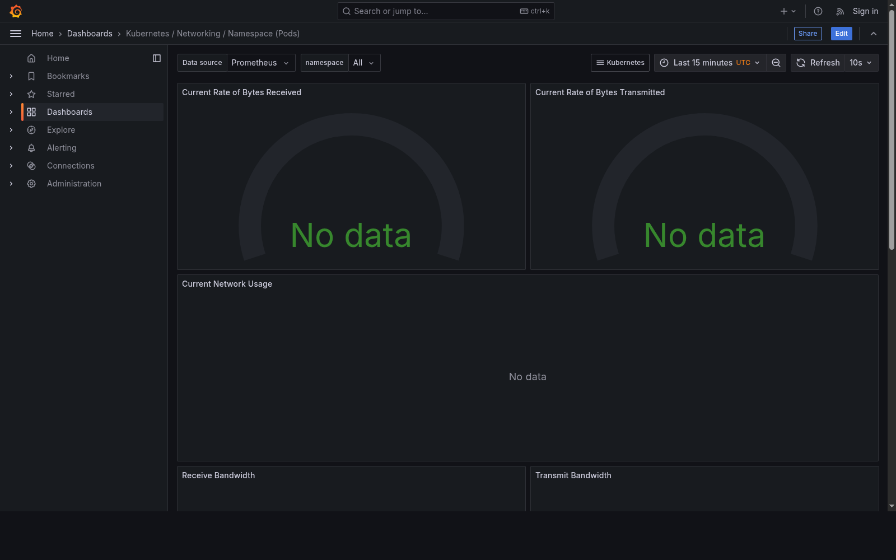
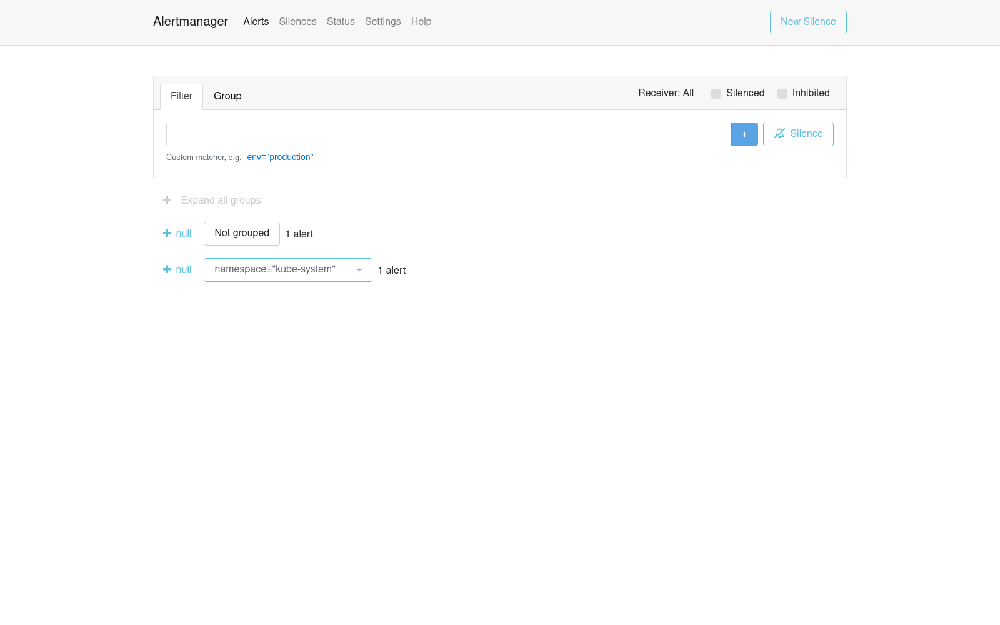
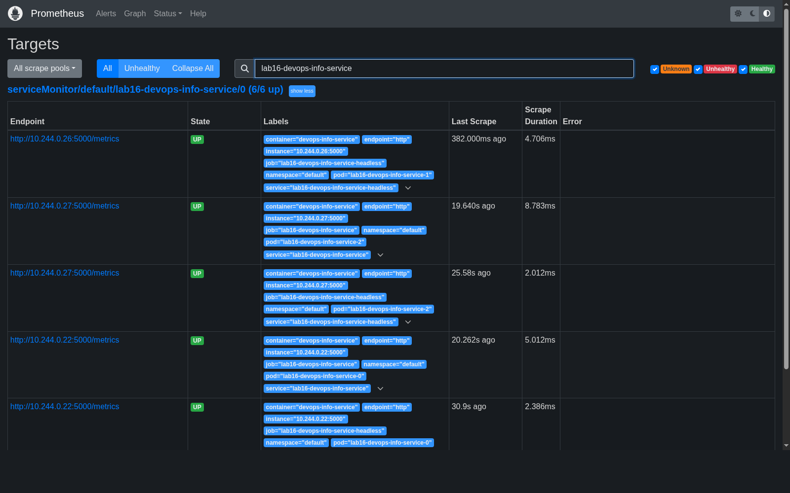

# Lab 16 — Kubernetes Monitoring & Init Containers

Date: 2026-05-10  
Cluster: Minikube `v1.38.1`, Kubernetes `v1.35.1`  
Monitoring stack: `prometheus-community/kube-prometheus-stack` chart `65.8.1`

## Stack Components

- **Prometheus Operator** manages Prometheus, Alertmanager, rules, and scrape configuration through Kubernetes CRDs such as `ServiceMonitor`.
- **Prometheus** stores time-series metrics and evaluates PromQL queries and alerting rules.
- **Alertmanager** receives firing alerts from Prometheus, groups them, applies silences/inhibition, and routes notifications.
- **Grafana** provides dashboards for Kubernetes, node, kubelet, and application metrics.
- **kube-state-metrics** exposes Kubernetes object state such as pods, deployments, StatefulSets, resource requests, and limits.
- **node-exporter** exposes host/node metrics such as CPU, memory, disk, and network usage.

## Installation Evidence

Commands used:

```bash
helm repo add prometheus-community https://prometheus-community.github.io/helm-charts
helm repo update
helm upgrade --install monitoring prometheus-community/kube-prometheus-stack \
  --version 65.8.1 \
  --namespace monitoring \
  --create-namespace
kubectl wait --for=condition=Ready pods --all -n monitoring --timeout=600s
kubectl get po,svc -n monitoring
```

Result:

```text
NAME                                                         READY   STATUS    RESTARTS   AGE
pod/alertmanager-monitoring-kube-prometheus-alertmanager-0   2/2     Running   0          15m
pod/monitoring-grafana-5fc54cb7fb-h9fmg                      3/3     Running   0          93s
pod/monitoring-kube-prometheus-operator-d5dbb45f9-wm9nr      1/1     Running   0          15m
pod/monitoring-kube-state-metrics-75c9d8f7c7-wfvp9           1/1     Running   0          15m
pod/monitoring-prometheus-node-exporter-7hq2p                1/1     Running   0          15m
pod/prometheus-monitoring-kube-prometheus-prometheus-0       2/2     Running   0          15m

NAME                                              TYPE        CLUSTER-IP       EXTERNAL-IP   PORT(S)                      AGE
service/alertmanager-operated                     ClusterIP   None             <none>        9093/TCP,9094/TCP,9094/UDP   15m
service/monitoring-grafana                        ClusterIP   10.104.162.248   <none>        80/TCP                       15m
service/monitoring-kube-prometheus-alertmanager   ClusterIP   10.104.145.51    <none>        9093/TCP,8080/TCP            15m
service/monitoring-kube-prometheus-operator       ClusterIP   10.107.78.238    <none>        443/TCP                      15m
service/monitoring-kube-prometheus-prometheus     ClusterIP   10.96.26.21      <none>        9090/TCP,8080/TCP            15m
service/monitoring-kube-state-metrics             ClusterIP   10.101.216.0     <none>        8080/TCP                     15m
service/monitoring-prometheus-node-exporter       ClusterIP   10.101.159.236   <none>        9100/TCP                     15m
service/prometheus-operated                       ClusterIP   None             <none>        9090/TCP                     15m
```

## Dashboard Answers

Screenshots are stored in [`k8s/lab16-evidence`](./lab16-evidence).

### 1. Pod Resources

StatefulSet: `lab16-devops-info-service`, 3 replicas.

Prometheus values:

| Pod | CPU usage | Memory |
| --- | ---: | ---: |
| `lab16-devops-info-service-0` | `0.000747` cores | `28.49 MiB` |
| `lab16-devops-info-service-1` | `0.000849` cores | `28.22 MiB` |
| `lab16-devops-info-service-2` | `0.000872` cores | `28.02 MiB` |

Evidence: 

### 2. Namespace Analysis

Default namespace CPU usage:

| Pod | CPU usage |
| --- | ---: |
| `lab16-devops-info-service-2` | `0.000872` cores |
| `lab16-devops-info-service-1` | `0.000849` cores |
| `lab16-devops-info-service-0` | `0.000747` cores |
| `lab16-init-download` | `0.000008` cores |
| `lab16-content-585c5b4578-6pz7z` | `0.00000045` cores |
| `lab16-wait-for-service` | `0` cores |

Highest CPU: `lab16-devops-info-service-2`.  
Lowest CPU: `lab16-wait-for-service`.

### 3. Node Metrics

Dashboard: `Node Exporter / Nodes`.

- Node: `minikube`
- CPU cores: `8`
- Memory used: `4926 MiB`
- Memory used percent: `31.21%`

Evidence: 

### 4. Kubelet

Dashboard: `Kubernetes / Kubelet`.

- Running pods: `22`
- Running containers: `41`

Evidence: 

### 5. Network

Dashboard: `Kubernetes / Networking / Namespace (Pods)`.

The dashboard was opened for namespace `default`. In this Minikube run, Prometheus did not expose `container_network_receive_bytes_total` / `container_network_transmit_bytes_total`, so pod network traffic panels showed no data.

Evidence query:

```bash
curl 'http://127.0.0.1:9090/api/v1/query?query=count(container_network_receive_bytes_total)'
```

Result:

```json
{"status":"success","data":{"resultType":"vector","result":[]}}
```

Evidence: 

### 6. Alerts

Alertmanager had `8` active alerts. The firing alerts were mostly default Minikube control-plane scrape alerts:

- `TargetDown` for kube-scheduler, kube-controller-manager, kube-etcd
- `KubeSchedulerDown`
- `KubeControllerManagerDown`
- `etcdInsufficientMembers`
- `etcdMembersDown`
- `Watchdog`

Evidence: 

## Init Containers

Manifest: [`k8s/lab16-init-containers.yaml`](./lab16-init-containers.yaml)

Resources:

```text
pod/lab16-content-585c5b4578-6pz7z   1/1   Running
pod/lab16-init-download              1/1   Running
pod/lab16-wait-for-service           1/1   Running
```

### Basic Download Init Container

The init container downloads `index.html` from the in-cluster `lab16-content` service into an `emptyDir` volume. The main container mounts the same volume at `/data`.

Proof:

```bash
kubectl logs lab16-init-download -c init-download
kubectl exec lab16-init-download -- cat /data/index.html
```

Result:

```text
Connecting to 10.97.146.41 (10.97.146.41:80)
saving to '/work-dir/index.html'
index.html           100% |********************************|    41  0:00:00 ETA
'/work-dir/index.html' saved

Lab 16 init container download evidence.
```

### Wait-for-Service Pattern

The `lab16-wait-for-service` pod uses an init container that runs `nslookup lab16-content.default.svc.cluster.local` before starting the main container.

Proof:

```bash
kubectl logs lab16-wait-for-service -c wait-for-service
kubectl logs lab16-wait-for-service -c main-app
```

Result:

```text
Server:         10.96.0.10
Address:        10.96.0.10:53

Name:   lab16-content.default.svc.cluster.local
Address: 10.97.146.41

dependency is ready
```

## Bonus: Custom Metrics and ServiceMonitor

The Flask application already exposes `/metrics` through `prometheus-client` in [`app_python/app.py`](../app_python/app.py). I added a Helm `ServiceMonitor` template:

- [`k8s/devops-info-service/templates/servicemonitor.yaml`](./devops-info-service/templates/servicemonitor.yaml)
- `serviceMonitor.enabled` in [`k8s/devops-info-service/values.yaml`](./devops-info-service/values.yaml)

Deployment command:

```bash
helm upgrade --install lab16 k8s/devops-info-service \
  -f k8s/devops-info-service/values-statefulset.yaml \
  --set serviceMonitor.enabled=true
```

Evidence:

```text
statefulset.apps/lab16-devops-info-service   3/3
servicemonitor.monitoring.coreos.com/lab16-devops-info-service
```

Prometheus target evidence:

```text
serviceMonitor/default/lab16-devops-info-service/0 (6/6 up)
job="lab16-devops-info-service"
job="lab16-devops-info-service-headless"
```

Evidence: 

Custom application metric check:

```text
devops_info_endpoint_calls_total scraped by Prometheus, total samples observed: 2227
```
