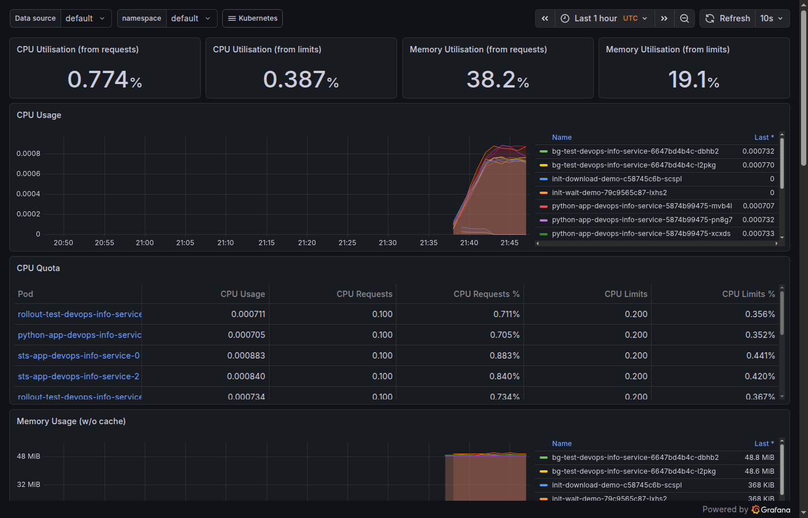
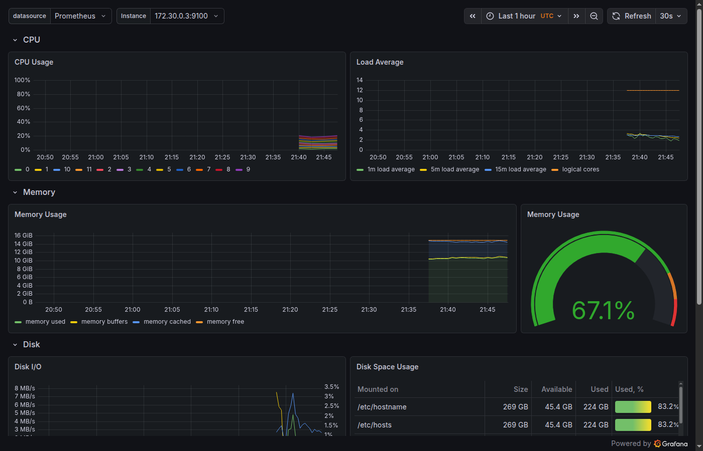
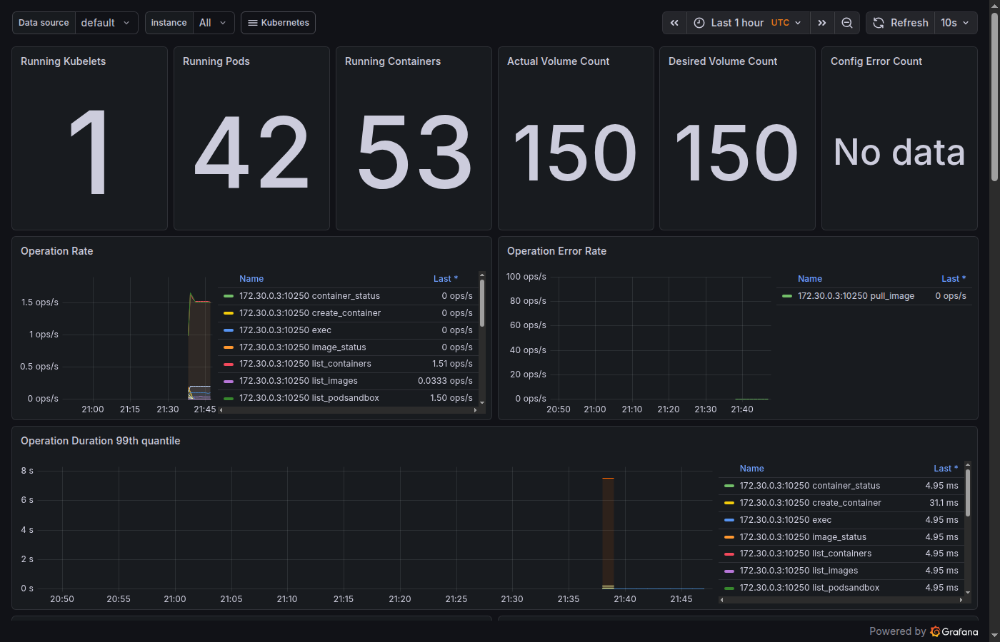
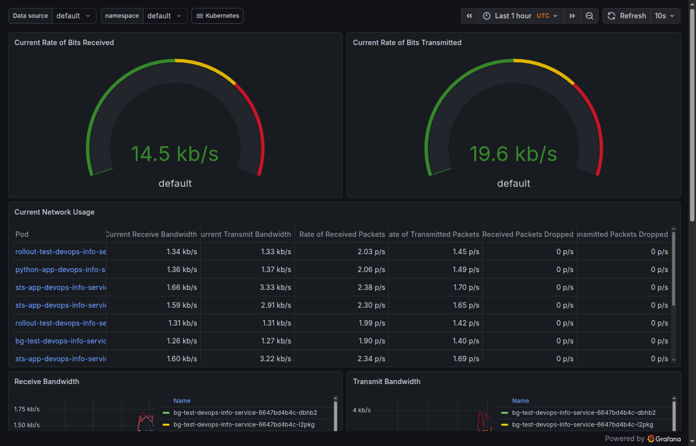
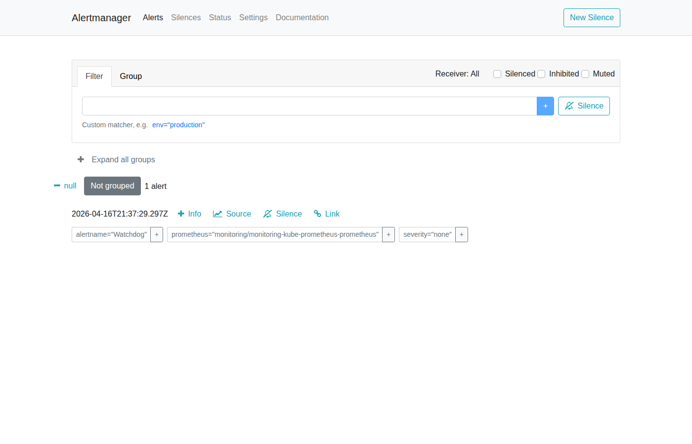
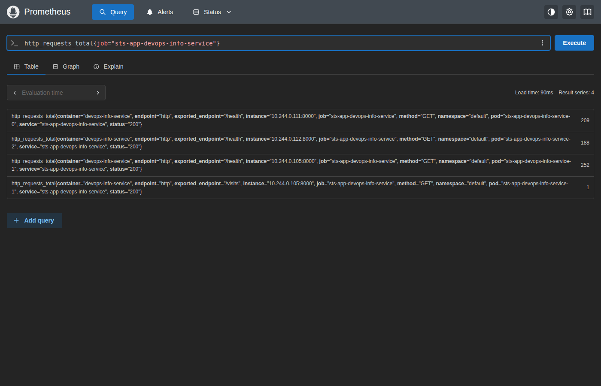

# Monitoring — Lab 16

## Stack Components

The kube-prometheus-stack installs several components that work together:

**Prometheus Operator** — a controller that manages Prometheus and Alertmanager instances in Kubernetes. It watches for `ServiceMonitor` and `PrometheusRule` CRDs and automatically configures Prometheus based on them. You don't need to edit config files manually.

**Prometheus** — the time-series database that scrapes metrics from targets. It stores metrics and lets you query them using PromQL. All Kubernetes components expose metrics that Prometheus collects automatically.

**Alertmanager** — receives alerts from Prometheus and handles routing, grouping, and sending notifications (email, Slack, etc). It also deduplicates alerts so you don't get 100 identical messages.

**Grafana** — the dashboard UI. It connects to Prometheus as a data source and lets you visualize metrics with graphs, tables, and gauges. Comes pre-loaded with Kubernetes dashboards.

**kube-state-metrics** — generates metrics about the state of Kubernetes objects (pods, deployments, services). It answers questions like "how many replicas does this deployment have?" or "is this pod in CrashLoopBackOff?".

**node-exporter** — runs on every node and exports hardware and OS metrics: CPU usage, memory, disk I/O, network traffic. It's what powers the "Node Exporter / Nodes" dashboard in Grafana.

---

## Installation Evidence

```bash
helm install monitoring prometheus-community/kube-prometheus-stack \
  --namespace monitoring \
  --create-namespace \
  --set grafana.adminPassword=prom-operator
```

Output of `kubectl get po,svc -n monitoring`:

```
NAME                                                         READY   STATUS    RESTARTS   AGE
pod/alertmanager-monitoring-kube-prometheus-alertmanager-0   2/2     Running   0          4m49s
pod/monitoring-grafana-6c7c49f469-chw54                      3/3     Running   0          4m56s
pod/monitoring-kube-prometheus-operator-fbc554898-dpnwd      1/1     Running   0          4m56s
pod/monitoring-kube-state-metrics-7d69554b96-s567v           1/1     Running   0          4m56s
pod/monitoring-prometheus-node-exporter-v77rg                1/1     Running   0          4m56s
pod/prometheus-monitoring-kube-prometheus-prometheus-0       2/2     Running   0          4m49s

NAME                                              TYPE        CLUSTER-IP      EXTERNAL-IP   PORT(S)
service/alertmanager-operated                     ClusterIP   None            <none>        9093/TCP,9094/TCP
service/monitoring-grafana                        ClusterIP   10.96.38.77     <none>        80/TCP
service/monitoring-kube-prometheus-alertmanager   ClusterIP   10.96.177.81    <none>        9093/TCP,8080/TCP
service/monitoring-kube-prometheus-operator       ClusterIP   10.96.77.103    <none>        443/TCP
service/monitoring-kube-prometheus-prometheus     ClusterIP   10.96.111.153   <none>        9090/TCP,8080/TCP
service/monitoring-kube-state-metrics             ClusterIP   10.96.99.240    <none>        8080/TCP
service/monitoring-prometheus-node-exporter       ClusterIP   10.96.182.150   <none>        9100/TCP
service/prometheus-operated                       ClusterIP   None            <none>        9090/TCP
```

---

## Dashboard Answers

Access commands used:
```bash
kubectl port-forward svc/monitoring-grafana -n monitoring 3000:80
kubectl port-forward svc/monitoring-kube-prometheus-prometheus -n monitoring 9090:9090
kubectl port-forward svc/monitoring-kube-prometheus-alertmanager -n monitoring 9093:9093
```

### 1. Pod Resources — StatefulSet CPU/Memory

From the "Kubernetes / Compute Resources / Namespace (Pods)" dashboard, default namespace:

- StatefulSet pods (`sts-app-devops-info-service-0/1/2`) each use ~0.0003–0.0004 CPU cores
- Memory: ~48–49 MB per pod



### 2. Namespace Analysis — CPU Usage per Pod

From the same dashboard, in the default namespace the pods using most CPU are the sts-app pods and rollout-test pods (~0.0004 cores each). The init-wait-demo pod uses the least CPU (~0.0000 cores — it's just sleeping).

Dashboard shows the CPU Quota table:

| Pod | CPU Usage |
|-----|-----------|
| sts-app-devops-info-service-0 | 0.0004 cores |
| rollout-test-devops-info-service | 0.0004 cores |
| bg-test-devops-info-service | 0.0004 cores |
| init-wait-demo | ~0.0000 cores |

### 3. Node Metrics — Memory and CPU

From the "Node Exporter / Nodes" dashboard:

- Total RAM: **15,320 MB** (~15 GiB)
- Memory used: **67.1%** (~10.3 GiB used)
- CPU cores: **12 logical cores**



### 4. Kubelet — Pods and Containers Managed

From the "Kubernetes / Kubelet" dashboard:

- **Running Kubelets**: 1
- **Running Pods**: 42
- **Running Containers**: 53



### 5. Network — Traffic for Default Namespace Pods

From the "Kubernetes / Networking / Namespace (Pods)" dashboard:

- Current receive rate: **14.5 kb/s** for the whole default namespace
- Current transmit rate: **19.6 kb/s**
- Pods like `sts-app-devops-info-service` each get ~1.6 kb/s receive, ~3 kb/s transmit (higher due to Prometheus scraping their `/metrics`)



### 6. Alerts — Active Alerts in Alertmanager

From the Alertmanager UI (`localhost:9093`):

- **1 active alert**: `Watchdog` (severity: none)

The Watchdog alert is intentional — it's a "dead man's switch" alert that fires constantly to confirm the alerting pipeline is working end-to-end. If this alert ever stops firing, it means something in the monitoring stack is broken.



---

## Init Containers

### Implementation

Two init container patterns are deployed in `k8s/init-containers-demo.yaml`.

**Pattern 1 — File Download (shared volume)**

An init container writes a config file to a shared `emptyDir` volume. The main container starts only after the init container finishes and can read the file.

```yaml
initContainers:
  - name: init-download
    image: busybox:1.36
    command:
      - sh
      - -c
      - echo '{"initialized": true}' > /work-dir/config.json
    volumeMounts:
      - name: workdir
        mountPath: /work-dir
containers:
  - name: main-app
    volumeMounts:
      - name: workdir
        mountPath: /data
volumes:
  - name: workdir
    emptyDir: {}
```

**Pattern 2 — Wait for Service**

An init container loops with `nslookup` until a dependency service is available. The main container only starts when the DNS resolves.

```yaml
initContainers:
  - name: wait-for-service
    image: busybox:1.36
    command:
      - sh
      - -c
      - until nslookup kubernetes.default.svc.cluster.local; do sleep 2; done
```

### Proof of Success

**Init download logs:**
```
Init container: writing config to shared volume...
Done.
```

**Main app reading the shared file:**
```bash
kubectl exec init-download-demo-... -- cat /data/config.json
# {"initialized": true, "message": "Hello from init container", "timestamp": "2026-04-16T21:37:28Z"}
```

**Main app output:**
```
Main app started. Reading init data:
{"initialized": true, "message": "Hello from init container", "timestamp": "2026-04-16T21:37:28Z"}
```

**Wait-for-service init container logs:**
```
Waiting for kubernetes service to be available...
Server:   10.96.0.10
Name:     kubernetes.default.svc.cluster.local
Address:  10.96.0.1

Service is ready! Starting main container.
```

**Main app after wait:**
```
Main app started — dependency was ready!
```

---

## Bonus — Custom Metrics & ServiceMonitor

### App `/metrics` Endpoint

The app already exposes Prometheus metrics using `prometheus_client`:

- `http_requests_total` — total HTTP requests by method, endpoint, status
- `http_request_duration_seconds` — request duration histogram
- `devops_info_endpoint_calls_total` — calls per endpoint
- `system_info_collection_seconds` — time spent on system info collection

### ServiceMonitor

Created `k8s/devops-info-service/templates/servicemonitor.yaml`:

```yaml
apiVersion: monitoring.coreos.com/v1
kind: ServiceMonitor
metadata:
  name: sts-app-devops-info-service
  labels:
    release: monitoring   # must match Prometheus selector
spec:
  selector:
    matchLabels:
      app.kubernetes.io/instance: sts-app
      app.kubernetes.io/name: devops-info-service
  endpoints:
    - port: http
      path: /metrics
      interval: 30s
```

Deployed with:
```bash
helm upgrade sts-app . --set serviceMonitor.enabled=true
```

### Verification in Prometheus

Prometheus discovered and started scraping all 3 StatefulSet pods:

```
sts-app-devops-info-service -> up  (pod-0: 10.244.0.111:8000)
sts-app-devops-info-service -> up  (pod-1: 10.244.0.105:8000)
sts-app-devops-info-service -> up  (pod-2: 10.244.0.112:8000)
```

Custom metrics visible in Prometheus:
```
http_requests_total{pod="sts-app-devops-info-service-0", endpoint="/health"} = 103
http_requests_total{pod="sts-app-devops-info-service-1", endpoint="/health"} = 164
http_requests_total{pod="sts-app-devops-info-service-2", endpoint="/health"} = 102
devops_info_endpoint_calls_total{endpoint="/visits", pod="sts-app-devops-info-service-1"} = 1
```



