# Lab 16 — Kubernetes Monitoring & Init Containers

# Task 1 — Kube-Prometheus Stack

## 1.1 Objective

The goal of this task was to install the `kube-prometheus-stack` in Kubernetes and understand the purpose of its main components.

The stack was deployed into the `monitoring` namespace using Helm.

## 1.2 Environment Check

Before installation, the cluster state was verified.

Commands:

```bash
minikube status
kubectl get nodes
kubectl get namespaces
```

Output:

```bash
minikube
type: Control Plane
host: Running
kubelet: Running
apiserver: Running
kubeconfig: Configured

NAME       STATUS   ROLES           AGE   VERSION
minikube   Ready    control-plane   32d   v1.35.1
```

The cluster was healthy and ready for monitoring stack installation.

## 1.3 Stack Components

### Prometheus Operator

Manages Prometheus-related custom resources in Kubernetes, such as `Prometheus`, `Alertmanager`, `ServiceMonitor`, and `PrometheusRule`.

### Prometheus

Collects and stores time-series metrics from the cluster, nodes, workloads, and applications.

### Alertmanager

Receives alerts from Prometheus and handles grouping, deduplication, silencing, and routing.

### Grafana

Provides dashboards and visualizations for cluster and application metrics.

### kube-state-metrics

Exposes metrics about Kubernetes object state, such as Pods, Deployments, StatefulSets, Services, and PVCs.

### node-exporter

Exposes node-level system metrics such as CPU, memory, disk, and network usage.

## 1.4 Helm Repository Setup

The Prometheus Community repository was checked and updated.

Commands:

```bash
helm repo add prometheus-community https://prometheus-community.github.io/helm-charts
helm repo update
helm search repo prometheus-community/kube-prometheus-stack --versions | grep "65\." | head
```

Important result:

```text
prometheus-community/kube-prometheus-stack 65.8.1 v0.77.2
```

Version `65.8.1` was selected because the lab recommends the `65.x` chart line.

## 1.5 Installation

The stack was installed with Helm:

```bash
helm upgrade --install monitoring prometheus-community/kube-prometheus-stack \
  --namespace monitoring \
  --create-namespace \
  --version 65.8.1
```

Helm release verification:

```bash
helm list -n monitoring
helm status monitoring -n monitoring
```

Result:

```text
NAME        NAMESPACE   REVISION   STATUS    CHART                         APP VERSION
monitoring  monitoring  1          deployed  kube-prometheus-stack-65.8.1 v0.77.2
```

## 1.6 Resource Verification

The monitoring Pods were checked:

```bash
kubectl get pods -n monitoring
kubectl get pods -n monitoring -w
```

After initialization, all main Pods became `Running`.

Main verification command:

```bash
kubectl get po,svc -n monitoring
```

Output:

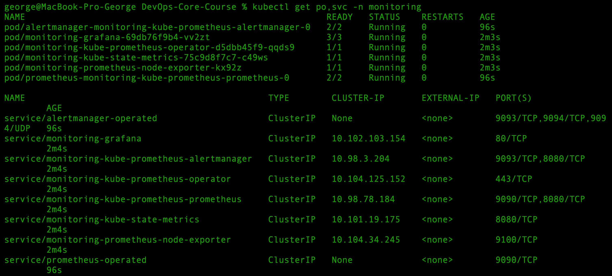

Additional full namespace verification:

```bash
kubectl get all -n monitoring
```

This confirmed the main workload types created by the chart:

* Deployments:

  * `monitoring-grafana`
  * `monitoring-kube-prometheus-operator`
  * `monitoring-kube-state-metrics`
* DaemonSet:

  * `monitoring-prometheus-node-exporter`
* StatefulSets:

  * `alertmanager-monitoring-kube-prometheus-alertmanager`
  * `prometheus-monitoring-kube-prometheus-prometheus`

### Screenshot — `kubectl get all -n monitoring`

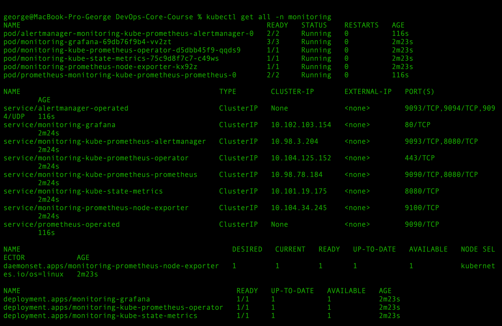

---


# Task 2 — Grafana Dashboard Exploration

## 2.1 Objective

The goal of this task was to explore Kubernetes monitoring dashboards in Grafana and answer questions about cluster resource usage, node metrics, kubelet metrics, network traffic, and active alerts.

Grafana was accessed through port-forwarding:

```bash
kubectl port-forward svc/monitoring-grafana -n monitoring 3000:80
```

Grafana URL:

```text
http://localhost:3000
```

Default credentials:

```text
admin / prom-operator
```

## 2.2 StatefulSet CPU and Memory Usage

Question:

```text
Pod Resources: CPU/memory usage of your StatefulSet
```

Dashboard used:

```text
Kubernetes / Compute Resources / Pod
```

Filters:

```bash
namespace: stateful
pod: stateful-devops-info-service-0
time range: Last 15 minutes
```

The dashboard showed resource metrics for StatefulSet Pod `stateful-devops-info-service-0`.

Observed CPU configuration:

```bash
CPU request: 0.0500 cores
CPU limit: 0.100 cores
```

Observed memory configuration:

```bash
Memory request: 64Mi
Memory limit: 128Mi
```

The CPU usage graph was visible in Grafana. During the test, the Pod stayed within its configured CPU request and limit.

The full StatefulSet workload includes three Pods:

* `stateful-devops-info-service-0`
* `stateful-devops-info-service-1`
* `stateful-devops-info-service-2`

Screenshot:

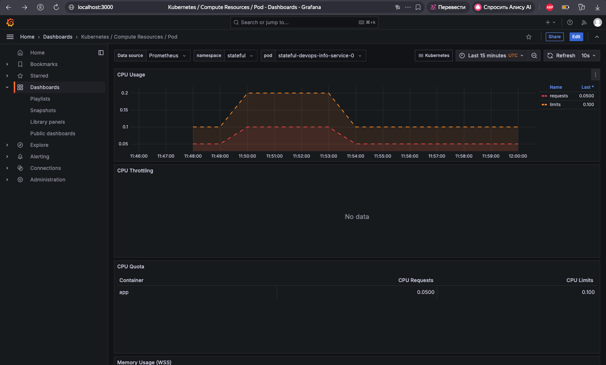

## 2.3 Default Namespace CPU Analysis

Question:

```text
Namespace Analysis: Which pods use most/least CPU in default namespace?
```

Dashboard used:

```text
Kubernetes / Compute Resources / Namespace (Pods)
```

Filters:

```text
namespace: default
time range: Last 15 minutes
```

Result:

The dashboard showed `No data` for CPU usage in the `default` namespace during the selected time range.

This means there were no active Pods with visible CPU metrics in the `default` namespace at the time of checking.

Most CPU pod:

```text
N/A
```

Least CPU pod:

```text
N/A
```

Screenshot:

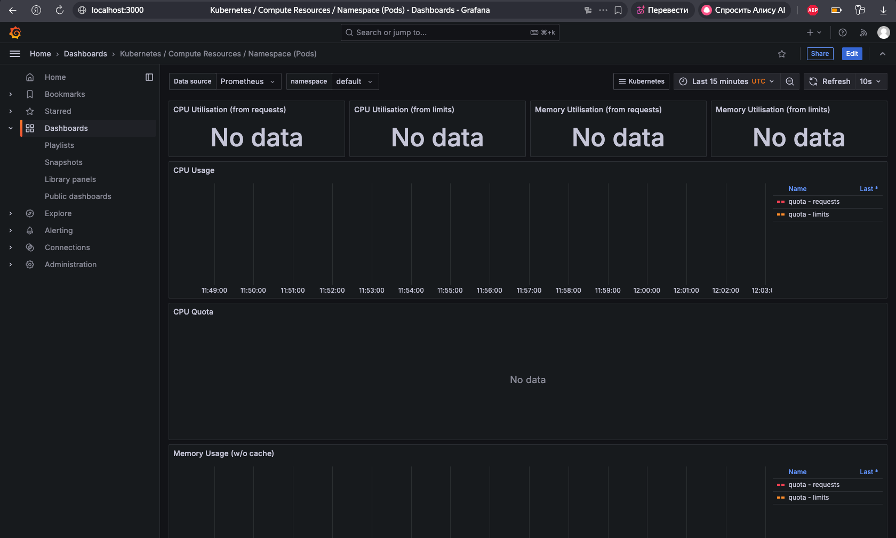

## 2.4 Node Metrics

Question:

```text
Node Metrics: Memory usage (% and MB), CPU cores
```

Dashboard used:

```text
Node Exporter / Nodes
```

Filters:

```text
Instance: 192.168.49.2:9100
Time range: Last 1 hour
```

Result:

```text
Memory usage: 60.1%
Memory used: approximately 4.8 GiB
CPU cores: 8 logical cores
```

The dashboard showed node-level metrics collected by `node-exporter`, including CPU usage, load average, memory usage, disk I/O, and disk space usage.

Screenshot:


## 2.5 Kubelet Metrics

Question:

```text
Kubelet: How many pods/containers managed?
```

Dashboard used:

```text
Kubernetes / Kubelet
```

Filters:

```text
instance: 192.168.49.2:10250
time range: Last 1 hour
```

Result:

```text
Running kubelets: 1
Managed pods: 36
Managed containers: 85
Actual volume count: 127
Desired volume count: 127
```

The dashboard showed that the kubelet on the Minikube node was managing 36 Pods and 85 containers at the time of checking.

Screenshot:

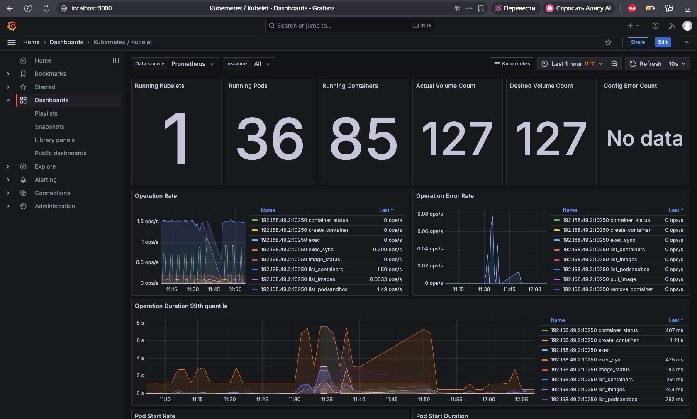

## 2.6 Default Namespace Network Traffic

Question:

```text
Network: Traffic for pods in default namespace
```

Dashboard used:

```text
Kubernetes / Networking / Namespace (Pods)
```

Filters:

```text
namespace: All
time range: Last 1 hour
```

Result:

The dashboard showed `No data` for network receive and transmit traffic.

The namespace selector did not list `default` as an available namespace in this dashboard, which indicates that there were no active Pod network metrics for the `default` namespace during the selected time range.

Receive traffic:

```text
No data
```

Transmit traffic:

```text
No data
```

Screenshot:

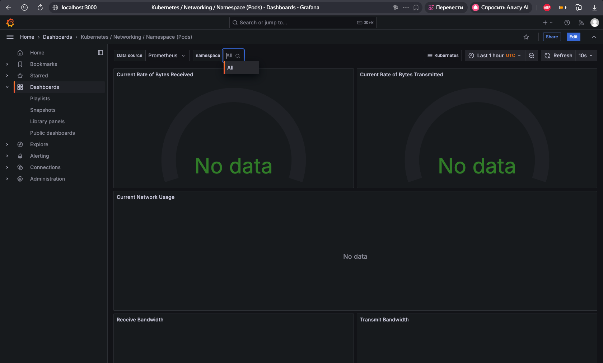

## 2.7 Alertmanager Active Alerts

Question:

```text
Alerts: How many active alerts? Check Alertmanager UI
```

Alertmanager was accessed through port-forwarding:

```bash
kubectl port-forward svc/monitoring-kube-prometheus-alertmanager -n monitoring 9093:9093
```

Alertmanager URL:

```text
http://localhost:9093
```

The Alerts page showed active alert groups:


- Not grouped: **2 alerts**
- Not grouped: **1 alert**
- namespace="dev": **3 alerts**
- namespace="kube-system": **5 alerts**
- namespace="monitoring": **1 alert**


Total active alerts:

```text
12
```

Screenshot:

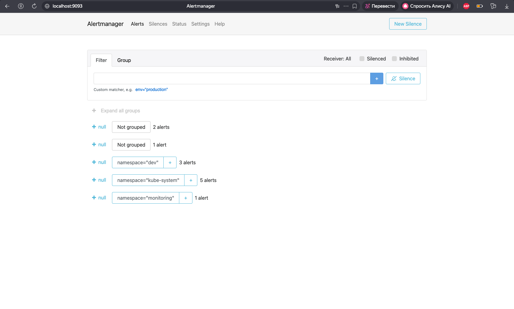

---


# Task 3 — Init Containers

## 3.1 Objective

The goal of this task was to implement init containers for the StatefulSet application.

Two init container patterns were implemented:

- basic init container that downloads a file with `wget`
- wait-for-service init container that waits for a dependency before the main container starts

The implementation was added to the StatefulSet deployment of `devops-info-service` in the `stateful` namespace.

## 3.2 Files Changed

The following Helm chart files were updated:

- `k8s/devops-info-service/values.yaml`
- `k8s/devops-info-service/values-stateful.yaml`
- `k8s/devops-info-service/templates/statefulset.yaml`

The default `values.yaml` keeps init containers disabled:

```yaml
initContainers:
  enabled: false
```

The `values-stateful.yaml` enables init containers for the StatefulSet deployment:

```yaml
initContainers:
  enabled: true
  image: busybox:1.36

  waitForService:
    enabled: true
    host: monitoring-grafana.monitoring.svc.cluster.local
    sleepSeconds: 2

  download:
    enabled: true
    url: http://monitoring-grafana.monitoring.svc.cluster.local
    filename: index.html

  mountPath: /init-data
```

## 3.3 Init Container Implementation

Two init containers were added to the StatefulSet template.

The first init container waits for the Grafana Service DNS name to become resolvable:

```yaml
- name: wait-for-service
  image: busybox:1.36
  command:
    - sh
    - -c
    - |
      echo "Waiting for service: monitoring-grafana.monitoring.svc.cluster.local"
      until nslookup monitoring-grafana.monitoring.svc.cluster.local; do
        echo "Service is not ready yet"
        sleep 2
      done
      echo "Service is resolvable"
```

The second init container downloads a file with `wget` into a shared volume:

```yaml
- name: init-download
  image: busybox:1.36
  command:
    - sh
    - -c
    - |
      wget -O /work-dir/index.html "http://monitoring-grafana.monitoring.svc.cluster.local"
  volumeMounts:
    - name: init-workdir
      mountPath: /work-dir
```

The main container mounts the same shared volume as read-only:

```yaml
volumeMounts:
  - name: init-workdir
    mountPath: /init-data
    readOnly: true
```

The shared volume is an `emptyDir`:

```yaml
volumes:
  - name: init-workdir
    emptyDir: {}
```

This allows init containers to prepare files before the main application container starts.

## 3.4 Helm Validation

The Helm chart was validated with:

```bash
helm lint k8s/devops-info-service
```

Output:

```text
==> Linting k8s/devops-info-service
[INFO] Chart.yaml: icon is recommended

1 chart(s) linted, 0 chart(s) failed
```

The rendered StatefulSet was checked for init containers:

```bash
helm template stateful ./k8s/devops-info-service \
  -n stateful \
  -f k8s/devops-info-service/values-stateful.yaml | grep -n "initContainers"
```

Output:

```text
154:      initContainers:
```

The `wait-for-service` init container was rendered:

```bash
helm template stateful ./k8s/devops-info-service \
  -n stateful \
  -f k8s/devops-info-service/values-stateful.yaml | grep -n "wait-for-service"
```

Output:

```text
155:        - name: wait-for-service
```

The `init-download` init container was rendered:

```bash
helm template stateful ./k8s/devops-info-service \
  -n stateful \
  -f k8s/devops-info-service/values-stateful.yaml | grep -n "init-download"
```

Output:

```text
167:        - name: init-download
```

The shared volume and mount path were also rendered:

```bash
helm template stateful ./k8s/devops-info-service \
  -n stateful \
  -f k8s/devops-info-service/values-stateful.yaml | grep -n "init-workdir"

helm template stateful ./k8s/devops-info-service \
  -n stateful \
  -f k8s/devops-info-service/values-stateful.yaml | grep -n "/init-data"
```

Output:

```text
181:            - name: init-workdir
215:            - name: init-workdir
245:        - name: init-workdir

216:              mountPath: /init-data
```

## 3.5 Dependency Service Verification

The init container waits for the Grafana Service from the monitoring stack.

The Service was verified before deployment:

```bash
kubectl get svc monitoring-grafana -n monitoring
```

Output:

```text
NAME                 TYPE        CLUSTER-IP       EXTERNAL-IP   PORT(S)   AGE
monitoring-grafana   ClusterIP   10.102.103.154   <none>        80/TCP    111m
```

## 3.6 Deployment

The StatefulSet release was upgraded with init containers enabled:

```bash
helm upgrade stateful ./k8s/devops-info-service \
  -n stateful \
  -f k8s/devops-info-service/values-stateful.yaml \
  --set env.RELEASE_VERSION=lab16-init-containers
```

Output:

```text
Release "stateful" has been upgraded. Happy Helming!
NAME: stateful
LAST DEPLOYED: Tue Apr 28 15:23:44 2026
NAMESPACE: stateful
STATUS: deployed
REVISION: 7
DESCRIPTION: Upgrade complete
```

The rollout completed successfully:

```bash
kubectl rollout status statefulset/stateful-devops-info-service -n stateful
```

Output:

```text
Waiting for 1 pods to be ready...
Waiting for partitioned roll out to finish: 1 out of 3 new pods have been updated...
Waiting for partitioned roll out to finish: 2 out of 3 new pods have been updated...
partitioned roll out complete: 3 new pods have been updated...
```

The Pods were running after the update:

```bash
kubectl get pods -n stateful -w
```

Output:
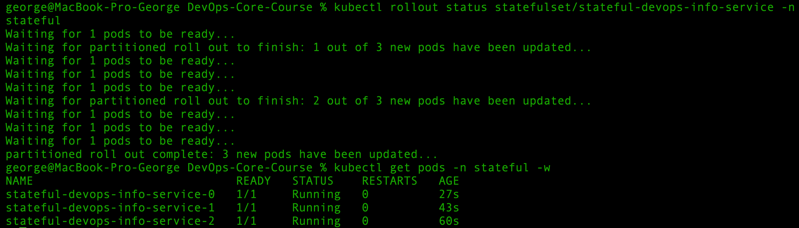

## 3.7 Init Container Status Verification

The Pod description showed both init containers completed successfully:

```bash
kubectl describe pod stateful-devops-info-service-0 -n stateful | grep -A60 "Init Containers"
```

Important output:

```text
Init Containers:
  wait-for-service:
    State:          Terminated
      Reason:       Completed
      Exit Code:    0
    Ready:          True
    Restart Count:  0

  init-download:
    State:          Terminated
      Reason:       Completed
      Exit Code:    0
    Ready:          True
    Restart Count:  0
    Mounts:
      /work-dir from init-workdir (rw)
```

The main application container mounted the shared volume:

```text
Mounts:
  /init-data from init-workdir (ro)
```

## 3.8 Wait-for-Service Logs

The `wait-for-service` init container logs were checked:

```bash
kubectl logs stateful-devops-info-service-0 -n stateful -c wait-for-service
```

Output:

```text
Waiting for service: monitoring-grafana.monitoring.svc.cluster.local
Server:         10.96.0.10
Address:        10.96.0.10:53

Name:   monitoring-grafana.monitoring.svc.cluster.local
Address: 10.102.103.154

Service monitoring-grafana.monitoring.svc.cluster.local is resolvable
```

This confirms that the init container waited for the Grafana Service before the main application container started.

## 3.9 Download Init Container Logs

The `init-download` container logs were checked:

```bash
kubectl logs stateful-devops-info-service-0 -n stateful -c init-download
```

Output:
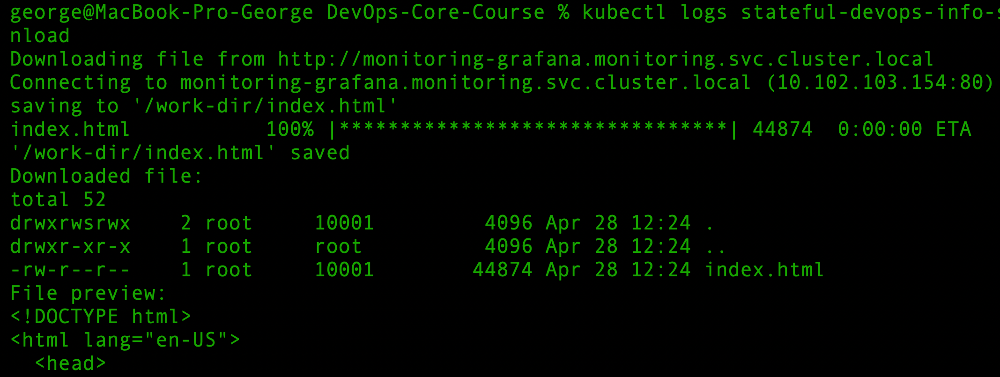
This confirms that the init container downloaded `index.html` using `wget`.

## 3.10 Main Container Access Verification

The main application container was able to access the file created by the init container.

Command:

```bash
kubectl exec stateful-devops-info-service-0 -n stateful -c app -- ls -la /init-data
```

Output:

```text
total 52
drwxrwsrwx 2 root appuser  4096 Apr 28 12:24 .
drwxr-xr-x 1 root root     4096 Apr 28 12:24 ..
-rw-r--r-- 1 root appuser 44874 Apr 28 12:24 index.html
```

The file content was checked from the main container:

```bash
kubectl exec stateful-devops-info-service-0 -n stateful -c app -- head -n 10 /init-data/index.html
```

Output:

```text
<!DOCTYPE html>
<html lang="en-US">
  <head>
    
    <meta charset="utf-8" />
    <meta http-equiv="X-UA-Compatible" content="IE=edge,chrome=1" />
    <meta name="viewport" content="width=device-width" />
    <meta name="theme-color" content="#000" />

    <title>Grafana</title>
```

This proves that the file downloaded by the init container was available to the main application container through the shared volume.

## 3.11 Verification Across All StatefulSet Pods

The shared file was checked in all StatefulSet Pods:

```bash
for pod in 0 1 2; do
  echo "Checking stateful-devops-info-service-$pod"
  kubectl exec stateful-devops-info-service-$pod -n stateful -c app -- ls -la /init-data
done
```

Output:

```text
Checking stateful-devops-info-service-0
-rw-r--r-- 1 root appuser 44874 Apr 28 12:24 index.html

Checking stateful-devops-info-service-1
-rw-r--r-- 1 root appuser 44874 Apr 28 12:24 index.html

Checking stateful-devops-info-service-2
-rw-r--r-- 1 root appuser 44874 Apr 28 12:23 index.html
```

This confirms that the init container pattern worked for every StatefulSet replica.

---

# Bonus Task — Custom Metrics and ServiceMonitor

## B.1 Objective

The goal of the bonus task was to expose application metrics and configure Prometheus scraping with a `ServiceMonitor`.

Requirements covered:

- application exposes `/metrics`
- `ServiceMonitor` CRD created
- Prometheus successfully scrapes application metrics

## B.2 Metrics Endpoint

The application already exposes Prometheus metrics through the `/metrics` endpoint using the Python `prometheus_client` library.

The endpoint was verified with:

```bash
curl -s http://localhost:18080/metrics | head -n 20
```

Output:

```text
# HELP python_gc_objects_collected_total Objects collected during gc
# TYPE python_gc_objects_collected_total counter
python_gc_objects_collected_total{generation="0"} 502.0
python_gc_objects_collected_total{generation="1"} 11.0
python_gc_objects_collected_total{generation="2"} 0.0
# HELP python_info Python platform information
# TYPE python_info gauge
python_info{implementation="CPython",major="3",minor="13",patchlevel="13",version="3.13.13"} 1.0
```

This confirms that the application exports Prometheus-compatible metrics.

## B.3 ServiceMonitor Configuration

A new Helm template was added:

```text
k8s/devops-info-service/templates/servicemonitor.yaml
```

The application Service was updated to use a named port:

```yaml
ports:
  - name: http
    port: 80
    targetPort: 5000
```

The `ServiceMonitor` is created in the `monitoring` namespace and scrapes the application from the `stateful` namespace.

Main configuration:

```yaml
apiVersion: monitoring.coreos.com/v1
kind: ServiceMonitor
metadata:
  name: stateful-devops-info-service
  namespace: monitoring
  labels:
    release: monitoring
spec:
  namespaceSelector:
    matchNames:
      - stateful
  selector:
    matchLabels:
      app.kubernetes.io/instance: stateful
      app.kubernetes.io/name: devops-info-service
  endpoints:
    - port: http
      path: /metrics
      interval: 15s
      scrapeTimeout: 10s
```

## B.4 Helm Verification

The chart was validated:

```bash
helm lint k8s/devops-info-service
```

Output:

```text
1 chart(s) linted, 0 chart(s) failed
```

The rendered manifests were checked:

```bash
helm template stateful ./k8s/devops-info-service \
  -n stateful \
  -f k8s/devops-info-service/values-stateful.yaml | grep -n "kind: ServiceMonitor"

helm template stateful ./k8s/devops-info-service \
  -n stateful \
  -f k8s/devops-info-service/values-stateful.yaml | grep -n "release:"

helm template stateful ./k8s/devops-info-service \
  -n stateful \
  -f k8s/devops-info-service/values-stateful.yaml | grep -n "/metrics"
```

Output:

```text
265:kind: ServiceMonitor
274:    release: "monitoring"
285:      path: "/metrics"
```

## B.5 Deployment

The StatefulSet release was upgraded:

```bash
helm upgrade stateful ./k8s/devops-info-service \
  -n stateful \
  -f k8s/devops-info-service/values-stateful.yaml \
  --set env.RELEASE_VERSION=lab16-servicemonitor
```

Output:

```text
Release "stateful" has been upgraded. Happy Helming!
NAME: stateful
NAMESPACE: stateful
STATUS: deployed
REVISION: 11
DESCRIPTION: Upgrade complete
```

The Helm release was verified:

```bash
helm list -n stateful
```

Output:

```text
NAME      NAMESPACE   REVISION   STATUS     CHART                     APP VERSION
stateful  stateful    11         deployed   devops-info-service-0.1.0  1.0.0
```

## B.6 Service and ServiceMonitor Verification

The application Service exposes a named `http` port:

```bash
kubectl get svc stateful-devops-info-service -n stateful -o yaml | grep -A10 "ports:"
```

Output:

```yaml
ports:
  - name: http
    nodePort: 30084
    port: 80
    protocol: TCP
    targetPort: 5000
selector:
  app.kubernetes.io/instance: stateful
  app.kubernetes.io/name: devops-info-service
```

The `ServiceMonitor` was created in the `monitoring` namespace:

```bash
kubectl get servicemonitor -n monitoring | grep devops-info-service
```

Output:

```text
stateful-devops-info-service
```

The `ServiceMonitor` configuration was verified:

```bash
kubectl describe servicemonitor stateful-devops-info-service -n monitoring
```

Output:

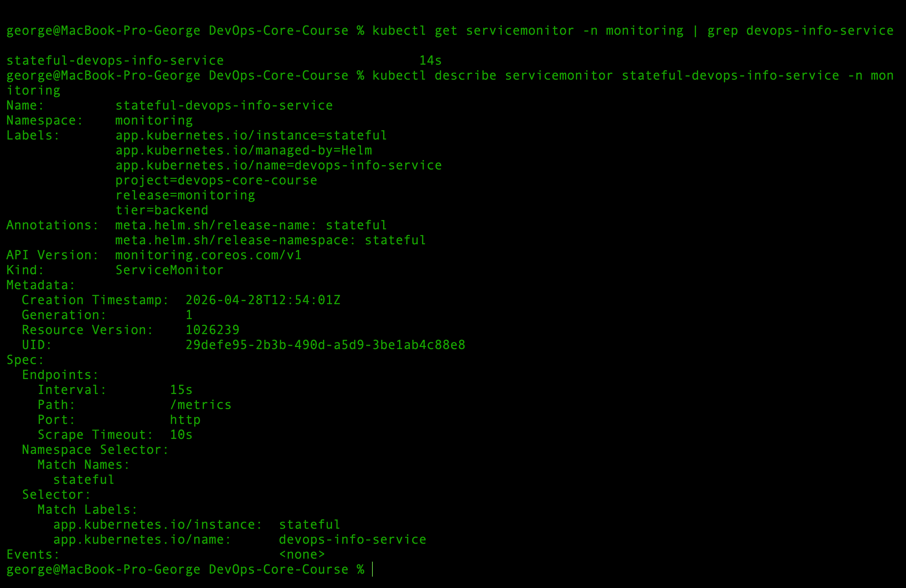

## B.7 Prometheus Target Verification

Prometheus was opened with:

```bash
kubectl port-forward svc/monitoring-kube-prometheus-prometheus -n monitoring 9090:9090
```

URL:

```text
http://localhost:9090
```

In Prometheus UI:

```text
Status -> Targets
```

The application target was found:

```text
serviceMonitor/monitoring/stateful-devops-info-service/0
```

Result:

```text
6/6 up
```

The discovered endpoints included:

```text
http://10.244.0.250:5000/metrics
http://10.244.0.251:5000/metrics
http://10.244.0.252:5000/metrics
```

All targets were `UP`.

Note: Prometheus discovered 6 targets because both the regular Service and the headless Service matched the same application labels. This still confirms that Prometheus successfully scrapes the application metrics.

Output:
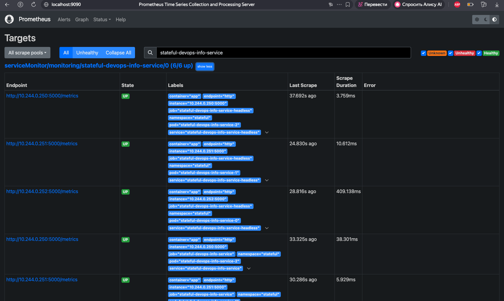

## B.8 PromQL Verification

Target health was verified with:

```promql
up{namespace="stateful", job=~"stateful-devops-info-service.*"}
```

Result:

```text
Result series: 6
All values: 1
```

Output:
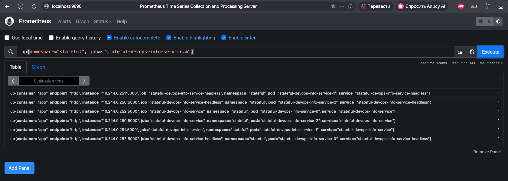

Application HTTP metrics were verified with:

```promql
http_requests_total{namespace="stateful"}
```

Result:

```text
Result series: 12
```

Output:
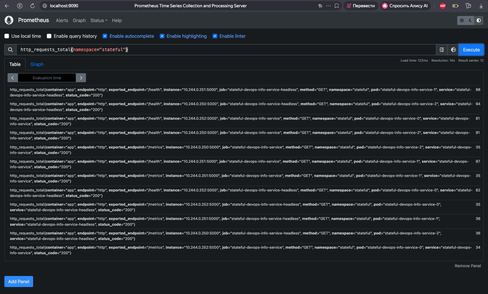

Custom business endpoint metrics were verified with:

```promql
devops_info_endpoint_calls_total{namespace="stateful"}
```

Result:

```text
Result series: 6
```

Output:
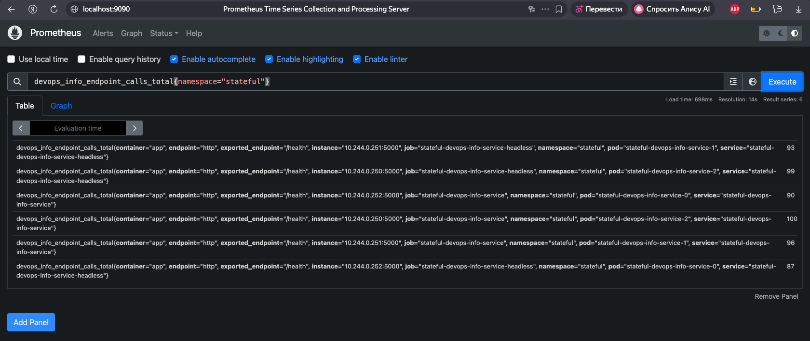
