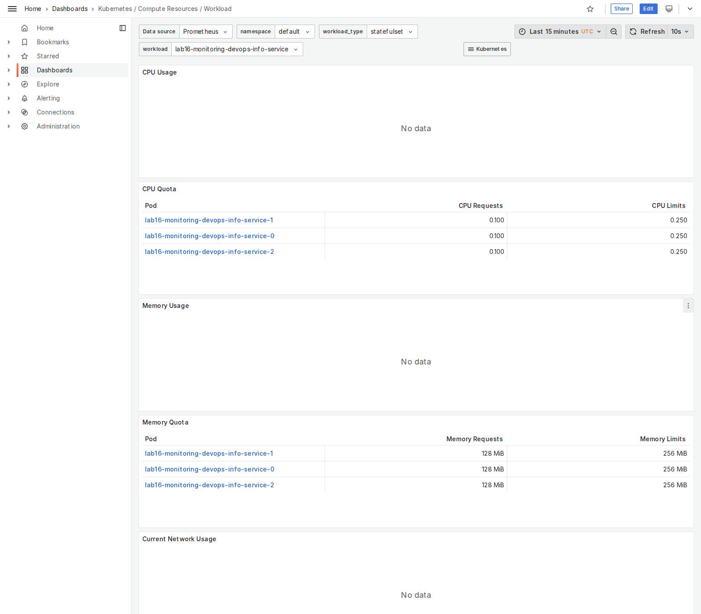
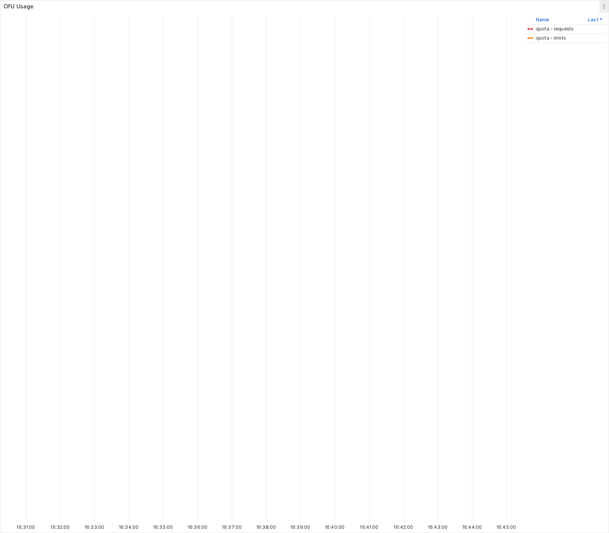
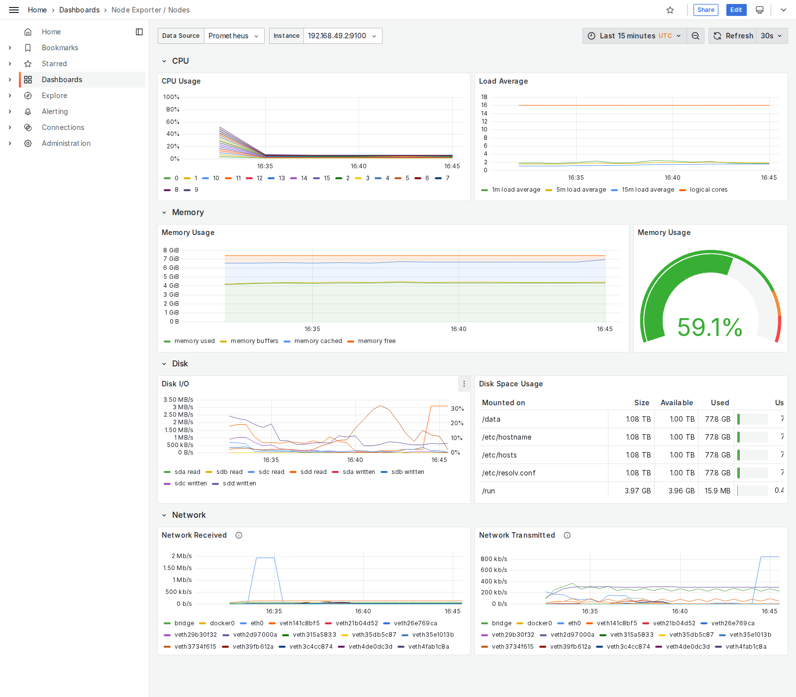
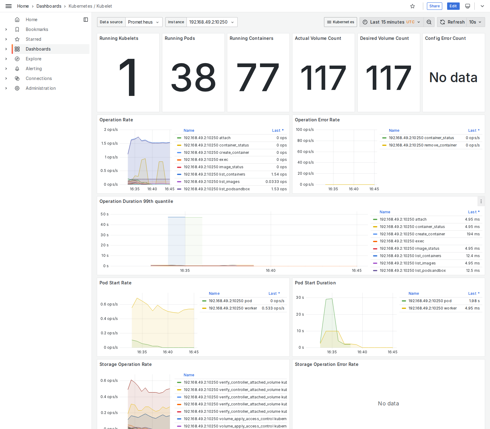
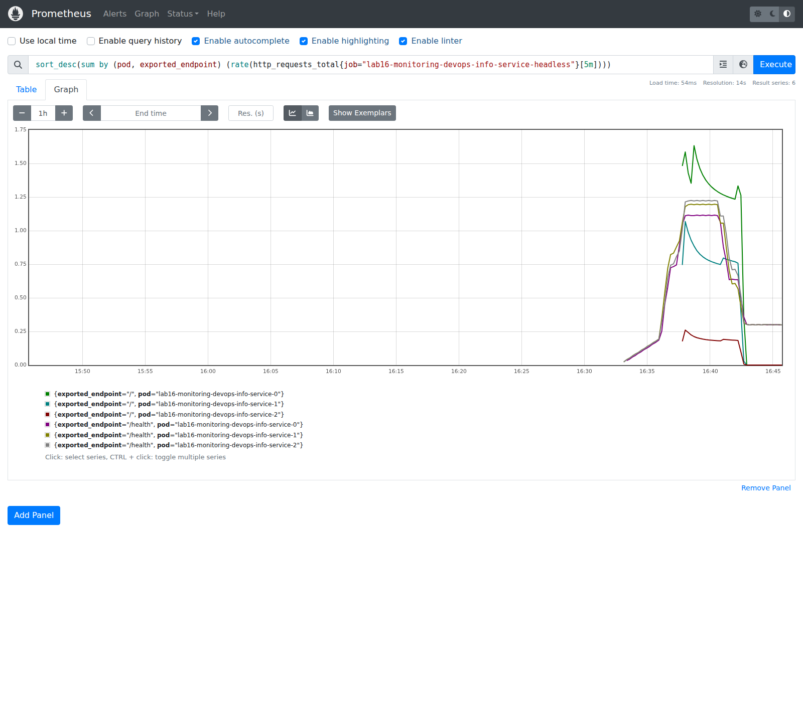
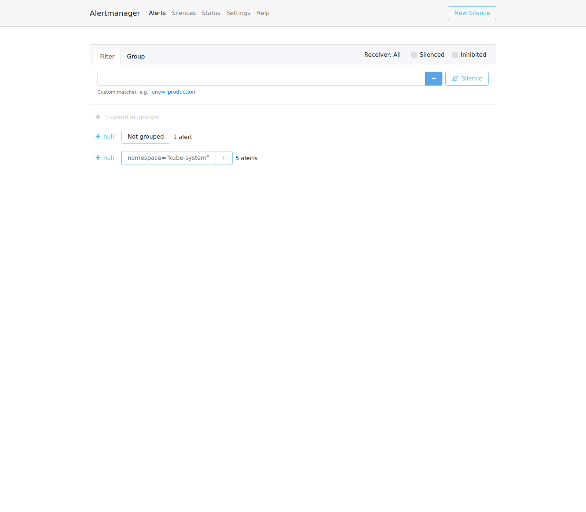
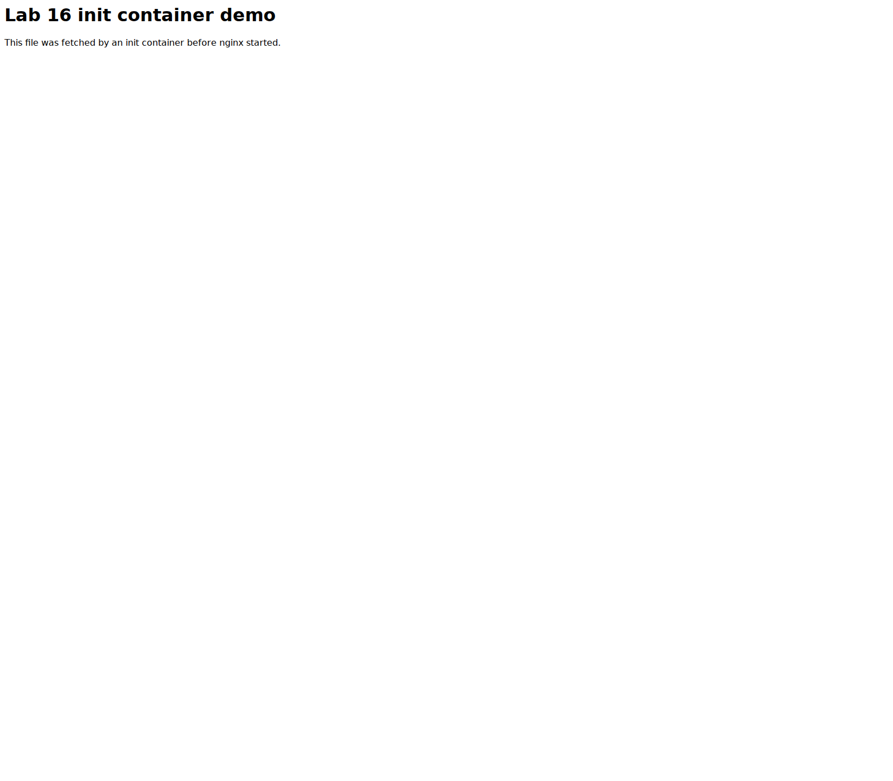
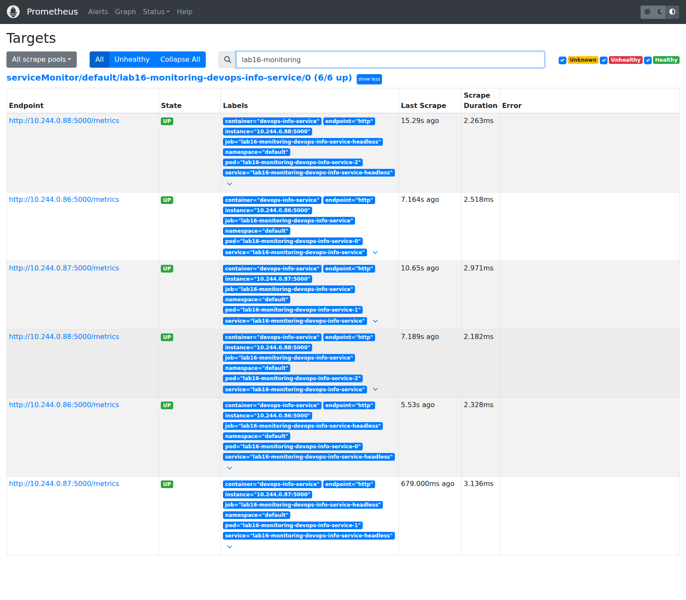

# Lab 16 - Kubernetes Monitoring & Init Containers

This lab was completed and verified on **May 9, 2026** with:

- Minikube `v1.38.1`
- Kubernetes `v1.35.1`
- Helm `v3.20.0`
- `kube-prometheus-stack` chart `65.8.1`

I also used **Playwright** to capture the dashboard and UI screenshots stored in [`k8s/screenshots/lab16`](./screenshots/lab16/).

## 1. Stack Components

- **Prometheus Operator**: manages Prometheus-related custom resources and keeps StatefulSets, configs, and secrets in sync with the desired state.
- **Prometheus**: scrapes metrics from Kubernetes targets and stores them as time-series data for queries and dashboards.
- **Alertmanager**: receives firing alerts from Prometheus, groups them, and shows their status in a single UI.
- **Grafana**: visualizes the collected metrics through the prebuilt Kubernetes dashboards.
- **kube-state-metrics**: exposes cluster object state like pod, workload, PVC, and namespace metadata as Prometheus metrics.
- **node-exporter**: exposes host-level CPU, memory, filesystem, and network metrics from the Minikube node.

## 2. What I Added

For this lab I extended the repo with:

- `k8s/devops-info-service/templates/statefulset.yaml`
- `k8s/devops-info-service/templates/headless-service.yaml`
- `k8s/devops-info-service/templates/servicemonitor.yaml`
- `k8s/devops-info-service/values-monitoring.yaml`
- `k8s/lab16/init-containers-demo.yaml`

That let me deploy:

- a **StatefulSet-based** version of the app for workload monitoring
- a **ServiceMonitor** for the bonus Prometheus scrape task
- a separate **init-container demo** that waits for a service and downloads a file into a shared volume before nginx starts

## 3. Installation Evidence

Monitoring stack install:

```bash
helm repo add prometheus-community https://prometheus-community.github.io/helm-charts
helm repo update
helm upgrade --install monitoring prometheus-community/kube-prometheus-stack \
  --namespace monitoring \
  --create-namespace \
  --version 65.8.1 \
  --wait --timeout 20m
```

Application and init-demo install:

```bash
docker build -t devops-info-service:lab09 ./app_python
minikube image load devops-info-service:lab09

helm upgrade --install lab16-monitoring k8s/devops-info-service \
  -f k8s/devops-info-service/values-monitoring.yaml \
  --wait --wait-for-jobs --timeout 10m

kubectl apply -f k8s/lab16/init-containers-demo.yaml
kubectl rollout status deployment/lab16-init-source --timeout=180s
kubectl rollout status deployment/lab16-init-demo --timeout=180s
```

`kubectl get po,svc -n monitoring`:

```text
NAME                                                         READY   STATUS    RESTARTS   AGE
pod/alertmanager-monitoring-kube-prometheus-alertmanager-0   2/2     Running   0          17m
pod/monitoring-grafana-69db76f9b4-l5rdh                      3/3     Running   0          18m
pod/monitoring-kube-prometheus-operator-d5dbb45f9-29f7m      1/1     Running   0          18m
pod/monitoring-kube-state-metrics-75c9d8f7c7-pd2nq           1/1     Running   0          18m
pod/monitoring-prometheus-node-exporter-k4td9                1/1     Running   0          18m
pod/prometheus-monitoring-kube-prometheus-prometheus-0       2/2     Running   0          17m

NAME                                              TYPE        CLUSTER-IP      EXTERNAL-IP   PORT(S)                      AGE
service/alertmanager-operated                     ClusterIP   None            <none>        9093/TCP,9094/TCP,9094/UDP   17m
service/monitoring-grafana                        ClusterIP   10.99.81.137    <none>        80/TCP                       18m
service/monitoring-kube-prometheus-alertmanager   ClusterIP   10.99.24.246    <none>        9093/TCP,8080/TCP            18m
service/monitoring-kube-prometheus-operator       ClusterIP   10.99.175.124   <none>        443/TCP                      18m
service/monitoring-kube-prometheus-prometheus     ClusterIP   10.109.42.79    <none>        9090/TCP,8080/TCP            18m
service/monitoring-kube-state-metrics             ClusterIP   10.102.250.3    <none>        8080/TCP                     18m
service/monitoring-prometheus-node-exporter       ClusterIP   10.100.43.210   <none>        9100/TCP                     18m
service/prometheus-operated                       ClusterIP   None            <none>        9090/TCP                     17m
```

StatefulSet and ServiceMonitor verification:

```text
NAME                                                    READY   AGE
statefulset.apps/lab16-monitoring-devops-info-service   3/3     14m

NAME                                         READY   STATUS    RESTARTS   AGE
pod/lab16-init-demo-7c49969894-fkqmc         1/1     Running   0          11m
pod/lab16-init-source-c4f9ff8bf-wvprg        1/1     Running   0          13m
pod/lab16-monitoring-devops-info-service-0   1/1     Running   0          14m
pod/lab16-monitoring-devops-info-service-1   1/1     Running   0          13m
pod/lab16-monitoring-devops-info-service-2   1/1     Running   0          13m

NAME                                                                STATUS   VOLUME                                     CAPACITY   ACCESS MODES   STORAGECLASS   VOLUMEATTRIBUTESCLASS   AGE
persistentvolumeclaim/data-lab16-monitoring-devops-info-service-0   Bound    pvc-3de741f4-a881-4622-a80e-2f8d1de75e32   128Mi      RWO            standard       <unset>                 14m
persistentvolumeclaim/data-lab16-monitoring-devops-info-service-1   Bound    pvc-3f7823d5-96cd-4270-a9de-fb5f0f3af7ca   128Mi      RWO            standard       <unset>                 13m
persistentvolumeclaim/data-lab16-monitoring-devops-info-service-2   Bound    pvc-8553d3f7-fb3a-48e6-b63d-bf84c1e6d8fc   128Mi      RWO            standard       <unset>                 13m

NAME                                                                        AGE
servicemonitor.monitoring.coreos.com/lab16-monitoring-devops-info-service   14m
```

## 4. Dashboard Answers

All metrics below were collected after installing the stack, deploying the StatefulSet release, and generating sample traffic on **May 9, 2026**.

### 4.1 Pod Resources - StatefulSet CPU and Memory

StatefulSet pod usage from Prometheus:

```text
lab16-monitoring-devops-info-service-0: 0.82 mCPU, 27.11 MiB
lab16-monitoring-devops-info-service-1: 0.95 mCPU, 26.73 MiB
lab16-monitoring-devops-info-service-2: 0.84 mCPU, 26.50 MiB
```

Screenshot:



### 4.2 Namespace Analysis - Most and Least CPU in `default`

Current CPU ranking in the `default` namespace:

```text
Most CPU:  lab16-monitoring-devops-info-service-1 -> 0.95 mCPU
Then:      lab16-monitoring-devops-info-service-2 -> 0.84 mCPU
Then:      lab16-monitoring-devops-info-service-0 -> 0.82 mCPU
Then:      lab16-init-demo-7c49969894-fkqmc      -> 0.09 mCPU
Least CPU: lab16-init-source-c4f9ff8bf-wvprg     -> 0.00 mCPU
```

Screenshot:



### 4.3 Node Metrics - Memory Usage and CPU Cores

For the Minikube node:

```text
Memory used: 59.08%
Memory used: 4476.85 MiB (~4694 MB)
CPU cores:   16
```

Screenshot:



### 4.4 Kubelet - Managed Pods and Containers

Kubelet metrics showed:

```text
Running pods:       38
Running containers: 77
```

Screenshot:



### 4.5 Network / Traffic for Pods in `default`

In this local Minikube run, the stock Grafana pod-bandwidth panels backed by `container_network_*` stayed empty, so I used the **application traffic actually scraped by Prometheus** as the practical traffic view for the default-namespace app pods.

15-minute request totals from `devops_info_endpoint_calls_total`:

```text
/health traffic:
  lab16-monitoring-devops-info-service-2 -> 530.15 requests
  lab16-monitoring-devops-info-service-1 -> 523.49 requests
  lab16-monitoring-devops-info-service-0 -> 499.15 requests

/ traffic:
  lab16-monitoring-devops-info-service-0 -> 370.92 requests
  lab16-monitoring-devops-info-service-1 -> 220.82 requests
  lab16-monitoring-devops-info-service-2 -> 53.10 requests
```

That matched the synthetic traffic I sent to create a measurable difference between the three StatefulSet pods.

Screenshot:



### 4.6 Alerts - Active Alert Count in Alertmanager

At the time of capture there were **8 active alerts**:

```text
TargetDown (kube-scheduler, warning)
KubeSchedulerDown (critical)
etcdInsufficientMembers (critical)
etcdMembersDown (critical)
TargetDown (kube-controller-manager, warning)
KubeControllerManagerDown (critical)
Watchdog (none)
TargetDown (kube-etcd, warning)
```

These are expected in this single-node Minikube setup because some control-plane targets are not exposed the same way they would be in a full multi-node cluster.

Screenshot:



## 5. Init Containers

Manifest file:

- `k8s/lab16/init-containers-demo.yaml`

What it demonstrates:

- `wait-for-source` waits until `lab16-init-source.default.svc.cluster.local` resolves and the HTTP endpoint responds
- `download-page` uses `wget` to download `/index.html` into a shared `emptyDir`
- the main nginx container serves the downloaded file from the same shared volume

Init-container log proof:

```text
Connecting to lab16-init-source (10.100.149.205:80)
saving to '/work-dir/index.html'
index.html           100% |********************************|   150  0:00:00 ETA
'/work-dir/index.html' saved
```

Main-container proof:

```html
<html>
  <body>
    <h1>Lab 16 init container demo</h1>
    <p>This file was fetched by an init container before nginx started.</p>
  </body>
</html>
```

Screenshot:



## 6. Bonus - Custom Metrics and ServiceMonitor

The app already exposes `/metrics` through `prometheus-client`, and for this lab I added a ServiceMonitor template so Prometheus can scrape the workload automatically.

ServiceMonitor resource:

- `k8s/devops-info-service/templates/servicemonitor.yaml`

Lab-specific values file:

- `k8s/devops-info-service/values-monitoring.yaml`

Prometheus target health:

```text
lab16-monitoring-devops-info-service-0 -> up=1
lab16-monitoring-devops-info-service-1 -> up=1
lab16-monitoring-devops-info-service-2 -> up=1
```

Screenshot:



## 7. Summary

Lab 16 is complete with:

- Kube-Prometheus installed and verified
- Grafana and Alertmanager evidence captured with Playwright screenshots
- StatefulSet workload monitored through Prometheus/Grafana
- Init container download and wait-for-service patterns implemented
- `/metrics` scraping verified through a ServiceMonitor
