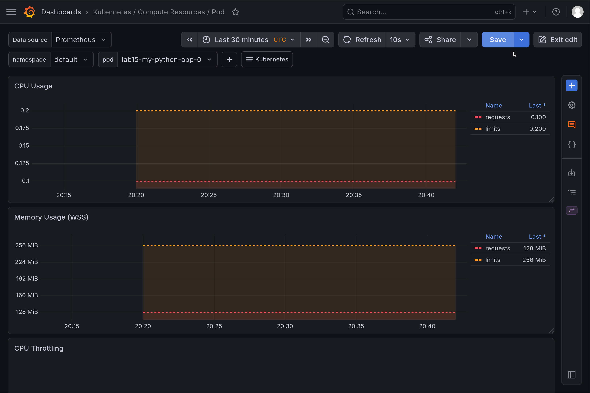
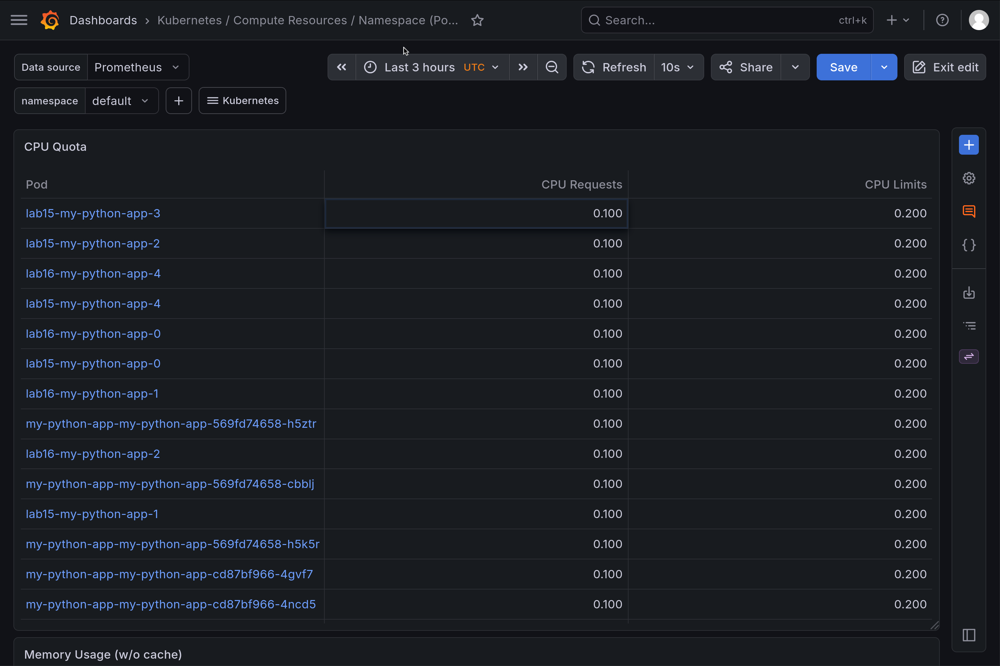
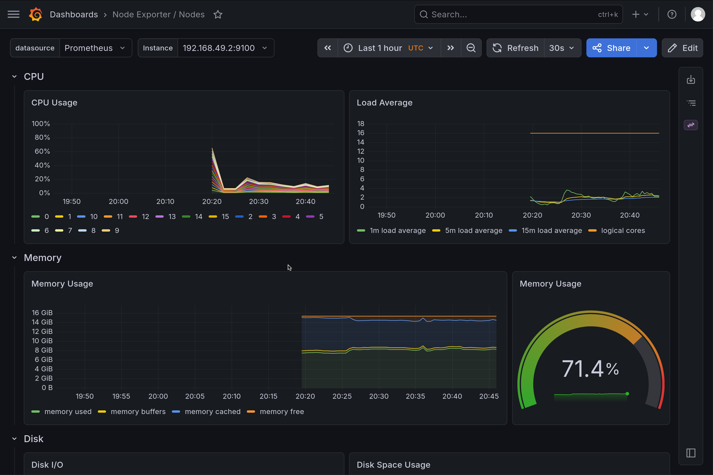
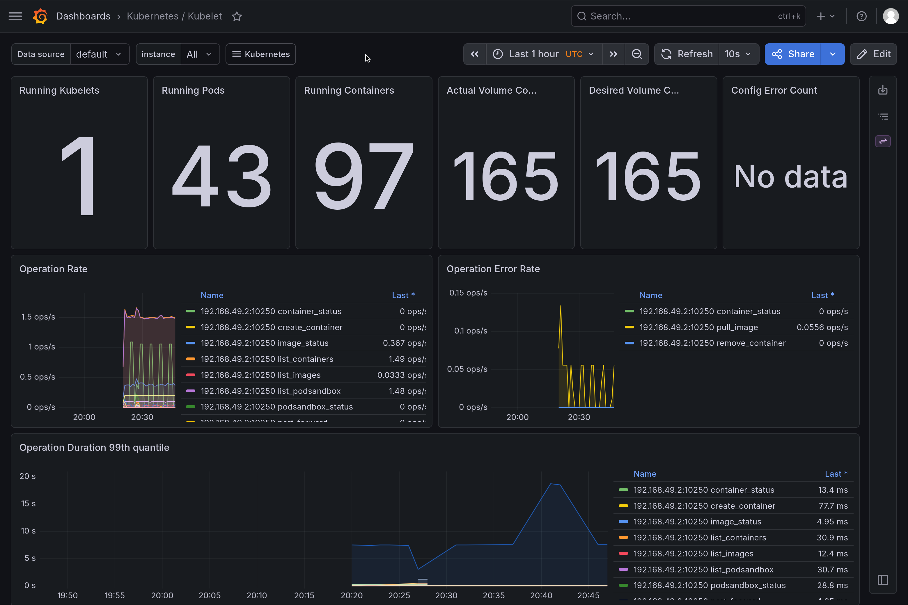
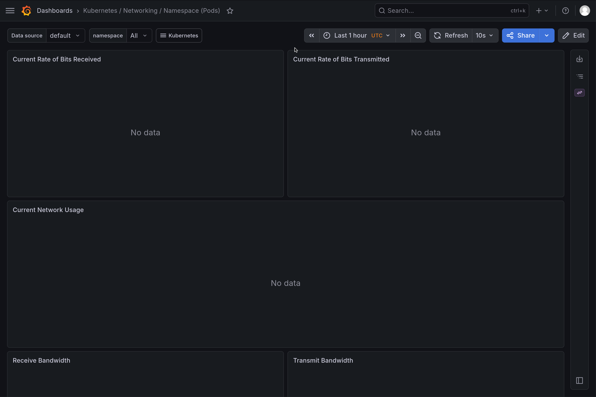
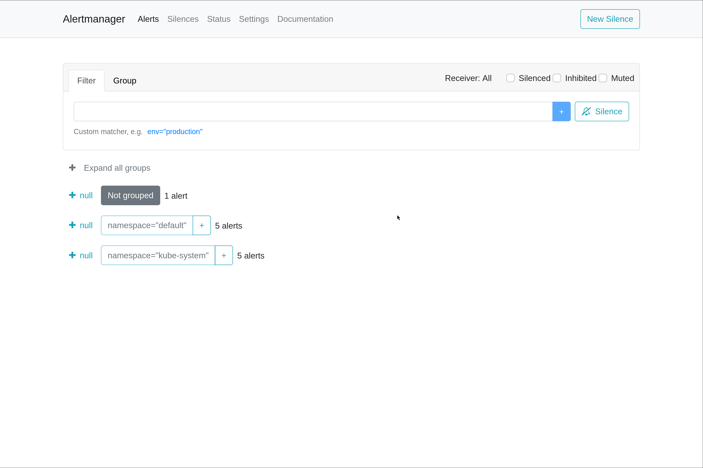

# Lab 16 - Kubernetes Monitoring and Init Containers

## 1) Kube-Prometheus Stack Components

- **Prometheus Operator**: Runs as a controller that manages Prometheus-related CRDs and reconciles Prometheus/Alertmanager configuration.
- **Prometheus**: Pulls and stores time-series metrics from Kubernetes targets and exporters.
- **Alertmanager**: Receives firing alerts from Prometheus, groups/deduplicates them, and handles notification routing.
- **Grafana**: Visualization layer for metrics with prebuilt Kubernetes dashboards.
- **kube-state-metrics**: Exposes Kubernetes object state (pods, deployments, nodes, etc.) as Prometheus metrics.
- **node-exporter**: Exposes host-level node metrics like CPU, memory, filesystem, and network stats.

## 2) Installation (Helm) and Evidence

Commands used:

```bash
helm repo add prometheus-community https://prometheus-community.github.io/helm-charts
helm repo update
helm install monitoring prometheus-community/kube-prometheus-stack \
  --namespace monitoring \
  --create-namespace
kubectl wait --for=condition=ready pod --all -n monitoring --timeout=240s
kubectl get po,svc -n monitoring
```

Output from `kubectl get po,svc -n monitoring`:

```text
NAME                                                         READY   STATUS    RESTARTS   AGE
pod/alertmanager-monitoring-kube-prometheus-alertmanager-0   2/2     Running   0          36m
pod/monitoring-grafana-5497ff9f5f-6hpvn                      3/3     Running   0          36m
pod/monitoring-kube-prometheus-operator-79689d79b4-s7gkj     1/1     Running   0          36m
pod/monitoring-kube-state-metrics-67d5f7bf68-pqnn8           1/1     Running   0          36m
pod/monitoring-prometheus-node-exporter-6j5vg                1/1     Running   0          36m
pod/prometheus-monitoring-kube-prometheus-prometheus-0       2/2     Running   0          36m

NAME                                              TYPE        CLUSTER-IP       EXTERNAL-IP   PORT(S)                      AGE
service/alertmanager-operated                     ClusterIP   None             <none>        9093/TCP,9094/TCP,9094/UDP   36m
service/monitoring-grafana                        ClusterIP   10.97.162.165    <none>        80/TCP                       36m
service/monitoring-kube-prometheus-alertmanager   ClusterIP   10.103.32.68     <none>        9093/TCP,8080/TCP            36m
service/monitoring-kube-prometheus-operator       ClusterIP   10.98.48.202     <none>        443/TCP                      36m
service/monitoring-kube-prometheus-prometheus     ClusterIP   10.105.184.239   <none>        9090/TCP,8080/TCP            36m
service/monitoring-kube-state-metrics             ClusterIP   10.98.190.7      <none>        8080/TCP                     36m
service/monitoring-prometheus-node-exporter       ClusterIP   10.103.136.152   <none>        9100/TCP                     36m
service/prometheus-operated                       ClusterIP   None             <none>        9090/TCP                     36m
```

## 3) Dashboard Questions and Answers

Grafana access:

```bash
kubectl port-forward svc/monitoring-grafana -n monitoring 3000:80
# login: admin / prom-operator
```

Prometheus and Alertmanager were queried via port-forward to extract exact values:

```bash
kubectl port-forward svc/monitoring-kube-prometheus-prometheus -n monitoring 9090:9090
kubectl port-forward svc/monitoring-kube-prometheus-alertmanager -n monitoring 9093:9093
```

### 3.1 Pod Resources (StatefulSet CPU/Memory)

Workload: `lab16-my-python-app-*`

- CPU usage (millicores):
  - `lab16-my-python-app-4`: 1.74m
  - `lab16-my-python-app-1`: 1.69m
  - `lab16-my-python-app-2`: 1.65m
  - `lab16-my-python-app-3`: 1.60m
  - `lab16-my-python-app-0`: 1.56m
- Memory usage:
  - `lab16-my-python-app-0`: 23.93 MiB
  - `lab16-my-python-app-4`: 23.50 MiB
  - `lab16-my-python-app-2`: 23.23 MiB
  - `lab16-my-python-app-3`: 23.23 MiB
  - `lab16-my-python-app-1`: 23.21 MiB

### 3.2 Namespace Analysis (default namespace, most/least CPU)

- Most CPU pod: `lab15-my-python-app-3` (1.77m)
- Least CPU pod: `my-python-app-my-python-app-cd87bf966-tbp76` (0.00m)
- Pods with 0 CPU in sampled window:
  - `my-python-app-my-python-app-cd87bf966-9vmdn`
  - `my-python-app-my-python-app-cd87bf966-4gvf7`
  - `my-python-app-my-python-app-cd87bf966-4ncd5`
  - `my-python-app-my-python-app-cd87bf966-cxdk7`
  - `my-python-app-my-python-app-cd87bf966-tbp76`

### 3.3 Node Metrics

- Node memory usage: 71.11%
- Node memory used: 11176.21 MiB
- Node CPU cores: 16

### 3.4 Kubelet (pods/containers managed)

- Managed pods: 43
- Managed containers: 47

### 3.5 Network Traffic (default namespace)

- Querying `container_network_receive_bytes_total` and `container_network_transmit_bytes_total` returned no series in this cluster profile at capture time.
- Result recorded as: RX series = 0, TX series = 0.

### 3.6 Alerts (Alertmanager)

- Active alerts (Prometheus `ALERTS{alertstate="firing"}`): 11
- Active alerts in Alertmanager API (`/api/v2/alerts`): 11

## 4) Init Containers Implementation and Proof

### 4.1 Helm implementation

Implemented in chart values and templates:

- `k8s/values.yaml`
  - Added `initContainers` settings:
    - shared `emptyDir` volume (`init-workdir`, mounted at `/init-data`)
    - `waitForService` init container (`nslookup` loop)
    - `download` init container (`wget` to shared volume)
- `k8s/templates/statefulset.yaml`
  - Added `initContainers` and shared volume wiring
  - Mounted shared volume in main container
- `k8s/templates/rollout.yaml`
  - Added same init-container behavior for rollout mode

### 4.2 Runtime verification

Deployment command:

```bash
helm upgrade --install lab16 ./k8s --wait --timeout 300s
```

Verification commands:

```bash
kubectl get pods -l app.kubernetes.io/instance=lab16 -o wide
kubectl logs lab16-my-python-app-0 -c init-download
kubectl logs lab16-my-python-app-0 -c wait-for-service
kubectl exec lab16-my-python-app-0 -- sh -c 'ls -l /init-data && head -n 3 /init-data/index.html'
```

Captured proof:

```text
Connecting to example.com (172.66.147.243:443)
wget: note: TLS certificate validation not implemented
saving to '/init-data/index.html'
index.html           100% |********************************|   528  0:00:00 ETA
'/init-data/index.html' saved

Name:   kubernetes.default.svc.cluster.local
Address: 10.96.0.1

total 4
-rw-r--r-- 1 root root 528 Apr 24 21:36 index.html
<!doctype html><html lang="en"><head><title>Example Domain</title>...
```

This confirms:

- Init container successfully waited for DNS-resolvable service
- Init container downloaded file with `wget`
- Main container accessed the downloaded file through shared volume

## 5) Screenshots

### 5.1 Pod Resources - StatefulSet



### 5.2 Default Namespace CPU (Most/Least)



### 5.3 Node Metrics (Memory and CPU)



### 5.4 Kubelet Pods and Containers



### 5.5 Default Namespace Network Traffic



### 5.6 Alertmanager Active Alerts



