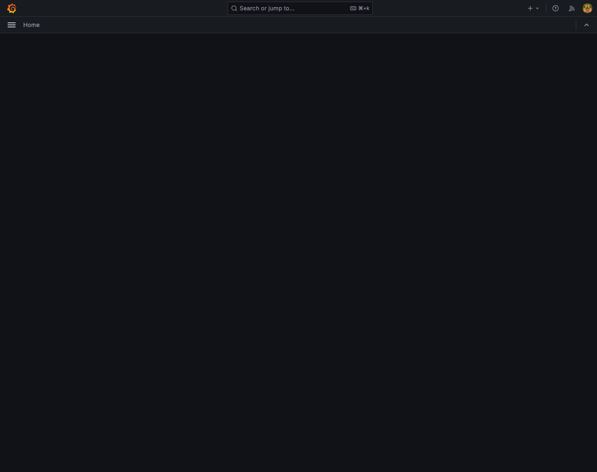
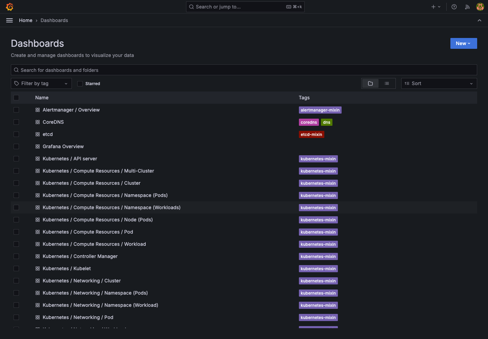
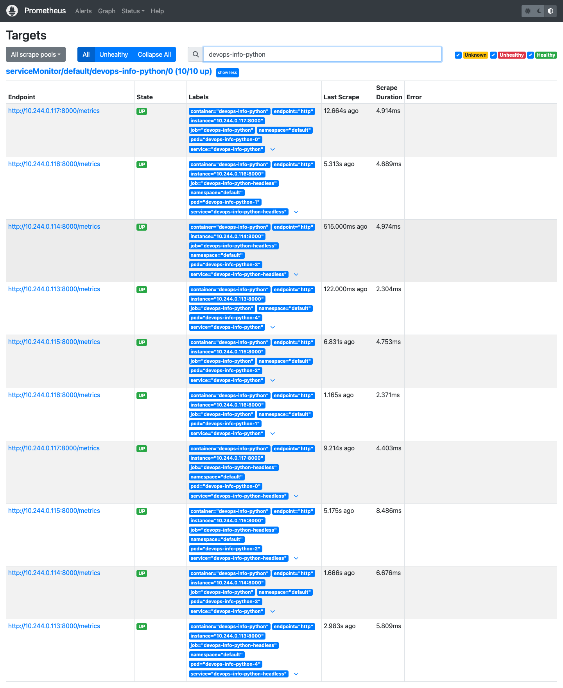
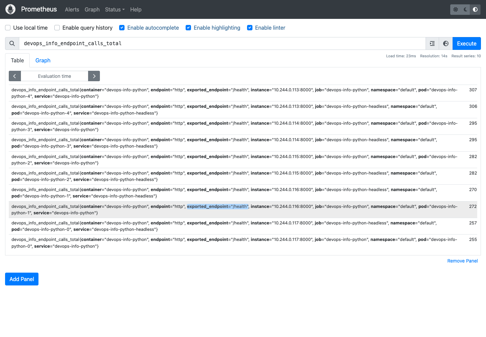
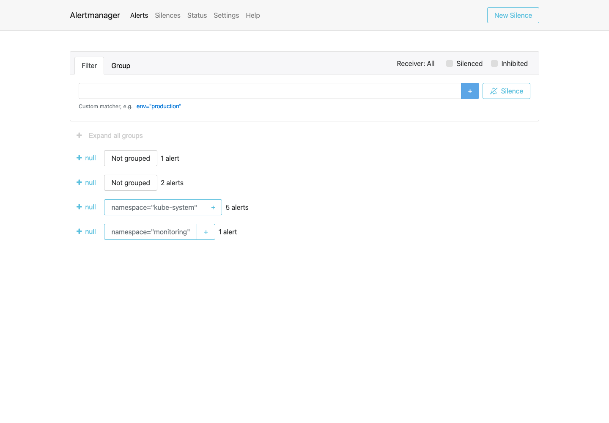

# Lab 16 - Kubernetes Monitoring and Init Containers

## Stack Components

- **Prometheus Operator** manages Prometheus, Alertmanager, ServiceMonitor, and related custom resources. It turns Kubernetes objects into Prometheus scrape configuration and keeps the monitoring stack reconciled.
- **Prometheus** stores time-series metrics and evaluates PromQL queries and alerting rules.
- **Alertmanager** receives firing alerts from Prometheus, groups them, applies silences/inhibition, and routes notifications.
- **Grafana** provides dashboards for Kubernetes, node, workload, and application metrics.
- **kube-state-metrics** exposes Kubernetes object state such as pod readiness, replica counts, StatefulSet status, and resource requests.
- **node-exporter** runs on the node and exposes host-level CPU, memory, filesystem, and network metrics.

## Installation Evidence

The stack was installed with Helm chart `kube-prometheus-stack-65.8.1` in namespace `monitoring`.

```bash
helm repo add prometheus-community https://prometheus-community.github.io/helm-charts
helm repo update
helm install monitoring prometheus-community/kube-prometheus-stack \
  --namespace monitoring \
  --create-namespace \
  --version 65.8.1 \
  --wait
```

```text
NAME       NAMESPACE   REVISION   STATUS     CHART                         APP VERSION
monitoring monitoring  1          deployed   kube-prometheus-stack-65.8.1   v0.77.2
```

```text
NAME                                                         READY   STATUS    RESTARTS   AGE
pod/alertmanager-monitoring-kube-prometheus-alertmanager-0   2/2     Running   0          22m
pod/monitoring-grafana-757b77f549-65b4g                      3/3     Running   0          22m
pod/monitoring-kube-prometheus-operator-6644fbd56f-jfdn6     1/1     Running   0          22m
pod/monitoring-kube-state-metrics-79fb7f456f-q7j5t           1/1     Running   0          22m
pod/monitoring-prometheus-node-exporter-wq8hp                1/1     Running   0          22m
pod/prometheus-monitoring-kube-prometheus-prometheus-0       2/2     Running   0          22m

NAME                                              TYPE        CLUSTER-IP       PORT(S)                      AGE
service/alertmanager-operated                     ClusterIP   None             9093/TCP,9094/TCP,9094/UDP   22m
service/monitoring-grafana                        ClusterIP   10.98.208.86     80/TCP                       22m
service/monitoring-kube-prometheus-alertmanager   ClusterIP   10.98.83.115     9093/TCP,8080/TCP            22m
service/monitoring-kube-prometheus-operator       ClusterIP   10.103.253.213   443/TCP                      22m
service/monitoring-kube-prometheus-prometheus     ClusterIP   10.103.182.133   9090/TCP,8080/TCP            22m
service/monitoring-kube-state-metrics             ClusterIP   10.109.219.194   8080/TCP                     22m
service/monitoring-prometheus-node-exporter       ClusterIP   10.102.109.115   9100/TCP                     22m
service/prometheus-operated                       ClusterIP   None             9090/TCP                     22m
```

## Dashboard Exploration

Screenshots:

- 
- 
- 
- 
- 

Answers from Grafana dashboards and Prometheus queries:

1. **Pod resources for StatefulSet**: `devops-info-python` had 5 ready pods. Combined CPU usage was about `0.0089` cores and combined working-set memory was about `193.45 MiB`.
2. **Default namespace CPU usage**: among default namespace pods, the highest CPU user was `devops-info-python-3` at about `0.00157` cores. The lowest was `devops-info-python-bg-6f699d8587-ksjzq` at about `0.00087` cores.
3. **Node metrics**: node `minikube` used about `4316.94 MiB` memory, which was `27.03%` of node memory. The node exposed `10` CPU cores.
4. **Kubelet**: kubelet reported `39` running pods and `79` running containers.
5. **Network**: this Minikube/cAdvisor setup did not expose `container_network_receive_bytes_total` or `container_network_transmit_bytes_total` with namespace labels, so the default-namespace pod network dashboard had no pod-level traffic series. Node-level network metrics were available from node-exporter.
6. **Alerts**: Alertmanager showed `1` active routed alert, `Watchdog`. Prometheus had `9` firing alert series, including Kubernetes control-plane targets that are intentionally unreachable in this local Minikube setup.

## Init Containers

The Python Helm chart now defines two init-container patterns in `values.yaml` and renders them for both Deployment and StatefulSet workloads:

- `wait-for-service` waits until DNS resolves `kubernetes.default.svc.cluster.local`.
- `init-download` downloads `http://example.com` into an `emptyDir` shared volume.
- The main app mounts the shared volume read-only at `/data/init`.

Rendered StatefulSet excerpt:

```yaml
initContainers:
  - name: wait-for-service
    image: "busybox:1.36"
    command:
      - sh
      - -c
      - >-
        until nslookup kubernetes.default.svc.cluster.local;
        do echo "waiting for kubernetes.default.svc.cluster.local";
        sleep 2;
        done
  - name: init-download
    image: "busybox:1.36"
    command:
      - sh
      - -c
      - >-
        set -eu;
        wget -O /work-dir/index.html "http://example.com";
        ls -l /work-dir/index.html
```

Live app resources:

```text
NAME                       READY   STATUS    RESTARTS   AGE
pod/devops-info-python-0   1/1     Running   0          15m
pod/devops-info-python-1   1/1     Running   0          16m
pod/devops-info-python-2   1/1     Running   0          17m
pod/devops-info-python-3   1/1     Running   0          17m
pod/devops-info-python-4   1/1     Running   0          18m

NAME                                  TYPE        CLUSTER-IP    PORT(S)   AGE
service/devops-info-python            ClusterIP   10.97.89.43   80/TCP    21h
service/devops-info-python-headless   ClusterIP   None          80/TCP    21m

NAME                                  READY   AGE
statefulset.apps/devops-info-python   5/5     21m
```

Init logs:

```text
$ kubectl logs devops-info-python-0 -n default -c wait-for-service
Server:         10.96.0.10
Address:        10.96.0.10:53
Name:   kubernetes.default.svc.cluster.local
Address: 10.96.0.1
```

```text
$ kubectl logs devops-info-python-0 -n default -c init-download
Connecting to example.com (8.47.69.0:80)
saving to '/work-dir/index.html'
index.html           100% |********************************|   528  0:00:00 ETA
'/work-dir/index.html' saved
-rw-r--r--    1 1000     1000           528 Apr 30 12:41 /work-dir/index.html
```

Main container verification:

```text
$ kubectl exec devops-info-python-0 -n default -- head -5 /data/init/index.html
<!doctype html><html lang="en"><head><title>Example Domain</title>...
```

## Bonus: Custom Metrics and ServiceMonitor

The Flask app exposes `/metrics` using `prometheus-client`. The endpoint includes default Python/process metrics plus custom application counters and histograms:

- `http_requests_total`
- `http_request_duration_seconds`
- `http_requests_in_progress`
- `devops_info_endpoint_calls_total`
- `devops_info_system_collection_seconds`

The Helm chart creates a `ServiceMonitor` when `serviceMonitor.enabled=true`:

```yaml
apiVersion: monitoring.coreos.com/v1
kind: ServiceMonitor
metadata:
  name: devops-info-python
  labels:
    release: monitoring
spec:
  selector:
    matchLabels:
      app.kubernetes.io/name: devops-info-python
      app.kubernetes.io/instance: devops-info-python
      monitoring.devops-labs.io/scrape: "true"
  namespaceSelector:
    matchNames:
      - default
  endpoints:
    - port: http
      path: /metrics
      interval: 15s
      scrapeTimeout: 10s
```

Live ServiceMonitor:

```text
NAME                                                      AGE
servicemonitor.monitoring.coreos.com/devops-info-python   21m
```

Prometheus verification:

```text
up{job="devops-info-python"} = 1 for devops-info-python-0 through devops-info-python-4
devops_info_endpoint_calls_total{job="devops-info-python", exported_endpoint="/health"} is present for all pods
```

Local image used for verification:

```bash
minikube image build -t ellilin/devops-info-service:lab16 app_python
helm upgrade devops-info-python k8s/python-app \
  --namespace default \
  --reuse-values \
  --set image.tag=lab16 \
  --set image.pullPolicy=IfNotPresent \
  --set serviceMonitor.scrapeLabel=true \
  --wait
```
