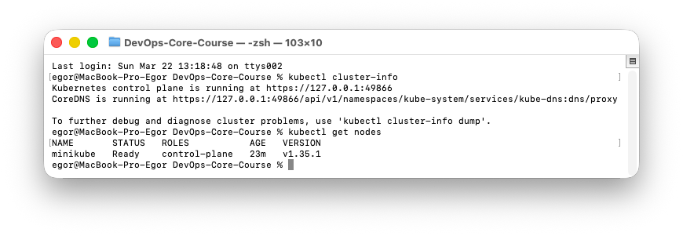
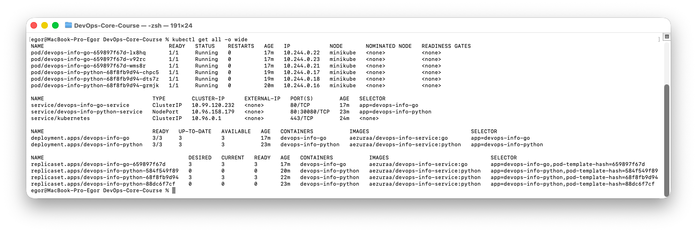
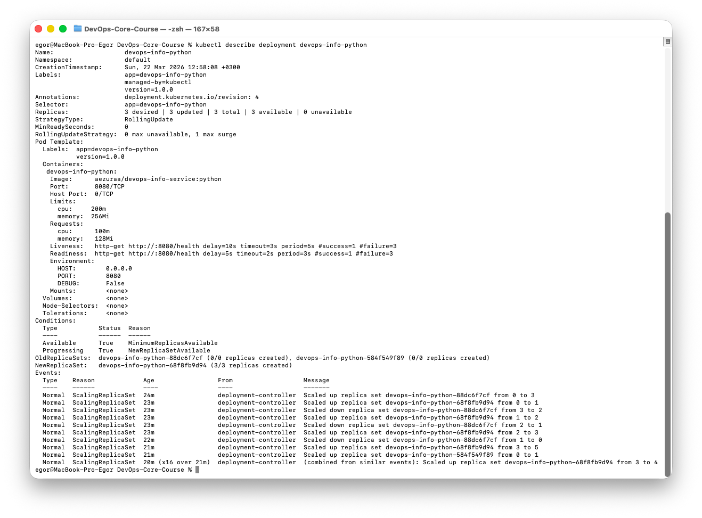
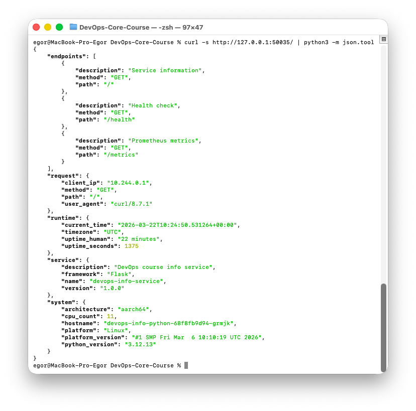
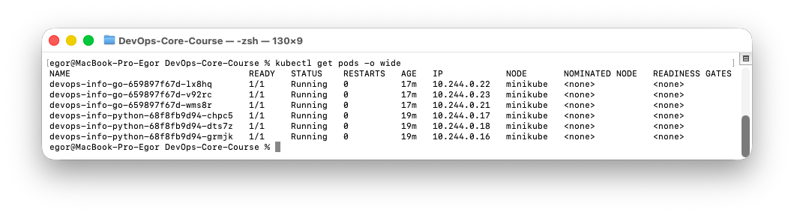
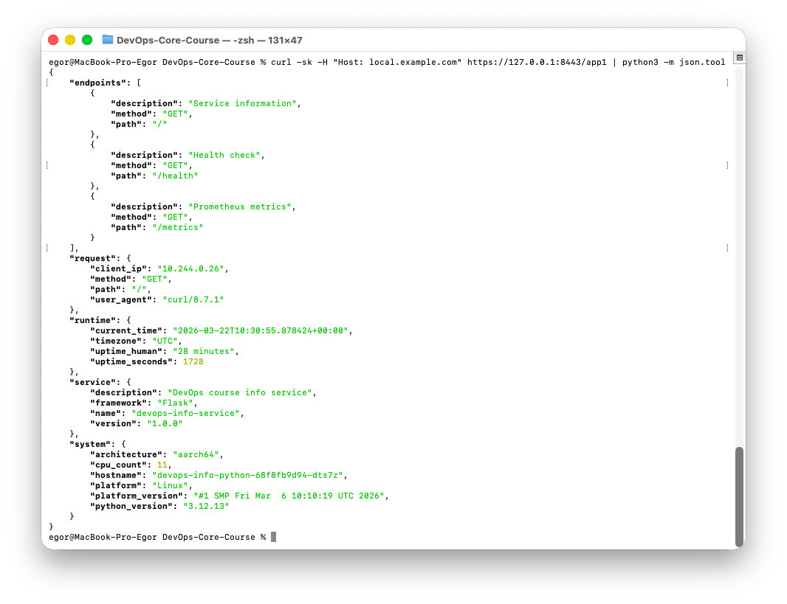
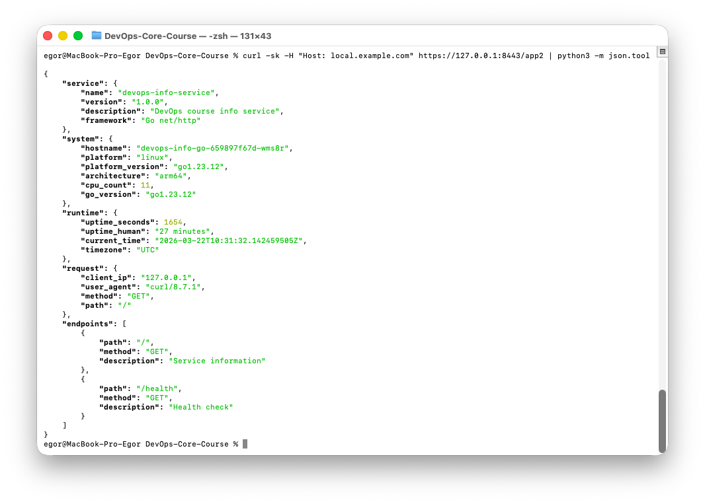
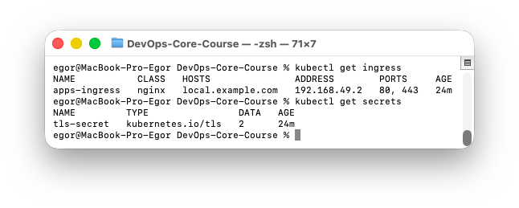

# Lab 09 — Kubernetes Fundamentals

## 1. Architecture Overview

### Deployment Architecture

```
                    ┌──────────────────────────────────────────────────┐
                    │              Minikube Cluster (Docker)           │
                    │                                                  │
                    │  ┌──────────────────────────────────────────┐   │
                    │  │       Ingress (nginx, TLS termination)   │   │
                    │  │  local.example.com                       │   │
                    │  │    /app1 → python-service                │   │
                    │  │    /app2 → go-service                    │   │
                    │  └────────────┬──────────────┬──────────────┘   │
                    │               │              │                   │
                    │  ┌────────────▼───────┐ ┌────▼──────────────┐   │
                    │  │ Service (NodePort)  │ │ Service (ClusterIP)│  │
                    │  │ python :80→8080     │ │ go :80→8080       │   │
                    │  └────────┬───────────┘ └────┬──────────────┘   │
                    │      ┌────┼────┐        ┌────┼────┐             │
                    │      ▼    ▼    ▼        ▼    ▼    ▼             │
                    │    Pod  Pod  Pod       Pod  Pod  Pod             │
                    │    128Mi/100m each     64Mi/50m each            │
                    └──────────────────────────────────────────────────┘
```

- **6 Pods total** — 3 Python replicas + 3 Go replicas
- **2 Services** — NodePort for Python (direct access), ClusterIP for Go
- **1 Ingress** — nginx with TLS, path-based routing (`/app1`, `/app2`)
- **Resource allocation** — Python: 128Mi/100m request, 256Mi/200m limit; Go: 64Mi/50m request, 128Mi/100m limit (smaller binary, lower overhead)

## 2. Manifest Files

| File | Description |
|------|-------------|
| `deployment.yml` | Python app — 3 replicas, health probes, resource limits, rolling update strategy |
| `service.yml` | Python service — NodePort type, port 80→8080, nodePort 30080 |
| `deployment-go.yml` | Go app — 3 replicas, health probes, lower resource limits (compiled binary) |
| `service-go.yml` | Go service — ClusterIP type, port 80→8080 |
| `ingress.yml` | Ingress — nginx controller, path-based routing, TLS with self-signed cert |

### Key Configuration Choices

- **3 replicas** — provides HA; enough for load balancing without overloading a single-node cluster
- **RollingUpdate with maxSurge=1, maxUnavailable=0** — guarantees zero downtime during updates
- **Resource requests/limits** — prevents resource starvation; Go app gets less since it has lower memory footprint (~10MB vs ~40MB for Python)
- **Liveness + Readiness probes on `/health`** — liveness restarts unhealthy containers, readiness removes them from Service endpoints until ready
- **imagePullPolicy: Never** — images are pre-loaded into minikube via `minikube image load`

## 3. Deployment Evidence

### Cluster Setup



```
$ kubectl cluster-info
Kubernetes control plane is running at https://127.0.0.1:49866
CoreDNS is running at https://127.0.0.1:49866/api/v1/namespaces/kube-system/services/kube-dns:dns/proxy

$ kubectl get nodes -o wide
NAME       STATUS   ROLES           AGE   VERSION   INTERNAL-IP    OS-IMAGE                         KERNEL-VERSION     CONTAINER-RUNTIME
minikube   Ready    control-plane   20s   v1.35.1   192.168.49.2   Debian GNU/Linux 12 (bookworm)   6.12.76-linuxkit   docker://29.2.1
```

**Tool choice: minikube** — full-featured local Kubernetes with built-in addon system (ingress, dashboard, metrics-server). Runs inside Docker on macOS via Docker Desktop driver. Preferred over kind for this lab because of native addon support.

### kubectl get all



```
NAME                                      READY   STATUS    RESTARTS   AGE
pod/devops-info-go-659897f67d-lx8hq       1/1     Running   0          5m18s
pod/devops-info-go-659897f67d-v92rc       1/1     Running   0          5m18s
pod/devops-info-go-659897f67d-wms8r       1/1     Running   0          5m18s
pod/devops-info-python-68f8fb9d94-chpc5   1/1     Running   0          7m14s
pod/devops-info-python-68f8fb9d94-dts7z   1/1     Running   0          7m9s
pod/devops-info-python-68f8fb9d94-grmjk   1/1     Running   0          7m22s

NAME                                 TYPE        CLUSTER-IP      EXTERNAL-IP   PORT(S)        AGE
service/devops-info-go-service       ClusterIP   10.99.120.232   <none>        80/TCP         5m18s
service/devops-info-python-service   NodePort    10.96.158.179   <none>        80:30080/TCP   11m
service/kubernetes                   ClusterIP   10.96.0.1       <none>        443/TCP        11m

NAME                                 READY   UP-TO-DATE   AVAILABLE   AGE
deployment.apps/devops-info-go       3/3     3            3           5m18s
deployment.apps/devops-info-python   3/3     3            3           11m
```

### kubectl describe deployment



```
Name:                   devops-info-python
Replicas:               3 desired | 3 updated | 3 total | 3 available | 0 unavailable
StrategyType:           RollingUpdate
RollingUpdateStrategy:  0 max unavailable, 1 max surge
Containers:
  devops-info-python:
    Image:      aezuraa/devops-info-service:python
    Limits:     cpu: 200m, memory: 256Mi
    Requests:   cpu: 100m, memory: 128Mi
    Liveness:   http-get http://:8080/health delay=10s timeout=3s period=5s #success=1 #failure=3
    Readiness:  http-get http://:8080/health delay=5s timeout=2s period=3s #success=1 #failure=3
```

### App Response via Service



```
$ curl -s http://127.0.0.1:50035/ | python3 -m json.tool
{
    "service": {
        "name": "devops-info-service",
        "version": "1.0.0",
        "description": "DevOps course info service",
        "framework": "Flask"
    },
    "system": {
        "hostname": "devops-info-python-68f8fb9d94-2lpts",
        "platform": "Linux",
        "architecture": "aarch64",
        "cpu_count": 11,
        "python_version": "3.12.13"
    }
}
```

## 4. Operations Performed

### Deploy

```bash
kubectl apply -f k8s/deployment.yml
kubectl apply -f k8s/service.yml
```

### Scaling to 5 Replicas



```
$ kubectl scale deployment/devops-info-python --replicas=5
deployment.apps/devops-info-python scaled

$ kubectl get pods
NAME                                  READY   STATUS    RESTARTS   AGE
devops-info-python-68f8fb9d94-2lpts   1/1     Running   0          76s
devops-info-python-68f8fb9d94-bhbx7   1/1     Running   0          10s
devops-info-python-68f8fb9d94-g854x   1/1     Running   0          71s
devops-info-python-68f8fb9d94-jp7sd   1/1     Running   0          10s
devops-info-python-68f8fb9d94-jw4pl   1/1     Running   0          84s

$ kubectl rollout status deployment/devops-info-python
deployment "devops-info-python" successfully rolled out
```

### Rolling Update

Triggered via environment variable change (simulating config update):

```
$ kubectl set env deployment/devops-info-python APP_VERSION=1.1.0
deployment.apps/devops-info-python env updated

$ kubectl rollout status deployment/devops-info-python
Waiting for deployment "devops-info-python" rollout to finish: 1 out of 5 new replicas have been updated...
Waiting for deployment "devops-info-python" rollout to finish: 2 out of 5 new replicas have been updated...
Waiting for deployment "devops-info-python" rollout to finish: 3 out of 5 new replicas have been updated...
Waiting for deployment "devops-info-python" rollout to finish: 4 out of 5 new replicas have been updated...
deployment "devops-info-python" successfully rolled out
```

Zero downtime achieved — `maxUnavailable: 0` ensures at least 5 pods serve traffic throughout the update.

### Rollback

```
$ kubectl rollout undo deployment/devops-info-python
deployment.apps/devops-info-python rolled back

$ kubectl rollout history deployment/devops-info-python
REVISION  CHANGE-CAUSE
1         <none>
3         <none>
4         <none>
```

Rollback completes the same way — new ReplicaSet is scaled up, old one is scaled down gradually.

### Service Access

```bash
# Via NodePort (minikube service tunnel)
minikube service devops-info-python-service --url
# → http://127.0.0.1:50035

# Via port-forward
kubectl port-forward service/devops-info-go-service 8081:80
```

## 5. Production Considerations

### Health Checks

- **Liveness probe** (`/health`, period=5s) — restarts container if 3 consecutive checks fail; catches deadlocks, memory leaks
- **Readiness probe** (`/health`, period=3s) — removes pod from Service endpoints during startup or degradation; prevents traffic to unhealthy pods
- **initialDelaySeconds** — Python gets 10s (Flask startup), Go gets 5s (instant binary start)

### Resource Limits Rationale

| App | Requests | Limits | Reason |
|-----|----------|--------|--------|
| Python | 128Mi/100m | 256Mi/200m | Flask + Python runtime overhead ~40MB idle |
| Go | 64Mi/50m | 128Mi/100m | Compiled binary, ~10MB idle |

Requests guarantee scheduling; limits prevent noisy-neighbor problems on shared nodes.

### Production Improvements

- **HPA (Horizontal Pod Autoscaler)** — auto-scale based on CPU/memory instead of static replica count
- **PodDisruptionBudget** — ensure minimum availability during voluntary disruptions (node drain, upgrades)
- **NetworkPolicy** — restrict inter-pod communication to only what's needed
- **Secrets management** — use external secrets operator or Vault instead of env vars
- **cert-manager** — auto-provision and renew TLS certificates via Let's Encrypt
- **Pod anti-affinity** — spread replicas across nodes for true HA
- **Resource quotas** — namespace-level limits to prevent any team from consuming all cluster resources

### Monitoring & Observability

- Python app already exposes `/metrics` (Prometheus format) — wire up with Prometheus + Grafana
- Structured JSON logs (Python) — ready for log aggregation via Loki/ELK
- Add `kubectl top pods` with metrics-server for real-time resource monitoring

## 6. Challenges & Solutions

### Challenge 1: ImagePullBackOff

**Problem:** Pods failed with `ImagePullBackOff` — minikube couldn't pull `aezuraa/devops-info-service:python` from Docker Hub because the image was built for `linux/amd64` but the cluster runs `linux/arm64`.

**Solution:** Built the image locally for the correct architecture, loaded it into minikube with `minikube image load`, and set `imagePullPolicy: Never`.

**Debugging:** `kubectl describe pod <name>` → Events section showed the exact pull error.

### Challenge 2: Ingress on macOS Docker Driver

**Problem:** `minikube tunnel` couldn't bind to port 80/443 on 127.0.0.1 without sudo.

**Solution:** Used `kubectl port-forward` to the ingress-nginx-controller service as an alternative:

```bash
kubectl port-forward -n ingress-nginx service/ingress-nginx-controller 8443:443 8080:80
```

### Challenge 3: HTTP to HTTPS Redirect

**Problem:** HTTP requests to Ingress returned 308 redirect instead of content.

**Solution:** This is expected behavior — nginx Ingress automatically redirects HTTP→HTTPS when TLS is configured. Tested directly via HTTPS port.

### Key Learnings

- Kubernetes is truly declarative — define desired state, controllers reconcile
- Labels/selectors are the glue between Deployments, Services, and Ingress
- Health probes are essential — without them, K8s can't distinguish healthy from unhealthy pods
- Rolling updates with `maxUnavailable: 0` guarantee zero downtime
- Local development with minikube requires image pre-loading when not using a registry

---

## Bonus: Ingress with TLS

### Multi-App Deployment

Both Python and Go apps deployed as separate Deployments with their own Services.

### Ingress Controller

```
$ minikube addons enable ingress
* The 'ingress' addon is enabled

$ kubectl get pods -n ingress-nginx
NAME                                        READY   STATUS
ingress-nginx-controller-596f8778bc-w2s9z   1/1     Running
```

### TLS Certificate

```bash
openssl req -x509 -nodes -days 365 -newkey rsa:2048 \
  -keyout tls.key -out tls.crt \
  -subj "/CN=local.example.com/O=local.example.com"

kubectl create secret tls tls-secret --key tls.key --cert tls.crt
```

### Path-Based Routing

```
$ kubectl get ingress
NAME           CLASS   HOSTS               ADDRESS        PORTS     AGE
apps-ingress   nginx   local.example.com   192.168.49.2   80, 443   113s
```

### Ingress HTTPS — exact commands (404 without `Host`)

Ingress rules use **host** `local.example.com`. If you run `curl https://127.0.0.1:8443/app1` **without** `Host: local.example.com`, nginx does not match this Ingress and returns **404**.

**Terminal 1** (leave running):

```bash
kubectl port-forward -n ingress-nginx service/ingress-nginx-controller 8443:443
```

**Terminal 2** — screenshots / checks:

```bash
# Python app (must include Host header)
curl -sk -H "Host: local.example.com" https://127.0.0.1:8443/app1

# Go app
curl -sk -H "Host: local.example.com" https://127.0.0.1:8443/app2

# Ingress + secrets (screenshot)
kubectl get ingress
kubectl get secrets
```

Optional: add `local.example.com` to `/etc/hosts` pointing at `minikube ip`, then you can use `curl -sk https://local.example.com:8443/app1` **only if** you still reach the controller on that port (same port-forward applies).

### Routing Verification







```
$ curl -sk -H "Host: local.example.com" https://127.0.0.1:8443/app1 | python3 -m json.tool
{
    "service": { "framework": "Flask", "name": "devops-info-service" },
    ...
}

$ curl -sk -H "Host: local.example.com" https://127.0.0.1:8443/app2 | python3 -m json.tool
{
    "service": { "framework": "Go net/http", "name": "devops-info-service" },
    ...
}
```

### Ingress Benefits over NodePort

- **L7 routing** — route by path/host instead of port numbers (no need to remember 30080, 30081...)
- **TLS termination** — one certificate at the edge, backends stay HTTP
- **Centralized config** — single entry point for all services
- **Name-based virtual hosting** — multiple domains on one IP
- **Rewrite rules** — transform URLs before forwarding to backends
