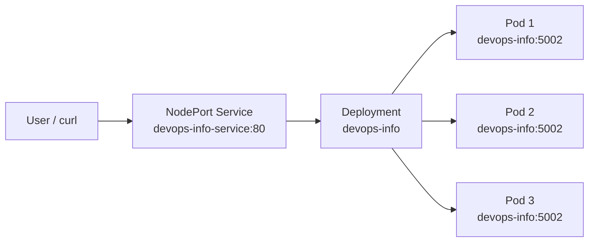
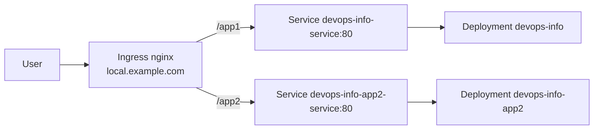

# Lab 9 — Kubernetes Deployment

This directory contains the Kubernetes manifests for deploying the Python `devops-info-service` from Lab 2.

## Architecture Overview

**Chosen local cluster tool:** `kind`

I would use `kind` for this lab because it is lightweight, Docker-native, quick to recreate, and fits iterative local testing well. The manifests themselves are cluster-agnostic, so the same files also work with `minikube`.



Networking flow:

- Traffic enters through the `NodePort` Service `devops-info-service`.
- The Service forwards traffic on port `80` to container port `5002`.
- The Service selects Pods by the shared `app: devops-info` and `app.kubernetes.io/name: devops-info` labels.
- The Deployment maintains the desired replica count and replaces failed Pods automatically.

Resource allocation strategy:

- Requests: `100m` CPU and `128Mi` memory guarantee schedulable baseline resources.
- Limits: `200m` CPU and `256Mi` memory prevent this small Flask service from consuming excessive cluster capacity.
- `minReadySeconds`, readiness probes, and `maxUnavailable: 0` keep updates safe for a user-facing HTTP service.

## Manifest Files

### `deployment.yml`

Defines the `Deployment` for the Flask application.

Key configuration choices:

- `replicas: 3` provides redundancy and satisfies the lab requirement.
- `image: sofiakulagina/devops-info:lab2` reuses the Docker image already published in Lab 2.
- Rolling updates use:
  - `maxSurge: 1`
  - `maxUnavailable: 0`
- Health checks:
  - `startupProbe` on `/health`
  - `livenessProbe` on `/health`
  - `readinessProbe` on `/health`
- Security settings:
  - `runAsNonRoot: true`
  - explicit UID/GID `1000`
  - `allowPrivilegeEscalation: false`
  - drop all Linux capabilities

Why these values:

- Three replicas are enough to demonstrate scheduling, scaling, and zero-downtime rollouts in a local cluster.
- The resource values are conservative for a simple Flask app with JSON responses and Prometheus metrics.
- Separate liveness and readiness probes better reflect production intent: a process can be alive before it should receive traffic.

### `service.yml`

Defines a `NodePort` Service for local access.

Key configuration choices:

- `type: NodePort`
- service port `80`
- target port `5002`
- fixed `nodePort: 30082`

Why these values:

- `NodePort` matches the lab requirement for local cluster exposure.
- Port `80` gives a clean service interface even though the application listens on `5002`.
- A fixed node port simplifies verification commands and documentation.

### `deployment-app2.yml`

Defines a second application deployment for the bonus task.

Key configuration choices:

- Separate workload name: `devops-info-app2`
- `replicas: 2` for independent scaling of the second app
- Same production baseline as app1: resources, probes, non-root security context
- `APP_REVISION=app2-v1` to clearly identify second app responses/logs

### `service-app2.yml`

Defines a second Service used by Ingress for `/app2`.

Key configuration choices:

- `type: ClusterIP` because external exposure is handled by Ingress
- service port `80` to keep backend contract consistent with app1 service
- selector `app: devops-info-app2`

### `ingress.yml`

Defines path-based routing and TLS for the bonus task.

Key configuration choices:

- host: `local.example.com`
- `/app1` routes to `devops-info-service`
- `/app2` routes to `devops-info-app2-service`
- TLS secret `tls-secret`
- NGINX regex rewrite to strip `/app1` and `/app2` prefixes before forwarding to the Flask app root

## Deployment Evidence

Run the commands below on your machine after starting a local cluster, then paste the real output into this section if your instructor requires raw evidence.

### Cluster setup evidence

```bash
kubectl cluster-info
kubectl get nodes -o wide
kubectl get namespaces
```

Screenshot links:

- [Cluster info](./screenshots/01-cluster-info&deployment.png)
- [Some info](./screenshots/getpods.png)

### Deployment evidence

```bash
kubectl apply -f k8s/deployment.yml
kubectl apply -f k8s/service.yml
kubectl get all
kubectl get pods,svc -o wide
kubectl describe deployment devops-info
```

Screenshot links:

- [kubectl get all](./screenshots/04-kubectl-get-all.png)
- [kubectl get pods,svc -o wide](./screenshots/05-kubectl-get-pods-svc-wide.png)
- [kubectl describe deployment devops-info](./screenshots/06-describe-deployment.png)

### Connectivity evidence

For `kind`:

```bash
kubectl port-forward service/devops-info-service 8080:80
curl -s http://127.0.0.1:8080/ | jq
curl -s http://127.0.0.1:8080/health | jq
```

For `minikube`:

```bash
minikube service devops-info-service --url
curl -s http://$(minikube service devops-info-service --url)/health
```

Screenshot links:

- [Service connectivity (port-forward or minikube url + curl)](./screenshots/07-service-connectivity-curl.png)

Expected deployed state:

- `1` Deployment
- `1` Service
- `3` running Pods initially
- Service endpoints pointing to the Pod IPs on port `5002`

## Operations Performed

### Initial deployment

```bash
kubectl apply -f k8s/deployment.yml
kubectl apply -f k8s/service.yml
kubectl rollout status deployment/devops-info
kubectl get deployments
kubectl get pods
kubectl get services
```

### Scaling demonstration

Imperative scaling:

```bash
kubectl scale deployment/devops-info --replicas=5
kubectl rollout status deployment/devops-info
kubectl get pods -l app=devops-info
```

Screenshot links:

- [Scale to 5 replicas](./screenshots/08-scale-to-5-replicas.png)
- [Pods after scaling](./screenshots/09-pods-after-scaling.png)

Declarative scaling:

1. Change `replicas` in `k8s/deployment.yml` from `3` to `5`.
2. Re-apply the manifest:

```bash
kubectl apply -f k8s/deployment.yml
kubectl rollout status deployment/devops-info
```

### Rolling update demonstration

This manifest includes `APP_REVISION=v1`. To trigger a rolling update without rebuilding the image:

1. Change `APP_REVISION` in `k8s/deployment.yml` from `v1` to `v2`.
2. Re-apply:

```bash
kubectl apply -f k8s/deployment.yml
kubectl rollout status deployment/devops-info
kubectl rollout history deployment/devops-info
```

Screenshot links:

- [Rolling update status](./screenshots/10-rolling-update-status.png)
- [Rollout history](./screenshots/11-rollout-history.png)

Because the Deployment strategy uses `maxUnavailable: 0`, Kubernetes should keep existing ready Pods serving while new Pods start.

### Rollback demonstration

```bash
kubectl rollout undo deployment/devops-info
kubectl rollout status deployment/devops-info
kubectl rollout history deployment/devops-info
```

Screenshot links:

- [Rollback execution and status](./screenshots/12-rollback-status.png)

## Bonus Task — Ingress with TLS

### Bonus architecture



### Bonus setup and apply commands

Deploy second app resources:

```bash
kubectl apply -f k8s/deployment-app2.yml
kubectl apply -f k8s/service-app2.yml
```

Install Ingress controller in `kind`:

```bash
kubectl apply -f https://raw.githubusercontent.com/kubernetes/ingress-nginx/main/deploy/static/provider/kind/deploy.yaml
kubectl wait --namespace ingress-nginx \
  --for=condition=ready pod \
  --selector=app.kubernetes.io/component=controller \
  --timeout=180s
```

Create TLS certificate and Kubernetes TLS Secret:

```bash
openssl req -x509 -nodes -days 365 -newkey rsa:2048 \
  -keyout k8s/tls.key -out k8s/tls.crt \
  -subj "/CN=local.example.com/O=local.example.com"

kubectl create secret tls tls-secret \
  --key k8s/tls.key \
  --cert k8s/tls.crt \
  --dry-run=client -o yaml | kubectl apply -f -
```

Apply Ingress resource:

```bash
kubectl apply -f k8s/ingress.yml
kubectl get ingress
kubectl describe ingress devops-info-ingress
```

### Bonus verification commands

For `kind`, use port-forward to the ingress controller and verify both routes:

```bash
kubectl -n ingress-nginx port-forward service/ingress-nginx-controller 8081:80 8443:443
```

In a second terminal:

```bash
curl -s -H "Host: local.example.com" http://127.0.0.1:8081/app1/ | jq
curl -s -H "Host: local.example.com" http://127.0.0.1:8081/app2/ | jq
curl -sk -H "Host: local.example.com" https://127.0.0.1:8443/app1/ | jq
curl -sk -H "Host: local.example.com" https://127.0.0.1:8443/app2/ | jq
```

Expected result:

- `/app1` responds from service `devops-info-service`
- `/app2` responds from service `devops-info-app2-service`
- HTTPS works with the self-signed cert (`-k`)

Bonus screenshot links:

- [Second app deployment and service](./screenshots/13-bonus-app2-resources.png)
- [Ingress controller ready](./screenshots/14-ingress-controller-ready.png)
- [TLS secret created](./screenshots/15-tls-secret.png)
- [Ingress resources](./screenshots/16-ingress-get-describe.png)
- [Routing check /app1 and /app2](./screenshots/17-routing-app1-app2.png)
- [HTTPS check with TLS](./screenshots/18-https-routing.png)

Ingress benefits over NodePort:

- One public entrypoint instead of separate node ports per service
- Layer 7 routing by host/path (`/app1`, `/app2`)
- Native TLS termination at the ingress edge
- Cleaner scaling of many services behind one endpoint

## Production Considerations

Health checks implemented:

- `startupProbe` prevents premature restarts during application boot.
- `livenessProbe` detects a stuck process and lets Kubernetes restart it.
- `readinessProbe` ensures traffic is sent only to Pods ready to serve requests.

Resource limit rationale:

- The Flask service is lightweight and mostly CPU-idle outside request handling.
- `100m/128Mi` requests keep scheduling realistic without over-reserving a local cluster.
- `200m/256Mi` limits provide enough headroom for bursts while keeping the Pod bounded.

Improvements for production:

- Replace the Flask development server with `gunicorn`.
- Add a dedicated Namespace, Ingress, and TLS termination.
- Store configuration in ConfigMaps and secrets in Kubernetes Secrets.
- Add a `HorizontalPodAutoscaler`.
- Add a `PodDisruptionBudget` for safer voluntary disruptions.
- Add network policies and image scanning to tighten security.

Monitoring and observability strategy:

- Reuse the `/metrics` endpoint already added in Lab 8.
- Scrape the service with Prometheus via a `ServiceMonitor` or scrape config.
- Continue shipping structured JSON logs to Loki.
- Add alerting for probe failures, restart count spikes, latency, and 5xx error rate.

## Challenges & Solutions

### Challenge 1: Distinguishing liveness from readiness

- **Issue:** rollout failed when readiness criteria were stricter than what the current image reliably exposed.
- **Solution:** used `/health` for startup, liveness, and readiness in this lab setup to stabilize rollouts.
- **What I learned:** probes must match the real behavior of the exact image tag deployed in the cluster.

### Challenge 2: Safe rolling updates

- **Issue:** a rollout can still cause visible disruption if new Pods receive traffic too early.
- **Solution:** used readiness probes, `minReadySeconds`, `maxSurge: 1`, and `maxUnavailable: 0`.
- **What I learned:** rollouts depend on both probe design and Deployment strategy, not just replica count.

### Challenge 3: Debugging Kubernetes resources

Recommended debugging flow:

```bash
kubectl get pods
kubectl describe pod <pod-name>
kubectl logs <pod-name>
kubectl get events --sort-by=.metadata.creationTimestamp
kubectl get endpoints
```

Typical issues to check:

- image pull failures
- probe failures
- incorrect Service selectors
- wrong container port or target port
- resource requests too high for the local cluster
