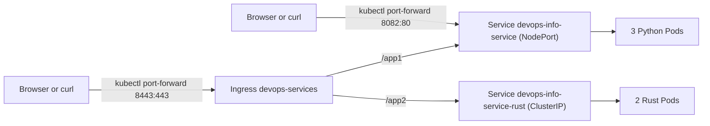

# Lab 09 - Kubernetes Fundamentals

## What I built

For this lab I moved my earlier containerized apps into a local Kubernetes cluster and kept the setup close to how I would approach a small real deployment:

- the Python service is deployed as a `Deployment` with 3 replicas
- it is exposed through a `NodePort` `Service`
- the Pods have resource requests and limits
- the Pods use startup, readiness, and liveness probes against `/health`
- rolling updates are configured with `maxUnavailable: 0`

I also completed the bonus part:

- the Rust app is deployed as a second Kubernetes workload
- both apps are exposed through a single `Ingress`
- `/app1` routes to the Python app
- `/app2` routes to the Rust app
- HTTPS is enabled with a self-signed TLS secret

I used `kind` for the cluster. `kubectl` and Docker were already installed locally, `kind` was missing, and it was the fastest way to get a clean cluster that could consume locally built Docker images without pushing them anywhere first.

## Architecture Overview



Final steady state:

- Python app: 3 Pods
- Rust app: 2 Pods
- Python service: `NodePort`
- Rust service: `ClusterIP`
- Ingress host: `devops.local`

Resource choices:

- Python app requests `100m` CPU and `128Mi` memory, limits `250m` CPU and `256Mi` memory
- Rust app requests `50m` CPU and `64Mi` memory, limits `200m` CPU and `128Mi` memory

That split felt reasonable for the workloads here. The Flask app is heavier than the distroless Rust binary, but both are still small enough for a local cluster.

## Manifest Files

- `k8s/namespace.yml`
  Creates an isolated `lab9` namespace so the lab resources do not mix with the ingress controller or default namespace objects.

- `k8s/deployment.yml`
  Main Python `Deployment`. It defines 3 replicas, rolling update strategy, explicit resource requests and limits, three HTTP probes, and a locked-down security context.

- `k8s/service.yml`
  Main Python `Service`. It is a `NodePort` service on port `80` with node port `30080`, which satisfies the lab requirement for external local access.

- `k8s/rust-deployment.yml`
  Bonus `Deployment` for the Rust app. I kept it smaller, with 2 replicas and lighter resource values.

- `k8s/rust-service.yml`
  Bonus `ClusterIP` service for the Rust app. It is only meant to sit behind the Ingress.

- `k8s/ingress.yml`
  Path-based routing with TLS:
  `/app1` -> `devops-info-service`
  `/app2` -> `devops-info-service-rust`

- `k8s/kind-config.yml`
  Local cluster config for `kind`. I kept host port mappings for `80` and `443` available, although on this machine the most reliable verification path ended up being `kubectl port-forward` against the ingress controller service.

## Local Kubernetes Setup

### Cluster info

```text
$ kubectl cluster-info
Kubernetes control plane is running at https://127.0.0.1:55475
CoreDNS is running at https://127.0.0.1:55475/api/v1/namespaces/kube-system/services/kube-dns:dns/proxy
```

### Nodes

```text
$ kubectl get nodes -o wide
NAME                 STATUS   ROLES           AGE   VERSION   INTERNAL-IP     EXTERNAL-IP   OS-IMAGE                         KERNEL-VERSION                        CONTAINER-RUNTIME
lab9-control-plane   Ready    control-plane   10m   v1.35.0   192.168.148.2   <none>        Debian GNU/Linux 12 (bookworm)   6.13.7-orbstack-00283-g9d1400e7e9c6   containerd://2.2.0
```

### Cluster creation flow

```bash
brew install kind
kind create cluster --name lab9 --config k8s/kind-config.yml
docker build -t devops-info-service-python:lab09 app_python
docker build -t devops-info-service-rust:lab09 app_rust
kind load docker-image devops-info-service-python:lab09 --name lab9
kind load docker-image devops-info-service-rust:lab09 --name lab9
kubectl apply -f k8s/namespace.yml
kubectl apply -f k8s/deployment.yml -f k8s/service.yml -f k8s/rust-deployment.yml -f k8s/rust-service.yml
```

## Deployment Evidence

### `kubectl get all -n lab9`

```text
$ kubectl get all -n lab9
NAME                                            READY   STATUS    RESTARTS   AGE
pod/devops-info-service-7dbcd68cdb-fm8qv        1/1     Running   0          44s
pod/devops-info-service-7dbcd68cdb-mb4zv        1/1     Running   0          40s
pod/devops-info-service-7dbcd68cdb-xm8mk        1/1     Running   0          50s
pod/devops-info-service-rust-767b85bc67-57csl   1/1     Running   0          9m57s
pod/devops-info-service-rust-767b85bc67-vmjp4   1/1     Running   0          9m57s

NAME                               TYPE        CLUSTER-IP     EXTERNAL-IP   PORT(S)        AGE
service/devops-info-service        NodePort    10.96.166.45   <none>        80:30080/TCP   9m57s
service/devops-info-service-rust   ClusterIP   10.96.252.94   <none>        80/TCP         9m57s

NAME                                       READY   UP-TO-DATE   AVAILABLE   AGE
deployment.apps/devops-info-service        3/3     3            3           9m57s
deployment.apps/devops-info-service-rust   2/2     2            2           9m57s
```

### `kubectl get pods,svc -n lab9 -o wide`

```text
$ kubectl get pods,svc -n lab9 -o wide
NAME                                            READY   STATUS    RESTARTS   AGE     IP            NODE                 NOMINATED NODE   READINESS GATES
pod/devops-info-service-7dbcd68cdb-fm8qv        1/1     Running   0          44s     10.244.0.36   lab9-control-plane   <none>           <none>
pod/devops-info-service-7dbcd68cdb-mb4zv        1/1     Running   0          40s     10.244.0.37   lab9-control-plane   <none>           <none>
pod/devops-info-service-7dbcd68cdb-xm8mk        1/1     Running   0          50s     10.244.0.35   lab9-control-plane   <none>           <none>
pod/devops-info-service-rust-767b85bc67-57csl   1/1     Running   0          9m57s   10.244.0.12   lab9-control-plane   <none>           <none>
pod/devops-info-service-rust-767b85bc67-vmjp4   1/1     Running   0          9m57s   10.244.0.11   lab9-control-plane   <none>           <none>

NAME                               TYPE        CLUSTER-IP     EXTERNAL-IP   PORT(S)        AGE     SELECTOR
service/devops-info-service        NodePort    10.96.166.45   <none>        80:30080/TCP   9m57s   app=devops-info-service
service/devops-info-service-rust   ClusterIP   10.96.252.94   <none>        80/TCP         9m57s   app=devops-info-service-rust
```

### Deployment description

```text
$ kubectl describe deployment devops-info-service -n lab9
Name:                   devops-info-service
Namespace:              lab9
Replicas:               3 desired | 3 updated | 3 total | 3 available | 0 unavailable
StrategyType:           RollingUpdate
RollingUpdateStrategy:  0 max unavailable, 1 max surge
...
Limits:
  cpu:     250m
  memory:  256Mi
Requests:
  cpu:      100m
  memory:   128Mi
Liveness:   http-get http://:http/health delay=10s timeout=2s period=10s #success=1 #failure=3
Readiness:  http-get http://:http/health delay=3s timeout=2s period=5s #success=1 #failure=3
Startup:    http-get http://:http/health delay=0s timeout=2s period=3s #success=1 #failure=10
Environment:
  PORT:             5000
  SERVICE_VERSION:  1.0.0
```

### Direct service verification

I used `kubectl port-forward` to verify the `NodePort` service from the host without depending on Docker Desktop networking details:

```bash
kubectl port-forward service/devops-info-service -n lab9 8082:80
curl -fsS http://127.0.0.1:8082/ | jq '{service: .service, request_path: .request.path}'
```

Observed response:

```json
{
  "service": {
    "description": "DevOps course info service",
    "framework": "Flask",
    "name": "devops-info-service",
    "version": "1.0.0"
  },
  "request_path": "/"
}
```

## Operations Performed

### Scaling to 5 replicas

```text
$ kubectl scale deployment/devops-info-service -n lab9 --replicas=5
deployment.apps/devops-info-service scaled

$ kubectl rollout status deployment/devops-info-service -n lab9 --timeout=180s
deployment "devops-info-service" successfully rolled out

$ kubectl get deployment devops-info-service -n lab9
NAME                  READY   UP-TO-DATE   AVAILABLE   AGE
devops-info-service   5/5     5            5           2m25s
```

I used the imperative command here on purpose because it is the quickest way to demonstrate scaling. After the demo I reapplied `k8s/deployment.yml` to return the cluster to the repo state of 3 replicas.

### Rolling update

I used a configuration change instead of rebuilding an image. The Python app now reads `SERVICE_VERSION` from the environment, which let me change a visible value during rollout.

Update command:

```bash
kubectl set env deployment/devops-info-service -n lab9 SERVICE_VERSION=1.0.2
kubectl rollout status deployment/devops-info-service -n lab9 --timeout=180s
```

Observed rollout summary:

```text
deployment.apps/devops-info-service env updated
deployment "devops-info-service" successfully rolled out
1.0.2
```

Zero-downtime verification:

`kubectl port-forward` to a service is sticky to one backend, so it is not a reliable proof of availability during a rolling update. To check the real service path, I ran a temporary `curlimages/curl` Pod inside the cluster and hit the service DNS name while the rollout was happening:

```bash
kubectl run lab9-curl-check --rm -i --restart=Never -n lab9 \
  --image=curlimages/curl:8.12.1 \
  --command -- sh -c 'failures=0; for i in $(seq 1 25); do curl -fsS http://devops-info-service/health >/dev/null || failures=$((failures+1)); sleep 1; done; echo healthcheck_failures=$failures'
```

Observed result:

```text
healthcheck_failures=0
```

### Rollback

```text
$ kubectl rollout undo deployment/devops-info-service -n lab9
deployment.apps/devops-info-service rolled back

$ kubectl rollout status deployment/devops-info-service -n lab9 --timeout=180s
deployment "devops-info-service" successfully rolled out

$ kubectl get deployment devops-info-service -n lab9 -o jsonpath='{.spec.template.spec.containers[0].env}'
[{"name":"PORT","value":"5000"},{"name":"SERVICE_VERSION","value":"1.0.1"}]
```

Rollout history after the lab run:

```text
$ kubectl rollout history deployment/devops-info-service -n lab9
deployment.apps/devops-info-service
REVISION  CHANGE-CAUSE
1         <none>
4         <none>
5         <none>
6         <none>
```

To finish in a clean, repo-driven state, I re-applied `k8s/deployment.yml` and brought the Python deployment back to `3 replicas, SERVICE_VERSION=1.0.0`.

## Bonus Task - Ingress with TLS

### Ingress controller

I installed `ingress-nginx` with the standard kind manifest:

```bash
kubectl apply -f https://raw.githubusercontent.com/kubernetes/ingress-nginx/main/deploy/static/provider/kind/deploy.yaml
kubectl rollout status deployment/ingress-nginx-controller -n ingress-nginx --timeout=180s
```

### TLS secret

I generated a self-signed certificate with a proper SAN:

```bash
openssl req -x509 -nodes -days 365 -newkey rsa:2048 \
  -keyout k8s/certs/devops.local.key \
  -out k8s/certs/devops.local.crt \
  -subj "/CN=devops.local/O=devops.local" \
  -addext "subjectAltName = DNS:devops.local"

kubectl create secret tls devops-local-tls -n lab9 \
  --key k8s/certs/devops.local.key \
  --cert k8s/certs/devops.local.crt \
  --dry-run=client -o yaml | kubectl apply -f -
```

### Ingress resource

```bash
kubectl apply -f k8s/ingress.yml
kubectl get ingress -n lab9
```

Observed:

```text
NAME              CLASS   HOSTS          ADDRESS     PORTS     AGE
devops-services   nginx   devops.local   localhost   80, 443   4m54s
```

### HTTPS verification

On this machine the cleanest test path was to port-forward the ingress controller service:

```bash
kubectl port-forward -n ingress-nginx service/ingress-nginx-controller 8443:443 8081:80
```

Then I verified both routes through HTTPS:

```bash
curl -sk --resolve devops.local:8443:127.0.0.1 https://devops.local:8443/app1/health
curl -sk --resolve devops.local:8443:127.0.0.1 https://devops.local:8443/app2/health
```

Observed responses:

```json
{"status":"healthy","timestamp":"2026-03-25T20:27:04.072171+00:00","uptime_seconds":35}
{"status":"healthy","timestamp":"2026-03-25T20:27:04.051453293+00:00","uptime_seconds":595}
```

I also verified the routed root endpoints:

```bash
curl -sk --resolve devops.local:8443:127.0.0.1 https://devops.local:8443/app1/ | jq '{service: .service, request_path: .request.path}'
curl -sk --resolve devops.local:8443:127.0.0.1 https://devops.local:8443/app2/ | jq '{service: .service, request_path: .request.path}'
```

Observed:

```json
{
  "service": {
    "description": "DevOps course info service",
    "framework": "Flask",
    "name": "devops-info-service",
    "version": "1.0.1"
  },
  "request_path": "/"
}
{
  "service": {
    "name": "devops-info-service",
    "version": "1.0.0",
    "description": "DevOps course info service",
    "framework": "Actix-web"
  },
  "request_path": "/"
}
```

Why Ingress is better than only using `NodePort`:

- one entry point instead of one external port per app
- path-based routing in one place
- TLS termination at the edge
- easier migration toward a real reverse proxy or cloud load balancer later

## Production Considerations

### Health checks

I used the same `/health` endpoint for startup, readiness, and liveness because both apps are simple stateless HTTP services. For a larger system I would separate concerns more clearly:

- startup probe for slow bootstrap only
- readiness probe for dependency checks
- liveness probe for process health only

### Resource limits

The current values are conservative enough for a local lab but still useful:

- they force the scheduler to make an explicit placement decision
- they stop a broken process from consuming the whole node
- they make the manifests look more like something I would actually keep in version control

### What I would improve for a real environment

- use a real registry and immutable image digests
- add `HorizontalPodAutoscaler`
- split readiness from deeper dependency checks
- add separate `NetworkPolicy` and `PodDisruptionBudget`
- move Ingress to `Gateway API` instead of keeping `ingress-nginx` as a long-term plan
- store TLS material in cert-manager rather than generating it by hand

### Monitoring and observability

I already have logging and Prometheus/Grafana work from Labs 7 and 8. In production I would connect those here by:

- scraping the Python app `/metrics` endpoint from inside the cluster
- shipping controller and app logs to Loki
- adding dashboards for Pod restarts, readiness failures, and rollout status

## Challenges and Solutions

### 1. Python Pods failed with `CreateContainerConfigError`

The first version of the Python deployment used `runAsNonRoot: true` with an image that had `USER app`. Kubernetes refuses that when the image user is not numeric because it cannot verify the UID ahead of time.

What I did:

- checked the image user inside the container
- found that `app` maps to UID/GID `999`
- updated `k8s/deployment.yml` to set `runAsUser: 999` and `runAsGroup: 999`

That kept the security settings strict and fixed the startup issue without weakening the manifest.

### 2. `kubectl port-forward` was misleading during the rollout test

I initially used `kubectl port-forward service/...` to watch the Python app during rollout. That was a mistake for verification because the forwarded connection stays attached to one backend and does not reflect how the service load balances across changing endpoints.

What I changed:

- used an in-cluster `curlimages/curl` Pod
- hit `http://devops-info-service/health` during the rollout itself
- recorded `healthcheck_failures=0`

That result is the one I trust.

### 3. TLS certificate warnings

The first self-signed cert only had a Common Name. Newer tooling expects a Subject Alternative Name.

What I changed:

- regenerated the cert with `-addext "subjectAltName = DNS:devops.local"`
- recreated the TLS secret
- restarted the ingress controller to pick up the fresh cert cleanly

### 4. kind host port mapping was inconsistent for Ingress testing

I added `80` and `443` mappings in the kind config, but the direct host path on this Docker Desktop setup was not as reliable as talking to the ingress controller through `kubectl port-forward`.

For the lab I documented the working path instead of pretending the first approach was fine.

## Local Testing

Besides the cluster checks, I also ran the existing Python tests locally:

```text
$ cd app_python && pytest
============================= test session starts ==============================
platform darwin -- Python 3.11.9, pytest-8.3.4, pluggy-1.6.0
collected 5 items

tests/test_app.py .....                                                  [100%]

============================== 5 passed in 0.38s ===============================
```

## Final State

- Kubernetes context: `kind-lab9`
- Python deployment: 3 replicas, `SERVICE_VERSION=1.0.0`
- Rust deployment: 2 replicas
- Ingress: `devops.local` with TLS
