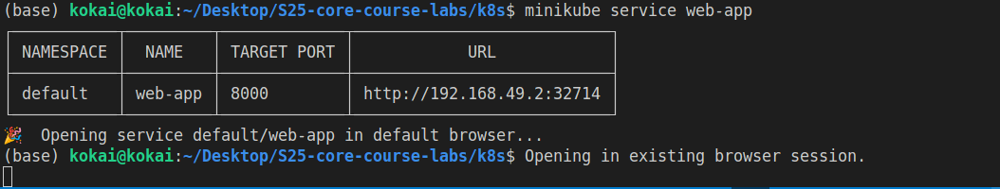
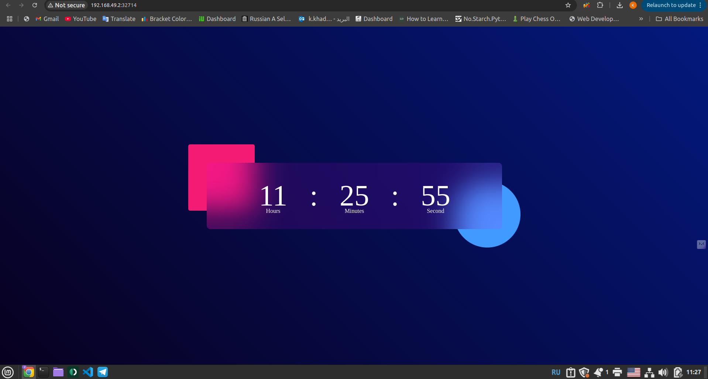
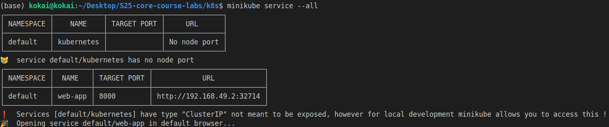
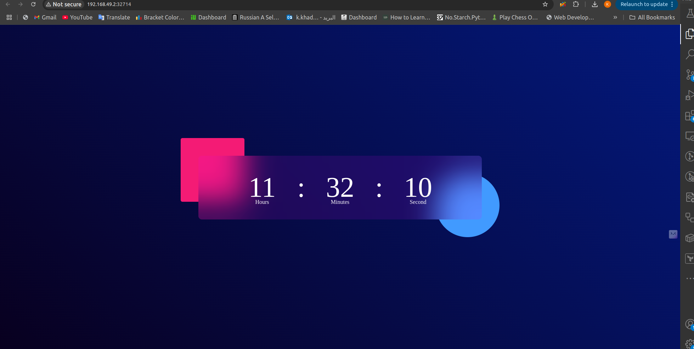
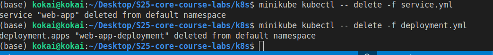

# Introduction to Kubernetes

## Walk through the process  

### creating the cluster and verfiying that it;s running

After startning the minikube cluster I verficed that the cluster is running by running the following command.

```
 kokai@kokai:~/Desktop/S25-core-course-labs$ minikube kubectl -- cluster-info

Kubernetes control plane is running at https://192.168.49.2:8443
CoreDNS is running at https://192.168.49.2:8443/api/v1/namespaces/kube-system/services/kube-dns:dns/proxy

To further debug and diagnose cluster problems, use 'kubectl cluster-info dump'.

```

And the following command too 

```
kokai@kokai:~/Desktop/S25-core-course-labs$ minikube kubectl -- get nodes
NAME       STATUS   ROLES           AGE   VERSION
minikube   Ready    control-plane   18h   v1.35.0
```
### Creating the deployment

```
 kokai@kokai:~/Desktop/S25-core-course-labs/k8s$ minikube kubectl -- apply -f deployment.yml
deployment.apps/web-app-deployment created
```

### Creating the service

```
 kokai@kokai:~/Desktop/S25-core-course-labs/k8s$ minikube kubectl -- apply -f service.yml
service/web-app created
```
### checking the pods 
```
kokai@kokai:~/Desktop/S25-core-course-labs/k8s$ minikube kubectl -- get pods
NAME                                  READY   STATUS    RESTARTS      AGE
nginx-depl-569bd7dcf9-n54gw           1/1     Running   1 (14h ago)   18h
web-app-deployment-76dc6b5965-jgv47   1/1     Running   0             2m27s
web-app-deployment-76dc6b5965-nrzm4   1/1     Running   0             2m27s
web-app-deployment-76dc6b5965-rk62s   1/1     Running   0             2m27s
```

### Checking the service 

```
kokai@kokai:~/Desktop/S25-core-course-labs/k8s$ minikube kubectl -- get svc
NAME         TYPE           CLUSTER-IP       EXTERNAL-IP   PORT(S)          AGE
kubernetes   ClusterIP      10.96.0.1        <none>        443/TCP          18h
web-app      LoadBalancer   10.110.208.223   <pending>     8000:32714/TCP   86s
```

### Service web-app
by running the following command we can see the result:

```
 minikube service web-app
```




We can see that we have the same address in the terminal and in chrome and that the app is running correctly

### Service --all




### clean up
