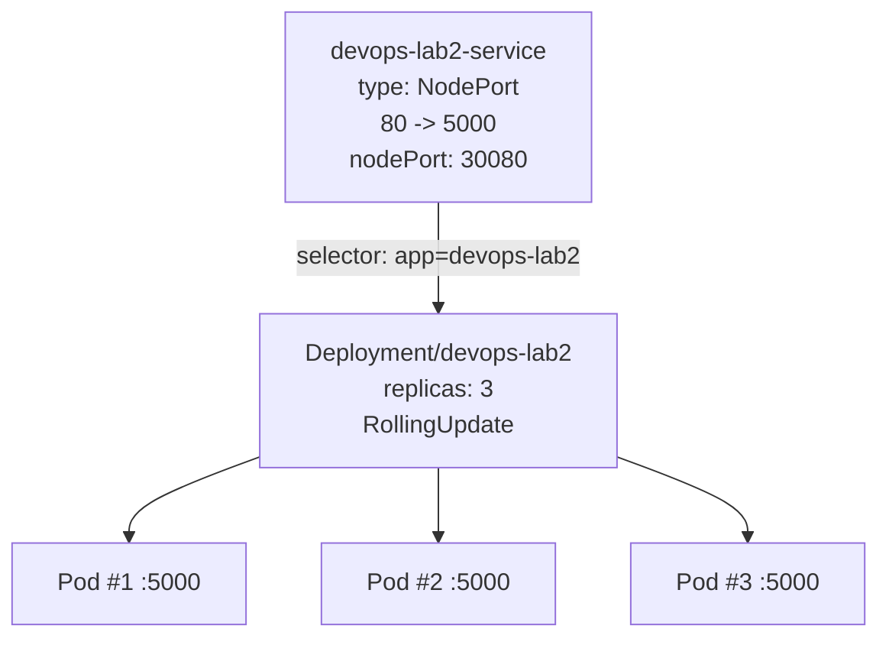
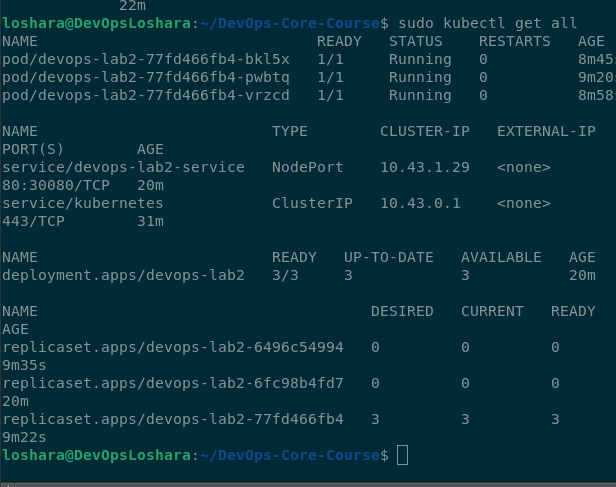
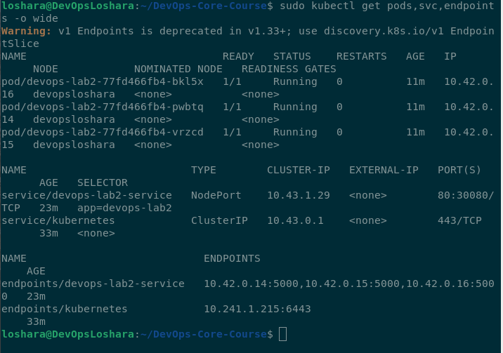
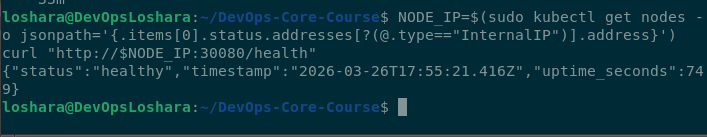
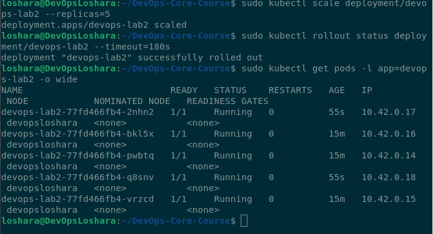
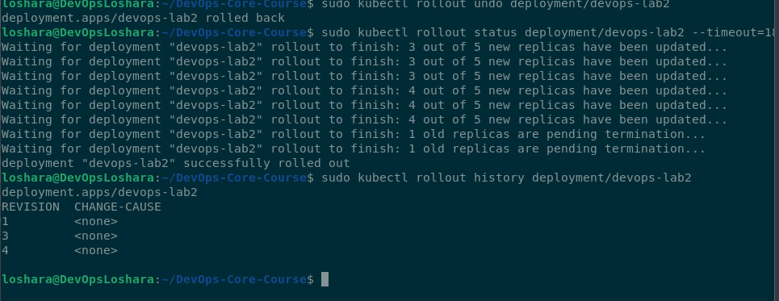

## Lab 9 - Kubernetes Fundamentals

### Stack and Objects
- Application: `devops-lab2` (Flask)
- Image: `linktur/devops-lab2:v1`
- Deployment: `devops-lab2` (3 replicas)
- Service: `devops-lab2-service` (`NodePort`, `80 -> 5000`, `30080`)
- Probes: liveness `/health`, readiness `/health`

## 1. Architecture Overview



## 2. Manifest Files

- `k8s/deployment.yml` - Deployment, resources, probes, rolling update strategy.
- `k8s/service.yml` - NodePort Service for external access.

Key choices:
- `replicas: 3` for baseline availability.
- `maxSurge: 1` and `maxUnavailable: 0` for safe rolling updates.
- resource requests/limits for predictable scheduling.

## 3. Commands Used

```bash
kubectl apply -f k8s/deployment.yml -f k8s/service.yml
kubectl rollout status deployment/devops-lab2 --timeout=180s
kubectl get all
kubectl get pods,svc,endpoints -o wide

kubectl scale deployment/devops-lab2 --replicas=5
kubectl rollout status deployment/devops-lab2 --timeout=180s

kubectl set env deployment/devops-lab2 LAB09_ROLLOUT=$(date +%s)
kubectl rollout history deployment/devops-lab2
kubectl rollout undo deployment/devops-lab2
```

## 4. Deployment Evidence (Minimal: 5 Screenshots)

### 1) Cluster objects


### 2) Detailed pods/services/endpoints


### 3) Service check via curl


### 4) Scaling to 5 replicas


### 5) Rollback proof


## 5. Production Considerations

- Probes prevent traffic to unhealthy Pods and improve self-healing.
- Requests/limits protect node stability and improve scheduling quality.
- Future improvements: `startupProbe`, HPA, PodDisruptionBudget, NetworkPolicy, immutable tags.

## 6. Challenges and Fixes

- Issue: rollout could stay unavailable when probe path did not match the running image.
- Fix: align probe endpoint with application endpoint and re-apply Deployment.
