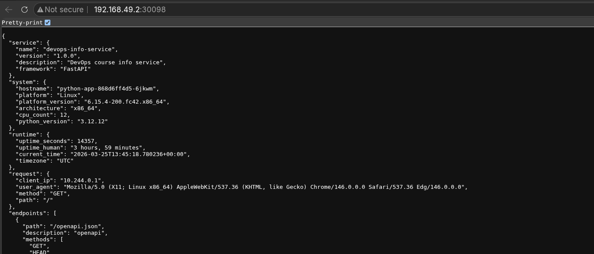

# Lab 09

## Architecture Overview

I have one deployment and one service.
Deployment contains three pods (replicas).

Service configured to route all requests to some random pod on my deployment.

I also opened external port using "minikube service"

**Resource Allocation Strategy:**

3 Pods in total requres 300m cpu and 384Mi and limites to 600m and 768Mi

## Manifest Files

**File "deployment.yml":** Deployment Manifest
Description: Defines how your Python app runs in Kubernetes—specifies the container image, resource constraints, health checks, and update strategy.

- 100m CPU / 128Mi memory: Conservative estimates for a lightweight Python app. If your app uses more (e.g., data processing), increase requests to avoid throttling.
- 10s liveness / 5s readiness: Liveness is slower because restarting a pod is expensive; readiness is faster because removing from load balancer is cheap.
- maxSurge=1, maxUnavailable=0: Ensures zero downtime during updates—critical for user-facing services.

**File "service.yml:** Service Manifest
Description: Creates a stable network endpoint that routes traffic to your 3 pods. Acts as a load balancer.

- NodePort: Perfect to test access.
- targetPort 5000: Must match your app's listening port.
- Selector: Automatically discovers pods.

## Deployment Evidence

```bash

(.venv) bulatgazizov@fedora:~/Projects/DevOps-Core-Course$ minikube kubectl cluster-info
Kubernetes control plane is running at https://192.168.49.2:8443
CoreDNS is running at https://192.168.49.2:8443/api/v1/namespaces/kube-system/services/kube-dns:dns/proxy

To further debug and diagnose cluster problems, use 'kubectl cluster-info dump'.
(.venv) bulatgazizov@fedora:~/Projects/DevOps-Core-Course$ minikube kubectl get nodes
NAME       STATUS   ROLES           AGE   VERSION
minikube   Ready    control-plane   10m   v1.35.1
```

kubectl get all output
kubectl get pods,svc with detailed view
kubectl describe deployment <name> showing replicas and strategy
Screenshot or curl output showing app working

## Operations Performed

### Commands used to deploy

```bash
kubectl apply -f k8s/deployment.yml
deployment.apps/python-app created
```

```bash
kubectl get deployments
NAME         READY   UP-TO-DATE   AVAILABLE   AGE
python-app   3/3     3            3           3m30s
(.venv) bulatgazizov@fedora:~/Projects/DevOps-Core-Course$ kubectl get pods
NAME                          READY   STATUS    RESTARTS   AGE
python-app-868d6ff4d5-6jkwm   1/1     Running   0          5m45s
python-app-868d6ff4d5-d9lzc   1/1     Running   0          5m45s
python-app-868d6ff4d5-j7q95   1/1     Running   0          5m45s
(.venv) bulatgazizov@fedora:~/Projects/DevOps-Core-Course$ kubectl describe deployment python-app
Name:                   python-app
Namespace:              default
CreationTimestamp:      Wed, 25 Mar 2026 12:42:59 +0300
Labels:                 app=python-app
Annotations:            deployment.kubernetes.io/revision: 1
Selector:               app=python-app
Replicas:               3 desired | 3 updated | 3 total | 3 available | 0 unavailable
StrategyType:           RollingUpdate
MinReadySeconds:        0
RollingUpdateStrategy:  25% max unavailable, 25% max surge
Pod Template:
  Labels:  app=python-app
  Containers:
   python-app:
    Image:      bulatgazizov/python_app:latest
    Port:       5000/TCP
    Host Port:  0/TCP
    Limits:
      cpu:     200m
      memory:  256Mi
    Requests:
      cpu:         100m
      memory:      128Mi
    Liveness:      http-get http://:5000/health delay=10s timeout=1s period=5s #success=1 #failure=3
    Readiness:     http-get http://:5000/ delay=5s timeout=1s period=3s #success=1 #failure=3
    Environment:   <none>
    Mounts:        <none>
  Volumes:         <none>
  Node-Selectors:  <none>
  Tolerations:     <none>
Conditions:
  Type           Status  Reason
  ----           ------  ------
  Available      True    MinimumReplicasAvailable
  Progressing    True    NewReplicaSetAvailable
OldReplicaSets:  <none>
NewReplicaSet:   python-app-868d6ff4d5 (3/3 replicas created)
Events:
  Type    Reason             Age   From                   Message
  ----    ------             ----  ----                   -------
  Normal  ScalingReplicaSet  6m    deployment-controller  Scaled up replica set python-app-868d6ff4d5 from 0 to 3
  ```

### Service

Service access method and verification

```bash
kubectl apply -f k8s/service.yml 
service/python-app-service configured
(.venv) bulatgazizov@fedora:~/Projects/DevOps-Core-Course$ kubectl get svc -o wide
NAME                 TYPE        CLUSTER-IP       EXTERNAL-IP   PORT(S)        AGE     SELECTOR
kubernetes           ClusterIP   10.96.0.1        <none>        443/TCP        4h53m   <none>
python-app-service   NodePort    10.105.222.193   <none>        80:30098/TCP   2m4s    app=python-app
(.venv) bulatgazizov@fedora:~/Projects/DevOps-Core-Course$ minikube service python-app-service --url
http://192.168.49.2:30098
(.venv) bulatgazizov@fedora:~/Projects/DevOps-Core-Course$ kubectl describe service python-app-service
Name:                     python-app-service
Namespace:                default
Labels:                   <none>
Annotations:              <none>
Selector:                 app=python-app
Type:                     NodePort
IP Family Policy:         SingleStack
IP Families:              IPv4
IP:                       10.105.222.193
IPs:                      10.105.222.193
Port:                     <unset>  80/TCP
TargetPort:               5000/TCP
NodePort:                 <unset>  30098/TCP
Endpoints:                10.244.0.3:5000,10.244.0.5:5000,10.244.0.4:5000
Session Affinity:         None
External Traffic Policy:  Cluster
Internal Traffic Policy:  Cluster
Events:                   <none>
(.venv) bulatgazizov@fedora:~/Projects/DevOps-Core-Course$ kubectl get endpoints
Warning: v1 Endpoints is deprecated in v1.33+; use discovery.k8s.io/v1 EndpointSlice
NAME                 ENDPOINTS                                         AGE
kubernetes           192.168.49.2:8443                                 4h54m
python-app-service   10.244.0.3:5000,10.244.0.4:5000,10.244.0.5:5000   3m
```



### Scaling demonstration output

```bash
kubectl get pods -w
NAME                          READY   STATUS              RESTARTS   AGE
python-app-868d6ff4d5-6jkwm   1/1     Running             0          4h19m
python-app-868d6ff4d5-d9lzc   1/1     Running             0          4h19m
python-app-868d6ff4d5-dhcb4   0/1     ContainerCreating   0          4s
python-app-868d6ff4d5-j7q95   1/1     Running             0          4h19m
python-app-868d6ff4d5-vwqn4   0/1     ContainerCreating   0          4s
python-app-868d6ff4d5-dhcb4   0/1     Running             0          8s
python-app-868d6ff4d5-vwqn4   0/1     Running             0          12s
python-app-868d6ff4d5-dhcb4   1/1     Running             0          15s
python-app-868d6ff4d5-vwqn4   1/1     Running             0          19s

kubectl rollout status deployment/python-app
deployment "python-app" successfully rolled out
```

### Rolling update demonstration output

I update image version and applied new configuration file:

```bash

kubectl apply -f k8s/deployment.yml 
deployment.apps/python-app configured

kubectl get pods -o wide
NAME                          READY   STATUS              RESTARTS   AGE     IP           NODE       NOMINATED NODE   READINESS GATES
python-app-6c4c988cd6-pbvh2   0/1     ContainerCreating   0          13s     <none>       minikube   <none>           <none>
python-app-868d6ff4d5-6jkwm   1/1     Running             0          4h59m   10.244.0.5   minikube   <none>           <none>
python-app-868d6ff4d5-d9lzc   1/1     Running             0          4h59m   10.244.0.3   minikube   <none>           <none>
python-app-868d6ff4d5-j7q95   1/1     Running             0          4h59m   10.244.0.4   minikube   <none>           <none>
(.venv) bulatgazizov@fedora:~/Projects/DevOps-Core-Course$ kubectl get pods -o wide
NAME                          READY   STATUS    RESTARTS   AGE     IP           NODE       NOMINATED NODE   READINESS GATES
python-app-6c4c988cd6-pbvh2   1/1     Running   0          28s     10.244.0.8   minikube   <none>           <none>
python-app-6c4c988cd6-vc6qj   0/1     Running   0          6s      10.244.0.9   minikube   <none>           <none>
python-app-868d6ff4d5-6jkwm   1/1     Running   0          4h59m   10.244.0.5   minikube   <none>           <none>
python-app-868d6ff4d5-d9lzc   1/1     Running   0          4h59m   10.244.0.3   minikube   <none>           <none>

kubectl get pods -o wide
NAME                          READY   STATUS    RESTARTS   AGE    IP            NODE       NOMINATED NODE   READINESS GATES
python-app-6c4c988cd6-pbvh2   1/1     Running   0          2m3s   10.244.0.8    minikube   <none>           <none>
python-app-6c4c988cd6-qzshb   1/1     Running   0          90s    10.244.0.10   minikube   <none>           <none>
python-app-6c4c988cd6-vc6qj   1/1     Running   0          101s   10.244.0.9    minikube   <none>           <none>
```

```
kubectl rollout status deployment/python-app
deployment "python-app" successfully rolled out
(.venv) bulatgazizov@fedora:~/Projects/DevOps-Core-Course$ kubectl rollout history deployment/python-app
deployment.apps/python-app 
REVISION  CHANGE-CAUSE
1         <none>
2         <none>

(.venv) bulatgazizov@fedora:~/Projects/DevOps-Core-Course$ kubectl rollout undo deployment/python-app
deployment.apps/python-app rolled back
(.venv) bulatgazizov@fedora:~/Projects/DevOps-Core-Course$ kubectl rollout history deployment/python-app
deployment.apps/python-app 
REVISION  CHANGE-CAUSE
2         <none>
3         <none>
```

## Production Considerations

What health checks did you implement and why?

- Liveness Probe (/health endpoint): Restarts the container if it becomes unresponsive. Checks every 5 seconds after a 10-second startup delay.
- Readiness Probe (/ endpoint): Removes the pod from the load balancer if it can't serve traffic. Checks every 3 seconds after a 5-second delay.

Resource limits rationale

- We have a fairly simple application, I allocate 100m for cpu usage and limit 200m, I also allocate 128 MB of memory with a limit of 256 MB.
- Limits protect cluster stability.

How would you improve this for production?

- If we talking deployment overall, for production I may add HorizontalPodAutoscaler to scale based on container metrics.
- Also, for production environment it's better to switch from NodePort to ClusterIP + Ingress for production (more flexible routing, TLS termination)

Monitoring and observability strategy

- We may reuse grafana & prometheus from previous labs in kubernetes, also connect kubernetes metrics to prometheus.
