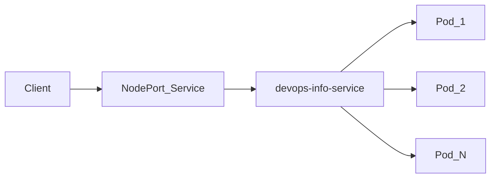

# Lab 9 — Kubernetes Fundamentals (Implementation)

This directory contains the Kubernetes manifests and evidence for **Lab 9**.

## 1. Architecture Overview

- **Workload**: `Deployment/devops-info` (Python Flask service)
- **Replicas**: 3 initially, scaled to 5 (Task 4)
- **Service exposure**: `Service/devops-info-service` of type **NodePort**
- **Traffic flow**:
  - Client → NodePort → Service → Pods → Flask app on port 5000
- **Health checks**:
  - **Readiness**: `GET /health`
  - **Liveness**: `GET /health`



## 2. Manifests

- **`deployment.yml`**
  - 3 replicas (minimum requirement)
  - resource requests/limits set
  - liveness/readiness probes configured
  - rolling update strategy: `maxSurge: 1`, `maxUnavailable: 0`
- **`service.yml`**
  - NodePort Service exposing port 80 → targetPort 5000
  - selector `app=devops-info` matches the Deployment pod template labels

### 2.1 Why these values were chosen

- **Replicas (`3`)**
  - `3` is the lab minimum and gives baseline high availability (a single pod failure does not make the app unavailable).
  - It is also enough to clearly demonstrate scaling and rolling updates in Task 4.

- **CPU/Memory requests and limits**
  - `requests` (`100m`, `128Mi`) reserve a small but stable baseline for a lightweight Flask app.
  - `limits` (`200m`, `256Mi`) cap resource usage to avoid noisy-neighbor impact on the node.
  - The ratio (limit roughly 2x request) leaves burst headroom while still enforcing boundaries.

- **Probes (`/health` on port `5000`)**
  - The application already exposes `GET /health`, so this is the most direct health signal.
  - **Readiness** protects traffic routing: pod only receives traffic when endpoint is healthy.
  - **Liveness** enables self-healing: kubelet restarts unhealthy containers automatically.
  - Delays/periods are short for local dev feedback (`initialDelaySeconds` 5/10, fast probe periods).

- **Rolling update strategy**
  - `maxUnavailable: 0` keeps all existing capacity during updates, supporting zero-downtime behavior.
  - `maxSurge: 1` performs controlled rollout one extra pod at a time, reducing risk during transition.

- **Service ports (`port: 80`, `targetPort: 5000`)**
  - `targetPort: 5000` matches the app container port.
  - `port: 80` gives a standard HTTP-facing service port while preserving container internals.
  - `NodePort` is selected because this is a local cluster lab and external access is required.

## 3. Local Cluster Setup (minikube + kubectl)

I used **minikube** (Docker driver) for a local Kubernetes cluster.

### 3.1 Cluster verification evidence

```text
lab09
Kubernetes control plane is running at https://127.0.0.1:49832
CoreDNS is running at https://127.0.0.1:49832/api/v1/namespaces/kube-system/services/kube-dns:dns/proxy

NAME    STATUS   ROLES           AGE   VERSION   INTERNAL-IP    EXTERNAL-IP   OS-IMAGE                         KERNEL-VERSION     CONTAINER-RUNTIME
lab09   Ready    control-plane   25s   v1.35.1   192.168.49.2   <none>        Debian GNU/Linux 12 (bookworm)   6.12.72-linuxkit   docker://29.2.1
```

## 4. Deployment Evidence

### 4.1 Apply manifests

```bash
kubectl apply -f k8s/deployment.yml
kubectl apply -f k8s/service.yml
```

### 4.2 Image note (arm64)

When initially using the Docker Hub image `pickpusha/devops-info-service-python:lab2`, pods failed with:

```text
Failed to pull image "...": no matching manifest for linux/arm64/v8 in the manifest list entries
```

Fix: build the image locally (arm64) and load it into minikube, then use it in the Deployment:

```bash
docker build -t devops-info-service-python:lab2 app_python
minikube -p lab09 image load devops-info-service-python:lab2
kubectl apply -f k8s/deployment.yml
```

### 4.3 Service access verification

Minikube provided the service URL:

```text
http://127.0.0.1:50059
```

App endpoints worked:

```text
devops-info-service
1.0.0
healthy
```

### 4.4 Service endpoints

```text
NAME                  ENDPOINTS                                         AGE
devops-info-service   10.244.0.6:5000,10.244.0.7:5000,10.244.0.8:5000   5m1s

NAME                  TYPE       CLUSTER-IP      EXTERNAL-IP   PORT(S)        AGE    SELECTOR
devops-info-service   NodePort   10.104.46.128   <none>        80:31974/TCP   5m1s   app=devops-info
```

### 4.5 `kubectl get all` and `kubectl describe deployment`

```text
NAME                               READY   STATUS    RESTARTS   AGE   IP            NODE    NOMINATED NODE   READINESS GATES
pod/devops-info-7b585d9d85-jqkfw   1/1     Running   0          27s   10.244.0.18   lab09   <none>           <none>
pod/devops-info-7b585d9d85-kzp48   1/1     Running   0          35s   10.244.0.17   lab09   <none>           <none>
pod/devops-info-7b585d9d85-lzg84   1/1     Running   0          19s   10.244.0.19   lab09   <none>           <none>
pod/devops-info-7b585d9d85-rmfcl   1/1     Running   0          43s   10.244.0.16   lab09   <none>           <none>
pod/devops-info-7b585d9d85-whgpb   1/1     Running   0          11s   10.244.0.20   lab09   <none>           <none>

NAME                          TYPE        CLUSTER-IP      EXTERNAL-IP   PORT(S)        AGE     SELECTOR
service/devops-info-service   NodePort    10.104.46.128   <none>        80:31974/TCP   7m19s   app=devops-info
service/kubernetes            ClusterIP   10.96.0.1       <none>        443/TCP        7m51s   <none>

NAME                          READY   UP-TO-DATE   AVAILABLE   AGE     CONTAINERS    IMAGES                            SELECTOR
deployment.apps/devops-info   5/5     5            5           7m19s   devops-info   devops-info-service-python:lab2   app=devops-info
```

```text
Name:                   devops-info
Replicas:               5 desired | 5 updated | 5 total | 5 available | 0 unavailable
StrategyType:           RollingUpdate
RollingUpdateStrategy:  0 max unavailable, 1 max surge
...
Liveness:   http-get http://:5000/health delay=10s timeout=2s period=5s #success=1 #failure=3
Readiness:  http-get http://:5000/health delay=5s timeout=2s period=3s #success=1 #failure=3
```

## 5. Operations Performed

### 5.1 Scaling to 5 replicas

```bash
kubectl scale deployment/devops-info --replicas=5
kubectl rollout status deployment/devops-info
kubectl get pods -l app=devops-info -o wide
```

Evidence:

```text
deployment.apps/devops-info scaled
deployment "devops-info" successfully rolled out
```

### 5.2 Rolling update + zero downtime check

I triggered a rolling update by changing an environment variable:

```bash
kubectl set env deployment/devops-info DEBUG=true
kubectl rollout status deployment/devops-info
```

To verify **no downtime**, I continuously checked `/health` during the rollout:

```bash
for i in $(seq 1 25); do curl -fsS http://127.0.0.1:50059/health >/dev/null; sleep 0.4; done
```

The rollout completed successfully:

```text
deployment "devops-info" successfully rolled out
```

Rollout history:

```text
deployment.apps/devops-info
REVISION  CHANGE-CAUSE
1         <none>
2         <none>
3         <none>
```

### 5.3 Rollback

```bash
kubectl rollout undo deployment/devops-info
kubectl rollout status deployment/devops-info
kubectl rollout history deployment/devops-info
```

Evidence:

```text
deployment.apps/devops-info rolled back
deployment "devops-info" successfully rolled out
```

## 6. Production Considerations

- **Probes**: `/health` ensures pods are only considered ready/healthy when the app responds.
- **Resources**: requests/limits prevent a single pod from consuming unbounded CPU/RAM and help scheduling.
- **Updates**: rolling update strategy with `maxUnavailable: 0` helps keep capacity during updates.
- **Observability**: this app exposes `/metrics` for Prometheus; in production, I would add:
  - Prometheus scraping configuration (ServiceMonitor in Prometheus Operator setups)
  - centralized logging and tracing
  - alerting on error rate/latency and probe failures
- **How I would improve for production**
  - Replace local NodePort exposure with an **Ingress/Gateway** + TLS certificates (cert-manager), and keep Service type as `ClusterIP`.
  - Build and publish **multi-arch images** (`linux/amd64`, `linux/arm64`) in CI to avoid architecture-specific pull failures.
  - Add **HPA** based on CPU and/or request latency metrics, and configure a **PodDisruptionBudget** to preserve availability during node maintenance.
  - Add stronger pod hardening: `securityContext` (`runAsNonRoot`, `readOnlyRootFilesystem`, drop Linux capabilities), `seccompProfile`, and least-privileged service accounts.
  - Add reliability controls: `startupProbe` for slow starts, graceful shutdown (`terminationGracePeriodSeconds` and preStop), and explicit `minReadySeconds`.
  - Use environment overlays (Helm/Kustomize) and externalized config/secrets (ConfigMap + Secret manager integration) for repeatable prod releases.

## 7. Challenges & Learnings

Docker Hub image tag used in earlier labs was not multi-arch; Kubernetes node on `arm64` failed pulling it. So I decided to build the image locally for the current architecture and load it into minikube, then reference that image name in the Deployment.

