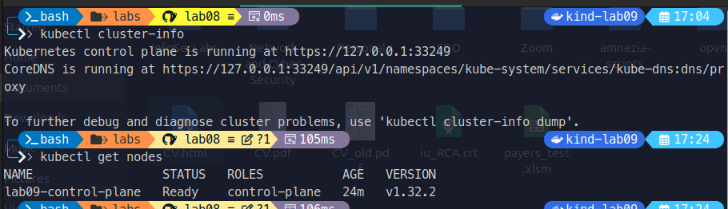
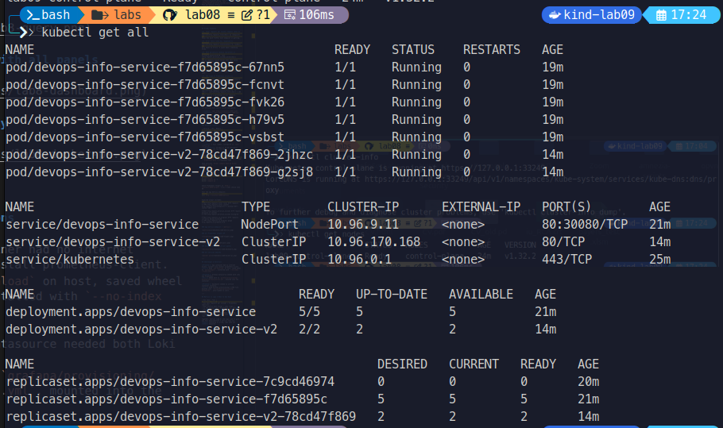
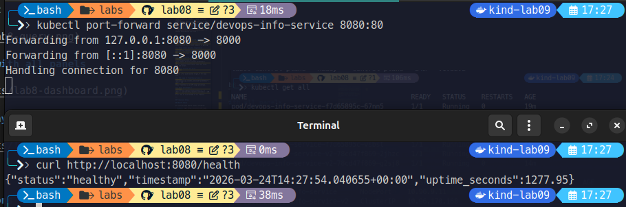
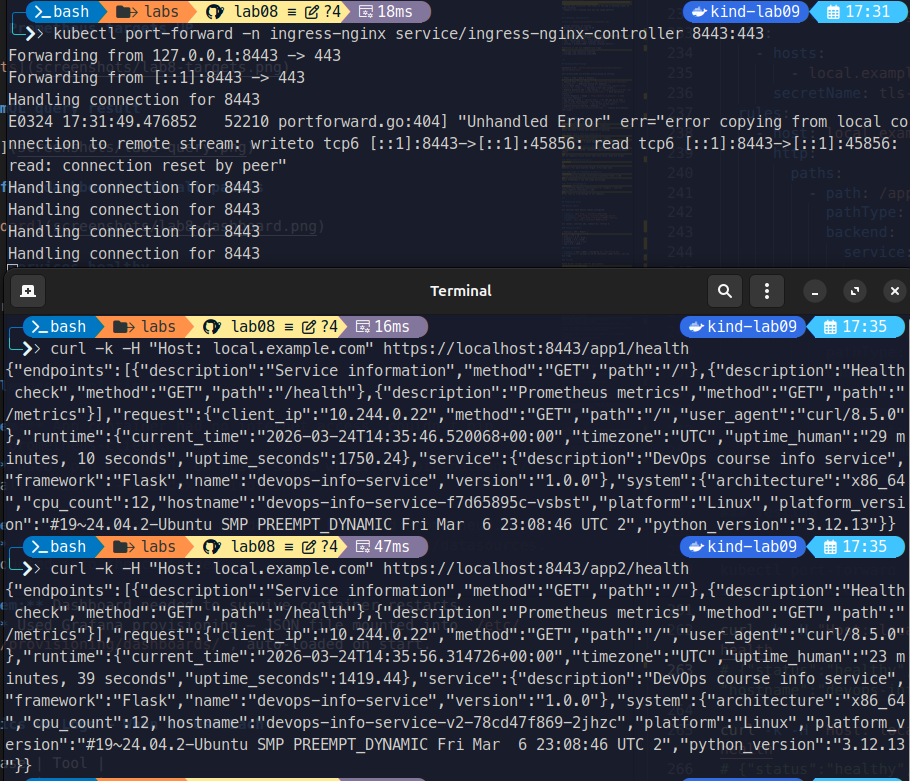

# Lab 9 — Kubernetes Fundamentals

## Architecture Overview

Two applications run in the cluster:

- **devops-info-service** — main Python/Flask app from Lab 2 (5 replicas, NodePort service on port 30080)
- **devops-info-service-v2** — second instance of the same app simulating a second microservice (2 replicas, ClusterIP)

Both are accessible via an Ingress controller with TLS:

```
Internet
    |
Ingress (HTTPS, nginx-ingress)
    |
    +-- /app1 --> devops-info-service (ClusterIP :80 -> Pod :8000)
    +-- /app2 --> devops-info-service-v2 (ClusterIP :80 -> Pod :8000)
```

Resource allocation:

- Each pod: 100m CPU request / 200m limit, 128Mi memory request / 256Mi limit
- Total cluster CPU requested: ~700m (5+2 pods × 100m)

---

## Manifest Files

| File | Description |
|------|-------------|
| `deployment.yml` | Main app deployment, 3 replicas (scaled to 5 later), rolling update strategy |
| `service.yml` | NodePort service exposing the main app on port 30080 |
| `app2-deployment.yml` | Second app deployment, 2 replicas |
| `app2-service.yml` | ClusterIP service for the second app (used by Ingress) |
| `ingress.yml` | Ingress with path-based routing and TLS |

Key choices:

- **3 replicas** minimum for high availability — one pod can die and traffic keeps flowing
- **RollingUpdate with maxUnavailable: 0** — zero downtime during updates, always 3+ pods serving
- **Resource limits** — prevents one pod from eating all cluster CPU/memory
- **imagePullPolicy: Never** — images loaded directly into kind, no registry needed
- **runAsUser: 1000** — non-root for security

---

## Deployment Evidence

### kubectl get all

```
NAME                                          READY   STATUS    RESTARTS   AGE
pod/devops-info-service-f7d65895c-67nn5       1/1     Running   0          5m31s
pod/devops-info-service-f7d65895c-fcnvt       1/1     Running   0          5m39s
pod/devops-info-service-f7d65895c-fvk26       1/1     Running   0          5m55s
pod/devops-info-service-f7d65895c-h79v5       1/1     Running   0          5m47s
pod/devops-info-service-f7d65895c-vsbst       1/1     Running   0          6m2s
pod/devops-info-service-v2-78cd47f869-2jhzc   1/1     Running   0          22s
pod/devops-info-service-v2-78cd47f869-g2sj8   1/1     Running   0          22s

NAME                             TYPE        CLUSTER-IP      EXTERNAL-IP   PORT(S)        AGE
service/devops-info-service      NodePort    10.96.9.11      <none>        80:30080/TCP   7m34s
service/devops-info-service-v2   ClusterIP   10.96.170.168   <none>        80/TCP         22s
service/kubernetes               ClusterIP   10.96.0.1       <none>        443/TCP        12m

NAME                                     READY   UP-TO-DATE   AVAILABLE   AGE
deployment.apps/devops-info-service      5/5     5            5           7m34s
deployment.apps/devops-info-service-v2   2/2     2            2           22s
```





### kubectl describe deployment devops-info-service (key fields)

```
Replicas: 5 desired | 5 updated | 5 total | 5 available | 0 unavailable
StrategyType: RollingUpdate
RollingUpdateStrategy: 0 max unavailable, 1 max surge
Liveness:  http-get http://:8000/health delay=10s period=10s #failure=3
Readiness: http-get http://:8000/health delay=5s period=5s #failure=3
```

### App working (via port-forward)

```bash
$ curl -s http://localhost:8080/health
{"status": "healthy", "timestamp": "2026-03-24T14:05:18.830451+00:00", "uptime_seconds": 13.93}
```

### HTTPS via Ingress

```bash
$ curl -k -H "Host: local.example.com" https://localhost:8443/app1/health
{"status":"healthy","uptime_seconds":328.36,...,"hostname":"devops-info-service-f7d65895c-fcnvt"}

$ curl -k -H "Host: local.example.com" https://localhost:8443/app2/health
{"status":"healthy","uptime_seconds":11.57,...,"hostname":"devops-info-service-v2-78cd47f869-g2sj8"}
```

---

## Operations Performed

### Deploy

```bash
# Load images into kind cluster
kind load docker-image devops-info-service:latest --name lab09

# Apply manifests
kubectl apply -f k8s/deployment.yml
kubectl apply -f k8s/service.yml
```

### Scaling to 5 replicas

```bash
kubectl scale deployment/devops-info-service --replicas=5
kubectl rollout status deployment/devops-info-service
# deployment "devops-info-service" successfully rolled out
```

### Rolling Update

```bash
# Tagged image as v2
docker tag devops-info-service:latest devops-info-service:v2
kind load docker-image devops-info-service:v2 --name lab09

kubectl set image deployment/devops-info-service devops-info-service=devops-info-service:v2
kubectl rollout status deployment/devops-info-service
# Waiting for deployment... 1 out of 5 new replicas have been updated...
# deployment "devops-info-service" successfully rolled out
```

During the update, old pods stayed running until new ones passed readiness checks — zero downtime.

### Rollback

```bash
kubectl rollout history deployment/devops-info-service
# REVISION  CHANGE-CAUSE
# 1         <none>
# 2         <none>

kubectl rollout undo deployment/devops-info-service
# deployment.apps/devops-info-service rolled back
```

### Service Access

```bash
# NodePort direct access
kubectl port-forward service/devops-info-service 8080:80
curl http://localhost:8080/health


# Via Ingress (HTTPS)
kubectl port-forward -n ingress-nginx service/ingress-nginx-controller 8443:443
curl -k -H "Host: local.example.com" https://localhost:8443/app1
```



---

## Production Considerations

**Health checks:**

- `livenessProbe` on `/health` — Kubernetes restarts the pod if the app hangs or crashes
- `readinessProbe` on `/health` — pod only receives traffic after it is actually ready to serve requests
- `initialDelaySeconds: 10` for liveness — gives the app time to start before Kubernetes checks

**Resource limits:**

- Requests tell the scheduler how much to reserve on the node
- Limits prevent a runaway pod from taking down other pods
- Values (128Mi/100m request, 256Mi/200m limit) are based on observed app behavior — Flask with gunicorn is lightweight

**What I would improve for real production:**

- Use Horizontal Pod Autoscaler (HPA) instead of fixed replicas
- Add a PodDisruptionBudget to guarantee minimum pods during node maintenance
- Use a proper image registry (not `imagePullPolicy: Never`)
- Set up network policies to restrict pod-to-pod traffic
- Use namespaces to separate environments (dev/staging/prod)
- Store secrets in a secrets manager like Vault (Lab 11)

**Monitoring:**

- The app already exposes `/metrics` (Prometheus format) from Lab 8
- In production, deploy Prometheus + Grafana (as in Lab 7/8) and scrape the pods using Kubernetes service discovery

---

## Challenges & Solutions

**kind image loading:** Docker images are not automatically available inside the kind cluster. Had to use `kind load docker-image` to push each image into the cluster nodes. This is a kind-specific thing — in a real cluster you would push to a registry.

**nginx:alpine failed with permission errors:** The standard nginx image tries to run as root and change file ownership. Since we enforce non-root containers, it crashed. Switched to `nginxinc/nginx-unprivileged` but it also failed due to cluster restrictions on `/tmp`. Solution: used a second instance of our own app instead — it already runs as non-root (uid 1000).

**Ingress routing with kind:** kind does not have automatic NodePort exposure for Ingress. Used `kubectl port-forward` to the ingress-nginx-controller service to test HTTPS routing locally.

**What I learned:**

- Deployments manage ReplicaSets under the hood — each update creates a new ReplicaSet
- Rolling updates work by slowly replacing old pods with new ones, guided by `maxUnavailable` and `maxSurge`
- Labels and selectors are the glue that connects Deployments → Pods → Services → Ingress
- Health checks are not optional in production — without them Kubernetes sends traffic to pods that are not ready

---

## Bonus — Ingress with TLS

### Setup

```bash
# Enable ingress-nginx for kind
kubectl apply -f https://raw.githubusercontent.com/kubernetes/ingress-nginx/main/deploy/static/provider/kind/deploy.yaml
kubectl wait --namespace ingress-nginx --for=condition=ready pod \
  --selector=app.kubernetes.io/component=controller --timeout=90s

# Generate self-signed certificate
openssl req -x509 -nodes -days 365 -newkey rsa:2048 \
  -keyout tls.key -out tls.crt \
  -subj "/CN=local.example.com/O=local.example.com"

# Create TLS secret
kubectl create secret tls tls-secret --key tls.key --cert tls.crt
```

### Ingress manifest

```yaml
apiVersion: networking.k8s.io/v1
kind: Ingress
metadata:
  name: apps-ingress
  annotations:
    nginx.ingress.kubernetes.io/rewrite-target: /
spec:
  ingressClassName: nginx
  tls:
    - hosts:
        - local.example.com
      secretName: tls-secret
  rules:
    - host: local.example.com
      http:
        paths:
          - path: /app1
            pathType: Prefix
            backend:
              service:
                name: devops-info-service
                port:
                  number: 80
          - path: /app2
            pathType: Prefix
            backend:
              service:
                name: devops-info-service-v2
                port:
                  number: 80
```

### Testing

```bash
kubectl port-forward -n ingress-nginx service/ingress-nginx-controller 8443:443

curl -k -H "Host: local.example.com" https://localhost:8443/app1/health
# {"status":"healthy","hostname":"devops-info-service-f7d65895c-fcnvt",...}

curl -k -H "Host: local.example.com" https://localhost:8443/app2/health
# {"status":"healthy","hostname":"devops-info-service-v2-78cd47f869-g2sj8",...}
```



### Why Ingress is better than NodePort

NodePort exposes one service per port (30000-32767). With 10 services you need 10 ports and remember which is which. Ingress gives you one entry point with URL-based routing, virtual hosting, and TLS termination in one place. It is the standard way to expose HTTP services in Kubernetes.
