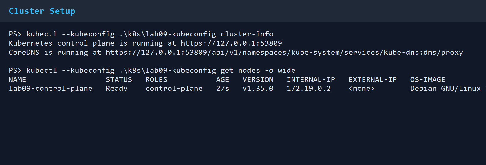
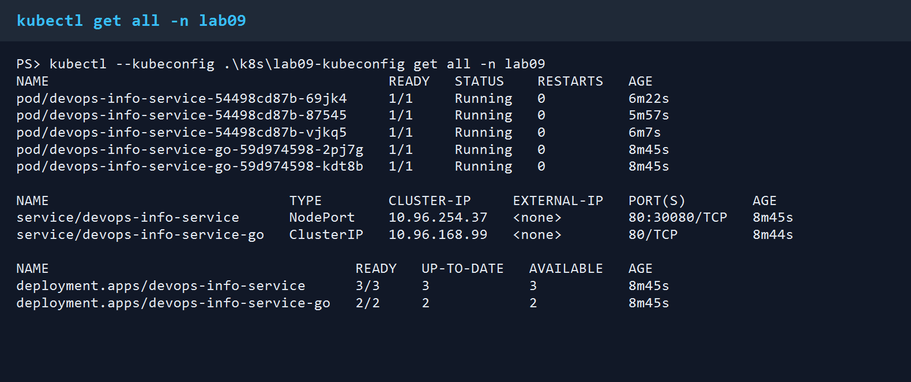
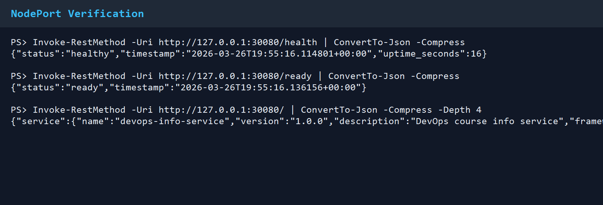
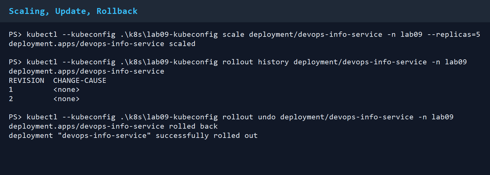
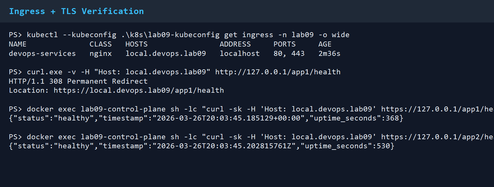

# Lab 9 - Kubernetes Fundamentals

Run date: March 26, 2026

## Architecture Overview

This lab was executed on a dedicated local `kind` cluster named `lab09` running Kubernetes `v1.35.0`, which satisfies the lab requirement of `1.33+`. I used a repo-local `kind` binary and a dedicated kubeconfig file so the work stayed isolated from any existing Kubernetes contexts on the machine.

Architecture:

```text
                           local kind cluster: lab09

                              +----------------------+
                              | ingress-nginx        |
                              | hostPort 80 / 443    |
                              +----------+-----------+
                                         |
                    +--------------------+--------------------+
                    |                                         |
                    v                                         v
        +---------------------------+             +---------------------------+
        | Service: devops-info-     |             | Service: devops-info-     |
        | service (NodePort 30080)  |             | service-go (ClusterIP)    |
        +-------------+-------------+             +-------------+-------------+
                      |                                           |
                      v                                           v
      +-----------------------------------+      +-----------------------------------+
      | Deployment: devops-info-service   |      | Deployment: devops-info-service-go|
      | replicas: 3 baseline              |      | replicas: 2                       |
      | liveness:  /health                |      | liveness:  /health                |
      | readiness: /ready                 |      | readiness: /ready                 |
      +-----------------------------------+      +-----------------------------------+
```

Resource allocation:

- Python app: requests `100m` CPU / `128Mi` memory, limits `250m` / `256Mi`
- Go app: requests `50m` CPU / `64Mi` memory, limits `150m` / `128Mi`
- Rolling updates: `maxSurge: 1`, `maxUnavailable: 0`

## Manifest Files

- `namespace.yml`: dedicated `lab09` namespace
- `deployment.yml`: Python FastAPI deployment with startup/liveness/readiness probes
- `service.yml`: Python `NodePort` service on `30080`
- `go-deployment.yml`: second application for the bonus task
- `go-service.yml`: internal service for the Go app
- `tls-secret.yml`: Kubernetes TLS secret for the ingress host
- `ingress.yml`: path-based ingress routing for `/app1` and `/app2`
- `kind-config.yml`: local cluster configuration with host port mappings for `30080`, `80`, and `443`
- `kustomization.yaml`: renderable manifest bundle for review

Key decisions:

- I added a dedicated `/ready` endpoint to both applications so readiness is separate from liveness.
- I kept the Python app as the primary lab workload and used the existing Go app as the bonus second service.
- I used `kind` instead of Docker Desktop Kubernetes because it gave me an isolated cluster and kubeconfig without touching any existing kubectl configuration.
- I built the application images locally from this branch and loaded them into the cluster to guarantee the deployed code matched the repo state.

## Deployment Evidence

### Tooling and cluster setup

`kind` version:

```text
kind v0.31.0 go1.25.5 windows/amd64
```

Cluster creation command:

```powershell
.\.tools\kind.exe create cluster --name lab09 --config .\k8s\kind-config.yml --kubeconfig .\k8s\lab09-kubeconfig
```

Cluster verification:

```powershell
kubectl --kubeconfig .\k8s\lab09-kubeconfig cluster-info
kubectl --kubeconfig .\k8s\lab09-kubeconfig get nodes -o wide
kubectl --kubeconfig .\k8s\lab09-kubeconfig get namespaces
```

Actual output:

```text
Kubernetes control plane is running at https://127.0.0.1:53809
CoreDNS is running at https://127.0.0.1:53809/api/v1/namespaces/kube-system/services/kube-dns:dns/proxy
```

```text
NAME                  STATUS   ROLES           AGE   VERSION   INTERNAL-IP   EXTERNAL-IP   OS-IMAGE                         KERNEL-VERSION                     CONTAINER-RUNTIME
lab09-control-plane   Ready    control-plane   27s   v1.35.0   172.19.0.2    <none>        Debian GNU/Linux 12 (bookworm)   6.6.87.2-microsoft-standard-WSL2   containerd://2.2.0
```

```text
NAME                 STATUS   AGE
default              Active   27s
kube-node-lease      Active   27s
kube-public          Active   27s
kube-system          Active   27s
local-path-storage   Active   21s
```

Screenshot:



### Images built from this branch

I built and loaded these images locally:

```powershell
docker build -t ravwvil/devops-info-service:latest -t ravwvil/devops-info-service:lab09-v2 .\app_python
docker build -t ravwvil/devops-info-service-go:latest .\app_go
.\.tools\kind.exe load docker-image ravwvil/devops-info-service:latest ravwvil/devops-info-service:lab09-v2 ravwvil/devops-info-service-go:latest --name lab09
```

This was important because the repo now contains `/ready` endpoints that may not exist in the previously published images.

### Base deployment

Commands:

```powershell
kubectl --kubeconfig .\k8s\lab09-kubeconfig apply -f .\k8s\namespace.yml
kubectl --kubeconfig .\k8s\lab09-kubeconfig apply -f .\k8s\deployment.yml
kubectl --kubeconfig .\k8s\lab09-kubeconfig apply -f .\k8s\service.yml
kubectl --kubeconfig .\k8s\lab09-kubeconfig apply -f .\k8s\go-deployment.yml
kubectl --kubeconfig .\k8s\lab09-kubeconfig apply -f .\k8s\go-service.yml
kubectl --kubeconfig .\k8s\lab09-kubeconfig rollout status deployment/devops-info-service -n lab09
kubectl --kubeconfig .\k8s\lab09-kubeconfig rollout status deployment/devops-info-service-go -n lab09
```

Actual `kubectl get all -n lab09` after rollback back to baseline:

```text
NAME                                         READY   STATUS    RESTARTS   AGE
pod/devops-info-service-54498cd87b-69jk4     1/1     Running   0          6m22s
pod/devops-info-service-54498cd87b-87545     1/1     Running   0          5m57s
pod/devops-info-service-54498cd87b-vjkq5     1/1     Running   0          6m7s
pod/devops-info-service-go-59d974598-2pj7g   1/1     Running   0          8m45s
pod/devops-info-service-go-59d974598-kdt8b   1/1     Running   0          8m45s

NAME                             TYPE        CLUSTER-IP     EXTERNAL-IP   PORT(S)        AGE
service/devops-info-service      NodePort    10.96.254.37   <none>        80:30080/TCP   8m45s
service/devops-info-service-go   ClusterIP   10.96.168.99   <none>        80/TCP         8m44s

NAME                                     READY   UP-TO-DATE   AVAILABLE   AGE
deployment.apps/devops-info-service      3/3     3            3           8m45s
deployment.apps/devops-info-service-go   2/2     2            2           8m45s

NAME                                               DESIRED   CURRENT   READY   AGE
replicaset.apps/devops-info-service-54498cd87b     3         3         3       8m45s
replicaset.apps/devops-info-service-5696cfcb9b     0         0         0       7m25s
replicaset.apps/devops-info-service-go-59d974598   2         2         2       8m45s
```

Actual `kubectl get pods,svc -n lab09 -o wide`:

```text
NAME                                         READY   STATUS    RESTARTS   AGE     IP            NODE                  NOMINATED NODE   READINESS GATES
pod/devops-info-service-54498cd87b-69jk4     1/1     Running   0          6m22s   10.244.0.17   lab09-control-plane   <none>           <none>
pod/devops-info-service-54498cd87b-87545     1/1     Running   0          5m57s   10.244.0.19   lab09-control-plane   <none>           <none>
pod/devops-info-service-54498cd87b-vjkq5     1/1     Running   0          6m7s    10.244.0.18   lab09-control-plane   <none>           <none>
pod/devops-info-service-go-59d974598-2pj7g   1/1     Running   0          8m45s   10.244.0.9    lab09-control-plane   <none>           <none>
pod/devops-info-service-go-59d974598-kdt8b   1/1     Running   0          8m45s   10.244.0.8    lab09-control-plane   <none>           <none>

NAME                             TYPE        CLUSTER-IP     EXTERNAL-IP   PORT(S)        AGE     SELECTOR
service/devops-info-service      NodePort    10.96.254.37   <none>        80:30080/TCP   8m45s   app.kubernetes.io/name=devops-info-service
service/devops-info-service-go   ClusterIP   10.96.168.99   <none>        80/TCP         8m44s   app.kubernetes.io/name=devops-info-service-go
```

Actual `kubectl describe deployment devops-info-service -n lab09` excerpt:

```text
Name:                   devops-info-service
Namespace:              lab09
Replicas:               3 desired | 3 updated | 3 total | 3 available | 0 unavailable
StrategyType:           RollingUpdate
MinReadySeconds:        5
RollingUpdateStrategy:  0 max unavailable, 1 max surge
Containers:
 devops-info-service:
  Image:      ravwvil/devops-info-service:latest
  Port:       8000/TCP (http)
  Limits:
    cpu:     250m
    memory:  256Mi
  Requests:
    cpu:      100m
    memory:   128Mi
  Liveness:   http-get http://:http/health delay=0s timeout=2s period=10s #success=1 #failure=3
  Readiness:  http-get http://:http/ready delay=3s timeout=2s period=5s #success=1 #failure=3
  Startup:    http-get http://:http/health delay=0s timeout=2s period=5s #success=1 #failure=12
```

Screenshot:



### Service verification

The `NodePort` is mapped directly to the host through the `kind` cluster config, so the app was reachable at `http://127.0.0.1:30080`.

Verification commands:

```powershell
Invoke-RestMethod -Uri 'http://127.0.0.1:30080/health' | ConvertTo-Json -Compress
Invoke-RestMethod -Uri 'http://127.0.0.1:30080/ready' | ConvertTo-Json -Compress
Invoke-RestMethod -Uri 'http://127.0.0.1:30080/' | ConvertTo-Json -Compress -Depth 6
```

Actual output:

```json
{"status":"healthy","timestamp":"2026-03-26T19:55:16.114801+00:00","uptime_seconds":16}
```

```json
{"status":"ready","timestamp":"2026-03-26T19:55:16.136156+00:00"}
```

```json
{"service":{"name":"devops-info-service","version":"1.0.0","description":"DevOps course info service","framework":"FastAPI"},"system":{"hostname":"devops-info-service-54498cd87b-f5vtq","platform":"Linux","platform_version":"Linux-6.6.87.2-microsoft-standard-WSL2-x86_64-with-glibc2.41","architecture":"x86_64","cpu_count":16,"python_version":"3.13.12"},"runtime":{"uptime_seconds":16,"uptime_human":"16 seconds","current_time":"2026-03-26T19:55:16.114334+00:00","timezone":"UTC"},"request":{"client_ip":"10.244.0.1","user_agent":"Mozilla/5.0 (Windows NT; Windows NT 10.0; en-US) WindowsPowerShell/5.1.26100.7920","method":"GET","path":"/"},"endpoints":[{"path":"/","method":"GET","description":"Service information"},{"path":"/health","method":"GET","description":"Health check"},{"path":"/ready","method":"GET","description":"Readiness check"},{"path":"/metrics","method":"GET","description":"Prometheus metrics"}]}
```

Screenshot:



## Operations Performed

### Scaling demonstration

Commands:

```powershell
kubectl --kubeconfig .\k8s\lab09-kubeconfig scale deployment/devops-info-service -n lab09 --replicas=5
kubectl --kubeconfig .\k8s\lab09-kubeconfig rollout status deployment/devops-info-service -n lab09
kubectl --kubeconfig .\k8s\lab09-kubeconfig get pods -n lab09 -l app.kubernetes.io/name=devops-info-service
```

Actual output:

```text
deployment.apps/devops-info-service scaled
deployment "devops-info-service" successfully rolled out

NAME                                   READY   STATUS    RESTARTS   AGE
devops-info-service-54498cd87b-88q5n   1/1     Running   0          62s
devops-info-service-54498cd87b-f5vtq   1/1     Running   0          62s
devops-info-service-54498cd87b-gh98l   1/1     Running   0          15s
devops-info-service-54498cd87b-pxz9c   1/1     Running   0          15s
devops-info-service-54498cd87b-s2s4f   1/1     Running   0          62s
```

### Rolling update

I tagged the Python image as `ravwvil/devops-info-service:lab09-v2` and performed a real image-tag rollout:

```powershell
kubectl --kubeconfig .\k8s\lab09-kubeconfig set image deployment/devops-info-service -n lab09 devops-info-service=ravwvil/devops-info-service:lab09-v2
kubectl --kubeconfig .\k8s\lab09-kubeconfig rollout status deployment/devops-info-service -n lab09
```

At the same time I hit the public health endpoint every 500ms:

```text
22:56:13.124 status=200
22:56:13.686 status=200
22:56:14.215 status=200
22:56:14.743 status=200
22:56:15.271 status=200
22:56:15.797 status=200
22:56:16.325 status=200
22:56:16.853 status=200
22:56:17.381 status=200
22:56:17.909 status=200
22:56:18.438 status=200
22:56:18.951 status=200
22:56:19.477 status=200
22:56:20.002 status=200
22:56:20.548 status=200
22:56:21.090 status=200
22:56:21.629 status=200
22:56:22.178 status=200
22:56:22.807 status=200
22:56:23.333 status=200
22:56:23.859 status=200
22:56:24.387 status=200
22:56:24.915 status=200
22:56:25.443 status=200
22:56:25.970 status=200
22:56:26.499 status=200
22:56:27.014 status=200
22:56:27.557 status=200
22:56:28.103 status=200
22:56:28.643 status=200
```

Result: no failed checks were observed during the rollout.

Rollout status:

```text
deployment.apps/devops-info-service image updated
deployment "devops-info-service" successfully rolled out
```

### Rollout history and rollback

Commands:

```powershell
kubectl --kubeconfig .\k8s\lab09-kubeconfig rollout history deployment/devops-info-service -n lab09
kubectl --kubeconfig .\k8s\lab09-kubeconfig rollout undo deployment/devops-info-service -n lab09
kubectl --kubeconfig .\k8s\lab09-kubeconfig rollout status deployment/devops-info-service -n lab09
kubectl --kubeconfig .\k8s\lab09-kubeconfig scale deployment/devops-info-service -n lab09 --replicas=3
```

Actual output:

```text
deployment.apps/devops-info-service
REVISION  CHANGE-CAUSE
1         <none>
2         <none>
```

```text
deployment.apps/devops-info-service rolled back
deployment "devops-info-service" successfully rolled out
deployment.apps/devops-info-service scaled
deployment "devops-info-service" successfully rolled out
```

Screenshot:



## Bonus - Ingress with TLS

### Ingress controller

I installed the official ingress-nginx manifest for `kind`:

```powershell
kubectl --kubeconfig .\k8s\lab09-kubeconfig apply -f https://raw.githubusercontent.com/kubernetes/ingress-nginx/main/deploy/static/provider/kind/deploy.yaml
kubectl --kubeconfig .\k8s\lab09-kubeconfig rollout status deployment/ingress-nginx-controller -n ingress-nginx
```

Controller state:

```text
NAME                                           READY   STATUS    RESTARTS   AGE
pod/ingress-nginx-controller-56dc4b4c6-92pxx   1/1     Running   0          5m24s

NAME                                         TYPE           CLUSTER-IP     EXTERNAL-IP   PORT(S)                      AGE
service/ingress-nginx-controller             LoadBalancer   10.96.187.9    <pending>     80:30397/TCP,443:32492/TCP   5m24s
service/ingress-nginx-controller-admission   ClusterIP      10.96.44.141   <none>        443/TCP                      5m24s
```

The deployment confirmed real `hostPort` bindings for `80` and `443`, so ingress traffic was reachable on the local host.

### TLS secret and ingress resource

Commands:

```powershell
kubectl --kubeconfig .\k8s\lab09-kubeconfig apply -f .\k8s\tls-secret.yml
kubectl --kubeconfig .\k8s\lab09-kubeconfig apply -f .\k8s\ingress.yml
kubectl --kubeconfig .\k8s\lab09-kubeconfig get ingress -n lab09 -o wide
kubectl --kubeconfig .\k8s\lab09-kubeconfig describe ingress devops-services -n lab09
```

Actual ingress output:

```text
NAME              CLASS   HOSTS                ADDRESS     PORTS     AGE
devops-services   nginx   local.devops.lab09   localhost   80, 443   2m36s
```

Describe output showed the expected backends:

```text
Host                Path  Backends
----                ----  --------
local.devops.lab09
                    /app1(/|$)(.*)   devops-info-service:80 (10.244.0.17:8000,10.244.0.18:8000,10.244.0.19:8000)
                    /app2(/|$)(.*)   devops-info-service-go:80 (10.244.0.9:8080,10.244.0.8:8080)
```

### Routing verification

HTTP hit the ingress and redirected to HTTPS:

```powershell
curl.exe -v -H "Host: local.devops.lab09" http://127.0.0.1/app1/health
```

Actual result:

```text
HTTP/1.1 308 Permanent Redirect
Location: https://local.devops.lab09/app1/health
```

Windows `curl.exe` and Windows PowerShell both failed the local HTTPS handshake with the OS TLS stack (`schannel: SEC_E_NO_CREDENTIALS`), so I verified HTTPS routing from inside the `kind` node itself:

```powershell
docker exec lab09-control-plane sh -lc "curl -sk -H 'Host: local.devops.lab09' https://127.0.0.1/app1/health"
docker exec lab09-control-plane sh -lc "curl -sk -H 'Host: local.devops.lab09' https://127.0.0.1/app2/health"
```

Actual output:

```json
{"status":"healthy","timestamp":"2026-03-26T20:03:45.185129+00:00","uptime_seconds":368}
{"status":"healthy","timestamp":"2026-03-26T20:03:45.202815761Z","uptime_seconds":530}
```

That confirmed:

- ingress path routing worked
- TLS termination worked
- `/app1` reached the Python app
- `/app2` reached the Go app

Screenshot:



Ingress benefits over plain `NodePort`:

- one entrypoint for multiple services
- HTTPS termination at the edge
- path-based routing for `/app1` and `/app2`
- easier migration path toward production-style traffic management

## Production Considerations

### Health checks

- `startupProbe` protects slow starts from being treated as failures
- `livenessProbe` restarts broken containers
- `readinessProbe` ensures only ready pods receive traffic
- separate `/ready` endpoints are better than reusing `/health` for everything

### Resource limits rationale

- the Python app has higher memory limits because the interpreter/runtime overhead is larger than the static Go binary
- requests are deliberately low for local scheduling but still realistic enough to demonstrate scheduling constraints
- limits stop a single pod from consuming the node

### Monitoring and observability

- the Python app already exposes `/metrics` from Lab 8
- Prometheus scraping plus Grafana dashboards from the monitoring lab can be reused directly
- rollout status, pod events, `describe`, logs, and ingress-controller logs were enough to debug this lab locally

### Improvements for production

- pin immutable image digests instead of mutable tags
- use cert-manager instead of a checked-in self-signed secret
- add HPA, PodDisruptionBudget, NetworkPolicy, and separate environments
- package the manifests into Helm in the next lab

## Challenges and Solutions

1. Existing kubectl contexts were irrelevant for this lab.
   Solution: I used a dedicated kubeconfig file at `k8s/lab09-kubeconfig` so the lab cluster stayed isolated.

2. The published application images might not contain the new `/ready` endpoints.
   Solution: I built both images locally from this branch and loaded them directly into `kind`.

3. Bonus ingress on `kind` needs host access for both the app `NodePort` and ingress ports.
   Solution: I added `extraPortMappings` in `kind-config.yml` for `30080`, `80`, and `443`.

4. Windows TLS clients failed locally with `SEC_E_NO_CREDENTIALS` even though the ingress controller accepted the secret and served HTTPS.
   Solution: I validated HTTPS routing from inside the `kind` node with `docker exec ... curl -sk ...`, and confirmed the controller loaded the TLS secret in its logs.

5. The ingress controller briefly reported the TLS secret as missing when the ingress object was created before the secret hit its local cache.
   Solution: after the secret was added, the controller reloaded successfully and the final ingress state was healthy.

## Screenshots

- Cluster setup:


- Running resources:


- Service verification:


- Rollout history and rollback:


- Ingress and TLS:


