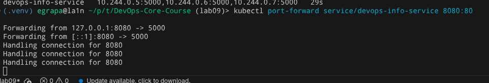
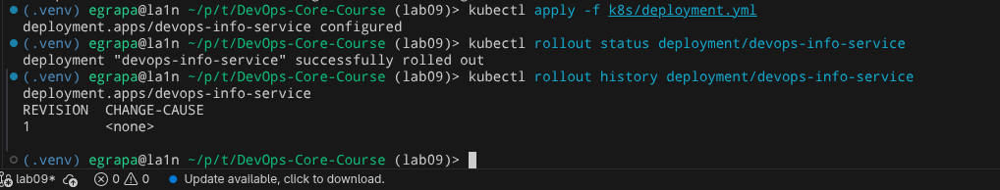
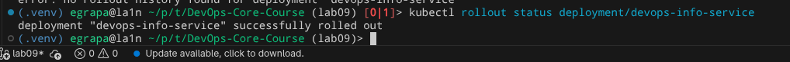

# Lab 9 — Kubernetes Fundamentals

## Architecture Overview

This lab deploys the Flask-based `devops-info-service` as a stateless Kubernetes workload:

- `Deployment/devops-info-service` manages 3 identical Pods by default.
- `Service/devops-info-service` exposes those Pods as a stable `NodePort` Service.
- Traffic flow is `client -> Service:80 -> Pod:5000 -> Flask app`.

The Deployment uses a rolling update strategy with `maxSurge: 1` and `maxUnavailable: 0` so at least the current capacity stays available while a new revision is being rolled out.

Resource strategy:

- Requests: `100m` CPU, `128Mi` memory
- Limits: `250m` CPU, `256Mi` memory

These values are conservative for a lightweight Flask service and are appropriate for a local `kind` or `minikube` cluster.

## Manifest Files

[`k8s/deployment.yml`](/home/egrapa/prog/tmp/DevOps-Core-Course/k8s/deployment.yml)

- Creates 3 replicas of the application.
- Uses the existing course image `egrapa/devops-core-course-lab2:latest`.
- Keeps the container on port `5000`, matching the current Flask app.
- Configures readiness and liveness probes against `/health`.
- Applies CPU and memory requests/limits.
- Uses a rolling update strategy for zero-downtime updates.

[`k8s/service.yml`](/home/egrapa/prog/tmp/DevOps-Core-Course/k8s/service.yml)

- Exposes the Deployment with a `NodePort` Service.
- Maps service port `80` to container port `5000`.
- Uses `nodePort: 30080` for predictable local access.

## Deployment
I used kind as k8s backend


## Service Access And Verification



## Scaling And Updates






## Production Considerations

Health checks:

- The app already exposes `/health`, so the same endpoint is used for both readiness and liveness.
- Readiness prevents the Service from sending traffic to Pods that have not started serving yet.
- Liveness lets Kubernetes restart Pods that stop responding correctly.

Resource limits rationale:

- Requests guarantee a small but stable amount of CPU and memory for scheduling.
- Limits prevent one replica from consuming disproportionate local-cluster resources.

Production improvements beyond this lab:

- Pin image tags to immutable versions instead of `latest`.
- Use a dedicated namespace and separate environment overlays.
- Add an Ingress or Gateway API resource instead of relying on NodePort.
- Add HPA based on CPU or custom metrics.
- Add PodDisruptionBudget and anti-affinity rules.
- Store configuration in ConfigMaps and secrets in Kubernetes Secrets or Vault.

Monitoring and observability:

- `/metrics` can be scraped by Prometheus from Lab 8.
- Structured JSON logs emitted by the Flask app can be collected by Promtail/Loki from Lab 7.
- Kubernetes-level observability should later include cluster metrics, events, and alerting.

## Challenges And Solutions

Challenges encountered in this workspace:

- No local Kubernetes tooling is installed, so the cluster setup and runtime evidence part cannot be executed here.
- The lab still can be implemented safely by preparing the manifests and documenting the exact commands required to run them on a local cluster.

Debugging workflow to use locally:

```bash
kubectl get pods
kubectl describe pod <pod-name>
kubectl logs <pod-name>
kubectl get events --sort-by=.metadata.creationTimestamp
```

What this lab demonstrates:

- Declarative application deployment with Kubernetes manifests
- Service exposure through a stable virtual IP and NodePort
- Readiness/liveness probes and resource controls
- Scaling, rollout, and rollback workflows
