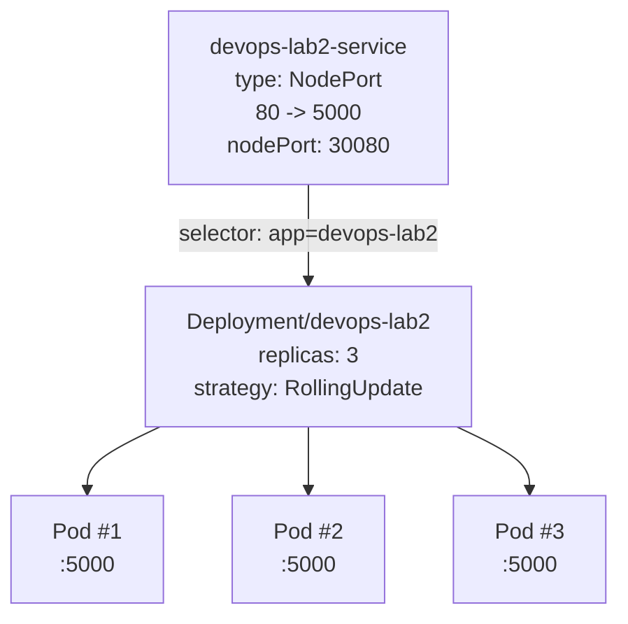

## Lab 9 - Kubernetes Fundamentals

This implementation is adapted for this repository and reuses the same approach as in `DevOps-Core-CourseDima`, but with this project's app data.

- Application: `devops-lab2` (Flask service from `Lab-1/app_python`)
- Container image: `linktur/devops-lab2:v1`
- Container port: `5000`
- Probe endpoints: liveness `/health`, readiness `/ready`

## 1. Architecture Overview

Kubernetes resources:
- `Deployment/devops-lab2`
- `Service/devops-lab2-service` (`NodePort`)

Traffic flow:
- External request -> `Service/devops-lab2-service:80`
- Service routes to Pods by label selector `app=devops-lab2`
- Pod container listens on `5000` (`targetPort: http`)



## 2. Manifest Files

- `k8s/deployment.yml`
- `k8s/service.yml`

Configuration decisions:
- `replicas: 3` for baseline availability.
- `RollingUpdate` with `maxSurge: 1` and `maxUnavailable: 0` for zero-downtime-style updates.
- Resource requests/limits to avoid uncontrolled resource usage.
- `livenessProbe` is configured to `/health`, `readinessProbe` to `/ready`.

## 3. Deployment Evidence

Apply manifests:

```bash
kubectl apply -f k8s/deployment.yml
kubectl apply -f k8s/service.yml
```

Verify resources:

```bash
kubectl get all
kubectl get pods,svc -o wide
kubectl describe deployment devops-lab2
kubectl get endpoints devops-lab2-service
```

Service access options:

```bash
minikube service devops-lab2-service --url
```

```bash
kubectl port-forward service/devops-lab2-service 8080:80
curl http://127.0.0.1:8080/health
```

## 4. Operations Performed

Scale to 5 replicas:

```bash
kubectl scale deployment devops-lab2 --replicas=5
kubectl rollout status deployment/devops-lab2
kubectl get pods
```

Rolling update and history:

```bash
kubectl rollout restart deployment/devops-lab2
kubectl rollout status deployment/devops-lab2
kubectl rollout history deployment/devops-lab2
```

Rollback:

```bash
kubectl rollout undo deployment/devops-lab2
```

## 5. Production Considerations

Health checks:
- `livenessProbe` on `/health` restarts unhealthy containers.
- `readinessProbe` on `/ready` ensures traffic is sent only to ready Pods.

Resource strategy:
- Requests reserve minimum CPU/memory for scheduling.
- Limits cap maximum usage and protect node stability.

Possible production improvements:
- Add `startupProbe` for slower startup scenarios.
- Add `PodDisruptionBudget`.
- Add `HPA` for autoscaling.
- Move to immutable tags and private registry auth (`imagePullSecrets`).
- Add `NetworkPolicy` and namespace isolation.

Monitoring and observability:
- The app already exposes `/metrics` (Lab 8).
- Prometheus + Grafana stack from `monitoring/` can be reused for Kubernetes monitoring later.

## 6. Challenges and Solutions

Typical issue:
- If Kubernetes does not pick new code, image tag may still point to an old image.

Fix:
- Build and push a new tag.
- Update `image` in `k8s/deployment.yml`.
- Re-apply manifest and verify rollout.

## 7. Optional Screenshot Folder

Copied from source implementation:
- `k8s/img/pods.png`
- `k8s/img/detailed.png`
- `k8s/img/curl.png`
- `k8s/img/scale.png`
- `k8s/img/rollback.png`

You can replace these with your own screenshots from your cluster run.
