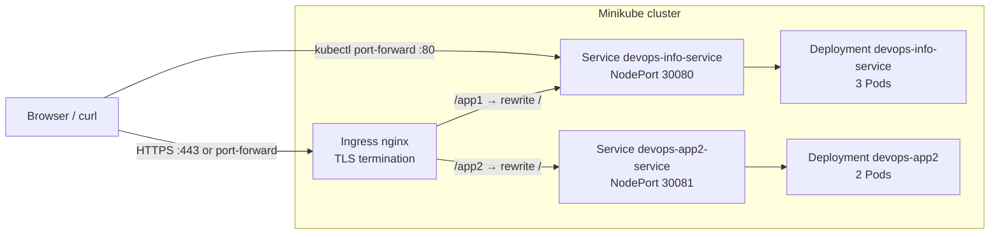

# Lab 9 — Kubernetes (manifests & runbook)

## 1. Architecture overview



- **Primary app**: `Deployment/devops-info-service` → **3 Pods** (Lab requirement: minimum 3 replicas). Each Pod runs the Flask app on **container port 5000**; the Service maps **80 → 5000** (named port `http`).
- **Second app (bonus)**: `Deployment/devops-app-java` → **2 Pods**, java app image, different `SERVICE_NAME` / description for a clear routing demo.
- **Networking**: `Service` objects use **NodePort** for direct access during development. **Ingress** (`devops-apps-ingress`) exposes **HTTP/HTTPS** on host `local.example.com` with path prefixes `/app1` and `/app2`, using **nginx** `rewrite-target: /` so backends still see `/` and `/health` as usual.
- **Resource strategy**: CPU/memory **requests** for scheduling; **limits** to cap noisy neighbors. **RollingUpdate** with `maxUnavailable: 0` and `maxSurge: 1` favors availability during rollouts.

---

## 2. Manifest files

| File | Purpose |
|------|---------|
| `deployment.yml` | Main app: 3 replicas, RollingUpdate, probes, resources, non-root + read-only root + `emptyDir` `/tmp`. Image from Lab 2. |
| `service.yml` | `NodePort` **30080** → Service port 80 → targetPort `http` (5000). Selector `app=devops-info-service`. |
| `deployment-app2.yml` | Bonus second app: 2 replicas, label `app=devops-app-java`, distinct env for identity. |
| `service-app2.yml` | `NodePort` **30081** for the second Service. |
| `ingress.yml` | Ingress class `nginx`, TLS secret `tls-apps-secret`, rules for `local.example.com` and paths `/app1`, `/app2`. |

**Why these values**

- **Replicas (3 / 2)**: Lab asks for ≥3 for the main Deployment; the second app uses 2 to show multiple workloads without oversizing a laptop cluster.
- **Probes**: Both use `GET /health` — readiness gates traffic; liveness restarts broken containers.
- **Requests/limits**: Small footprint (`50m` CPU, `64Mi` request) matches a tiny Flask app; limits prevent spikes from starving the node.
- **NodePorts 30080 / 30081**: Fixed ports in the valid range **30000–32767** for predictable local testing.

---

## 3. Local cluster setup (Task 1)

### Tool choice: **minikube**

**minikube** was installed via Homebrew and started with the **Docker** driver. It provides a full control plane on one node, works well with Docker Desktop on macOS, and includes an **Ingress** addon for the bonus task. **kind** is lighter and popular in CI; **minikube** was chosen here for integrated addons and straightforward local UX.

### Verification commands

```text
$ kubectl cluster-info
Kubernetes control plane is running at https://127.0.0.1:54684
CoreDNS is running at https://127.0.0.1:54684/api/v1/namespaces/kube-system/services/kube-dns:dns/proxy
```

```text
$ kubectl get nodes -o wide
NAME       STATUS   ROLES           AGE   VERSION   INTERNAL-IP    EXTERNAL-IP   OS-IMAGE                         KERNEL-VERSION     CONTAINER-RUNTIME
minikube   Ready    control-plane   25m     v1.35.1   192.168.49.2   <none>        Debian GNU/Linux 12 (bookworm)   6.10.14-linuxkit   docker://29.2.1
```

---

## 4. Deploy & verify

```bash
antipovd@Dmitrijs-MacBook-Air DevOps-Core-Course % kubectl apply -f k8s/deployment.yml
deployment.apps/devops-info-service configured

antipovd@Dmitrijs-MacBook-Air DevOps-Core-Course % kubectl apply -f k8s/service.yml
service/devops-info-service unchanged

antipovd@Dmitrijs-MacBook-Air DevOps-Core-Course % kubectl rollout status deployment/devops-info-service
deployment "devops-info-service" successfully rolled out
```

### Accessing the Service
```bash
kubectl port-forward service/devops-info-service 18080:80
# parallel in other terminal
curl -s http://127.0.0.1:18080/health
```

Example response:

```json
{"status":"healthy","timestamp":"2026-03-28T08:20:04.810Z","uptime_seconds":55}
```

---

## 5. Deployment evidence

### `kubectl get all`

```text
NAME                                      READY   STATUS    RESTARTS   AGE
pod/devops-app2-7fcbfdf67f-snq67          1/1     Running   0          30m
pod/devops-app2-7fcbfdf67f-xrxzk          1/1     Running   0          30m
pod/devops-info-service-69bc5cb59-m8bk4   1/1     Running   0          6m59s
pod/devops-info-service-69bc5cb59-mjvzh   1/1     Running   0          6m55s
pod/devops-info-service-69bc5cb59-qvwrj   1/1     Running   0          7m10s

NAME                          TYPE        CLUSTER-IP       EXTERNAL-IP   PORT(S)        AGE
service/devops-app2-service   NodePort    10.100.218.171   <none>        80:30081/TCP   30m
service/devops-info-service   NodePort    10.101.146.1     <none>        80:30080/TCP   34m
service/kubernetes            ClusterIP   10.96.0.1        <none>        443/TCP        34m

NAME                                  READY   UP-TO-DATE   AVAILABLE   AGE
deployment.apps/devops-app2           2/2     2            2           30m
deployment.apps/devops-info-service   3/3     3            3           34m

NAME                                             DESIRED   CURRENT   READY   AGE
replicaset.apps/devops-app2-7fcbfdf67f           2         2         2       30m
replicaset.apps/devops-info-service-5494dbb665   0         0         0       34m
replicaset.apps/devops-info-service-5b88d54fbd   0         0         0       33m
replicaset.apps/devops-info-service-69bc5cb59    3         3         3       7m10s
```

### `kubectl get pods,svc -o wide`

Shows Pod IPs on the `minikube` node and ClusterIP/NodePort mapping.

```text
NAME                                      READY   STATUS    RESTARTS   AGE
pod/devops-app2-7fcbfdf67f-snq67          1/1     Running   0          30m
pod/devops-app2-7fcbfdf67f-xrxzk          1/1     Running   0          30m
pod/devops-info-service-69bc5cb59-m8bk4   1/1     Running   0          6m59s
pod/devops-info-service-69bc5cb59-mjvzh   1/1     Running   0          6m55s
pod/devops-info-service-69bc5cb59-qvwrj   1/1     Running   0          7m10s

NAME                          TYPE        CLUSTER-IP       EXTERNAL-IP   PORT(S)        AGE
service/devops-app2-service   NodePort    10.100.218.171   <none>        80:30081/TCP   30m
service/devops-info-service   NodePort    10.101.146.1     <none>        80:30080/TCP   34m
service/kubernetes            ClusterIP   10.96.0.1        <none>        443/TCP        34m

NAME                                  READY   UP-TO-DATE   AVAILABLE   AGE
deployment.apps/devops-app2           2/2     2            2           30m
deployment.apps/devops-info-service   3/3     3            3           34m

NAME                                             DESIRED   CURRENT   READY   AGE
replicaset.apps/devops-app2-7fcbfdf67f           2         2         2       30m
replicaset.apps/devops-info-service-5494dbb665   0         0         0       34m
replicaset.apps/devops-info-service-5b88d54fbd   0         0         0       33m
replicaset.apps/devops-info-service-69bc5cb59    3         3         3       7m10s
antipovd@Dmitrijs-MacBook-Air DevOps-Core-Course % kubectl get pods,svc
NAME                                      READY   STATUS    RESTARTS   AGE
pod/devops-app2-7fcbfdf67f-snq67          1/1     Running   0          31m
pod/devops-app2-7fcbfdf67f-xrxzk          1/1     Running   0          31m
pod/devops-info-service-69bc5cb59-m8bk4   1/1     Running   0          7m57s
pod/devops-info-service-69bc5cb59-mjvzh   1/1     Running   0          7m53s
pod/devops-info-service-69bc5cb59-qvwrj   1/1     Running   0          8m8s

NAME                          TYPE        CLUSTER-IP       EXTERNAL-IP   PORT(S)        AGE
service/devops-app2-service   NodePort    10.100.218.171   <none>        80:30081/TCP   31m
service/devops-info-service   NodePort    10.101.146.1     <none>        80:30080/TCP   35m
service/kubernetes            ClusterIP   10.96.0.1        <none>        443/TCP        35m
```

### `kubectl describe deployment devops-info-service`

```text
Name:                   devops-info-service
Namespace:              default
CreationTimestamp:      Sat, 28 Mar 2026 11:19:01 +0300
Labels:                 app=devops-info-service
Annotations:            deployment.kubernetes.io/revision: 4
Selector:               app=devops-info-service
Replicas:               3 desired | 3 updated | 3 total | 3 available | 0 unavailable
StrategyType:           RollingUpdate
MinReadySeconds:        0
RollingUpdateStrategy:  0 max unavailable, 1 max surge
Pod Template:
  Labels:  app=devops-info-service
  Containers:
   devops-info-service:
    Image:      gghost1/devops-lab-app-python:latest
    Port:       5000/TCP
    Host Port:  0/TCP
    Limits:
      cpu:     200m
      memory:  256Mi
    Requests:
      cpu:      50m
      memory:   64Mi
    Liveness:   http-get http://:http/health delay=10s timeout=2s period=5s #success=1 #failure=3
    Readiness:  http-get http://:http/health delay=3s timeout=2s period=3s #success=1 #failure=3
    Environment:
      HOST:                     0.0.0.0
      PORT:                     5000
      SERVICE_NAME:             devops-info-service
      SERVICE_VERSION:          latest
      SERVICE_DESCRIPTION:      DevOps course info service
      LOG_LEVEL:                INFO
      PYTHONDONTWRITEBYTECODE:  1
    Mounts:
      /tmp from tmp (rw)
  Volumes:
   tmp:
    Type:          EmptyDir (a temporary directory that shares a pod's lifetime)
    Medium:        
    SizeLimit:     <unset>
  Node-Selectors:  <none>
  Tolerations:     <none>
Conditions:
  Type           Status  Reason
  ----           ------  ------
  Available      True    MinimumReplicasAvailable
  Progressing    True    NewReplicaSetAvailable
OldReplicaSets:  devops-info-service-5494dbb665 (0/0 replicas created), devops-info-service-5b88d54fbd (0/0 replicas created)
NewReplicaSet:   devops-info-service-69bc5cb59 (3/3 replicas created)
Events:
  Type    Reason             Age                  From                   Message
  ----    ------             ----                 ----                   -------
  Normal  ScalingReplicaSet  36m                  deployment-controller  Scaled up replica set devops-info-service-5494dbb665 from 0 to 3
  Normal  ScalingReplicaSet  35m                  deployment-controller  Scaled up replica set devops-info-service-5494dbb665 from 3 to 5
  Normal  ScalingReplicaSet  34m                  deployment-controller  Scaled down replica set devops-info-service-5494dbb665 from 5 to 3
  Normal  ScalingReplicaSet  34m                  deployment-controller  Scaled up replica set devops-info-service-5b88d54fbd from 0 to 1
  Normal  ScalingReplicaSet  34m                  deployment-controller  Scaled up replica set devops-info-service-5b88d54fbd from 1 to 2
  Normal  ScalingReplicaSet  34m                  deployment-controller  Scaled up replica set devops-info-service-5b88d54fbd from 2 to 3
  Normal  ScalingReplicaSet  34m (x6 over 34m)    deployment-controller  (combined from similar events): Scaled down replica set devops-info-service-5b88d54fbd from 1 to 0
  Normal  ScalingReplicaSet  9m8s                 deployment-controller  Scaled up replica set devops-info-service-69bc5cb59 from 0 to 1
  Normal  ScalingReplicaSet  8m57s (x2 over 34m)  deployment-controller  Scaled down replica set devops-info-service-5494dbb665 from 3 to 2
  Normal  ScalingReplicaSet  8m57s                deployment-controller  Scaled up replica set devops-info-service-69bc5cb59 from 1 to 2
  Normal  ScalingReplicaSet  8m53s (x2 over 34m)  deployment-controller  Scaled down replica set devops-info-service-5494dbb665 from 2 to 1
  Normal  ScalingReplicaSet  8m53s                deployment-controller  Scaled up replica set devops-info-service-69bc5cb59 from 2 to 3
  Normal  ScalingReplicaSet  8m48s (x2 over 34m)  deployment-controller  Scaled down replica set devops-info-service-5494dbb665 from 1 to 0
```

### curl command to shop app working

```bash
antipovd@Dmitrijs-MacBook-Air DevOps-Core-Course % curl -s http://127.0.0.1:18080/health
{"status":"healthy","timestamp":"2026-03-28T08:56:39.622Z","uptime_seconds":620}
```

---

## 6. Operations performed (Task 4)


### 6.1 Commands used to deploy

From the repository root:

```bash
kubectl apply -f k8s/deployment.yml
kubectl apply -f k8s/service.yml
kubectl rollout status deployment/devops-info-service
```

```bash
kubectl apply -f k8s/deployment-app2.yml -f k8s/service-app2.yml
kubectl apply -f k8s/ingress.yml
```

### 6.2 Scaling demonstration

```bash
kubectl scale deployment/devops-info-service --replicas=5
kubectl rollout status deployment/devops-info-service
kubectl get pods -l app=devops-info-service -o wide
```

Example output:

```text
deployment.apps/devops-info-service scaled
Waiting for deployment "devops-info-service" rollout to finish: 3 of 5 updated replicas are available...
Waiting for deployment "devops-info-service" rollout to finish: 4 of 5 updated replicas are available...
deployment "devops-info-service" successfully rolled out

NAME                                  READY   STATUS    RESTARTS   AGE   IP            NODE       NOMINATED NODE   READINESS GATES
devops-info-service-69bc5cb59-c747r   1/1     Running   0          6s    10.244.0.22   minikube   <none>           <none>
devops-info-service-69bc5cb59-m8bk4   1/1     Running   0          15m   10.244.0.20   minikube   <none>           <none>
devops-info-service-69bc5cb59-mjvzh   1/1     Running   0          15m   10.244.0.21   minikube   <none>           <none>
devops-info-service-69bc5cb59-qvwrj   1/1     Running   0          15m   10.244.0.19   minikube   <none>           <none>
devops-info-service-69bc5cb59-x8fdm   1/1     Running   0          6s    10.244.0.23   minikube   <none>           <none>
```

### 6.3 Rolling update demonstration

`SERVICE_VERSION` was temporarily set to `1.0.1` in `deployment.yml` (same image tag; config-only change), then:

```bash
kubectl apply -f k8s/deployment.yml
kubectl rollout status deployment/devops-info-service
kubectl rollout history deployment/devops-info-service
```

Example output:

```text
deployment.apps/devops-info-service configured
Waiting for deployment "devops-info-service" rollout to finish: 2 out of 3 new replicas have been updated...
deployment "devops-info-service" successfully rolled out

deployment.apps/devops-info-service
REVISION  CHANGE-CAUSE
1         <none>
2         <none>
```

### 6.4 Rollback

```bash
kubectl rollout undo deployment/devops-info-service
kubectl rollout status deployment/devops-info-service
kubectl rollout history deployment/devops-info-service
```

Example output:

```text
deployment.apps/devops-info-service rolled back
deployment "devops-info-service" successfully rolled out

REVISION  CHANGE-CAUSE
2         <none>
3         <none>
```

After the demo, the manifest was restored to **3 replicas** and **`SERVICE_VERSION=latest`** so the repo matches the intended Lab 2 story.

### 6.5 Service access method and verification

NodePort on the node IP is often unreachable from the host, so **`kubectl port-forward`** to the Service is the reliable check. `port-forward` blocks the terminal — used a **second terminal**, then `curl`.

```bash
kubectl port-forward service/devops-info-service 18080:80
# parallel in other terminal
curl -s http://127.0.0.1:18080/health
```

**Verification output (health):**

```json
{"status":"healthy","timestamp":"2026-03-28T08:56:39.622Z","uptime_seconds":620}
```

---

## 7. Production considerations

| Topic | What I implemented | Rationale |
|-------|---------------------|-----------|
| Health | HTTP readiness + liveness on `/health` | Route traffic only to ready Pods; restart stuck processes. |
| Resources | Requests + limits | Predictable scheduling; cap memory/CPU. |
| Updates | `RollingUpdate`, `maxUnavailable: 0` | Reduce downtime during image/config changes. |
| Security | Non-root UID, read-only root FS, dropped caps, `emptyDir` `/tmp` | Shrink attack surface and writable paths. |

**Possible next steps for real production**: namespace + RBAC, PodDisruptionBudget, HPA/VPA, external secrets, Ingress **Gateway API**, Service mesh or mTLS, centralized logging/metrics/tracing, and pinning images by digest.

---

## 8. Challenges & solutions

| Issue | How I debugged / mitigated |
|-------|-----------------------------|
| NodePort not reachable from macOS host via `minikube ip` | Expected with Docker driver; use **`kubectl port-forward`** or **`minikube service`** tunnel. |
| `kubectl` client version warning vs cluster | Use **`brew install kubernetes-cli`** (or `minikube kubectl -- …`) to align client/server. |
| Ingress HTTPS testing | **`kubectl port-forward -n ingress-nginx svc/ingress-nginx-controller 18443:443`** and `curl -k --resolve local.example.com:18443:127.0.0.1 https://local.example.com:18443/app1/`. |

---

## 9. Bonus — Ingress with TLS (multi-app)

### Controller

```bash
minikube addons enable ingress
kubectl get pods -n ingress-nginx
```

### TLS secret (self-signed)

```bash
openssl req -x509 -nodes -days 365 -newkey rsa:2048 \
  -keyout tls.key -out tls.crt \
  -subj "/CN=local.example.com/O=local.example.com"
kubectl create secret tls tls-apps-secret --key tls.key --cert tls.crt
kubectl apply -f k8s/deployment-app2.yml -f k8s/service-app2.yml
kubectl apply -f k8s/ingress.yml
```

### Verify routing (HTTPS)

With port-forward to the ingress controller (see section 8):

```bash
curl -sk --resolve local.example.com:18443:127.0.0.1 \
  https://local.example.com:18443/app1/ | jq '.service.name'
# "devops-info-service"

curl -sk --resolve local.example.com:18443:127.0.0.1 \
  https://local.example.com:18443/app2/ | jq '.service.name'
# "devops-app-java"
```

**Why Ingress over NodePort alone**

- **HTTP routing** by host/path (L7), **TLS termination**, and a **single entry point** instead of many high ports.
- NodePort remains useful for quick checks; Ingress fits public HTTP APIs and web apps behind one hostname.