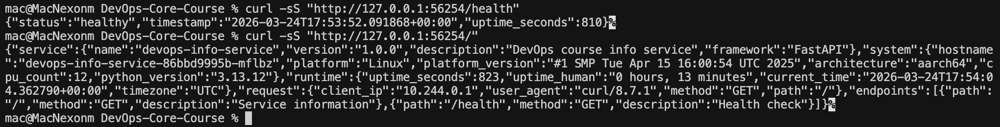

# Lab 9: Kubernetes Fundamentals

**Author:** Nikita Maksimenko
**Date:** 2026-03-24
**Tool:** minikube v1.35 — Kubernetes v1.35.1

## Architecture Overview

The application from Lab 8 (`devops-info-service`, a FastAPI Python service) is deployed inside a local minikube cluster. The setup consists of three main parts: a Deployment, a Service, and (for the bonus) an Ingress.

The Deployment runs **five replicas** of the container (initially three, scaled up during the lab). Each Pod listens on port **8000** and runs as a non-root user (`appuser`, UID 999). The Deployment uses a RollingUpdate strategy so that during an update Kubernetes adds one new Pod before removing an old one. This means the app stays available through the whole update.

The Service is a **NodePort** type. It accepts traffic on port **80** inside the cluster and maps it to container port 8000. Externally it is reachable on port **30080** of any cluster node.

Traffic path from the host machine: `host:30080` → `Service:80` → `Pod:8000`.

Both the liveness probe and the readiness probe use `GET /health`. The `/health` endpoint already exists in the app from previous labs, so no code changes were needed. The readiness probe prevents a Pod from receiving traffic until it responds; the liveness probe restarts the container if it stops responding.

Resource requests (`100m` CPU, `128Mi` memory) tell the scheduler what the Pod needs. Limits (`500m` CPU, `256Mi` memory) prevent a single Pod from consuming too much. The values are based on the resource limits already defined in the Lab 8 `docker-compose.yml`.

## Manifest Files

### deployment.yml

The Deployment manages the Pod replicas. Key choices:

- **Image:** `nexonm22/devops-info-service:lab08` — the same image that was used in Lab 8.
- **Replicas: 5** — started at 3 (lab minimum), then scaled to 5 during the scaling task. The manifest reflects the final count.
- **RollingUpdate** with `maxSurge: 1` and `maxUnavailable: 0` — the cluster always keeps at least the desired replica count running during updates.
- **securityContext** — `runAsNonRoot: true`, `runAsUser: 999`, `runAsGroup: 999`. I verified the UID by running `docker run --rm nexonm22/devops-info-service:lab08 id`, which printed `uid=999(appuser)`.
- **allowPrivilegeEscalation: false** — an extra hardening flag, no elevated permissions allowed.
- **livenessProbe and readinessProbe** — both use `httpGet` on `/health`. Liveness starts checking after 15 seconds (enough time for Python to start). Readiness checks every 5 seconds from second 5.

### service.yml

The Service exposes the Deployment to the outside. It is a **NodePort** Service with:

- `selector: app: devops-info-service` — matches the Pod labels exactly.
- `port: 80`, `targetPort: http` (named port 8000), `nodePort: 30080`.

The nodePort is set explicitly to 30080 so the access URL is always predictable.

## Deployment Evidence

### Cluster setup

I used **minikube** because it is straightforward to install on macOS and includes a built-in way to tunnel to NodePort services.

```
$ kubectl cluster-info
Kubernetes control plane is running at https://127.0.0.1:52435
CoreDNS is running at https://127.0.0.1:52435/api/v1/namespaces/kube-system/services/kube-dns:dns/proxy

$ kubectl get nodes
NAME       STATUS   ROLES           AGE     VERSION
minikube   Ready    control-plane   3m59s   v1.35.1
```

### Applying the manifests

```
$ kubectl apply -f k8s/deployment.yml
deployment.apps/devops-info-service created

$ kubectl apply -f k8s/service.yml
service/devops-info-service created
```

Because minikube has its own image cache (separate from the host Docker), I had to load the image manually:

```
$ docker pull nexonm22/devops-info-service:lab08
Digest: sha256:7def279b9e17a0516905a9605cb30bdbf36c692338d28b89564176dd1d44e495
Status: Image is up to date for nexonm22/devops-info-service:lab08

$ minikube image load nexonm22/devops-info-service:lab08
```

After that the rollout finished and all three Pods reached Running state:

```
$ kubectl rollout status deployment/devops-info-service
deployment "devops-info-service" successfully rolled out

$ kubectl get pods -l app=devops-info-service
NAME                                   READY   STATUS    RESTARTS   AGE
devops-info-service-86bbd9995b-bs52m   1/1     Running   0          18m
devops-info-service-86bbd9995b-hh6st   1/1     Running   0          18m
devops-info-service-86bbd9995b-mflbz   1/1     Running   0          18m
```

### Application responding

I accessed the app through `minikube service devops-info-service --url`, which opened a local tunnel. The responses from both endpoints are shown in the screenshot below.



**GET /health** response:

```json
{"status":"healthy","timestamp":"2026-03-24T17:53:52.091868+00:00","uptime_seconds":810}
```

**GET /** response includes service metadata, system hostname (matching the Pod name), and the list of endpoints. Full response is visible in the screenshot.

## Operations Performed

### Initial deployment

```bash
minikube start
kubectl apply -f k8s/deployment.yml
kubectl apply -f k8s/service.yml
kubectl rollout status deployment/devops-info-service
```

### Accessing the service

Used `minikube service devops-info-service --url` to open a local tunnel, then tested with curl:

```bash
curl -sS "http://127.0.0.1:<tunnel-port>/health"
curl -sS "http://127.0.0.1:<tunnel-port>/"
```

Both endpoints responded correctly (see screenshot in Deployment Evidence).

### Scaling to 5 replicas

Scaled the Deployment imperatively, then confirmed all five Pods were running:

```
$ kubectl scale deployment/devops-info-service --replicas=5
deployment.apps/devops-info-service scaled

$ kubectl get pods -l app=devops-info-service
NAME                                   READY   STATUS    RESTARTS   AGE
devops-info-service-86bbd9995b-6swwk   1/1     Running   0          88s
devops-info-service-86bbd9995b-bs52m   1/1     Running   0          33m
devops-info-service-86bbd9995b-hh6st   1/1     Running   0          33m
devops-info-service-86bbd9995b-mflbz   1/1     Running   0          33m
devops-info-service-86bbd9995b-xg7pf   1/1     Running   0          88s
```

I also updated `replicas: 5` in `deployment.yml` to keep the manifest in sync with the running state.

### Rolling update

To trigger a rolling update I added an environment variable (`REVISION: "2"`) to `deployment.yml` and applied it. Kubernetes replaced all five Pods one by one, always keeping at least five available (`maxUnavailable: 0`, `maxSurge: 1`):

```
$ kubectl apply -f k8s/deployment.yml
deployment.apps/devops-info-service configured

$ kubectl rollout status deployment/devops-info-service
Waiting for deployment "devops-info-service" rollout to finish: 2 out of 5 new replicas have been updated...
Waiting for deployment "devops-info-service" rollout to finish: 3 out of 5 new replicas have been updated...
Waiting for deployment "devops-info-service" rollout to finish: 4 out of 5 new replicas have been updated...
Waiting for deployment "devops-info-service" rollout to finish: 1 old replicas are pending termination...
deployment "devops-info-service" successfully rolled out

$ kubectl get pods -l app=devops-info-service
NAME                                   READY   STATUS    RESTARTS   AGE
devops-info-service-66964f6885-7qngl   1/1     Running   0          10s
devops-info-service-66964f6885-bsgmj   1/1     Running   0          38s
devops-info-service-66964f6885-gqz2b   1/1     Running   0          17s
devops-info-service-66964f6885-wz4x7   1/1     Running   0          24s
devops-info-service-66964f6885-xqncp   1/1     Running   0          31s
```

All Pod names changed (new ReplicaSet hash `66964f6885`), which confirms a new revision was deployed.

### Rollout history and rollback

```
$ kubectl rollout history deployment/devops-info-service
deployment.apps/devops-info-service
REVISION  CHANGE-CAUSE
1         <none>
2         <none>
```

Two revisions: the original deploy and the update with `REVISION: "2"`. I then rolled back to revision 1:

```
$ kubectl rollout undo deployment/devops-info-service
deployment.apps/devops-info-service rolled back

$ kubectl rollout status deployment/devops-info-service
Waiting for deployment "devops-info-service" rollout to finish: 1 out of 5 new replicas have been updated...
Waiting for deployment "devops-info-service" rollout to finish: 2 out of 5 new replicas have been updated...
Waiting for deployment "devops-info-service" rollout to finish: 3 out of 5 new replicas have been updated...
Waiting for deployment "devops-info-service" rollout to finish: 4 out of 5 new replicas have been updated...
Waiting for deployment "devops-info-service" rollout to finish: 1 old replicas are pending termination...
deployment "devops-info-service" successfully rolled out

$ kubectl get pods -l app=devops-info-service
NAME                                   READY   STATUS    RESTARTS   AGE
devops-info-service-86bbd9995b-9cs29   1/1     Running   0          17s
devops-info-service-86bbd9995b-v48g9   1/1     Running   0          31s
devops-info-service-86bbd9995b-vjmtz   1/1     Running   0          24s
devops-info-service-86bbd9995b-vxzgx   1/1     Running   0          10s
devops-info-service-86bbd9995b-xrqpf   1/1     Running   0          38s
```

Pod names are back to hash `86bbd9995b` (revision 1 ReplicaSet), rollout completed successfully with zero downtime throughout the whole process.

## Production Considerations

**Health checks:** The `/health` endpoint was already part of the app from Lab 3, so I reused it for both probes. Liveness and readiness share the same path here, which is fine for a stateless API. In a real system you might want a separate `/ready` that also checks database connectivity or other dependencies.

**Resource limits:** The values I used (100m/128Mi requests, 500m/256Mi limits) come from the `docker-compose.yml` reservations in Lab 8. They are reasonable for a small Python service. In production I would start with these values, look at actual usage in Prometheus, and tune from there.

**Improvements for production:**
- Use a Horizontal Pod Autoscaler instead of a fixed replica count
- Add a Pod Disruption Budget to control voluntary disruptions during node maintenance
- Use image digest pinning (`image@sha256:...`) instead of a tag so deployments are fully reproducible
- Replace NodePort with an Ingress or Gateway API resource for proper external routing
- Store secrets like TLS keys in a proper secrets manager, not as plain Kubernetes Secrets

## Challenges and Solutions

**Problem: ImagePullBackOff on all Pods after first apply**

Right after applying the manifests, all three Pods went into `ImagePullBackOff`. The container was not starting at all.

I ran `kubectl describe pod devops-info-service-86bbd9995b-bs52m` and checked the Events section. It said the image could not be pulled. The reason was that minikube runs its own container runtime and does not share the host Docker cache. The image was available locally on macOS but not inside the minikube VM.

The fix was to load the image into minikube explicitly:

```bash
docker pull nexonm22/devops-info-service:lab08
minikube image load nexonm22/devops-info-service:lab08
```

After that the Pods started normally within a few seconds.

**What I learned:** minikube and the host Docker daemon are separate environments. Any image you want to use in minikube either needs to be public (minikube pulls it itself) or loaded with `minikube image load`. This is a common gotcha when starting with minikube on a laptop.
