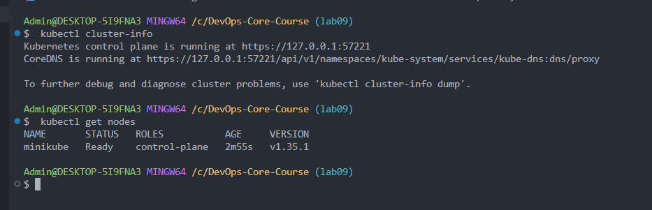
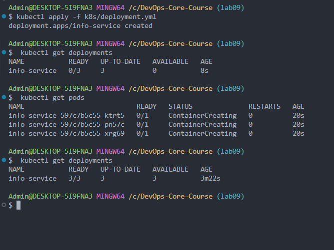
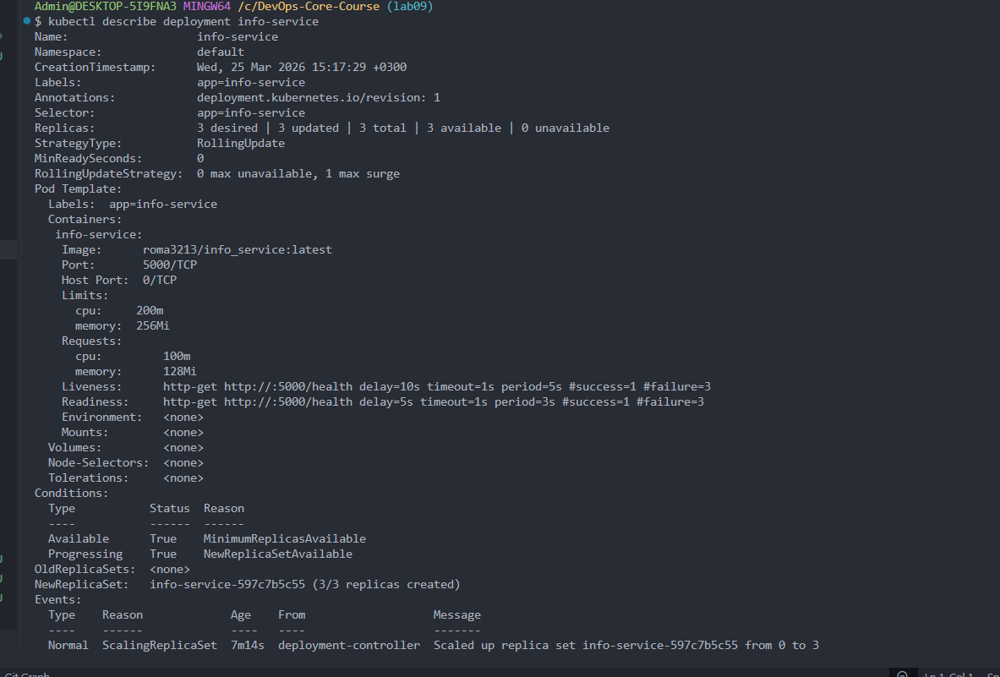
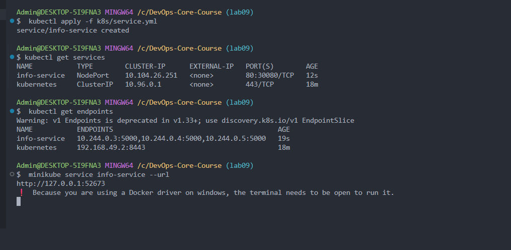
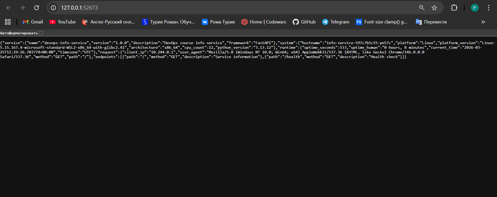
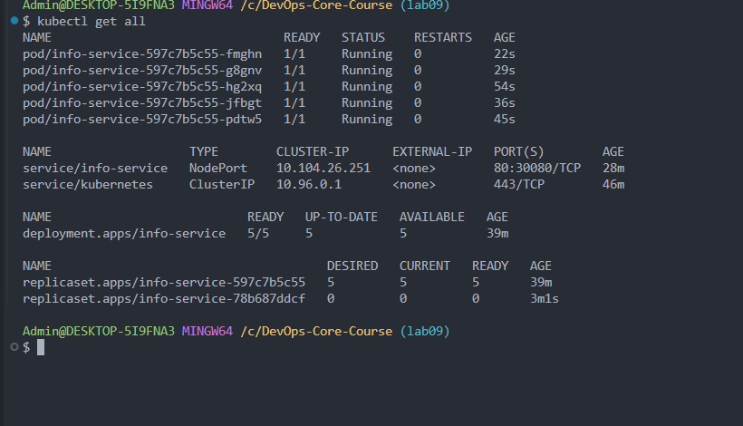
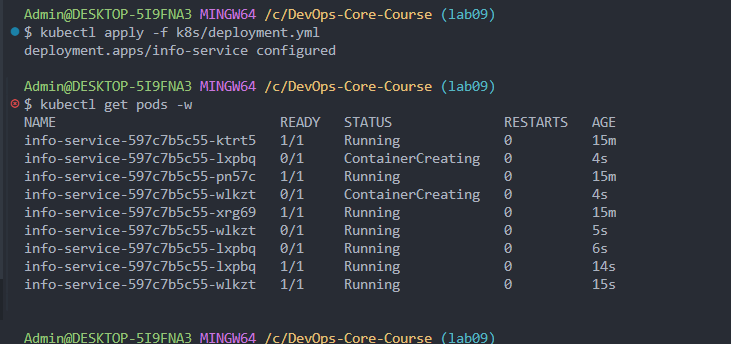
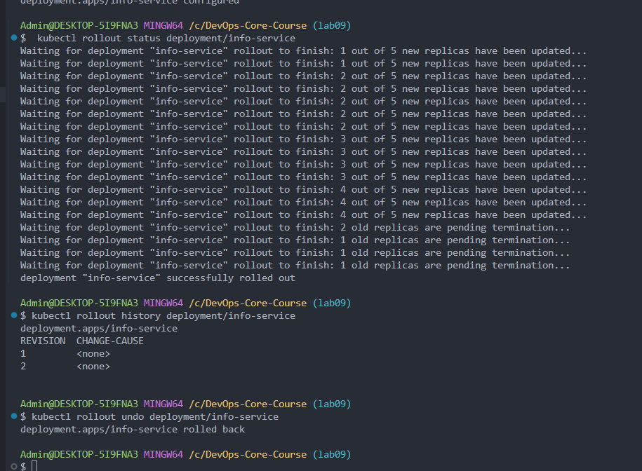

# Kubernetes Deployment — info-service

## 1. Architecture Overview

```
Internet/Browser
       |
  [ NodePort Service :30080 ]
       |
  [ Deployment: info-service ]
    ├── Pod 1 (info_service:latest, port 5000)
    ├── Pod 2 (info_service:latest, port 5000)
    ├── Pod 3 (info_service:latest, port 5000)
    ├── Pod 4 (info_service:latest, port 5000)
    └── Pod 5 (info_service:latest, port 5000)
```

- **Pods**: 5 replicas of `roma3213/info_service:latest`
- **Service**: NodePort (port 80 → targetPort 5000, nodePort 30080)
- **Cluster**: minikube (single-node, Docker driver)

**Resource allocation:**

- Requests: 128Mi memory, 100m CPU per pod
- Limits: 256Mi memory, 200m CPU per pod
- Total cluster usage: ~1280Mi memory, 1000m CPU (5 pods)

## 2. Manifest Files

### `deployment.yml`

- **Replicas**: 5 (scaled from initial 3)
- **Image**: `roma3213/info_service:latest` — FastAPI app from Lab 2
- **Strategy**: RollingUpdate (`maxSurge: 1`, `maxUnavailable: 0`) — zero downtime updates
- **Liveness probe**: GET `/health` every 5s (delay 10s) — restarts unhealthy containers
- **Readiness probe**: GET `/health` every 3s (delay 5s) — removes unready pods from service
- **Resources**: requests and limits set to prevent resource starvation

### `service.yml`

- **Type**: NodePort — allows external access to pods in local cluster
- **Selector**: `app: info-service` — matches pods by label
- **Port mapping**: 80 (service) → 5000 (container) → 30080 (node)

## 3. Deployment Evidence

### Cluster setup (`kubectl cluster-info`, `kubectl get nodes`)



### Deployment and pods (`kubectl apply`, `kubectl get deployments`, `kubectl get pods`)



### Deployment details (`kubectl describe deployment info-service`)



### Service and endpoints (`kubectl get services`, `kubectl get endpoints`)



### App working via browser



### All resources (`kubectl get all`)



## 4. Operations Performed

### Deploy

```bash
kubectl apply -f k8s/deployment.yml
kubectl apply -f k8s/service.yml
minikube service info-service --url
```

### Scaling (3 → 5 replicas)

Changed `replicas: 3` → `replicas: 5` in `deployment.yml`, then:

```bash
kubectl apply -f k8s/deployment.yml
kubectl get pods -w
```



### Rolling Update

Changed memory limit (`256Mi` → `512Mi`) in `deployment.yml` to trigger a rolling update:

```bash
kubectl apply -f k8s/deployment.yml
kubectl rollout status deployment/info-service
```

All 5 replicas updated gradually with zero downtime.

### Rollback

Rolled back to previous configuration (memory limit `256Mi`):

```bash
kubectl rollout history deployment/info-service
kubectl rollout undo deployment/info-service
```



## 5. Production Considerations

### Health checks

- **Liveness probe**: detects deadlocked or crashed containers, triggers automatic restart
- **Readiness probe**: prevents traffic to pods that aren't ready (during startup or under heavy load)
- Both use `/health` endpoint which returns HTTP 200 with status and uptime

### Resource limits rationale

- **Requests** (128Mi/100m): guaranteed minimum for scheduling — enough for a lightweight FastAPI app
- **Limits** (256Mi/200m): prevents a single pod from consuming excessive resources
- Ratio 1:2 (request:limit) allows burstable workloads

### Production improvements

- Add `PodDisruptionBudget` to ensure minimum availability during maintenance
- Add `NetworkPolicy` to restrict pod-to-pod communication
- Use `Ingress` instead of NodePort for proper HTTP routing and TLS
- Add `HorizontalPodAutoscaler` for automatic scaling based on CPU/memory
- Set up monitoring with Prometheus + Grafana

### Monitoring and observability

- `kubectl logs <pod>` for application logs
- `kubectl describe pod <pod>` for events and state
- `kubectl top pods` for resource usage (requires metrics-server)
- App already exposes Prometheus metrics for integration

## 6. Challenges & Solutions

### Challenge 1: minikube not in PATH

After installing minikube via `winget`, the executable was not found in Git Bash PATH.
**Solution**: Added `export PATH="$PATH:/c/Program Files/Kubernetes/Minikube"` to `~/.bashrc`.

### Key learnings

- Kubernetes declarative model: describe desired state, K8s makes it happen
- Rolling updates provide zero-downtime deployments out of the box
- Labels and selectors are the glue between Deployments and Services
- Health probes are essential — without them K8s can't self-heal properly
