# Lab 9 — Kubernetes Fundamentals

## Architecture Overview
### Diagram of deployment architecture
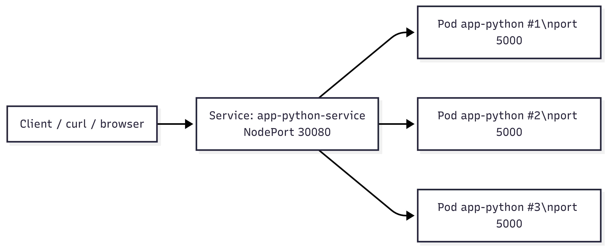

### General information (Pods, Services, networking flow):
- **1 Deployment**: `app-python`;
- **3 Pods** in normal condition according to the manifest;
- **1 Service**: `app-python-service` of type `NodePort`;
- **Networking flow**: `Client -> NodePort Service -> Pods`

During scaling progress, the deployment was temporarily scaled up to **5 pods** of a single `kubectl Scale`, after which, upon reapplying the manifest, the cluster reverted to the declaratively defined state of `replicas: 3`.

### Resource allocation strategy
The container was given basic constraints and required resources:
- `requests.memory: 128Mi`
- `requests.cpu: 100m`
- `limits.memory: 256Mi`
- `limits.cpu: 200m`

This set of values ​​was chosen as a reasonable minimum for a lightweight Flask application in a training environment. It allows us to:
- guarantee access to the minimum required resources;
- prevent uncontrolled memory and CPU consumption;
- demonstrate correct production-oriented Kubernetes practices.

---

## Manifest Files
### `deployment.yml` file (describes the basic Deployment of the application):
- Deployment name: `app-python`;
- Labels: `app=app-python`;
- Number of replicas: `3`;
- Update strategy: `RollingUpdate`;
- Container image: `sergey173/app_python:2026.03.16`;
- Container port: `5000`;
- Environment variables: `HOST`, `PORT`, `DEBUG`;
- Probes for health checks;
- Requests/limits for CPU and memory;
- Security context for running as non-root user.

#### Key decisions:
- **`replicas: 3`** — minimum task requirement and basic fault tolerance
- **`RollingUpdate` with `maxSurge: 1` and `maxUnavailable: 0`** — upgrade without downtime;
- **`runAsNonRoot: true`, `runAsUser: 1001`** — the container is run as an unprivileged user, which corresponds to the Dockerfile;
- **`livenessProbe` and `readinessProbe`** configured to the `/health` endpoint already implemented in the application.

### `service.yml` file (describes a Kubernetes Service):
- Service name: `app-python-service`;
- Service type: `NodePort`;
- Service port: `80`;
- `targetPort: 5000`;
- `nodePort: 30080`;
- selector: `app=app-python`.

#### Key decisions:
- **`NodePort`** was chosen as the simplest way to expose an application from a local Minikube cluster to the outside world without using a cloud load balancer;
- **selector** matches the Pod label, so the Service correctly routes traffic to all application replicas.

---

## Deployment Evidence

### `kubectl get all` output:
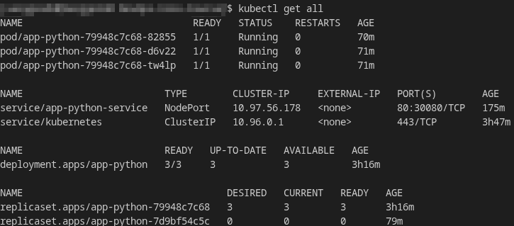

### `kubectl get pods,svc` with detailed view:
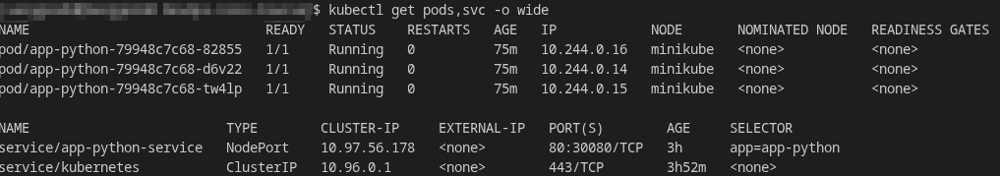

### `kubectl describe deployment app-python` showing replicas and strategy:
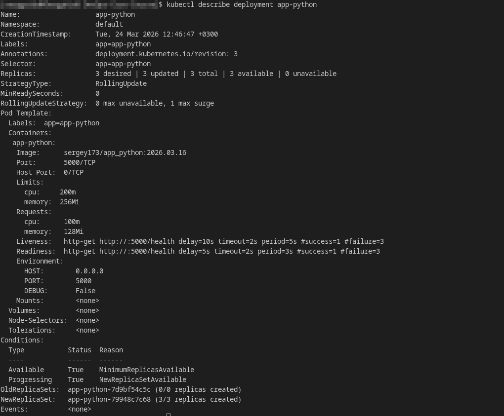

### Output from service startup, endpoint checking, and requests via `curl`:
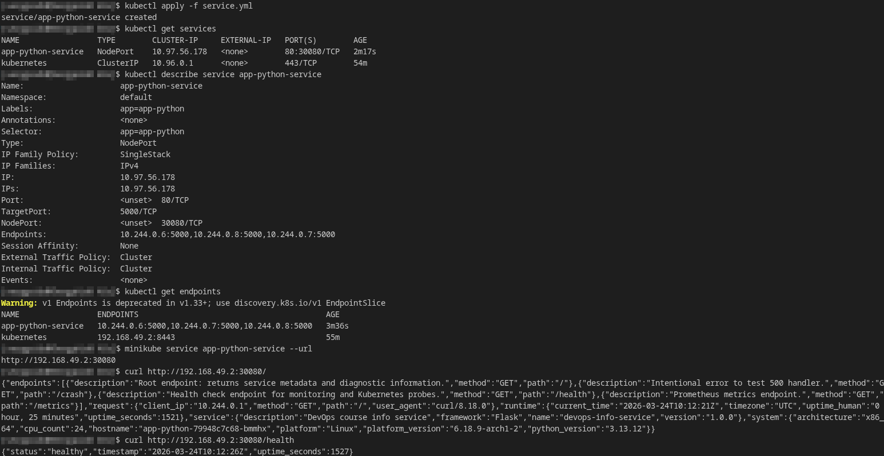

---

## Operations Performed

### Cluster setup
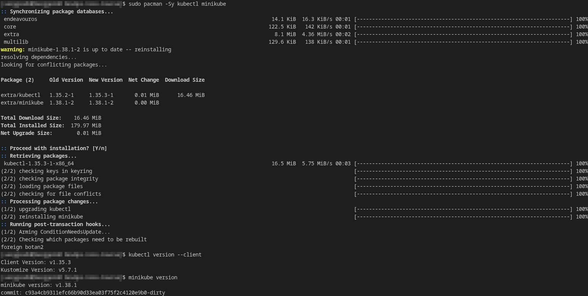
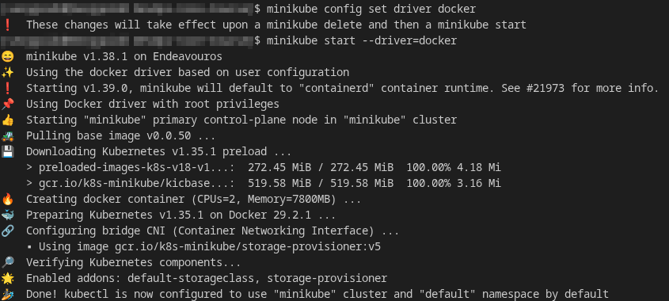
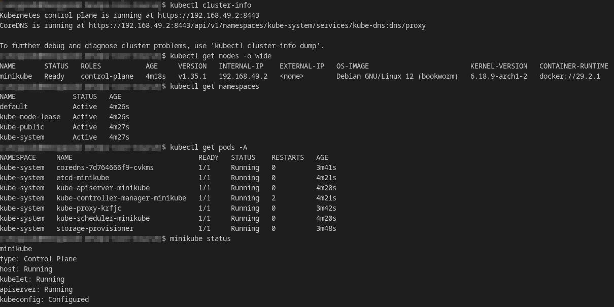

### Commands used to deploy
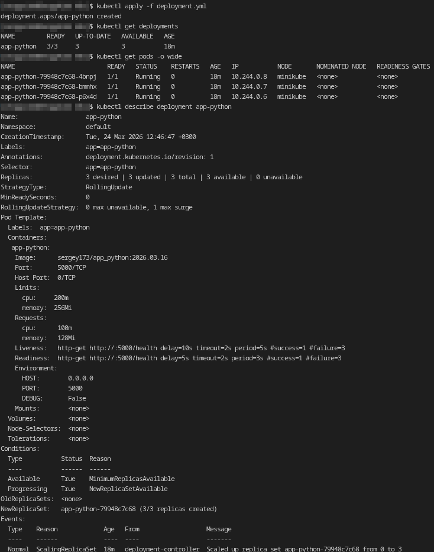

### Scaling demonstration output
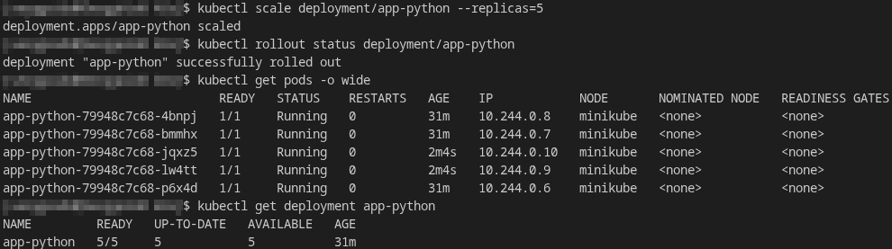

### Rolling update (with zero downtime verification) and rolling backup demonstration output:
For future updates, a new variable has been added to `deployment.yml`:
```yaml
- name: RELEASE_VERSION
  value: "v2"
```
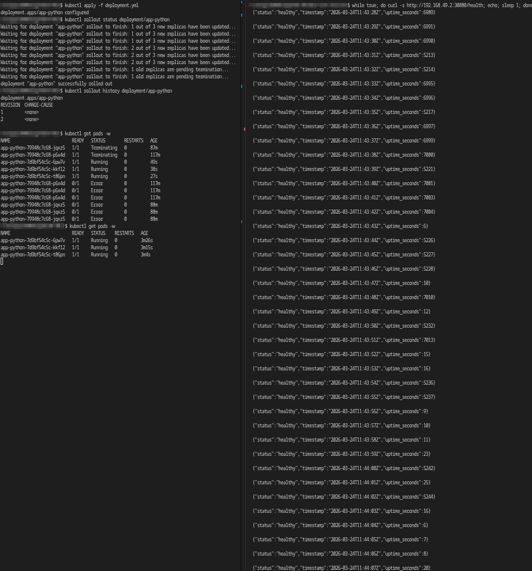
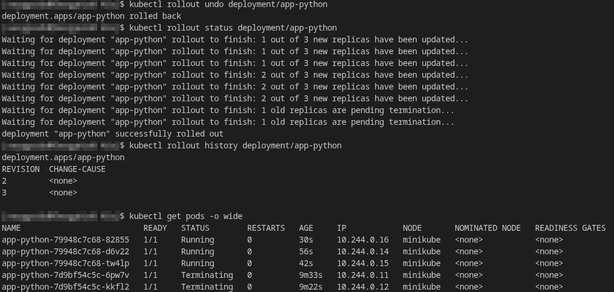

### Service access method and verification
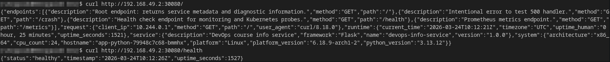

---

## Production Considerations

### Health checks
The following were implemented in Deployment:
- **`livenessProbe`** on `GET /health`;
- **`readinessProbe`** on `GET /health`.

The main reason for choosing this option is that the `/health` endpoint is already implemented in the application;

### Resource limits rationale
- the application is lightweight, so high limits are not required;
- resources are limited sufficiently to demonstrate consumption control;
- requests allow Kubernetes to correctly schedule pods per node.

### How to improve this for production
- Use **Ingress** instead of a single **NodePort**;
- Add **TLS**;
- Move configuration to **ConfigMap** and sensitive data to **Secrets**;
- Set up a **Horizontal Pod Autoscaler**;
- Add **PodDisruptionBudget**;
- Set up a **readiness endpoint** that depends on the actual state of the application;
- Add **network policies**;
- Use a separate namespace for the application;
- Move rollout processes to CI/CD or GitOps.
- Separate 'liveness' and 'readiness' endpoints;
- Add a separate '/ready' endpoint that checks application dependencies;
- Add 'startupProbe' for slow startup.

### Monitoring and observability strategy
The application already has good observability foundations (from previous labs):
- **`/metrics`** endpoint for Prometheus;
- structured JSON logs;
- health endpoint `/health`.

For a production approach, it makes sense to use:
- Prometheus for metrics collection;
- Grafana for visualization;
- Loki + Promtail or EFK/ELK for logging;
- Alerts via Prometheus Alertmanager;
- kubectl describe, kubectl logs, and kubectl get events for operational debugging.

---

## Challenges & Solutions:

### Challenge 1 — Local Kubernetes setup on EndeavourOS

**Problem:** It was necessary to set up a local Kubernetes cluster on Arch Linux and select the appropriate runtime.

**Solution:** `minikube` with `Docker driver` was selected because Docker was already installed and working correctly. After running `minikube start --driver=docker`, the cluster started successfully, and its status was checked using `kubectl cluster-info`, `kubectl get nodes`, `kubectl get pods -A`, and `minikube status`.

### Challenge 2 — Verifying zero downtime
**Problem:** It was necessary not only to perform a rolling update, but also to prove that the application remained accessible.

**Solution.** The second terminal was running a continuous `curl` poll to `/health`. Responses continued to arrive during the upgrade, although `uptime_seconds` changed due to traffic transitioning between the old and new Pods. This provided clear evidence of zero downtime.


### Debugging tools used (`kubectl` commands):
- `kubectl describe deployment app-python`
- `kubectl describe pod <pod-name>`
- `kubectl rollout status deployment/app-python`
- `kubectl rollout history deployment/app-python`
- `kubectl logs <pod-name>` — as a primary tool if detailed container analysis is needed
- `kubectl get events --sort-by=.metadata.creationTimestamp` — as a general way to analyze cluster events

### What I learned about Kubernetes
- Kubernetes operates declaratively: the desired state is specified in YAML manifests;
- Deployment manages Pods, replicas, and updates;
- Service provides a stable entry point to ephemeral Pods;
- Rolling update and rollback are built into Deployment and actually work;
- Probes and resource limits are not a formality, but a basic production minimum;
- The difference between imperative and declarative approaches is clearly illustrated by `kubectl scale` and `kubectl apply`.