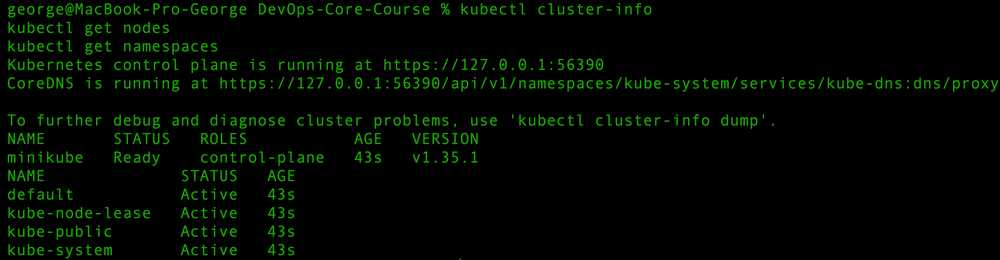
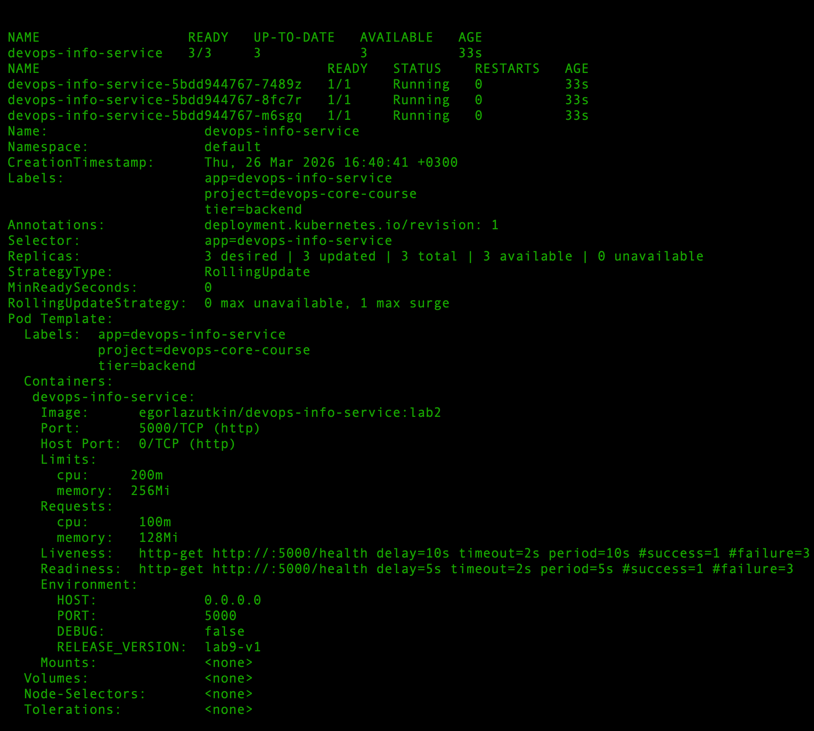
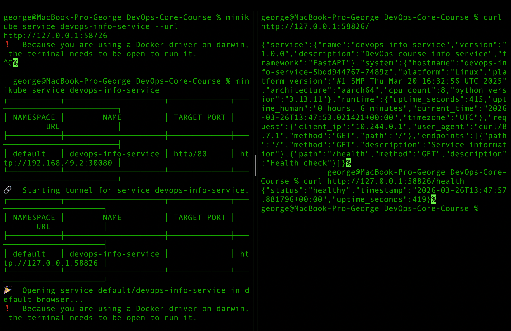
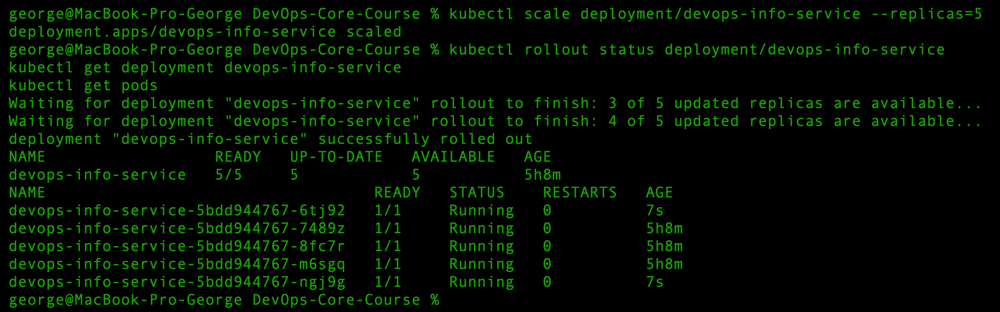
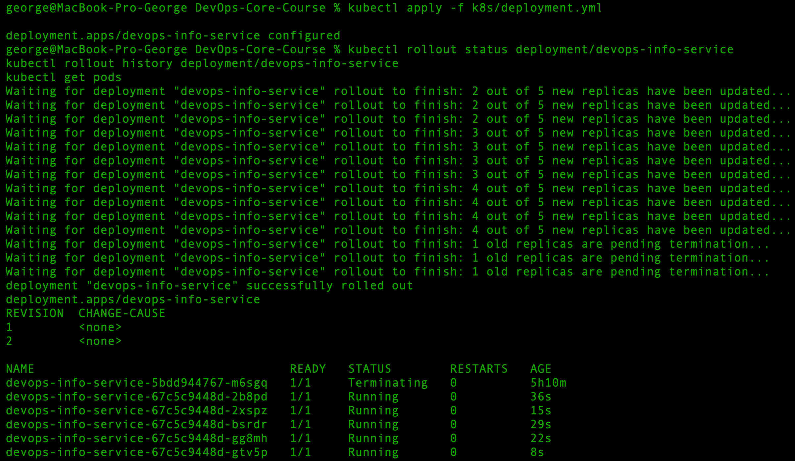

# Lab 9 — Kubernetes Fundamentals

## Architecture Overview

For this lab, the application was deployed to a local Kubernetes cluster using **minikube**.

### Architecture components

- **Deployment:** `devops-info-service`
- **Pods:** 3 replicas initially, later scaled to 5 replicas
- **Service:** `devops-info-service`
- **Service type:** `NodePort`
- **Container image:** `egorlazutkin/devops-info-service:lab2`

### Networking flow

Client traffic flows through the Kubernetes Service to one of the available application Pods:

`Client -> NodePort Service -> Pod`

The Service exposes:

- **Service port:** `80`
- **Target container port:** `5000`
- **NodePort:** `30080`

### Resource allocation strategy

The following container resources were configured:

- **CPU request:** `100m`
- **CPU limit:** `200m`
- **Memory request:** `128Mi`
- **Memory limit:** `256Mi`

These values are sufficient for a lightweight FastAPI application and demonstrate basic Kubernetes resource management best practices.

---

## Task 1 — Local Kubernetes Setup

### Chosen Tool

For the local Kubernetes environment, **minikube** was selected.

### Why minikube

Minikube was chosen because:

* it is convenient for local development
* it works well with Docker on macOS
* it simplifies Service testing through `minikube service`
* it is well suited for educational and laboratory environments

### Cluster Setup Commands

```bash
kubectl cluster-info
kubectl get nodes
kubectl get namespaces
```

### Cluster Information Output


The local Kubernetes cluster was successfully started and verified.
The control plane was running correctly, the minikube node was in `Ready` state, and the standard namespaces were available.

---

## Task 2 — Application Deployment

### Deployment Manifest

The application was deployed using a declarative manifest file:

```text
k8s/deployment.yml
```

### Key Deployment Configuration

* **Deployment name:** `devops-info-service`
* **Replicas:** `3` (initial), later scaled to `5`
* **Container image:** `egorlazutkin/devops-info-service:lab2`
* **Container port:** `5000`
* **Update strategy:** `RollingUpdate`
* **Liveness probe:** `GET /health`
* **Readiness probe:** `GET /health`

### Why these choices were made

* **3 replicas** were configured to satisfy the lab requirement and provide basic redundancy.
* **RollingUpdate** ensures safer updates with minimal disruption.
* **Liveness probe** helps Kubernetes restart unhealthy containers.
* **Readiness probe** ensures traffic is sent only to ready Pods.
* **Resource requests and limits** protect cluster stability and improve scheduling.
* The container image already runs as a **non-root user**, which follows security best practices.

### Deployment Verification Commands

```bash
kubectl get deployments
kubectl get pods
kubectl describe deployment devops-info-service
```

### Deployment Output


```bash
Conditions:
  Type           Status  Reason
  ----           ------  ------
  Available      True    MinimumReplicasAvailable
  Progressing    True    NewReplicaSetAvailable
OldReplicaSets:  <none>
NewReplicaSet:   devops-info-service-5bdd944767 (3/3 replicas created)
Events:
  Type    Reason             Age   From                   Message
  ----    ------             ----  ----                   -------
  Normal  ScalingReplicaSet  33s   deployment-controller  Scaled up replica set devops-info-service-5bdd944767 from 0 to 3
```

The application Deployment was successfully created.
All 3 replicas were running and available. The Deployment used production-oriented settings such as resource limits, health probes, labels, and rolling update strategy.

---

## Task 3 — Service Configuration

### Service Manifest

The application was exposed using the following manifest:

```text
k8s/service.yml
```

### Service Configuration

* **Service name:** `devops-info-service`
* **Service type:** `NodePort`
* **Service port:** `80`
* **Target port:** `5000`
* **NodePort:** `30080`

### Why NodePort was used

`NodePort` is appropriate for local Kubernetes development because it allows the application to be accessed from outside the cluster without requiring a cloud load balancer.

### Service Verification Commands

```bash
kubectl get services
kubectl describe service devops-info-service
kubectl get endpoints
```

### Service Output

```bash
NAME                  TYPE        CLUSTER-IP      EXTERNAL-IP   PORT(S)        AGE
devops-info-service   NodePort    10.108.71.127   <none>        80:30080/TCP   8s
kubernetes            ClusterIP   10.96.0.1       <none>        443/TCP        10m
Name:                     devops-info-service
Namespace:                default
Labels:                   app=devops-info-service
                          project=devops-core-course
Annotations:              <none>
Selector:                 app=devops-info-service
Type:                     NodePort
IP Family Policy:         SingleStack
IP Families:              IPv4
IP:                       10.108.71.127
IPs:                      10.108.71.127
Port:                     http  80/TCP
TargetPort:               5000/TCP
NodePort:                 http  30080/TCP
Endpoints:                10.244.0.4:5000,10.244.0.5:5000,10.244.0.3:5000
Session Affinity:         None
External Traffic Policy:  Cluster
Internal Traffic Policy:  Cluster
Events:                   <none>
Warning: v1 Endpoints is deprecated in v1.33+; use discovery.k8s.io/v1 EndpointSlice
NAME                  ENDPOINTS                                         AGE
devops-info-service   10.244.0.3:5000,10.244.0.4:5000,10.244.0.5:5000   8s
kubernetes            192.168.49.2:8443                                 10m
```

### Access Verification

The Service was accessed using:

```bash
minikube service devops-info-service --url
```

Output:

```bash
http://127.0.0.1:58726
```

Because minikube was running with the Docker driver on macOS, the terminal had to remain open while the tunnel was active. This is expected behavior and does not indicate a configuration issue.

### Application Response Verification

```bash
curl http://127.0.0.1:58826/
```
The temporary localhost tunnel port changed between command executions, which is expected behavior for `minikube service` on macOS with Docker driver.

```json
{"service":{"name":"devops-info-service","version":"1.0.0","description":"DevOps course info service","framework":"FastAPI"},"system":{"hostname":"devops-info-service-5bdd944767-7489z","platform":"Linux","platform_version":"#1 SMP Thu Mar 20 16:32:56 UTC 2025","architecture":"aarch64","cpu_count":8,"python_version":"3.13.11"},"runtime":{"uptime_seconds":415,"uptime_human":"0 hours, 6 minutes","current_time":"2026-03-26T13:47:53.021421+00:00","timezone":"UTC"},"request":{"client_ip":"10.244.0.1","user_agent":"curl/8.7.1","method":"GET","path":"/"},"endpoints":[{"path":"/","method":"GET","description":"Service information"},{"path":"/health","method":"GET","description":"Health check"}]}
```

```bash
curl http://127.0.0.1:58826/health
```

```json
{"status":"healthy","timestamp":"2026-03-26T13:47:57.881796+00:00","uptime_seconds":419}
```



The Service was configured correctly and successfully exposed the application externally.
The selector matched the Deployment Pods, all Pod endpoints were registered, and both `/` and `/health` returned valid responses.


---


## Task 4 — Scaling and Updates

### Scaling Demonstration

The Deployment was first scaled from 3 replicas to 5 replicas using an imperative command:

```bash
kubectl scale deployment/devops-info-service --replicas=5
kubectl rollout status deployment/devops-info-service
kubectl get deployment devops-info-service
kubectl get pods
```

Output:


After that, the declarative manifest was updated to keep the cluster state and YAML manifest consistent:

```yaml
replicas: 5
```
Then reapplied:

```bash
kubectl apply -f k8s/deployment.yml
```

This demonstrates both imperative scaling for quick operations and declarative configuration as the preferred Kubernetes approach.

---

### Rolling Update Demonstration

To trigger a rolling update, the Deployment manifest was modified by changing the environment variable:

```yaml
- name: RELEASE_VERSION
  value: "lab9-v1"
```

to:

```yaml
- name: RELEASE_VERSION
  value: "lab9-v2"
```

Then the manifest was applied:

```bash
kubectl apply -f k8s/deployment.yml
kubectl rollout status deployment/devops-info-service
kubectl rollout history deployment/devops-info-service
kubectl get pods
```

Output:


This confirms that Kubernetes created a new ReplicaSet and gradually replaced the old Pods with new ones.

---

### Zero Downtime Verification

Zero downtime was verified by observing the rolling update behavior:

* the update strategy used:
  * `maxUnavailable: 0`
  * `maxSurge: 1`
* old Pods were terminated only after new Pods became available
* the Service continued to route traffic to healthy Pods during the rollout

This means the application remained available throughout the update process.

---

### Rollback Demonstration

Rollback was demonstrated with:

```bash
kubectl rollout undo deployment/devops-info-service
kubectl rollout status deployment/devops-info-service
kubectl rollout history deployment/devops-info-service
kubectl get pods
kubectl describe deployment devops-info-service
```

Output:

```bash
deployment.apps/devops-info-service rolled back
Waiting for deployment "devops-info-service" rollout to finish: 1 out of 5 new replicas have been updated...
Waiting for deployment "devops-info-service" rollout to finish: 2 out of 5 new replicas have been updated...
Waiting for deployment "devops-info-service" rollout to finish: 3 out of 5 new replicas have been updated...
Waiting for deployment "devops-info-service" rollout to finish: 4 out of 5 new replicas have been updated...
Waiting for deployment "devops-info-service" rollout to finish: 1 old replicas are pending termination...
deployment "devops-info-service" successfully rolled out
deployment.apps/devops-info-service 
REVISION  CHANGE-CAUSE
2         <none>
3         <none>
```

Pods after rollback:

```bash
NAME                                   READY   STATUS        RESTARTS   AGE
devops-info-service-5bdd944767-5rt7q   1/1     Running       0          8s
devops-info-service-5bdd944767-9ns7n   1/1     Running       0          15s
devops-info-service-5bdd944767-nglbd   1/1     Running       0          29s
devops-info-service-5bdd944767-qhn7q   1/1     Running       0          22s
devops-info-service-5bdd944767-swwcm   1/1     Running       0          36s
devops-info-service-67c5c9448d-2b8pd   1/1     Terminating   0          2m19s
```

The Deployment description confirmed that the application configuration returned to:

```bash
RELEASE_VERSION:  lab9-v1
```

This proves that rollback worked successfully and restored the previous stable configuration.

---

## Manifest Files

### `k8s/deployment.yml`

This file defines the application Deployment with:

* 5 replicas in the final manifest state (initial deployment started with 3 replicas)
* container image from Lab 2
* resource requests and limits
* readiness and liveness probes
* rolling update strategy
* environment variables
* security-oriented runtime settings

### `k8s/service.yml`

This file defines the Kubernetes Service with:

* type `NodePort`
* selector matching the Deployment labels
* public access through port `80`
* forwarding to container port `5000`

---

## Deployment Evidence

### kubectl get all

```bash
kubectl get all
```

```bash
NAME                                       READY   STATUS    RESTARTS   AGE
pod/devops-info-service-5bdd944767-5rt7q   1/1     Running   0          39m
pod/devops-info-service-5bdd944767-9ns7n   1/1     Running   0          39m
pod/devops-info-service-5bdd944767-nglbd   1/1     Running   0          39m
pod/devops-info-service-5bdd944767-qhn7q   1/1     Running   0          39m
pod/devops-info-service-5bdd944767-swwcm   1/1     Running   0          39m

NAME                          TYPE        CLUSTER-IP      EXTERNAL-IP   PORT(S)        AGE
service/devops-info-service   NodePort    10.108.71.127   <none>        80:30080/TCP   5h50m
service/kubernetes            ClusterIP   10.96.0.1       <none>        443/TCP        6h

NAME                                  READY   UP-TO-DATE   AVAILABLE   AGE
deployment.apps/devops-info-service   5/5     5            5           5h51m

NAME                                             DESIRED   CURRENT   READY   AGE
replicaset.apps/devops-info-service-5bdd944767   5         5         5       5h51m
replicaset.apps/devops-info-service-67c5c9448d   0         0         0       41m
```

This output confirms that:

* the Deployment is present and healthy
* the Service is created and exposed as `NodePort`
* 5 Pods are running successfully
* the old ReplicaSet from the rolling update remains in history with 0 active replicas

### kubectl get pods,svc -o wide
```bash
kubectl get pods,svc -o wide
```

```bash
NAME                                       READY   STATUS    RESTARTS   AGE   IP            NODE       NOMINATED NODE   READINESS GATES
pod/devops-info-service-5bdd944767-5rt7q   1/1     Running   0          39m   10.244.0.17   minikube   <none>           <none>
pod/devops-info-service-5bdd944767-9ns7n   1/1     Running   0          39m   10.244.0.16   minikube   <none>           <none>
pod/devops-info-service-5bdd944767-nglbd   1/1     Running   0          39m   10.244.0.14   minikube   <none>           <none>
pod/devops-info-service-5bdd944767-qhn7q   1/1     Running   0          39m   10.244.0.15   minikube   <none>           <none>
pod/devops-info-service-5bdd944767-swwcm   1/1     Running   0          39m   10.244.0.13   minikube   <none>           <none>

NAME                          TYPE        CLUSTER-IP      EXTERNAL-IP   PORT(S)        AGE     SELECTOR
service/devops-info-service   NodePort    10.108.71.127   <none>        80:30080/TCP   5h50m   app=devops-info-service
service/kubernetes            ClusterIP   10.96.0.1       <none>        443/TCP        6h1m    <none>
```

This detailed view shows:

* each Pod has its own cluster IP
* all Pods are scheduled on the `minikube` node
* the Service selector correctly matches `app=devops-info-service`
* the Service remains available on `NodePort 30080`


### kubectl describe deployment devops-info-service

The Deployment was inspected using:

```bash
kubectl describe deployment devops-info-service
```

Key output:

```bash
  ...
Replicas:               5 desired | 5 updated | 5 total | 5 available | 0 unavailable
StrategyType:           RollingUpdate
RollingUpdateStrategy:  0 max unavailable, 1 max surge

Image:      egorlazutkin/devops-info-service:lab2

Limits:
  cpu:     200m
  memory:  256Mi
Requests:
  cpu:      100m
  memory:   128Mi

Liveness:   http-get http://:5000/health
Readiness:  http-get http://:5000/health

Environment:
  RELEASE_VERSION:  lab9-v1
  ...
```

This confirms that:

* the Deployment is fully available (5/5 replicas)
* rolling update strategy is configured correctly
* resource requests and limits are applied
* health checks (`/health`) are used for both readiness and liveness
* the application is running the expected version after rollback


### Application Verification

The application was verified through the exposed Service using `minikube service`.

A screenshot of service verification and health check is included:
`(screenshots/health_check.png)`


---

## Production Considerations

### Health checks

The application already exposes `/health`, so it was used for both:

* **readiness probe**
* **liveness probe**

This is sufficient for a simple service and ensures that only healthy containers receive traffic.

### Resource management

Resource requests and limits were configured to:

* guarantee minimum CPU and memory
* prevent the application from consuming excessive cluster resources
* demonstrate production-oriented scheduling practices

### Security

The Docker image runs as a **non-root user**, which improves container security and aligns with Kubernetes best practices.

### Future production improvements

For a more advanced production deployment, the following could be added:

* separate `/ready` endpoint
* `startupProbe`
* `ConfigMap` and `Secret`
* `Ingress`
* `HorizontalPodAutoscaler`
* monitoring and alerting integration

### Monitoring and Observability Strategy

The application already exposes Prometheus-compatible metrics at the `/metrics` endpoint, which provides a solid starting point for observability.

For a more production-ready setup, I would integrate:

- **Prometheus** for metrics scraping
- **Grafana** for dashboards and visualization
- **Loki or ELK** for centralized log aggregation
- **Alertmanager** for alert delivery
- Kubernetes event monitoring for deployment failures, restart loops, and probe failures

Key signals I would monitor:

- request rate
- error rate
- latency
- pod restarts
- CPU and memory usage
- probe failures
- deployment rollout status

---

## Challenges & Solutions

### Challenge 1 — Accessing NodePort on macOS with Docker driver

When using minikube with Docker driver on macOS, the service tunnel requires the terminal to remain open.

**Solution:**
The application was accessed through `minikube service devops-info-service`, keeping the terminal open while the local tunnel remained active.

### Challenge 2 — Verifying correct Pod-Service binding

It was necessary to ensure that the Service selected the correct Pods.

**Solution:**
This was verified using:

```bash
kubectl describe service devops-info-service
kubectl get endpoints
```
The endpoints confirmed that all Pods were correctly attached to the Service.

### What I Learned

This lab helped me better understand:

- how Services provide stable networking for Pods
- how labels and selectors connect Deployments and Services
- how readiness and liveness probes improve reliability
