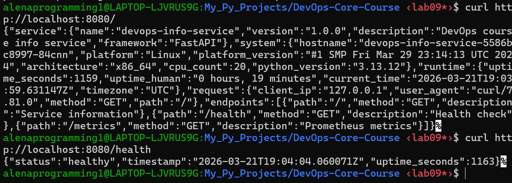

# Lab 9 — Kubernetes Fundamentals

## Architecture Overview

This deployment runs a single application as a Kubernetes Deployment with a NodePort Service for local access.

**Local cluster tool choice**  
I used `kind` because it is lightweight, fast to start, and integrates well with Docker/WSL for local Kubernetes testing. It is ideal for lab work where a quick, disposable cluster is needed.

**Components**
1. Deployment: `devops-info-service`
2. Service (NodePort): `devops-info-service`
3. Replicas: 3 by default, scaled to 5 in Task 4

**Network flow**
Client -> NodePort `30080` -> Service port `80` -> Pod containerPort `5000`

**Resource strategy**
Requests: `100m` CPU, `128Mi` memory. Limits: `250m` CPU, `256Mi` memory.

```
+-------------------+          +---------------------------+
| Client / Browser  |  HTTP    | Kubernetes Node           |
| curl / Postman    +--------->+ NodePort :30080           |
+-------------------+          +-----------+---------------+
                                            |
                                            v
                                   +--------+--------+
                                   | Service :80     |
                                   | selector app=  |
                                   | devops-info     |
                                   +--------+--------+
                                            |
                                  +---------+---------+
                                  |   Deployment       |
                                  | 3-5 replicas       |
                                  +----+----+----+-----+
                                       |    |    |
                                       v    v    v
                                     Pod  Pod  Pod
                                 containerPort 5000
```

## Manifest Files

1. `k8s/deployment.yml`  
Deployment with 3 replicas and RollingUpdate strategy. Probes use `/health` for both readiness and liveness. Resources set to 100m/128Mi requests and 250m/256Mi limits. The container runs as a non-root user defined in the image, and the manifest disables privilege escalation.

2. `k8s/service.yml`  
NodePort Service exposing port `80` and forwarding to container port `5000` via named port `http`. Fixed NodePort is `30080`.

## Deployment Evidence

1. Cluster creation:
```bash
kind create cluster --name devops-lab9
```
```
/DevOps-Core-Course ‹lab09*›$ kind create cluster --name devops-lab9
Creating cluster "devops-lab9" ...
 ✓ Ensuring node image (kindest/node:v1.35.0) 🖼
 ✓ Preparing nodes 📦
 ✓ Writing configuration 📜
 ✓ Starting control-plane 🕹️
 ✓ Installing CNI 🔌
 ✓ Installing StorageClass 💾
Set kubectl context to "kind-devops-lab9"
You can now use your cluster with:

kubectl cluster-info --context kind-devops-lab9

Not sure what to do next? 😅  Check out https://kind.sigs.k8s.io/docs/user/quick-start/
```

2. Cluster info
```bash
kubectl cluster-info
kubectl get nodes -o wide
```
```
/DevOps-Core-Course ‹lab09*›$ kubectl cluster-info
Kubernetes control plane is running at https://127.0.0.1:40705
CoreDNS is running at https://127.0.0.1:40705/api/v1/namespaces/kube-system/services/kube-dns:dns/proxy

To further debug and diagnose cluster problems, use 'kubectl cluster-info dump'.
/DevOps-Core-Course ‹lab09*›$ kubectl get nodes -o wide
NAME                        STATUS   ROLES           AGE     VERSION   INTERNAL-IP   EXTERNAL-IP   OS-IMAGE                         KERNEL-VERSION                       CONTAINER-RUNTIME
devops-lab9-control-plane   Ready    control-plane   3h50m   v1.35.0   172.18.0.2    <none>        Debian GNU/Linux 12 (bookworm)   5.15.153.1-microsoft-standard-WSL2   containerd://2.2.0
```

3. All resources
```bash
kubectl get all
```
```
/DevOps-Core-Course ‹lab09*›$ kubectl get all
NAME                                       READY   STATUS             RESTARTS        AGE
pod/devops-debug                           0/1     CrashLoopBackOff   8 (4m50s ago)   20m
pod/devops-info-service-5586bc8997-84cnn   1/1     Running            0               9m49s
pod/devops-info-service-5586bc8997-jnkvn   1/1     Running            0               9m49s
pod/devops-info-service-5586bc8997-sq85m   1/1     Running            0               9m49s

NAME                          TYPE        CLUSTER-IP     EXTERNAL-IP   PORT(S)        AGE
service/devops-info-service   NodePort    10.96.90.159   <none>        80:30080/TCP   9m46s
service/kubernetes            ClusterIP   10.96.0.1      <none>        443/TCP        3h50m

NAME                                  READY   UP-TO-DATE   AVAILABLE   AGE
deployment.apps/devops-info-service   3/3     3            3           9m49s

NAME                                             DESIRED   CURRENT   READY   AGE
replicaset.apps/devops-info-service-5586bc8997   3         3         3       9m49s
```

4. Pods and Services (wide)
```bash
kubectl get pods,svc -o wide
```
```
/DevOps-Core-Course ‹lab09*›$ kubectl get pods,svc -o wide
NAME                                       READY   STATUS      RESTARTS       AGE   IP            NODE                        NOMINATED NODE   READINESS GATES
pod/devops-debug                           0/1     Completed   9 (5m3s ago)   21m   10.244.0.30   devops-lab9-control-plane   <none>           <none>
pod/devops-info-service-5586bc8997-84cnn   1/1     Running     0              10m   10.244.0.43   devops-lab9-control-plane   <none>           <none>
pod/devops-info-service-5586bc8997-jnkvn   1/1     Running     0              10m   10.244.0.41   devops-lab9-control-plane   <none>           <none>
pod/devops-info-service-5586bc8997-sq85m   1/1     Running     0              10m   10.244.0.42   devops-lab9-control-plane   <none>           <none>

NAME                          TYPE        CLUSTER-IP     EXTERNAL-IP   PORT(S)        AGE     SELECTOR
service/devops-info-service   NodePort    10.96.90.159   <none>        80:30080/TCP   9m59s   app=devops-info
service/kubernetes            ClusterIP   10.96.0.1      <none>        443/TCP        3h51m   <none>
```

5. Deployment details
```bash
kubectl get deployments
kubectl get pods
kubectl describe deployment devops-info-service
```
```
/DevOps-Core-Course ‹lab09*›$ kubectl get deployments
NAME                  READY   UP-TO-DATE   AVAILABLE   AGE
devops-info-service   3/3     3            3           13s
/DevOps-Core-Course ‹lab09*›$ kubectl get pods
NAME                                   READY   STATUS             RESTARTS       AGE
devops-debug                           0/1     CrashLoopBackOff   9 (5m9s ago)   26m
devops-info-service-5586bc8997-84cnn   1/1     Running            0              15m
devops-info-service-5586bc8997-jnkvn   1/1     Running            0              15m
devops-info-service-5586bc8997-sq85m   1/1     Running            0              15m
/DevOps-Core-Course ‹lab09*›$ kubectl describe deployment devops-info-service
Name:                   devops-info-service
Namespace:              default
CreationTimestamp:      Sat, 21 Mar 2026 21:44:36 +0300
Labels:                 app=devops-info
                        tier=backend
Annotations:            deployment.kubernetes.io/revision: 1
Selector:               app=devops-info
Replicas:               3 desired | 3 updated | 3 total | 3 available | 0 unavailable
StrategyType:           RollingUpdate
MinReadySeconds:        0
RollingUpdateStrategy:  0 max unavailable, 1 max surge
Pod Template:
  Labels:  app=devops-info
           tier=backend
  Containers:
   devops-info-service:
    Image:      alsstarikova/devops-info-service:lab09
    Port:       5000/TCP (http)
    Host Port:  0/TCP (http)
    Command:
      python
      -m
      uvicorn
    Args:
      app:app
      --host
      0.0.0.0
      --port
      5000
    Limits:
      cpu:     250m
      memory:  256Mi
    Requests:
      cpu:      100m
      memory:   128Mi
    Liveness:   http-get http://:http/health delay=10s timeout=2s period=10s #success=1 #failure=3
    Readiness:  http-get http://:http/health delay=5s timeout=2s period=5s #success=1 #failure=3
    Environment:
      PORT:        5000
      PYTHONPATH:  /home/app
    Mounts:        <none>
  Volumes:         <none>
  Node-Selectors:  <none>
  Tolerations:     <none>
Conditions:
  Type           Status  Reason
  ----           ------  ------
  Available      True    MinimumReplicasAvailable
  Progressing    True    NewReplicaSetAvailable
OldReplicaSets:  <none>
NewReplicaSet:   devops-info-service-5586bc8997 (3/3 replicas created)
Events:
  Type    Reason             Age   From                   Message
  ----    ------             ----  ----                   -------
  Normal  ScalingReplicaSet  10m   dep
```

6. Service verification
by port-forward
```bash
kubectl port-forward service/devops-info-service 8080:80
curl http://localhost:8080/
curl http://localhost:8080/health
```
```
/DevOps-Core-Course ‹lab09*›$ kubectl port-forward service/devops-info-service 8080:80
Forwarding from 127.0.0.1:8080 -> 5000
Forwarding from [::1]:8080 -> 5000
Handling connection for 8080
Handling connection for 8080
s/DevOps-Core-Course ‹lab09*›$ curl http://localhost:8080/
{"service":{"name":"devops-info-service","version":"1.0.0","description":"DevOps course info service","framework":"FastAPI"},"system":{"hostname":"devops-info-service-5586bc8997-84cnn","platform":"Linux","platform_version":"#1 SMP Fri Mar 29 23:14:13 UTC 2024","architecture":"x86_64","cpu_count":20,"python_version":"3.13.12"},"runtime":{"uptime_seconds":1159,"uptime_human":"0 hours, 19 minutes","current_time":"2026-03-21T19:03:59.631147Z","timezone":"UTC"},"request":{"client_ip":"127.0.0.1","user_agent":"curl/7.81.0","method":"GET","path":"/"},"endpoints":[{"path":"/","method":"GET","description":"Service information"},{"path":"/health","method":"GET","description":"Health check"},{"path":"/metrics","method":"GET","description":"Prometheus metrics"}]}%
/DevOps-Core-Course ‹lab09*›$ curl http://localhost:8080/health
{"status":"healthy","timestamp":"2026-03-21T19:04:04.060071Z","uptime_seconds":1163}% 
```
  

## Operations Performed

1. Apply manifests
```bash
kubectl apply -f k8s/deployment.yml
kubectl apply -f k8s/service.yml
kubectl get deployments
kubectl get pods
kubectl get svc
```

2. Service access method and verification  
Local access is done via `kubectl port-forward`. Verification commands:
```bash
kubectl port-forward service/devops-info-service 8080:80
curl http://localhost:8080/
curl http://localhost:8080/health
```

3. Scaling demonstration
```bash
kubectl scale deployment/devops-info-service --replicas=5
kubectl rollout status deployment/devops-info-service
kubectl get pods -o wide
```
```
/DevOps-Core-Course ‹lab09*›$ kubectl scale deployment/devops-info-service --replicas=5
deployment.apps/devops-info-service scaled
/DevOps-Core-Course ‹lab09*›$ kubectl rollout status deployment/devops-info-service
Waiting for deployment "devops-info-service" rollout to finish: 3 of 5 updated replicas are available...
Waiting for deployment "devops-info-service" rollout to finish: 4 of 5 updated replicas are available...
deployment "devops-info-service" successfully rolled out
/DevOps-Core-Course ‹lab09*›$ kubectl get pods -o wide
NAME                                   READY   STATUS      RESTARTS         AGE   IP            NODE                        NOMINATED NODE   READINESS GATES
devops-debug                           0/1     Completed   11 (5m50s ago)   32m   10.244.0.30   devops-lab9-control-plane   <none>           <none>
devops-info-service-5586bc8997-4lcmn   1/1     Running     0                12s   10.244.0.44   devops-lab9-control-plane   <none>           <none>
devops-info-service-5586bc8997-7xjg2   1/1     Running     0                12s   10.244.0.45   devops-lab9-control-plane   <none>           <none>
devops-info-service-5586bc8997-84cnn   1/1     Running     0                21m   10.244.0.43   devops-lab9-control-plane   <none>           <none>
devops-info-service-5586bc8997-jnkvn   1/1     Running     0                21m   10.244.0.41   devops-lab9-control-plane   <none>           <none>
devops-info-service-5586bc8997-sq85m   1/1     Running     0                21m   10.244.0.42   devops-lab9-control-plane   <none>           <none>
```

4. Rolling update demonstration
Updated image tag in `k8s/deployment.yml` (from `:lab09` -> `:lab02`):
```bash
kubectl apply -f k8s/deployment.yml
kubectl rollout status deployment/devops-info-service
kubectl rollout history deployment/devops-info-service
```
```
s/DevOps-Core-Course ‹lab09*›$ kubectl apply -f k8s/deployment.yml
deployment.apps/devops-info-service configured
/DevOps-Core-Course ‹lab09*›$ kubectl rollout status deployment/devops-info-service
Waiting for deployment "devops-info-service" rollout to finish: 1 out of 3 new replicas have been updated...
Waiting for deployment "devops-info-service" rollout to finish: 1 out of 3 new replicas have been updated...
Waiting for deployment "devops-info-service" rollout to finish: 1 out of 3 new replicas have been updated...
Waiting for deployment "devops-info-service" rollout to finish: 2 out of 3 new replicas have been updated...
Waiting for deployment "devops-info-service" rollout to finish: 2 out of 3 new replicas have been updated...
Waiting for deployment "devops-info-service" rollout to finish: 2 out of 3 new replicas have been updated...
Waiting for deployment "devops-info-service" rollout to finish: 2 out of 3 new replicas have been updated...
Waiting for deployment "devops-info-service" rollout to finish: 1 old replicas are pending termination...
Waiting for deployment "devops-info-service" rollout to finish: 1 old replicas are pending termination...
Waiting for deployment "devops-info-service" rollout to finish: 1 old replicas are pending termination...
deployment "devops-info-service" successfully rolled out
/DevOps-Core-Course ‹lab09*›$ kubectl rollout history deployment/devops-info-service
deployment.apps/devops-info-service
REVISION  CHANGE-CAUSE
1         <none>
2         <none>

/DevOps-Core-Course ‹lab09*›$ kubectl get pods -o wide
NAME                                   READY   STATUS             RESTARTS         AGE   IP            NODE                        NOMINATED NODE   READINESS GATES
devops-debug                           0/1     CrashLoopBackOff   11 (3m30s ago)   35m   10.244.0.30   devops-lab9-control-plane   <none>           <none>
devops-info-service-5c85cbbd86-8zrmz   1/1     Running            0                17s   10.244.0.48   devops-lab9-control-plane   <none>           <none>
devops-info-service-5c85cbbd86-pc448   1/1     Running            0                31s   10.244.0.46   devops-lab9-control-plane   <none>           <none>
devops-info-service-5c85cbbd86-sprmp   1/1     Running            0                24s   10.244.0.47   devops-lab9-control-plane   <none>           <none
```

5. Rollback demonstration
```bash
kubectl rollout undo deployment/devops-info-service
kubectl rollout status deployment/devops-info-service
kubectl rollout history deployment/devops-info-service
```
```
/DevOps-Core-Course ‹lab09*›$ kubectl rollout undo deployment/devops-info-service
deployment.apps/devops-info-service rolled back
/DevOps-Core-Course ‹lab09*›$ kubectl rollout status deployment/devops-info-service
Waiting for deployment "devops-info-service" rollout to finish: 1 out of 3 new replicas have been updated...
Waiting for deployment "devops-info-service" rollout to finish: 1 out of 3 new replicas have been updated...
Waiting for deployment "devops-info-service" rollout to finish: 1 out of 3 new replicas have been updated...
Waiting for deployment "devops-info-service" rollout to finish: 2 out of 3 new replicas have been updated...
Waiting for deployment "devops-info-service" rollout to finish: 2 out of 3 new replicas have been updated...
Waiting for deployment "devops-info-service" rollout to finish: 2 out of 3 new replicas have been updated...
Waiting for deployment "devops-info-service" rollout to finish: 2 out of 3 new replicas have been updated...
Waiting for deployment "devops-info-service" rollout to finish: 1 old replicas are pending termination...
Waiting for deployment "devops-info-service" rollout to finish: 1 old replicas are pending termination...
Waiting for deployment "devops-info-service" rollout to finish: 1 old replicas are pending termination...
deployment "devops-info-service" successfully rolled out
/DevOps-Core-Course ‹lab09*›$ kubectl rollout history deployment/devops-info-service
deployment.apps/devops-info-service
REVISION  CHANGE-CAUSE
2         <none>
3         <none>

/DevOps-Core-Course ‹lab09*›$ kubectl get pods -o wide
NAME                                   READY   STATUS             RESTARTS         AGE   IP            NODE                        NOMINATED NODE   READINESS GATES
devops-debug                           0/1     CrashLoopBackOff   11 (4m31s ago)   36m   10.244.0.30   devops-lab9-control-plane   <none>           <none>
devops-info-service-5586bc8997-55xgw   1/1     Running            0                19s   10.244.0.50   devops-lab9-control-plane   <none>           <none>
devops-info-service-5586bc8997-768br   1/1     Running            0                26s   10.244.0.49   devops-lab9-control-plane   <none>           <none>
devops-info-service-5586bc8997-srl5b   1/1     Running            0                12s   10.244.0.51   devops-lab9-control-plane   <none>           <none>
```

## Production Considerations

**Health checks** use `/health` for readiness and liveness to avoid serving traffic before the app is ready and to restart unhealthy containers.  
**Resource limits** protect the node from a single pod consuming too much CPU or memory. Rolling updates with `maxUnavailable: 0` ensure zero downtime during updates.  
**Future improvements** include a `startupProbe`, `PodDisruptionBudget`, centralized **monitoring** (Prometheus), tracing (OpenTelemetry), and `NetworkPolicy` for traffic isolation.

## Challenges & Solutions

Challenge: `uvicorn` could not import `app` inside Kubernetes even though the image worked locally.  
Solution: ensured the container runs from `/home/app`, explicitly started `uvicorn` via `python -m uvicorn`, and set `PYTHONPATH=/home/app` to make module resolution deterministic.

Challenge: Kubernetes was stuck in `CrashLoopBackOff` while the service looked correct.  
Solution: used `kubectl describe pod` and `kubectl logs --previous` to inspect the real failure reason and iterated on the manifest based on actual error output.

Challenge: Rolling updates must keep the service available.  
Solution: configured `maxUnavailable: 0`, readiness probes on `/health`, and verified rollout status before proceeding.

## What I Learned

Kubernetes is fully declarative, and the control plane constantly reconciles actual state to the desired state in manifests. This makes deployments repeatable and safe to re-apply, but also means mistakes in YAML propagate quickly.

Probes are not optional in production. Readiness protects users from half‑started pods, while liveness enables self‑healing. Without probes, rollouts can appear “successful” even when the app is not actually serving.

Services decouple clients from pods. A Service provides a stable virtual IP and label selectors so traffic continues to flow even as pods are recreated or scaled.

Rolling updates are a controlled workflow, not just an image change. Proper strategy settings and readiness checks are the difference between zero downtime and an outage.

Debugging is a first‑class Kubernetes skill. `kubectl describe`, `kubectl logs --previous`, and `kubectl get events` expose the real cause of failures faster than guessing.

Local clusters have networking quirks. In kind on WSL, NodePort is not always reachable from localhost, so `kubectl port-forward` is often the most reliable way to test locally.
