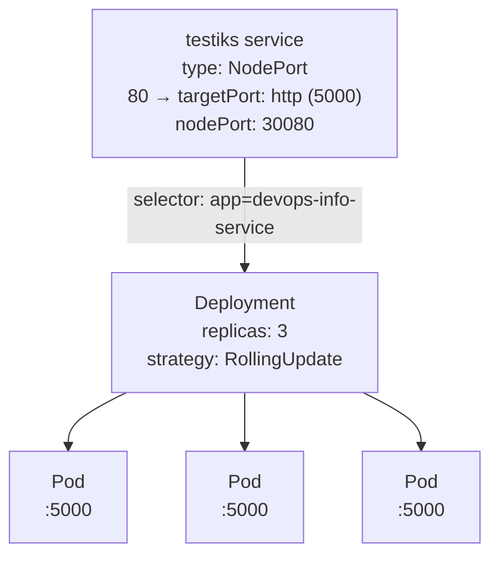

## Lab 9 — Kubernetes Fundamentals

The system architecture is based on a Deployment named `testiks`:
- Workload: `Deployment/testiks`
- Replicas: **three Pods** by default (scaled to 5 later); process listens on **TCP 5000**
- Service  exposure: `Service/devops-info-service` of type **NodePort**

Communications diagram:



## Manifest Files

| File             | Usage                                                                                                                                                                                                                              |
| ---------------- | ---------------------------------------------------------------------------------------------------------------------------------------------------------------------------------------------------------------------------------- |
| `deployment.yml` | Creates and manages the application Pods; creates the `Deployment` and defines replica count, rolling update strategy, resource requests/limits. Performs healthchecks: `livenessProbe` on `/health`,`readinessProbe` on `/health` |
| `service.yml`    | Creates a `Service` of type NodePort, selects Pods using the Deployment label selector, exposes port `80` and routes to container `targetPort: 5000`                                                                               |

Key choices:
- `replicas: 3` provides basic high availability even on a single-node local cluster.
- `maxUnavailable: 0` keeps all existing Pods serving traffic during rollout (when readiness passes).
- requests/limits are small but realistic for a lightweight Flask app.
- `port: 80` is convenient for clients; application stays on `5000`.
- NodePort allows access via `minikube service ... --url`.

## Deployment Evidence

### Cluster objects
![[./img/ods.png]]

### Detailed pods + services

![[./img/etailed.png]]

### Deployment description
```
└─$ kubectl describe deployment testiks            
Name:                   testiks
Namespace:              default
CreationTimestamp:      Thu, 26 Mar 2026 12:49:02 +0300
Labels:                 app=testiks
                        component=api
Annotations:            deployment.kubernetes.io/revision: 16
Selector:               app=testiks
Replicas:               3 desired | 3 updated | 3 total | 3 available | 0 unavailable
StrategyType:           RollingUpdate
MinReadySeconds:        0
RollingUpdateStrategy:  0 max unavailable, 1 max surge
Pod Template:
  Labels:       app=testiks
                component=api
  Annotations:  kubectl.kubernetes.io/restartedAt: 2026-03-26T13:30:43+03:00
  Containers:
   app:
    Image:      cacucoh/testiks:lab9
    Port:       5000/TCP
    Host Port:  0/TCP
    Limits:
      cpu:     500m
      memory:  256Mi
    Requests:
      cpu:      100m
      memory:   128Mi
    Liveness:   http-get http://:http/health delay=15s timeout=3s period=10s #success=1 #failure=3
    Readiness:  http-get http://:http/ready delay=5s timeout=2s period=5s #success=1 #failure=3
    Environment:
      PORT:        5000
    Mounts:        <none>
  Volumes:         <none>
  Node-Selectors:  <none>
  Tolerations:     <none>
Conditions:
  Type           Status  Reason
  ----           ------  ------
  Available      True    MinimumReplicasAvailable
  Progressing    True    NewReplicaSetAvailable
OldReplicaSets:  testiks-6dd7b49449 (0/0 replicas created), testiks-6c99d58d4d (0/0 replicas created), testiks-7f5cfd8947 (0/0 replicas created), testiks-7cb7974599 (0/0 replicas created), testiks-849474fb78 (0/0 replicas created), testiks-5dcd66d7c6 (0/0 replicas created), testiks-559cd698df (0/0 replicas created), testiks-6c8fdf9559 (0/0 replicas created), testiks-6f96859f5b (0/0 replicas created), testiks-6c976bcf57 (0/0 replicas created)
NewReplicaSet:   testiks-764db4db6 (3/3 replicas created)
Events:
  Type    Reason             Age                   From                   Message
  ----    ------             ----                  ----                   -------
  Normal  ScalingReplicaSet  44m                   deployment-controller  Scaled up replica set testiks-c65d77cf5 from 0 to 3
  Normal  ScalingReplicaSet  42m                   deployment-controller  Scaled up replica set testiks-7d66876995 from 0 to 1
  Normal  ScalingReplicaSet  39m                   deployment-controller  Scaled down replica set testiks-c65d77cf5 from 3 to 2
  Normal  ScalingReplicaSet  39m                   deployment-controller  Scaled up replica set testiks-7c7fbdfbf4 from 0 to 1
  Normal  ScalingReplicaSet  37m                   deployment-controller  Scaled down replica set testiks-c65d77cf5 from 2 to 1
  Normal  ScalingReplicaSet  37m                   deployment-controller  Scaled up replica set testiks-698df5d97c from 0 to 1
  Normal  ScalingReplicaSet  31m                   deployment-controller  Scaled down replica set testiks-c65d77cf5 from 1 to 0
  Normal  ScalingReplicaSet  31m                   deployment-controller  Scaled up replica set testiks-6dd7b49449 from 0 to 1
  Normal  ScalingReplicaSet  30m                   deployment-controller  Scaled down replica set testiks-7d66876995 from 1 to 0
  Normal  ScalingReplicaSet  30m                   deployment-controller  Scaled up replica set testiks-6c99d58d4d from 0 to 1
  Normal  ScalingReplicaSet  18m                   deployment-controller  Scaled down replica set testiks-7c7fbdfbf4 from 1 to 0
  Normal  ScalingReplicaSet  18m                   deployment-controller  Scaled up replica set testiks-7f5cfd8947 from 0 to 1
  Normal  ScalingReplicaSet  15m                   deployment-controller  Scaled down replica set testiks-698df5d97c from 1 to 0
  Normal  ScalingReplicaSet  15m                   deployment-controller  Scaled up replica set testiks-7cb7974599 from 0 to 1
  Normal  ScalingReplicaSet  14m                   deployment-controller  Scaled down replica set testiks-6dd7b49449 from 1 to 0
  Normal  ScalingReplicaSet  14m                   deployment-controller  Scaled up replica set testiks-849474fb78 from 0 to 1
  Normal  ScalingReplicaSet  12m                   deployment-controller  Scaled down replica set testiks-6c99d58d4d from 1 to 0
  Normal  ScalingReplicaSet  12m                   deployment-controller  Scaled up replica set testiks-5dcd66d7c6 from 0 to 1
  Normal  ScalingReplicaSet  12m                   deployment-controller  Scaled down replica set testiks-7f5cfd8947 from 1 to 0
  Normal  ScalingReplicaSet  2m30s (x14 over 12m)  deployment-controller  (combined from similar events): Scaled down replica set testiks-6c976bcf57 from 1 to 0
```
### Endpoints
```
└─$ kubectl get endpoints tetsiks

Warning: v1 Endpoints is deprecated in v1.33+; use discovery.k8s.io/v1 EndpointSlice

NAME                  ENDPOINTS                                                        AGE
tetsiks   10.244.0.41:5000,10.244.0.42:5000,10.244.0.43:5000 + 2 more...   17m

NAME                        ADDRESSTYPE   PORTS   ENDPOINTS                                         AGE
tetsiks-8lkwr   IPv4          5000    10.244.0.41,10.244.0.42,10.244.0.43 + 2 more...   17m
```

### Curl tests
![[./img/curl.png]]

### Scaling to 5 pods
![[./img/scale.png]]
```
kubectl scale deployment testiks --replicas=5
kubectl rollout restart deployment/testiks
kubectl rollout status deployment/testiks
kubectl get pods
```

### Rollback
![[./img/ollback.png]]

## 5. Production Considerations
**Health checks:** **Liveness** probes call **`/health`** so Kubernetes restarts the container if the HTTP server stops responding while the process is still running. **Readiness** probes call **`/ready`** so traffic is only sent to Pods that report ready, which avoids routing to Pods that are still starting or temporarily overloaded.

**Resource limits:** Limits (**256Mi** memory, **500m** CPU) bound worst-case usage on shared nodes. Requests (**128Mi**, **100m**) reserve a minimum so the scheduler does not overcommit the node. Values are conservative for a small API and would be raised after measuring steady-state and peak load.

**Improvements for a real production environment**:
- Add **startupProbe** for slow-start applications.
- Add `PodDisruptionBudget` to preserve availability during voluntary disruptions.
- Use `HorizontalPodAutoscaler` (HPA) based on CPU/RPS.
- Use private registry + `imagePullSecrets`, pin image tags (no `latest`), sign images.
- Use namespaces, NetworkPolicies, and secrets management (e.g., External Secrets/Vault).

**Monitoring and observability:** The application exposes **Prometheus metrics** at `/metrics` for request rates, latency, and errors. Cluster-level metrics come from **kube-state-metrics** and **cAdvisor** when integrated with Prometheus. Logs can be collected with a node agent and centralized (for example **Loki**) for correlation with metric alerts.

### Challenges & Solutions

**Docker image issues:** Pods I pushed changes to my python app (added `/ready` endpoint) but kubernetes ignored these changes. Then I just created new lab tag and all succeed