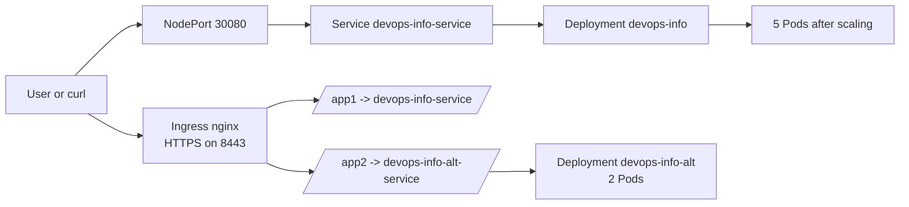

# Lab 09 - Kubernetes Fundamentals

## Status

Lab 09 was implemented and validated live on 2026-03-26 with:

- `kubectl v1.35.3`
- `kind v0.31.0`
- Kubernetes `v1.35.0`
- Docker image `devops-info-service:lab09`

Completed scope:

- Main deployment in namespace `devops-lab09`
- `NodePort` service on `30080`
- Health checks with separate liveness and readiness endpoints
- Scaling from `3` to `5` replicas
- Rolling update plus rollback
- Zero-downtime verification during rollout
- Bonus second deployment, ingress-nginx, TLS secret, and HTTPS path routing

## 1. Architecture Overview

Chosen local tool: `kind`.

Why `kind`:

- It fits the Docker-based workflow already used in earlier labs
- It is lightweight and reproducible
- It works well for local Kubernetes validation without a VM

Architecture:



Networking flow:

- Main application traffic enters through `http://127.0.0.1:30080`
- Bonus traffic enters through `https://local.example.com:8443`
- The application listens on container port `5000`
- Services expose port `80`

Resource allocation strategy:

- Requests: `100m` CPU and `128Mi` memory
- Limits: `250m` CPU and `256Mi` memory
- Rolling updates use `maxUnavailable: 0` and `maxSurge: 1`
- Pods run as non-root UID/GID `10001`

## 2. Manifest Files

| File | Purpose | Key choices |
|---|---|---|
| [`namespace.yml`](/home/eugene/IU/DevOps/DevOps-Core-Course/k8s/namespace.yml) | Isolates lab resources | Dedicated namespace `devops-lab09` |
| [`kind-config.yml`](/home/eugene/IU/DevOps/DevOps-Core-Course/k8s/kind-config.yml) | Local `kind` cluster config | Host port mappings for `30080`, `8081`, and `8443` |
| [`deployment.yml`](/home/eugene/IU/DevOps/DevOps-Core-Course/k8s/deployment.yml) | Main app deployment | 3 replicas by default, probes, requests/limits, rolling updates |
| [`service.yml`](/home/eugene/IU/DevOps/DevOps-Core-Course/k8s/service.yml) | Main app service | `NodePort` on `30080` |
| [`bonus-deployment.yml`](/home/eugene/IU/DevOps/DevOps-Core-Course/k8s/bonus-deployment.yml) | Second app for ingress routing | Same image, different env-driven identity |
| [`bonus-service.yml`](/home/eugene/IU/DevOps/DevOps-Core-Course/k8s/bonus-service.yml) | Internal service for second app | `ClusterIP`, intended to sit behind ingress |
| [`ingress.yml`](/home/eugene/IU/DevOps/DevOps-Core-Course/k8s/ingress.yml) | Bonus ingress with TLS | Regex path rewrites for `/app1` and `/app2` |

Application changes made for Kubernetes:

- Added `GET /ready` for readiness probes
- Made service metadata configurable with `SERVICE_NAME`, `SERVICE_VERSION`, `SERVICE_DESCRIPTION`, and `SERVICE_VARIANT`
- Updated the Docker image to use numeric UID/GID `10001:10001` for reliable `runAsNonRoot`

## 3. Deployment Evidence

### Cluster setup

Cluster creation:

```bash
kind create cluster --name lab09 --config k8s/kind-config.yml
kubectl cluster-info --context kind-lab09
kubectl get nodes -o wide
```

Actual output:

```text
Kubernetes control plane is running at https://127.0.0.1:38705
CoreDNS is running at https://127.0.0.1:38705/api/v1/namespaces/kube-system/services/kube-dns:dns/proxy
```

```text
NAME                  STATUS   ROLES           AGE     VERSION   INTERNAL-IP   EXTERNAL-IP   OS-IMAGE                         KERNEL-VERSION      CONTAINER-RUNTIME
lab09-control-plane   Ready    control-plane   6m39s   v1.35.0   172.18.0.2    <none>        Debian GNU/Linux 12 (bookworm)   6.17.0-19-generic   containerd://2.2.0
```

### Deployment commands

```bash
docker build -t devops-info-service:lab09 app_python
kind load docker-image devops-info-service:lab09 --name lab09
kubectl apply -f k8s/namespace.yml
kubectl apply -f k8s/deployment.yml
kubectl apply -f k8s/service.yml
kubectl -n devops-lab09 rollout status deployment/devops-info
```

Result:

```text
deployment "devops-info" successfully rolled out
```

### `kubectl get all`

```text
NAME                                  READY   STATUS    RESTARTS   AGE
pod/devops-info-6c9ff59cd9-9dsm2      1/1     Running   0          4m1s
pod/devops-info-6c9ff59cd9-dj272      1/1     Running   0          3m29s
pod/devops-info-6c9ff59cd9-ffqv6      1/1     Running   0          3m19s
pod/devops-info-6c9ff59cd9-lvz4b      1/1     Running   0          3m50s
pod/devops-info-6c9ff59cd9-vnqv9      1/1     Running   0          3m40s
pod/devops-info-alt-5545f8b5d-74gvs   1/1     Running   0          36s
pod/devops-info-alt-5545f8b5d-8lqlx   1/1     Running   0          36s

NAME                              TYPE        CLUSTER-IP      EXTERNAL-IP   PORT(S)        AGE
service/devops-info-alt-service   ClusterIP   10.96.25.57     <none>        80/TCP         36s
service/devops-info-service       NodePort    10.96.149.117   <none>        80:30080/TCP   6m22s

NAME                              READY   UP-TO-DATE   AVAILABLE   AGE
deployment.apps/devops-info       5/5     5            5           6m22s
deployment.apps/devops-info-alt   2/2     2            2           36s

NAME                                        DESIRED   CURRENT   READY   AGE
replicaset.apps/devops-info-69fb845c6       0         0         0       5m2s
replicaset.apps/devops-info-6c9ff59cd9      5         5         5       6m22s
replicaset.apps/devops-info-alt-5545f8b5d   2         2         2       36s
```

### `kubectl get pods,svc,ingress -o wide`

```text
NAME                                  READY   STATUS    RESTARTS   AGE     IP            NODE                  NOMINATED NODE   READINESS GATES
pod/devops-info-6c9ff59cd9-9dsm2      1/1     Running   0          4m1s    10.244.0.15   lab09-control-plane   <none>           <none>
pod/devops-info-6c9ff59cd9-dj272      1/1     Running   0          3m29s   10.244.0.18   lab09-control-plane   <none>           <none>
pod/devops-info-6c9ff59cd9-ffqv6      1/1     Running   0          3m19s   10.244.0.19   lab09-control-plane   <none>           <none>
pod/devops-info-6c9ff59cd9-lvz4b      1/1     Running   0          3m50s   10.244.0.16   lab09-control-plane   <none>           <none>
pod/devops-info-6c9ff59cd9-vnqv9      1/1     Running   0          3m40s   10.244.0.17   lab09-control-plane   <none>           <none>
pod/devops-info-alt-5545f8b5d-74gvs   1/1     Running   0          36s     10.244.0.24   lab09-control-plane   <none>           <none>
pod/devops-info-alt-5545f8b5d-8lqlx   1/1     Running   0          36s     10.244.0.23   lab09-control-plane   <none>           <none>

NAME                              TYPE        CLUSTER-IP      EXTERNAL-IP   PORT(S)        AGE     SELECTOR
service/devops-info-alt-service   ClusterIP   10.96.25.57     <none>        80/TCP         36s     app.kubernetes.io/instance=secondary,app.kubernetes.io/name=devops-info
service/devops-info-service       NodePort    10.96.149.117   <none>        80:30080/TCP   6m22s   app.kubernetes.io/instance=primary,app.kubernetes.io/name=devops-info

NAME                                            CLASS   HOSTS               ADDRESS   PORTS     AGE
ingress.networking.k8s.io/devops-info-ingress   nginx   local.example.com             80, 443   21s
```

### `kubectl describe deployment devops-info`

```text
Name:                   devops-info
Namespace:              devops-lab09
Replicas:               5 desired | 5 updated | 5 total | 5 available | 0 unavailable
StrategyType:           RollingUpdate
MinReadySeconds:        5
RollingUpdateStrategy:  0 max unavailable, 1 max surge
...
Liveness:   http-get http://:http/health delay=10s timeout=2s period=10s #success=1 #failure=3
Readiness:  http-get http://:http/ready delay=5s timeout=2s period=5s #success=1 #failure=3
Startup:    http-get http://:http/health delay=0s timeout=1s period=2s #success=1 #failure=30
...
SERVICE_VERSION:      1.0.0
SERVICE_VARIANT:      primary
```

### Application access evidence

Main service through `NodePort`:

```bash
curl http://127.0.0.1:30080/health
curl http://127.0.0.1:30080/ready
curl http://127.0.0.1:30080/
```

Actual output:

```json
{"status":"healthy","service":"devops-info-service","timestamp":"2026-03-26T18:21:59.034784+00:00","uptime_seconds":24}
```

```json
{"status":"ready","service":"devops-info-service","timestamp":"2026-03-26T18:21:59.034812+00:00"}
```

```json
{"service":{"name":"devops-info-service","version":"1.0.0","description":"DevOps course info service running on Kubernetes","framework":"FastAPI","variant":"primary"},"system":{"hostname":"devops-info-6c9ff59cd9-dw5rj","platform":"Linux","platform_version":"#19~24.04.2-Ubuntu SMP PREEMPT_DYNAMIC Fri Mar  6 23:08:46 UTC 2","architecture":"x86_64","cpu_count":12,"python_version":"3.13.12"}}
```

## 4. Operations Performed

### Scaling

Command:

```bash
kubectl -n devops-lab09 scale deployment/devops-info --replicas=5
kubectl -n devops-lab09 rollout status deployment/devops-info
kubectl -n devops-lab09 get pods
```

Actual output:

```text
deployment.apps/devops-info scaled
deployment "devops-info" successfully rolled out
```

The deployment ended in `5/5` available replicas.

### Rolling update

Update command:

```bash
kubectl -n devops-lab09 set env deployment/devops-info SERVICE_VERSION=1.0.1
kubectl -n devops-lab09 rollout status deployment/devops-info
kubectl -n devops-lab09 rollout history deployment/devops-info
```

Actual output:

```text
deployment.apps/devops-info env updated
deployment "devops-info" successfully rolled out

deployment.apps/devops-info
REVISION  CHANGE-CAUSE
1         <none>
2         <none>
```

Zero-downtime verification:

- I ran 60 live `GET /health` requests against `http://127.0.0.1:30080/health` during the rollout
- Result: `ok=60 fails=0`

Why it stayed available:

- `maxUnavailable: 0`
- Readiness gates traffic on `/ready`
- `minReadySeconds: 5`

### Rollback

Rollback command:

```bash
kubectl -n devops-lab09 rollout undo deployment/devops-info
kubectl -n devops-lab09 rollout status deployment/devops-info
kubectl -n devops-lab09 rollout history deployment/devops-info
```

Actual output:

```text
deployment.apps/devops-info rolled back
deployment "devops-info" successfully rolled out

deployment.apps/devops-info
REVISION  CHANGE-CAUSE
2         <none>
3         <none>
```

Version after rollback:

```python
{'name': 'devops-info-service', 'version': '1.0.0', 'description': 'DevOps course info service running on Kubernetes', 'framework': 'FastAPI', 'variant': 'primary'}
```

## 5. Production Considerations

Health checks:

- `startupProbe` on `/health` avoids false restarts during process start
- `livenessProbe` on `/health` restarts a dead or stuck process
- `readinessProbe` on `/ready` removes pods from service before they are ready

Security:

- The image runs as UID/GID `10001`
- Kubernetes explicitly uses `runAsNonRoot`, `runAsUser`, and `runAsGroup`
- `allowPrivilegeEscalation: false`
- All Linux capabilities are dropped
- `seccompProfile: RuntimeDefault`

Resource rationale:

- This service is a small FastAPI app with predictable CPU and memory usage
- The chosen requests keep scheduling stable on a single-node local cluster
- The limits prevent one pod from monopolizing the node during tests

Monitoring strategy:

- `/metrics` is already available from Lab 08
- The app still emits structured JSON logs
- For production I would add a `ServiceMonitor`, latency and error-rate alerts, and a `PodDisruptionBudget`

Next improvements:

- `HorizontalPodAutoscaler`
- `NetworkPolicy`
- Remote container registry instead of manual `kind load docker-image`
- Gateway API for longer-term ingress evolution

## 6. Bonus Task - Ingress with TLS

### Bonus deployment

Commands:

```bash
kubectl apply -f k8s/bonus-deployment.yml
kubectl apply -f k8s/bonus-service.yml
kubectl -n devops-lab09 rollout status deployment/devops-info-alt
```

Result:

```text
deployment "devops-info-alt" successfully rolled out
```

### Ingress controller

Installed for `kind` with:

```bash
kubectl apply -f https://raw.githubusercontent.com/kubernetes/ingress-nginx/main/deploy/static/provider/kind/deploy.yaml
kubectl wait --namespace ingress-nginx \
  --for=condition=ready pod \
  --selector=app.kubernetes.io/component=controller \
  --timeout=300s
```

Result:

```text
pod/ingress-nginx-controller-56dc4b4c6-bjrnq condition met
```

### TLS secret

Commands used:

```bash
openssl req -x509 -nodes -days 365 -newkey rsa:2048 \
  -keyout /tmp/lab09-tls.key \
  -out /tmp/lab09-tls.crt \
  -subj "/CN=local.example.com/O=local.example.com"

kubectl -n devops-lab09 create secret tls devops-local-tls \
  --key /tmp/lab09-tls.key \
  --cert /tmp/lab09-tls.crt \
  --dry-run=client -o yaml | kubectl apply -f -
```

Result:

```text
secret/devops-local-tls created
```

### Ingress routing verification

Ingress apply:

```bash
kubectl apply -f k8s/ingress.yml
kubectl -n devops-lab09 get ingress
```

Result:

```text
NAME                  CLASS   HOSTS               ADDRESS   PORTS     AGE
devops-info-ingress   nginx   local.example.com             80, 443   0s
```

HTTPS verification used `--resolve` instead of editing `/etc/hosts`:

```bash
curl -k --resolve local.example.com:8443:127.0.0.1 https://local.example.com:8443/app1
curl -k --resolve local.example.com:8443:127.0.0.1 https://local.example.com:8443/app1/health
curl -k --resolve local.example.com:8443:127.0.0.1 https://local.example.com:8443/app2
curl -k --resolve local.example.com:8443:127.0.0.1 https://local.example.com:8443/app2/health
```

Actual results:

```json
{"service":{"name":"devops-info-service","version":"1.0.0","description":"DevOps course info service running on Kubernetes","framework":"FastAPI","variant":"primary"}}
```

```json
{"status":"healthy","service":"devops-info-service","timestamp":"2026-03-26T18:27:37.448307+00:00","uptime_seconds":184}
```

```json
{"service":{"name":"devops-info-alt","version":"1.1.0","description":"Secondary variant exposed through ingress","framework":"FastAPI","variant":"secondary"}}
```

```json
{"status":"healthy","service":"devops-info-alt","timestamp":"2026-03-26T18:27:37.456791+00:00","uptime_seconds":20}
```

Ingress benefits over NodePort:

- One HTTPS entrypoint instead of multiple exposed high ports
- Path-based routing to multiple services
- Central TLS termination
- Closer to a production traffic-management model

## 7. Challenges and Solutions

Issue 1: Broken local `kubectl`

- The original `kubectl` binary in `~/.local/bin` segfaulted
- I replaced it with the official `v1.35.3` binary before validation

Issue 2: NodePort and ingress access from `kind`

- `kind` does not expose NodePorts to the host by default in a convenient way
- I added [`kind-config.yml`](/home/eugene/IU/DevOps/DevOps-Core-Course/k8s/kind-config.yml) with explicit host port mappings

Issue 3: Kubernetes non-root enforcement

- A named image user is less reliable for `runAsNonRoot`
- I changed the image to a fixed numeric UID/GID `10001`

What I learned:

- Separate readiness and liveness checks make rollouts safer and easier to debug
- Small image details matter once Kubernetes security settings are enforced
- For local labs, a dedicated `kind` config is worth keeping in version control
