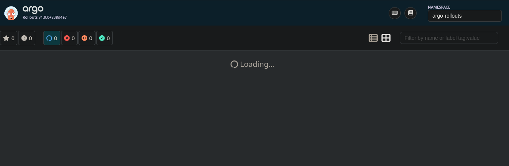
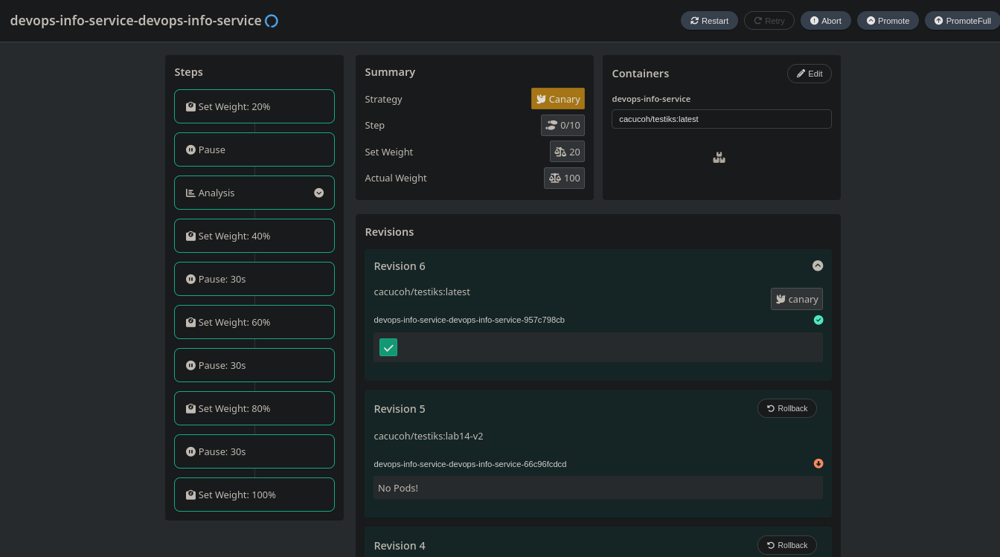
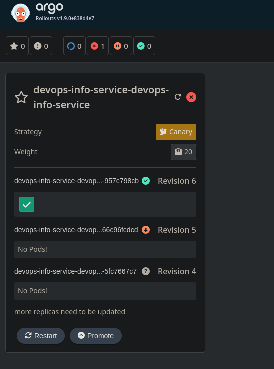
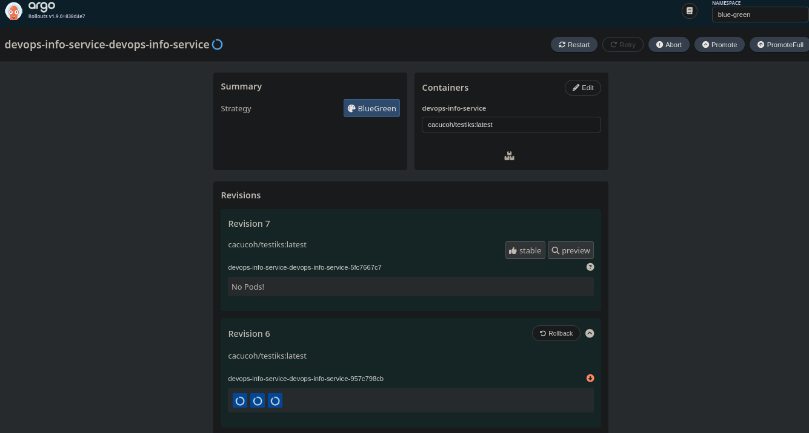

# Lab 14 - Progressive Delivery with Argo Rollouts

## 1. Argo Rollouts Setup

In this lab, I migrated my application from a regular `Deployment` to `Rollout` to support progressive delivery strategies (canary and blue-green)

I used these commands to verify the controller and CLI plugin installation:

```bash
kubectl argo rollouts version
kubectl get pods -n argo-rollouts
kubectl get svc -n argo-rollouts
```

Command output:

```text
$ kubectl config current-context
minikube

$ kubectl argo rollouts version
kubectl-argo-rollouts: v1.9.0+838d4e7
  BuildDate: 2026-03-20T21:08:11Z
  GitCommit: 838d4e792be666ec11bd0c80331e0c5511b5010e
  GitTreeState: clean
  GoVersion: go1.24.13
  Compiler: gc
  Platform: linux/amd64
```

For the Dashboard, I used port-forward:

```bash
kubectl port-forward svc/argo-rollouts-dashboard -n argo-rollouts 3100:3100
```

Then I opened `http://localhost:3100` and monitored rollout stages in the web UI

Dashboard screenshot:



### Deployment vs Rollout (my summary)

| Criteria | Deployment | Rollout |
| --- | --- | --- |
| Update strategies | RollingUpdate/Recreate | Canary/BlueGreen (+ staged steps) |
| Traffic control | No | Yes |
| Pause and manual promotion | No | Yes |
| Metrics analysis | No | Yes (`AnalysisTemplate`) |
| Rollback control | Basic rollout undo | Controlled `abort/retry/promote` |

Conclusion: `Deployment` is simpler, but `Rollout` provides safer production releases with better risk control

## 2. Canary Deployment

### What I implemented in the Helm chart

I extended the `k8s/devops-info-service` chart:

- `templates/rollout.yml` with canary steps `20 -> 40 -> 60 -> 80 -> 100`
- first pause is manual (`pause: {}`), then timed pauses (`30s`)
- added `AnalysisTemplate` in `templates/analysis-template.yml` (bonus)
- canary mode enabled via `values-canary.yml`

Canary steps:

```yaml
strategy:
  canary:
    steps:
      - setWeight: 20
      - pause: {}
      - analysis:
          templates:
            - templateName: <release>-success-rate
      - setWeight: 40
      - pause: { duration: 30s }
      - setWeight: 60
      - pause: { duration: 30s }
      - setWeight: 80
      - pause: { duration: 30s }
      - setWeight: 100
```

### Commands I used

```bash
# canary deployment
helm upgrade --install devops-info-service ./k8s/devops-info-service \
  -f ./k8s/devops-info-service/values-canary.yml

# watch rollout progress
kubectl argo rollouts get rollout devops-info-service-devops-info-service -w

# manual promotion after first pause
kubectl argo rollouts promote devops-info-service-devops-info-service

# abort rollout
kubectl argo rollouts abort devops-info-service-devops-info-service

# retry after abort
kubectl argo rollouts retry rollout devops-info-service-devops-info-service
```


Command output (example from my run):

```text
$ helm template devops ./k8s/devops-info-service -f ./k8s/devops-info-service/values-canary.yml
...
kind: AnalysisTemplate
...
kind: Rollout
...
strategy:
  canary:
    steps:
      - setWeight: 20
      - pause: {}
      - analysis:
          templates:
            - templateName: devops-devops-info-service-success-rate
      - setWeight: 40
      - pause: { duration: 30s }
      - setWeight: 60
      - pause: { duration: 30s }
      - setWeight: 80
      - pause: { duration: 30s }
      - setWeight: 100
```

Live cluster output from my run:

```text
$ kubectl argo rollouts get rollout devops-info-service-devops-info-service -w
Name:            devops-info-service-devops-info-service
Status:          ॥ Paused
Step:            2/9
SetWeight:       20
...

$ kubectl argo rollouts promote devops-info-service-devops-info-service
rollout 'devops-info-service-devops-info-service' promoted

$ kubectl argo rollouts abort devops-info-service-devops-info-service
rollout 'devops-info-service-devops-info-service' aborted
```

### Rollback check

During canary, I used `abort` and confirmed that traffic returned to the stable version. Rollback was correct and fast, but not as instant as blue-green

## 3. Blue-Green Deployment

### What I added

For blue-green, I created a dedicated values file:

- `values-bluegreen.yml`
- `rollout.strategy: blueGreen`
- `autoPromotionEnabled: false` (manual switch)

The chart uses:

- main service `templates/service.yml` (active service)
- `templates/preview-service.yml` (preview service)

Strategy snippet:

```yaml
strategy:
  blueGreen:
    activeService: <release>-devops-info-service
    previewService: <release>-devops-info-service-preview
    autoPromotionEnabled: false
```

### How I tested

```bash
# blue-green deployment
helm upgrade --install devops-info-service ./k8s/devops-info-service \
  -f ./k8s/devops-info-service/values-bluegreen.yml

# active service
kubectl port-forward svc/devops-info-service-devops-info-service 8080:80

# preview service
kubectl port-forward svc/devops-info-service-devops-info-service-preview 8081:80

# promote after preview validation
kubectl argo rollouts promote devops-info-service-devops-info-service
```

Command output (example from my render validation):

```text
$ helm template devops ./k8s/devops-info-service -f ./k8s/devops-info-service/values-bluegreen.yml
...
kind: Service
metadata:
  name: devops-devops-info-service
...
kind: Service
metadata:
  name: devops-devops-info-service-preview
...
kind: Rollout
...
strategy:
  blueGreen:
    activeService: devops-devops-info-service
    previewService: devops-devops-info-service-preview
    autoPromotionEnabled: false
```

Live cluster output to capture during demo:

```text
$ kubectl get svc -n default | grep devops-info-service
devops-info-service-devops-info-service           NodePort    10.97.61.94     <none>   80:30080/TCP   39m
devops-info-service-devops-info-service-preview   ClusterIP   10.106.51.212    <none>   80/TCP         0s

$ kubectl argo rollouts get rollout devops-info-service-devops-info-service -n default
Status:          ॥ Paused
Message:         BlueGreenPause
Strategy:        BlueGreen
Images:          cacucoh/testiks:1.0 (preview)
                 cacucoh/testiks:latest (stable, active)

$ kubectl argo rollouts promote devops-info-service-devops-info-service -n default
rollout 'devops-info-service-devops-info-service' promoted

$ kubectl argo rollouts get rollout devops-info-service-devops-info-service -n default
Status:          ✔ Healthy
Strategy:        BlueGreen
Images:          cacucoh/testiks:1.0 (stable, active)
                 cacucoh/testiks:latest
```

```bash
$ kubectl get svc -n default | grep devops-info-service

devops-info-service-devops-info-service           NodePort    10.97.61.94     <none>        80:30080/TCP   35m
devops-info-service-devops-info-service-preview   ClusterIP   10.106.181.10   <none>        80/TCP         4m30s
```

I verified that before promotion, the new version was available through the preview service, and after promotion, traffic switched to it as active


## 4. Bonus - AnalysisTemplate

I added automated health validation using Argo Analysis:

- file: `templates/analysis-template.yml`
- provider: `web`
- request: `GET /health`
- `jsonPath: "{$.status}"`
- success condition: `result == "healthy"`

This analysis runs in canary after `setWeight: 20`. If validation fails, the rollout can be stopped based on `failureLimit`.

Live cluster output from my run:

```text
$ kubectl argo rollouts promote devops-info-service-devops-info-service -n default
rollout 'devops-info-service-devops-info-service' promoted

$ kubectl argo rollouts get rollout devops-info-service-devops-info-service -n default
Step:            2/10
...
└──α devops-info-service-devops-info-service-957c798cb-10-2  AnalysisRun  ◌ Running

$ kubectl get analysisrun -n default
NAME                                                     STATUS    AGE
devops-info-service-devops-info-service-957c798cb-10-2  Running   6s

$ kubectl describe analysisrun devops-info-service-devops-info-service-957c798cb-10-2 -n default
Name:         devops-info-service-devops-info-service-957c798cb-10-2
...
Metric Results:
  Name:           healthcheck
  Successful:     1
  Measurements:
    Phase:        Successful
    Value:        "healthy"
```

## 5. Strategy Selection: When to Use What

### Canary

Pros:
- gradual traffic increase
- better risk control for larger changes
- easy integration with metrics/analysis

Cons:
- more complex monitoring
- slower path to full rollout

### Blue-Green

Pros:
- almost instant switching
- simple rollback to previous version
- good for short release windows

Cons:
- requires more resources (two environments at once)
- requires a strict preview validation process

### My Recommendation

- Canary: for higher-risk or frequently released services
- Blue-Green: for critical services where quick switch/rollback matters
- For this project, I would use canary by default and blue-green for major releases

## 6. Helm Template Validation

Before applying to the cluster, I validated template rendering:

```bash
helm template devops ./k8s/devops-info-service
helm template devops ./k8s/devops-info-service -f ./k8s/devops-info-service/values-canary.yml
helm template devops ./k8s/devops-info-service -f ./k8s/devops-info-service/values-bluegreen.yml
```

Command output summary:

```text
- default values render Deployment
- values-canary.yml renders Rollout + AnalysisTemplate (canary strategy)
- values-bluegreen.yml renders Rollout + preview Service (blueGreen strategy)
```

All three modes render successfully:
- base `Deployment`
- `Rollout` with canary
- `Rollout` with blue-green + preview service


## Screensots:




Service degraded:




Blue-green:



