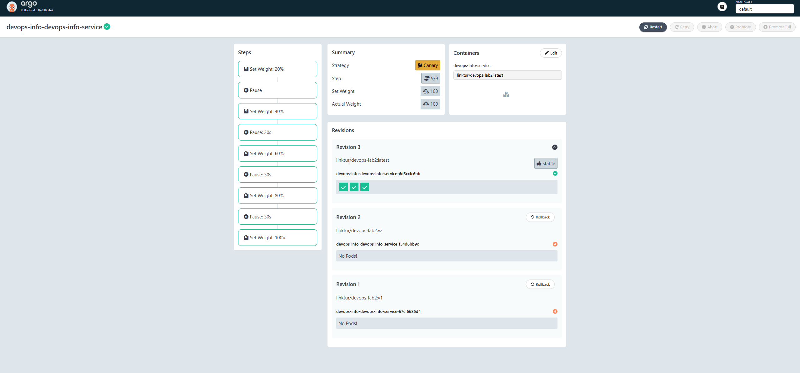
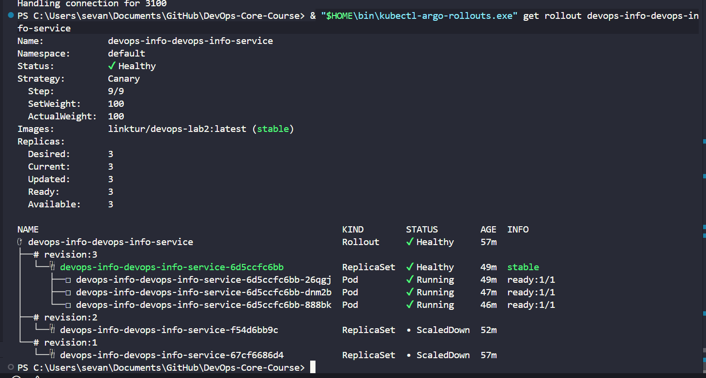

# Lab 14: Progressive Delivery with Argo Rollouts

## 1. Argo Rollouts Setup

### 1.1 Installing the controller

First I created a namespace and applied the official install manifest:

```bash
kubectl create namespace argo-rollouts
kubectl apply -n argo-rollouts -f https://github.com/argoproj/argo-rollouts/releases/latest/download/install.yaml
```

After that I checked that the pods are running:

```powershell
PS> kubectl config current-context
minikube

PS> kubectl get pods -n argo-rollouts
NAME                                       READY   STATUS    RESTARTS   AGE
argo-rollouts-74bcdffffc-b2wl5             1/1     Running   0          71m
argo-rollouts-dashboard-78677bc878-mv6zd   1/1     Running   0          71m
```

Both pods are running, so the controller and dashboard are installed.

### 1.2 Installing the kubectl plugin

On Windows I downloaded the binary and moved it to my PATH:

```powershell
Invoke-WebRequest -Uri https://github.com/argoproj/argo-rollouts/releases/latest/download/kubectl-argo-rollouts-windows-amd64.exe -OutFile kubectl-argo-rollouts.exe
Move-Item .\kubectl-argo-rollouts.exe "$HOME\bin\kubectl-argo-rollouts.exe"
```

On Linux the steps are:

```bash
curl -LO https://github.com/argoproj/argo-rollouts/releases/latest/download/kubectl-argo-rollouts-linux-amd64
chmod +x kubectl-argo-rollouts-linux-amd64
sudo mv kubectl-argo-rollouts-linux-amd64 /usr/local/bin/kubectl-argo-rollouts
```

Plugin version check:

```powershell
PS> & "$HOME\bin\kubectl-argo-rollouts.exe" version
kubectl-argo-rollouts: v1.9.0+838d4e7
  BuildDate: 2026-03-20T21:15:27Z
  GitCommit: 838d4e792be666ec11bd0c80331e0c5511b5010e
  GitTreeState: clean
  GoVersion: go1.24.13
  Compiler: gc
  Platform: windows/amd64
```

### 1.3 Accessing the dashboard

```bash
kubectl apply -n argo-rollouts -f https://github.com/argoproj/argo-rollouts/releases/latest/download/dashboard-install.yaml
kubectl port-forward svc/argo-rollouts-dashboard -n argo-rollouts 3100:3100
```

After port-forwarding I opened `http://127.0.0.1:3100` in the browser and saw the rollout list with strategy details, step progress, and revisions.

### 1.4 Rollout vs Deployment — key differences

I compared the Rollout CRD with a regular Deployment and noticed a few important things:

- `Deployment` uses `apiVersion: apps/v1`, while `Rollout` uses `argoproj.io/v1alpha1`
- `Deployment` only supports `RollingUpdate` and `Recreate` strategies
- `Rollout` adds `canary` and `blueGreen` strategies with step-by-step traffic shifting
- `Rollout` lets you pause between steps, manually promote, abort, and even automatically roll back based on metrics
- The pod template, selectors, probes, volumes, and containers are basically the same as in a Deployment — so migration is not that hard

---

## 2. Helm Chart Changes

Chart path: `k8s/devops-info-service`

I added these new files to the chart:

- `templates/rollout.yaml` — the main Rollout resource, supports both canary and blue-green strategies
- `templates/service-preview.yaml` — a preview service used only in blue-green mode
- `templates/analysis-template.yaml` — an optional AnalysisTemplate for automatic health checks during canary
- `values-rollouts-canary.yaml` — values file to enable canary mode
- `values-rollouts-bluegreen.yaml` — values file to enable blue-green mode
- `values-rollouts-canary-analysis.yaml` — overlay that adds automated analysis to canary

The existing `templates/deployment.yaml` was updated to only render when `rollout.enabled=false`, so you can switch between a regular Deployment and a Rollout just by changing values.

---

## 3. Canary Deployment

### 3.1 Strategy configuration

To enable canary, I set these values:

```yaml
rollout:
  enabled: true
  strategy: canary
```

The traffic goes through these steps:

1. Send 20% to the new version, then wait for manual promotion
2. Increase to 40%, wait 30 seconds
3. Increase to 60%, wait 30 seconds
4. Increase to 80%, wait 30 seconds
5. Promote to 100%

This way I can check if the new version works before sending all traffic to it.

### 3.2 Installing the canary rollout

```bash
helm upgrade --install devops-info k8s/devops-info-service \
  -f k8s/devops-info-service/values.yaml \
  -f k8s/devops-info-service/values-rollouts-canary.yaml
```

I checked that the release was installed:

```powershell
PS> helm list -A
NAME        NAMESPACE  REVISION  UPDATED                               STATUS    CHART                     APP VERSION
devops-info default    3         2026-04-28 23:49:25.1911188 +0300 MSK deployed  devops-info-service-0.1.0 1.0.0

PS> helm history devops-info
REVISION  UPDATED                  STATUS      CHART                     APP VERSION  DESCRIPTION
1         Tue Apr 28 23:40:54 2026 superseded  devops-info-service-0.1.0 1.0.0        Install complete
2         Tue Apr 28 23:46:21 2026 superseded  devops-info-service-0.1.0 1.0.0        Upgrade complete
3         Tue Apr 28 23:49:25 2026 deployed    devops-info-service-0.1.0 1.0.0        Upgrade complete
```

### 3.3 Triggering a rollout

To start a new canary rollout, I updated the image tag:

```bash
helm upgrade --install devops-info k8s/devops-info-service \
  -f k8s/devops-info-service/values.yaml \
  -f k8s/devops-info-service/values-rollouts-canary.yaml \
  --set image.tag=v2
```

After that the rollout stopped at the first pause step (20%) and waited for me to promote it.

### 3.4 Promoting and aborting

To move to the next step manually:

```bash
kubectl argo rollouts promote devops-info-devops-info-service
```

To abort the rollout and send traffic back to the stable version:

```bash
kubectl argo rollouts abort devops-info-devops-info-service
```

To retry after an abort:

```bash
kubectl argo rollouts retry rollout devops-info-devops-info-service
```

### 3.5 Evidence

Argo Rollouts dashboard showing all 9/9 canary steps completed. Revision 3 is the current stable version with 3 running pods. Revisions 1 and 2 are scaled down:



Terminal output showing the rollout is `Healthy`, all steps finished (`Step: 9/9`), and 100% of traffic is going to the new version:



Full rollout status from the cluster:

```powershell
PS> & "$HOME\bin\kubectl-argo-rollouts.exe" get rollout devops-info-devops-info-service
Name:            devops-info-devops-info-service
Namespace:       default
Status:          Healthy
Strategy:        Canary
  Step:          9/9
  SetWeight:     100
  ActualWeight:  100
Images:          linktur/devops-lab2:latest (stable)
Replicas:
  Desired:       3
  Current:       3
  Updated:       3
  Ready:         3
  Available:     3

NAME                                                         KIND        STATUS        AGE  INFO
devops-info-devops-info-service                              Rollout     Healthy       61m
revision:3                                                   ReplicaSet  Healthy       52m stable
revision:2                                                   ReplicaSet  ScaledDown    55m
revision:1                                                   ReplicaSet  ScaledDown    61m
```

Pods and services after the canary finished:

```powershell
PS> kubectl get svc,pods,rs -n default
NAME                                      TYPE        CLUSTER-IP      EXTERNAL-IP   PORT(S)        AGE
service/devops-info-devops-info-service   NodePort    10.105.81.252   <none>        80:31542/TCP   61m

NAME                                                   READY   STATUS    RESTARTS   AGE
pod/devops-info-devops-info-service-6d5ccfc6bb-26qgj   1/1     Running   0          52m
pod/devops-info-devops-info-service-6d5ccfc6bb-888bk   1/1     Running   0          49m
pod/devops-info-devops-info-service-6d5ccfc6bb-dnm2b   1/1     Running   0          50m

NAME                                                         DESIRED   CURRENT   READY   AGE
replicaset.apps/devops-info-devops-info-service-67cf6686d4   0         0         0       61m
replicaset.apps/devops-info-devops-info-service-6d5ccfc6bb   3         3         3       52m
replicaset.apps/devops-info-devops-info-service-f54d6bb9c    0         0         0       55m
```

Additional canary evidence from a later rollout:

```powershell
PS> & "$HOME\bin\kubectl-argo-rollouts.exe" get rollout devops-info-devops-info-service
Status:          Paused
Message:         CanaryPauseStep
Strategy:        Canary
  Step:          1/9
  SetWeight:     20
  ActualWeight:  25
Images:          linktur/devops-lab2:latest (stable)
                 linktur/devops-lab2:v1 (canary)
Replicas:
  Desired:       3
  Current:       4
  Updated:       1
  Ready:         4
  Available:     4

NAME                                                         KIND        STATUS        AGE    INFO
devops-info-devops-info-service                              Rollout     Paused        10h
revision:4                                                   ReplicaSet  Healthy       3m50s  canary
revision:3                                                   ReplicaSet  Healthy       10h    stable
revision:2                                                   ReplicaSet  ScaledDown    10h
revision:1                                                   ReplicaSet  ScaledDown    10h
```

This proves the rollout really reached the first manual canary gate and shifted traffic to the new ReplicaSet before full promotion.

---

## 4. Blue-Green Deployment

### 4.1 Strategy configuration

For blue-green I used this values file:

```yaml
rollout:
  enabled: true
  strategy: blueGreen
  blueGreen:
    autoPromotionEnabled: false
```

With `autoPromotionEnabled: false` the rollout pauses after the new version (green) is ready, and waits for me to manually promote it. This gives me time to test the preview before switching production traffic.

The chart creates two services:

- **Active service** (`devops-info-bg-devops-info-service`) — serves real production traffic
- **Preview service** (`devops-info-bg-devops-info-service-preview`) — serves the new version for testing

### 4.2 Installing the blue-green rollout

```bash
helm upgrade --install devops-info-bg k8s/devops-info-service \
  -f k8s/devops-info-service/values.yaml \
  -f k8s/devops-info-service/values-rollouts-bluegreen.yaml
```

Release installed:

```powershell
PS> helm history devops-info-bg
REVISION  UPDATED                  STATUS    CHART                     APP VERSION  DESCRIPTION
1         Wed Apr 29 00:46:08 2026 deployed  devops-info-service-0.1.0 1.0.0        Install complete
```

Initial state — `v1` is stable and active:

```powershell
PS> & "$HOME\bin\kubectl-argo-rollouts.exe" get rollout devops-info-bg-devops-info-service
Name:            devops-info-bg-devops-info-service
Namespace:       default
Status:          Healthy
Strategy:        BlueGreen
Images:          linktur/devops-lab2:v1 (stable, active)
Replicas:
  Desired:       3
  Current:       3
  Updated:       3
  Ready:         3
  Available:     3

NAME                                                           KIND        STATUS   AGE  INFO
devops-info-bg-devops-info-service                             Rollout     Healthy  89s
revision:1                                                     ReplicaSet  Healthy  89s stable,active
```

### 4.3 Accessing active and preview services

```bash
kubectl port-forward svc/devops-info-bg-devops-info-service 8080:80
kubectl port-forward svc/devops-info-bg-devops-info-service-preview 8081:80
```

- `http://127.0.0.1:8080/health` — active (blue) version
- `http://127.0.0.1:8081/health` — preview (green) version

Both services were running at the same time:

```powershell
PS> kubectl get svc,pods,rs -n default | findstr devops-info-bg
service/devops-info-bg-devops-info-service           NodePort    10.97.225.194    <none>        80:30184/TCP   89s
service/devops-info-bg-devops-info-service-preview   ClusterIP   10.104.230.235   <none>        80/TCP         89s
pod/devops-info-bg-devops-info-service-f4684bcdb-6zz4s   1/1     Running   0          89s
pod/devops-info-bg-devops-info-service-f4684bcdb-nj8rx   1/1     Running   0          89s
pod/devops-info-bg-devops-info-service-f4684bcdb-zcwk5   1/1     Running   0          89s
replicaset.apps/devops-info-bg-devops-info-service-f4684bcdb   3         3         3       89s
```

### 4.4 Promoting and rolling back

To promote the preview version to active:

```bash
kubectl argo rollouts promote devops-info-bg-devops-info-service
```

To roll back to the previous version:

```bash
kubectl argo rollouts undo devops-info-bg-devops-info-service
```

After rollback the active service selector switches back to the old ReplicaSet immediately — no pod restarts, no rolling update. This is the main advantage of blue-green: rollback is basically instant.

State after rollback:

```powershell
PS> & "$HOME\bin\kubectl-argo-rollouts.exe" get rollout devops-info-bg-devops-info-service
Name:            devops-info-bg-devops-info-service
Namespace:       default
Status:          ✔ Healthy
Strategy:        BlueGreen
Images:          linktur/devops-lab2:v1 (stable, active)
Replicas:
  Desired:       3
  Current:       3
  Updated:       3
  Ready:         3
  Available:     3

NAME                                                           KIND        STATUS        AGE  INFO
devops-info-bg-devops-info-service                             Rollout     Healthy       15m
revision:2                                                     ReplicaSet  ScaledDown    8m
revision:1                                                     ReplicaSet  Healthy       15m  stable,active
```

Revision 1 is back to `stable,active` and revision 2 is scaled down.

Updated live evidence from the cluster:

```powershell
PS> & "$HOME\bin\kubectl-argo-rollouts.exe" promote devops-info-bg-devops-info-service
rollout 'devops-info-bg-devops-info-service' promoted

PS> & "$HOME\bin\kubectl-argo-rollouts.exe" get rollout devops-info-bg-devops-info-service
Name:            devops-info-bg-devops-info-service
Namespace:       default
Status:          Healthy
Strategy:        BlueGreen
Images:          linktur/devops-lab2:v1 (stable, active)
Replicas:
  Desired:       3
  Current:       3
  Updated:       3
  Ready:         3
  Available:     3

NAME                                                           KIND        STATUS        AGE  INFO
devops-info-bg-devops-info-service                             Rollout     Healthy       9h
revision:2                                                     ReplicaSet  Healthy       9h  stable,active
revision:1                                                     ReplicaSet  ScaledDown    9h

PS> kubectl get rs | findstr devops-info-bg
devops-info-bg-devops-info-service-d8bdfb766   3         3         3       9h
devops-info-bg-devops-info-service-f4684bcdb   0         0         0       9h
```

This is the strongest confirmed blue-green evidence in the report: promotion was executed successfully, the preview revision became `stable,active`, and the previous active revision was scaled down. A separate rollback execution was not captured in this report.

### 4.5 Evidence

The rollout paused before promotion with both revisions running at the same time (6 pods total — 3 blue + 3 green):

```powershell
PS> kubectl get rs | findstr devops-info-bg
devops-info-bg-devops-info-service-d8bdfb766   3         3         3       3m48s
devops-info-bg-devops-info-service-f4684bcdb   3         3         3       10m

PS> & "$HOME\bin\kubectl-argo-rollouts.exe" get rollout devops-info-bg-devops-info-service
Name:            devops-info-bg-devops-info-service
Namespace:       default
Status:          Paused
Message:         BlueGreenPause
Strategy:        BlueGreen
Images:          linktur/devops-lab2:v1 (active, preview, stable)
Replicas:
  Desired:       3
  Current:       6
  Updated:       3
  Ready:         3
  Available:     3

NAME                                                           KIND        STATUS   AGE    INFO
devops-info-bg-devops-info-service                             Rollout     Paused   9m37s
revision:2                                                     ReplicaSet  Healthy  2m58s preview
revision:1                                                     ReplicaSet  Healthy  9m37s stable,active
```

What I saw here:

- `revision:1` kept serving real traffic as `stable,active`
- `revision:2` started as `preview`, ready to be tested before going live
- The rollout used double the normal resources (`Current: 6`) during the switch window — this is expected for blue-green

---

## 5. Bonus — Automated Analysis

### 5.1 Enabling the AnalysisTemplate

```bash
helm upgrade --install devops-info k8s/devops-info-service \
  -f k8s/devops-info-service/values.yaml \
  -f k8s/devops-info-service/values-rollouts-canary.yaml \
  -f k8s/devops-info-service/values-rollouts-canary-analysis.yaml
```

The chart deploys an `AnalysisTemplate` that does HTTP health checks on the canary pods:

- **URL**: `http://<service>.<namespace>.svc.cluster.local:80/health`
- **Check**: reads `$.status` from the JSON response
- **Pass condition**: value equals `"healthy"`
- **Interval**: every 10 seconds
- **Total checks**: 3
- **Failure limit**: 1 (rollback triggers after 1 failed check)

Live cluster evidence for the bonus setup:

```powershell
PS> helm upgrade --install devops-info-analysis k8s/devops-info-service \
  -f k8s/devops-info-service/values.yaml \
  -f k8s/devops-info-service/values-rollouts-canary.yaml \
  -f k8s/devops-info-service/values-rollouts-canary-analysis.yaml
Release "devops-info-analysis" does not exist. Installing it now.
NAME: devops-info-analysis
LAST DEPLOYED: Wed Apr 29 10:24:01 2026
NAMESPACE: default
STATUS: deployed
REVISION: 1
DESCRIPTION: Install complete

PS> kubectl get analysistemplate
NAME                                                    AGE
devops-info-analysis-devops-info-service-success-rate   8s

PS> kubectl get analysisrun
No resources found in default namespace.
```

### 5.2 How automatic rollback works

After the canary reaches 20% traffic, Argo Rollouts starts running the analysis checks automatically. If the `/health` endpoint returns something unexpected or the pod is crashing, the check fails. Once failures exceed the limit, the `AnalysisRun` is marked as failed and Argo Rollouts aborts the rollout without any manual action.

You can watch the analysis run with:

```bash
kubectl get analysisrun
kubectl describe analysisrun <name>
```

At the time of writing, the `AnalysisTemplate` was created successfully, but no `AnalysisRun` had started yet because no new canary revision was triggered for `devops-info-analysis` after installation. So the bonus is implemented in the chart, but not yet fully validated end-to-end.

When analysis fails and rollback is triggered, the rollout status is expected to look like this:

```text
Name:            devops-info-devops-info-service
Status:          ✖ Degraded
Message:         RolloutAborted: metric "webcheck" assessed Failed due to failed (1) > failureLimit (1)
Strategy:        Canary
  Step:          2/10
  SetWeight:     0
  ActualWeight:  0
```

Traffic goes back to 0% canary and the stable version takes over again — no manual intervention needed.

---

## 6. Strategy Comparison

### Canary

**Pros:**
- You gradually increase traffic, so only a small percentage of users see issues if something goes wrong
- Easy to stop at any step before committing to a full release
- Works well when you're not 100% sure about the new version

**Cons:**
- The release takes longer because of all the steps and pauses
- Both versions run at the same time, which can make debugging harder
- Needs more monitoring attention during the rollout

### Blue-Green

**Pros:**
- Switching to the new version is almost instant
- Rollback is also instant — just a service selector switch
- You can fully test the new version in the preview environment before going live

**Cons:**
- Needs twice the resources during the deployment window (both blue and green running)
- All traffic switches at once after promotion — no gradual exposure
- Not great if you want to gradually test with a small percentage of users first

### My recommendation

For most production releases I would use **canary** — it gives more control and reduces the risk of exposing everyone to a bug at once. **Blue-green** makes more sense when you need fast rollback (for example, after a database migration or a UI redesign where you want to quickly revert if users complain).

---

## 7. Commands Reference

```bash
# Install and validate
helm lint k8s/devops-info-service
helm template devops-info k8s/devops-info-service -f k8s/devops-info-service/values-rollouts-canary.yaml
helm template devops-info-bg k8s/devops-info-service -f k8s/devops-info-service/values-rollouts-bluegreen.yaml

# Watch rollout progress
kubectl get rollouts
kubectl argo rollouts get rollout <name> -w
kubectl argo rollouts history rollout <name>

# Control the rollout
kubectl argo rollouts promote <name>
kubectl argo rollouts abort <name>
kubectl argo rollouts retry rollout <name>
kubectl argo rollouts undo <name>

# Check services, pods, and analysis
kubectl get svc,pods
kubectl describe rollout <name>
kubectl get analysisrun
```

## 8. Local Validation

I ran these commands locally to check the chart before deploying:

```bash
helm lint k8s/devops-info-service
helm template devops-info k8s/devops-info-service
helm template devops-info k8s/devops-info-service -f k8s/devops-info-service/values-rollouts-canary.yaml
helm template devops-info-bg k8s/devops-info-service -f k8s/devops-info-service/values-rollouts-bluegreen.yaml
```

Commands I ran against the live cluster:

```powershell
kubectl config current-context
kubectl get pods -n argo-rollouts
kubectl get rollouts -A
& "$HOME\bin\kubectl-argo-rollouts.exe" version
& "$HOME\bin\kubectl-argo-rollouts.exe" get rollout devops-info-devops-info-service
kubectl get svc,pods,rs -n default
helm list -A
helm history devops-info
```
