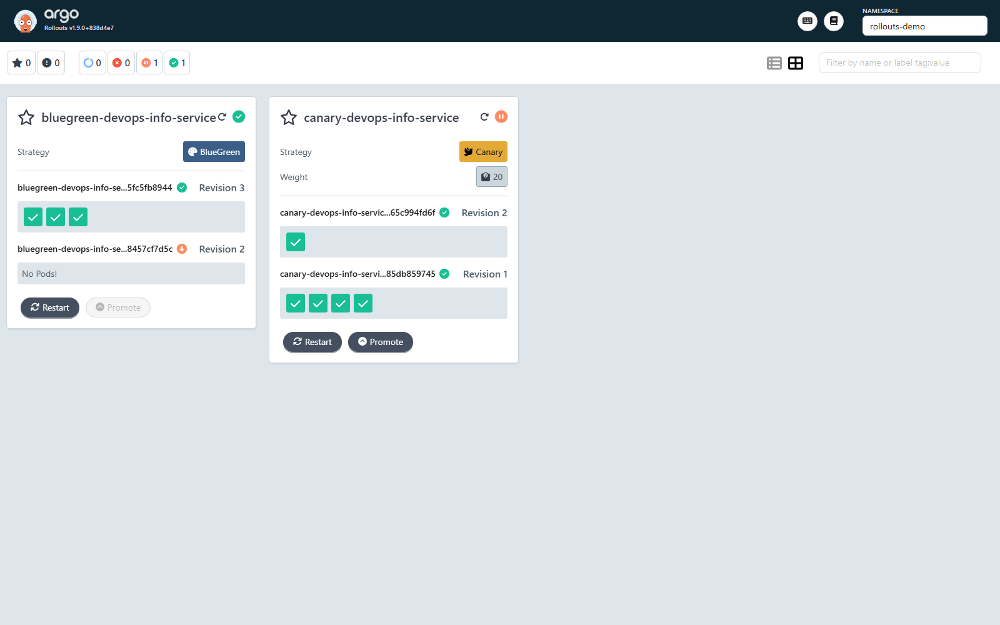
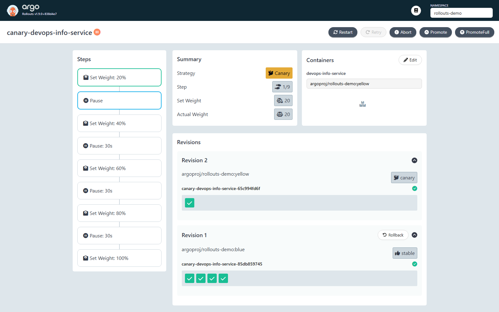
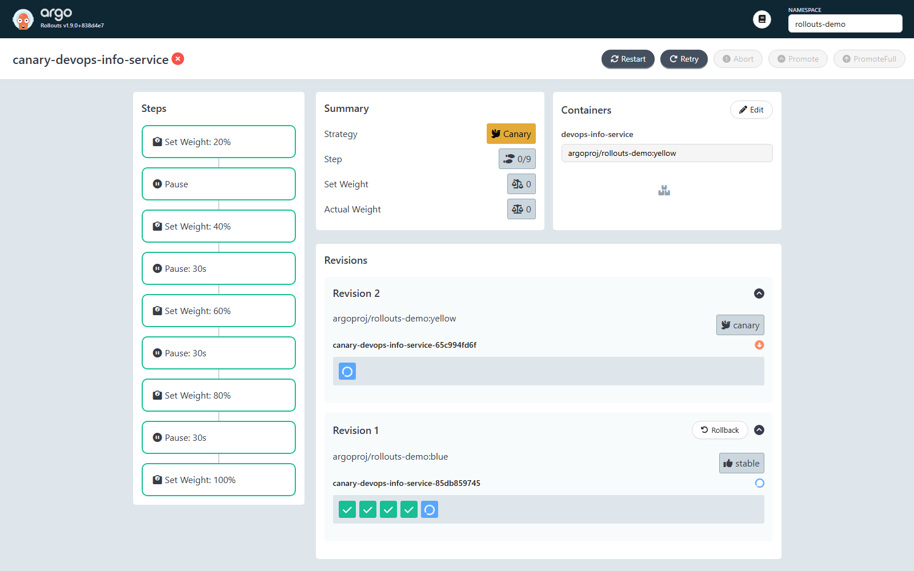
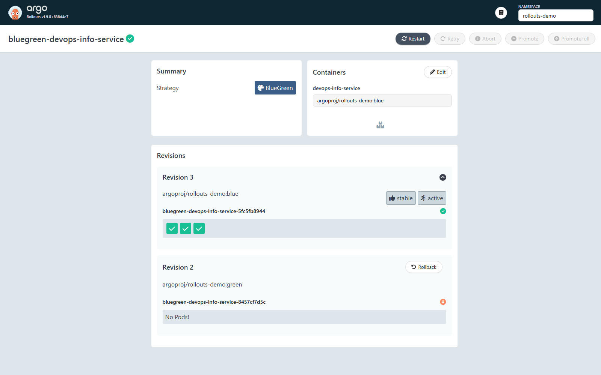

## Argo Rollouts Setup

### Installation verification

Controller and Dashboard are installed from the upstream manifests
(`v1.9.0` at the time of writing) into the `argo-rollouts` namespace, and
the `kubectl-argo-rollouts` plugin is dropped into `~/.local/bin`:

```bash
kubectl create namespace argo-rollouts
kubectl apply -n argo-rollouts \
  -f https://github.com/argoproj/argo-rollouts/releases/latest/download/install.yaml
kubectl apply -n argo-rollouts \
  -f https://github.com/argoproj/argo-rollouts/releases/latest/download/dashboard-install.yaml

curl.exe -sL -o "$env:USERPROFILE\.local\bin\kubectl-argo-rollouts.exe" \
  https://github.com/argoproj/argo-rollouts/releases/download/v1.9.0/kubectl-argo-rollouts-windows-amd64
```

Both controller and dashboard pods are `Running`:

```text
kubectl get pods -n argo-rollouts
NAME                                       READY   STATUS    RESTARTS   AGE
argo-rollouts-54595797c6-gjqzc             1/1     Running   0          36s
argo-rollouts-dashboard-6bfb48b9c5-qlbw9   1/1     Running   0          21s

kubectl argo rollouts version
kubectl-argo-rollouts: v1.9.0+838d4e7
  Platform: windows/amd64
```

The five Rollouts CRDs are registered cluster-wide:

```text
kubectl get crd | findstr argoproj
analysisruns.argoproj.io               2026-04-29T08:29:48Z
analysistemplates.argoproj.io          2026-04-29T08:29:48Z
clusteranalysistemplates.argoproj.io   2026-04-29T08:29:49Z
experiments.argoproj.io                2026-04-29T08:29:49Z
rollouts.argoproj.io                   2026-04-29T08:29:49Z
```

### Dashboard access

```bash
kubectl port-forward -n argo-rollouts svc/argo-rollouts-dashboard 3100:3100
# UI: http://localhost:3100/rollouts/
```

The list view scoped to the demo namespace shows both rollouts side by side:




## Canary Deployment

### Strategy configuration

The chart renders a `Rollout` when
`rollouts.enabled=true`. The canary strategy template renders the steps
verbatim from `values.rollouts.canary.steps`:

```yaml
# k8s/devops-info-service/templates/rollout.yaml (excerpt)
strategy:
  canary:
    steps:
      {{- toYaml .Values.rollouts.canary.steps | nindent 8 }}
```

The values override (`values-canary.yaml`) implements the schedule required by
the lab - 20 % with a manual gate, then 40/60/80 % with 30-second pauses,
finally 100 %:

```yaml
# k8s/devops-info-service/values-canary.yaml (excerpt)
rollouts:
  enabled: true
  strategy: canary
  canary:
    steps:
      - setWeight: 20
      - pause: {}
      - setWeight: 40
      - pause: { duration: 30s }
      - setWeight: 60
      - pause: { duration: 30s }
      - setWeight: 80
      - pause: { duration: 30s }
      - setWeight: 100
```

Install:

```bash
helm install canary k8s/devops-info-service -n rollouts-demo \
  -f k8s/devops-info-service/values.yaml \
  -f k8s/devops-info-service/values-canary.yaml --no-hooks
```

### Step-by-step rollout progression

A new image (`argoproj/rollouts-demo:yellow`) is pushed onto the running
release. The controller starts revision 2 and pauses at step 1 (20 %):

```text
kubectl argo rollouts set image canary-devops-info-service \
    -n rollouts-demo devops-info-service=argoproj/rollouts-demo:yellow

kubectl argo rollouts get rollout canary-devops-info-service -n rollouts-demo
Status:        ॥ Paused          Message: CanaryPauseStep
Strategy:      Canary             Step: 1/9   SetWeight: 20   ActualWeight: 20
Images:        argoproj/rollouts-demo:blue (stable)
               argoproj/rollouts-demo:yellow (canary)
Replicas:      Desired:5  Current:5  Updated:1  Ready:5  Available:5
```

Dashboard view at the same moment - one yellow canary pod alongside four
stable blue pods, the `Pause` step highlighted in the steps panel:



### Promotion and abort demonstration

Manually unblocking the first gate lets the timed steps run automatically
through 40 -> 60 -> 80 -> 100 %, finishing as **Healthy** with `yellow` as the
new stable image:

```text
kubectl argo rollouts promote canary-devops-info-service -n rollouts-demo
rollout 'canary-devops-info-service' promoted

kubectl argo rollouts status canary-devops-info-service -n rollouts-demo --timeout 240s
Paused - CanaryPauseStep
Progressing - more replicas need to be updated
Progressing - updated replicas are still becoming available
Progressing - waiting for all steps to complete
Healthy

kubectl argo rollouts get rollout canary-devops-info-service -n rollouts-demo
Status:    ✔ Healthy
Step: 9/9  SetWeight: 100  ActualWeight: 100
Images:    argoproj/rollouts-demo:yellow (stable)
```

Aborting another rollout in mid-progression (yellow -> red) immediately scales
the canary ReplicaSet to zero and routes 100 % of traffic back to the stable
yellow ReplicaSet:

```text
kubectl argo rollouts set image canary-devops-info-service \
    -n rollouts-demo devops-info-service=argoproj/rollouts-demo:red
kubectl argo rollouts abort canary-devops-info-service -n rollouts-demo
rollout 'canary-devops-info-service' aborted

kubectl argo rollouts get rollout canary-devops-info-service -n rollouts-demo
Status:    ✖ Degraded     Message: RolloutAborted: Rollout aborted update to revision 3
Step: 0/9  SetWeight: 0    ActualWeight: 0
Images:    argoproj/rollouts-demo:yellow (stable)
revision:3  ReplicaSet  • ScaledDown
revision:2  ReplicaSet  ✔ Healthy   stable (5 pods Running)
```

The dashboard shows the canary revision scaled down with a red status badge
and the stable revision still serving all five pods:



## Blue-Green Deployment

### Strategy configuration

The same Rollout template switches to the `blueGreen` block when
`rollouts.strategy=blueGreen`. The chart also renders a second Service
(`*-preview`) with the same selector, exposed in
`templates/service-preview.yaml`:

```yaml
# k8s/devops-info-service/templates/rollout.yaml (excerpt)
strategy:
  blueGreen:
    activeService:  {{ include "devops-info-service.fullname" . }}
    previewService: {{ include "devops-info-service.fullname" . }}-preview
    autoPromotionEnabled: {{ .Values.rollouts.blueGreen.autoPromotionEnabled }}
    scaleDownDelaySeconds: {{ .Values.rollouts.blueGreen.scaleDownDelaySeconds }}
```

```yaml
# k8s/devops-info-service/values-bluegreen.yaml (excerpt)
rollouts:
  enabled: true
  strategy: blueGreen
  blueGreen:
    autoPromotionEnabled: false
    scaleDownDelaySeconds: 30
```

Install:

```bash
helm install bluegreen k8s/devops-info-service -n rollouts-demo \
  -f k8s/devops-info-service/values.yaml \
  -f k8s/devops-info-service/values-bluegreen.yaml --no-hooks
```

### Preview vs active service

After installation both services exist; selectors are managed by the
controller via the rollout-pod-template-hash label:

```text
kubectl get svc -n rollouts-demo
NAME                                    TYPE        CLUSTER-IP      PORT(S)
bluegreen-devops-info-service           ClusterIP   10.96.58.76     80/TCP   # active
bluegreen-devops-info-service-preview   ClusterIP   10.96.180.181   80/TCP   # preview
```

Pushing a new image (`argoproj/rollouts-demo:green`) creates a second
ReplicaSet at full size; the active service still routes only to blue while
preview already serves green:

```text
kubectl argo rollouts set image bluegreen-devops-info-service \
    -n rollouts-demo devops-info-service=argoproj/rollouts-demo:green

kubectl argo rollouts get rollout bluegreen-devops-info-service -n rollouts-demo
Status:   ॥ Paused        Message: BlueGreenPause
Strategy: BlueGreen
Images:   argoproj/rollouts-demo:blue  (stable, active)
          argoproj/rollouts-demo:green (preview)
Replicas: Desired:3  Current:6  Updated:3  Ready:3  Available:3
```

Hitting the two services concurrently confirms the split:

```text
curl -s http://localhost:18080/color   # active
"blue"
curl -s http://localhost:18081/color   # preview
"green"
```

### Promotion process

Manual promotion patches the active service selector to the green
ReplicaSet, which is an instantaneous Kubernetes endpoint update; the old
blue ReplicaSet is kept around for `scaleDownDelaySeconds` (30 s) to allow a
fast rollback:

```text
kubectl argo rollouts promote bluegreen-devops-info-service -n rollouts-demo
rollout 'bluegreen-devops-info-service' promoted

curl -s http://localhost:18080/color   # active after promote
"green"

kubectl argo rollouts get rollout bluegreen-devops-info-service -n rollouts-demo
Status:   ✔ Healthy
Strategy: BlueGreen
Images:   argoproj/rollouts-demo:green (stable, active)
revision:2 ReplicaSet ✔ Healthy   stable, active   (3 pods Running)
revision:1 ReplicaSet ✔ Healthy   (kept for scaleDownDelaySeconds)
```

Rolling back to revision 1 produces a new revision (`undo`) and pauses
again; promoting it flips the active service back to blue just as quickly:

```text
kubectl argo rollouts undo    bluegreen-devops-info-service -n rollouts-demo
kubectl argo rollouts promote bluegreen-devops-info-service -n rollouts-demo
curl -s http://localhost:18080/color
"blue"
```

Dashboard view of the rollout after promotion (Revision 3 = active blue,
Revision 2 = scaled-down green):



## Strategy Comparison

| Aspect                | Canary                                            | Blue-Green                                      |
|-----------------------|---------------------------------------------------|-------------------------------------------------|
| Traffic shift         | Gradual, percentage-based                         | Instant cut-over via service selector           |
| Resource footprint    | stable + 1 surge pod                              | 2 * pods until `scaleDownDelaySeconds` elapses  |
| Blast radius          | Limited to the current weight (e.g. 20 %)         | All-or-nothing                                  |
| Pre-prod validation   | Real production traffic on a small slice          | Full preview Service with no production traffic |
| Rollback speed        | Fast (re-routing) but staged                      | Instant (single selector flip)                  |
| Suitable for          | High-traffic stateless APIs, feature gating       | Stateful or version-incompatible upgrades       |
| Not ideal for         | Database/protocol breaking changes                | Resource-constrained clusters                   |

**When to use canary**
- Front-end or API services where partial exposure is acceptable.
- When metrics (latency, error rate) need to drive promotion - pairs naturally with
  `AnalysisTemplate`.
- When 2* capacity is not affordable.

**When to use blue-green**
- Schema/contract changes where mixing two versions on the same service would
  be unsafe.
- Releases that must be validated as a whole on the preview Service before any
  user sees them.
- Hot-fix scenarios where instant rollback is more important than cost.

**Recommendation for this project.** `devops-info-service` is a stateless
HTTP API, so the **canary** strategy is the default - it gives a small blast
radius and natural metric-driven promotion. The **blue-green** values file is
kept available for releases that change request/response contracts or
dependencies (for example, a major framework upgrade) where mixed-version
traffic would be problematic.