# Lab 14 — Progressive Delivery with Argo Rollouts

# Task 1 — Argo Rollouts Fundamentals

## 1.1 Controller installation and verification

Argo Rollouts was installed into the `argo-rollouts` namespace:

```bash
kubectl create namespace argo-rollouts

kubectl apply -n argo-rollouts \
  -f https://github.com/argoproj/argo-rollouts/releases/latest/download/install.yaml
```

The controller was verified with:

```bash
kubectl get all -n argo-rollouts
```

Actual output:

```text
NAME                                          READY   STATUS    RESTARTS
pod/argo-rollouts-5f64f8d68-hbp28             1/1     Running   0
pod/argo-rollouts-dashboard-755bbc64c-f4c5p   1/1     Running   0

NAME                              TYPE        CLUSTER-IP      PORT(S)
service/argo-rollouts-dashboard   ClusterIP   10.103.212.67   3100/TCP
service/argo-rollouts-metrics     ClusterIP   10.106.116.2    8090/TCP

NAME                                      READY   UP-TO-DATE   AVAILABLE
deployment.apps/argo-rollouts             1/1     1            1
deployment.apps/argo-rollouts-dashboard   1/1     1            1
```

The controller was running successfully:

```text
quay.io/argoproj/argo-rollouts:v1.9.0
```

## 1.2 Kubectl plugin

The kubectl plugin was installed with Homebrew:

```bash
brew install argoproj/tap/kubectl-argo-rollouts
```

Verification:

```bash
kubectl argo rollouts version
```

Actual output:

```text
kubectl-argo-rollouts: v1.8.3+49fa151
BuildDate: 2025-06-04T22:19:21Z
Platform: darwin/amd64
```

## 1.3 Dashboard access

The dashboard was installed with:

```bash
kubectl apply -n argo-rollouts \
  -f https://github.com/argoproj/argo-rollouts/releases/latest/download/dashboard-install.yaml
```

It was accessed through port-forwarding:

```bash
kubectl port-forward svc/argo-rollouts-dashboard -n argo-rollouts 3100:3100
```

Dashboard URL:

```text
http://localhost:3100/rollouts
```

The dashboard was used to observe rollouts in:

```text
dev
prod
```

Dev namespace with Canary rollout:

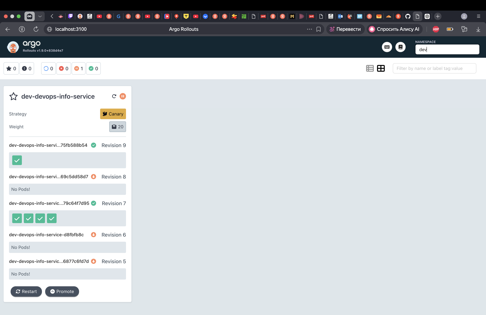

Prod namespace with Blue-Green rollout:

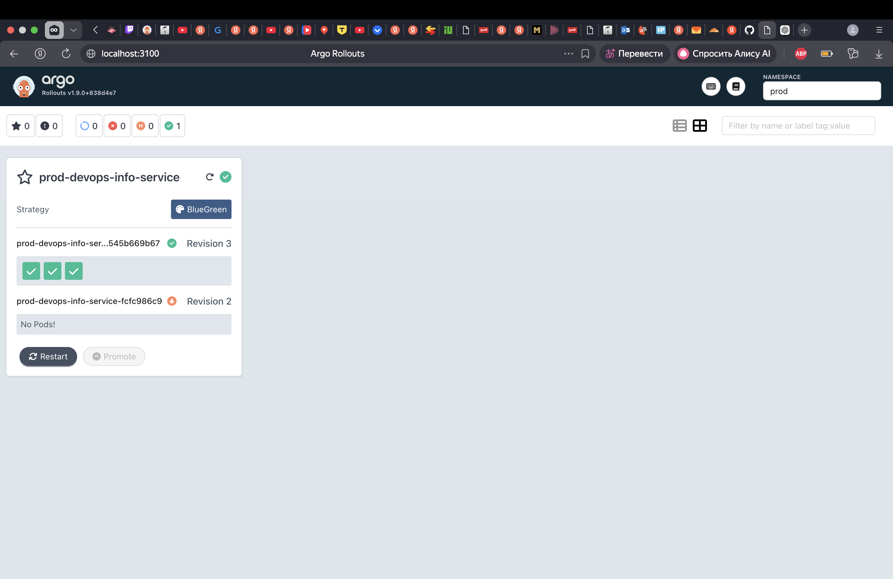

## 1.4 Rollout vs Deployment

The original chart used a standard Kubernetes Deployment:

```yaml
apiVersion: apps/v1
kind: Deployment
```

It was replaced with an Argo Rollouts resource:

```yaml
apiVersion: argoproj.io/v1alpha1
kind: Rollout
```

The existing Deployment template was kept but disabled:

```yaml
deployment:
  enabled: false
```

The Rollout was enabled:

```yaml
rollout:
  enabled: true
```

Main differences:

| Feature | Deployment | Rollout |
|---|---|---|
| Basic rolling update | Yes | Yes |
| Canary deployment | No | Yes |
| Blue-green deployment | No | Yes |
| Manual promotion | No | Yes |
| Abort rollout | Limited | Yes |
| Preview service | No | Yes |
| Automated analysis | No | Yes |
| Auto rollback on failed analysis | No | Yes |

---

# Task 2 — Canary Deployment

## 2.1 Canary strategy configuration

Canary deployment was configured for the `dev` environment.

File:

```text
k8s/devops-info-service/values-dev.yaml
```

Relevant values:

```yaml
replicaCount: 5

deployment:
  enabled: false

rollout:
  enabled: true
  strategy: canary
  revisionHistoryLimit: 3

  analysis:
    enabled: true
    interval: 10s
    count: 3
    failureLimit: 1
    timeoutSeconds: 5
    expectedStatus: "healthy"
```

Five replicas were used so that canary weights are visible:

```text
20% = 1 pod
40% = 2 pods
60% = 3 pods
80% = 4 pods
100% = 5 pods
```

The canary strategy in `rollout.yaml`:

```yaml
strategy:
  canary:
    steps:
      - setWeight: 20
      - pause: {}
      - analysis:
          templates:
            - templateName: {{ include "devops-info-service.fullname" . }}-health-check
      - setWeight: 40
      - pause:
          duration: 30s
      - setWeight: 60
      - pause:
          duration: 30s
      - setWeight: 80
      - pause:
          duration: 30s
      - setWeight: 100
```

The first pause is manual. The next pauses are automatic 30-second pauses.

## 2.2 Initial deployment

The `dev` environment was installed with:

```bash
helm upgrade --install dev ./k8s/devops-info-service \
  -n dev \
  --create-namespace \
  -f k8s/devops-info-service/values-dev.yaml
```

Rollout verification:

```bash
kubectl argo rollouts get rollout dev-devops-info-service -n dev
```

Actual output:

```text
Name:            dev-devops-info-service
Namespace:       dev
Status:          ✔ Healthy
Strategy:        Canary
Step:            10/10
SetWeight:       100
ActualWeight:    100

Replicas:
  Desired:       5
  Current:       5
  Updated:       5
  Ready:         5
  Available:     5
```

Pods:

```bash
kubectl get pods -n dev
```

Actual output:

```text
NAME                                      READY   STATUS
dev-devops-info-service-575d97688-78txm   1/1     Running
dev-devops-info-service-575d97688-ddlsm   1/1     Running
dev-devops-info-service-575d97688-gm4hj   1/1     Running
dev-devops-info-service-575d97688-ngb8w   1/1     Running
dev-devops-info-service-575d97688-scjvz   1/1     Running
```

## 2.3 Traffic shifting and manual promotion

A canary rollout was triggered by changing `RELEASE_VERSION`:

```bash
helm upgrade --install dev ./k8s/devops-info-service \
  -n dev \
  -f k8s/devops-info-service/values-dev.yaml \
  --set env.RELEASE_VERSION=lab14-canary-v2
```

The rollout was watched with:

```bash
kubectl argo rollouts get rollout dev-devops-info-service -n dev -w
```

### Evidence — Canary 20% Pause

At the first canary step, the rollout paused at 20%. One pod was running the canary revision and four pods remained stable.

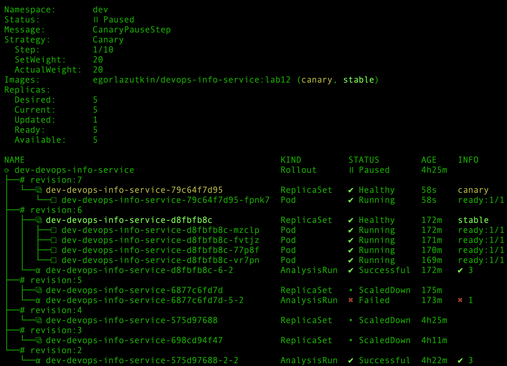

### Evidence — Canary 40% Progress

After manual promotion and successful analysis, the rollout continued to 40%. Two pods were running the canary revision.

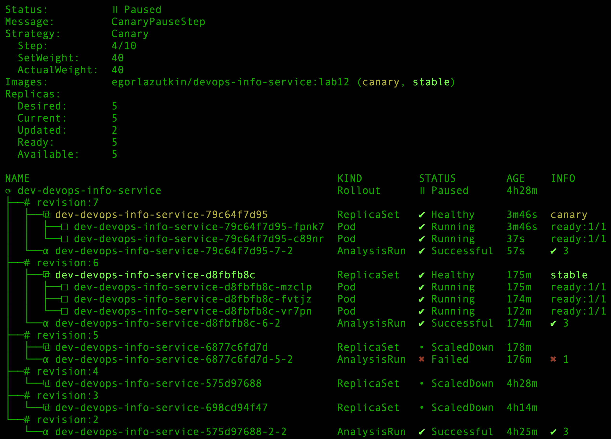

### Evidence — Canary 80% Progress

The rollout later reached 80%. Four pods were running the canary revision, while one pod remained stable.

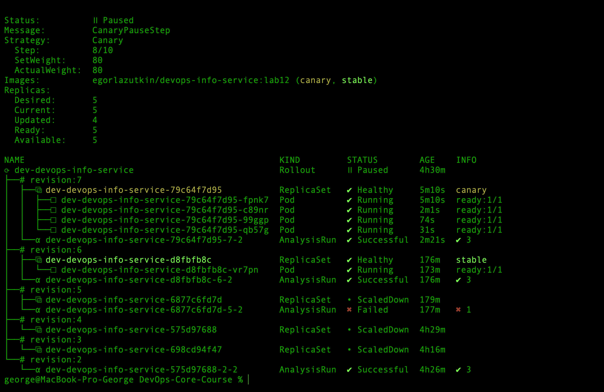

### Evidence — Canary Completed

After the rollout reached 100%, revision 7 became the stable ReplicaSet. All 5 pods were updated and ready.

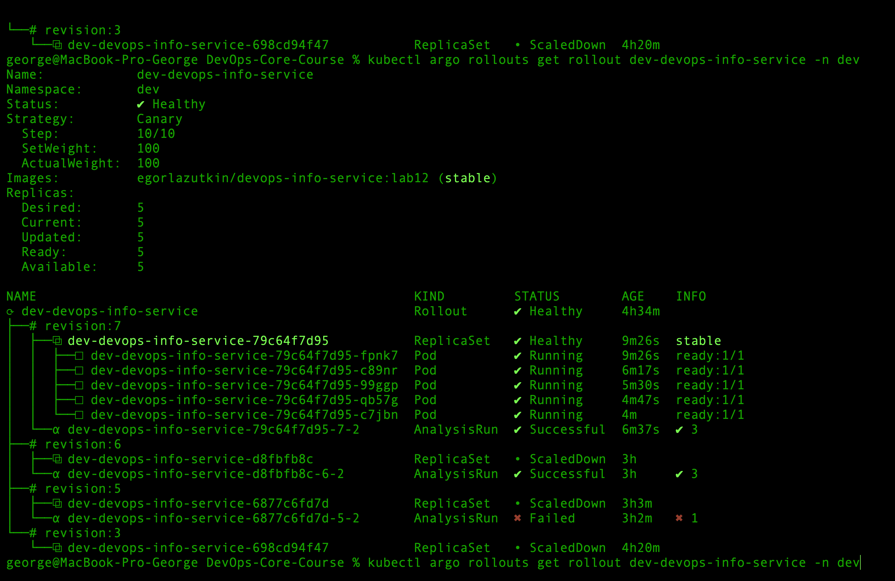

## 2.4 Abort and rollback test

A new canary rollout was started for abort testing:

```bash
helm upgrade --install dev ./k8s/devops-info-service \
  -n dev \
  -f k8s/devops-info-service/values-dev.yaml \
  --set env.RELEASE_VERSION=lab14-canary-abort-test
```

After aborting the rollout, the canary ReplicaSet was scaled down and traffic returned to the previous stable revision.

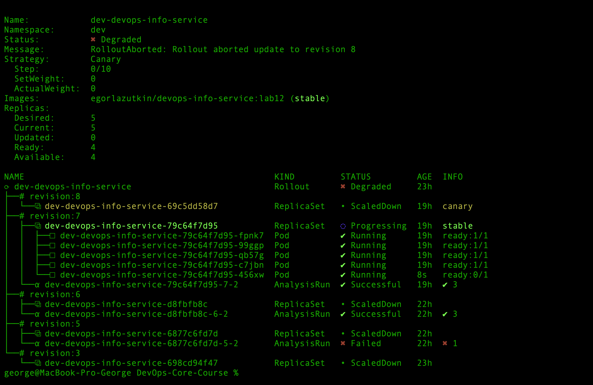


The release was restored with Helm rollback:

```bash
helm history dev -n dev
helm rollback dev 2 -n dev
```

Final state:

```text
Status:          ✔ Healthy
Step:            10/10
SetWeight:       100
ActualWeight:    100
Ready:           5
Available:       5
```

---

# Task 3 — Blue-Green Deployment

## 3.1 Blue-green strategy configuration

Blue-green deployment was configured for the `prod` environment.

File:

```text
k8s/devops-info-service/values-prod.yaml
```

Relevant values:

```yaml
replicaCount: 3

deployment:
  enabled: false

rollout:
  enabled: true
  strategy: blueGreen
  revisionHistoryLimit: 3

  blueGreen:
    autoPromotionEnabled: false
    scaleDownDelaySeconds: 30

previewService:
  type: ClusterIP
  port: 80
  targetPort: 5000
```

The blue-green strategy in `rollout.yaml`:

```yaml
strategy:
  blueGreen:
    activeService: {{ include "devops-info-service.fullname" . }}
    previewService: {{ include "devops-info-service.fullname" . }}-preview
    autoPromotionEnabled: {{ .Values.rollout.blueGreen.autoPromotionEnabled }}
    scaleDownDelaySeconds: {{ .Values.rollout.blueGreen.scaleDownDelaySeconds }}
```

`autoPromotionEnabled: false` means that the new version is not promoted automatically. It must be tested through the preview service and then promoted manually.

## 3.2 Active and preview services

The active production service:

```text
prod-devops-info-service
```

The preview service:

```text
prod-devops-info-service-preview
```

Service verification:

```bash
kubectl get svc -n prod
```

Actual output:

```text
NAME                               TYPE        CLUSTER-IP       PORT(S)
prod-devops-info-service           NodePort    10.102.132.162   80:30082/TCP
prod-devops-info-service-preview   ClusterIP   10.103.185.108   80/TCP
```

The active service serves production traffic. The preview service exposes the new version before promotion.

## 3.3 Initial blue deployment

The initial blue version was installed with:

```bash
helm upgrade --install prod ./k8s/devops-info-service \
  -n prod \
  --create-namespace \
  -f k8s/devops-info-service/values-prod.yaml
```

Rollout verification:

```bash
kubectl argo rollouts get rollout prod-devops-info-service -n prod
```

Actual output:

```text
Name:            prod-devops-info-service
Namespace:       prod
Status:          ✔ Healthy
Strategy:        BlueGreen
Images:          egorlazutkin/devops-info-service:lab12 (stable, active)

Replicas:
  Desired:       3
  Current:       3
  Updated:       3
  Ready:         3
  Available:     3

revision:1 ReplicaSet stable,active
```

## 3.4 Green deployment and preview testing

A green version was deployed:

```bash
helm upgrade --install prod ./k8s/devops-info-service \
  -n prod \
  -f k8s/devops-info-service/values-prod.yaml \
  --set env.RELEASE_VERSION=lab14-bluegreen-green
```

The rollout paused because promotion was manual:

```text
Status:          ॥ Paused
Message:         BlueGreenPause
Strategy:        BlueGreen

Replicas:
  Desired:       3
  Current:       6
  Updated:       3
  Ready:         3
  Available:     3

revision:2 ReplicaSet Healthy preview
revision:1 ReplicaSet Healthy stable,active
```

### Evidence — Blue-Green Preview

The new revision was deployed as preview, while the previous revision continued serving production traffic as stable and active.

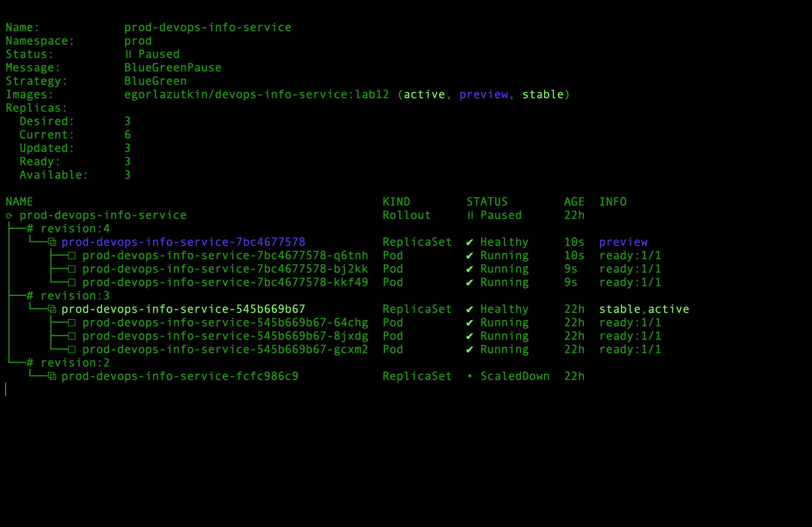

Active service was exposed locally:

```bash
kubectl port-forward svc/prod-devops-info-service -n prod 8080:80
```

Preview service was exposed locally:

```bash
kubectl port-forward svc/prod-devops-info-service-preview -n prod 8081:80
```

Active service check:

```bash
curl -s http://localhost:8080/ | python3 -m json.tool | grep version
```

Actual output:

```text
"version": "lab12-prod",
```

Preview service check:

```bash
curl -s http://localhost:8081/ | python3 -m json.tool | grep version
```

Actual output:

```text
"version": "lab14-bluegreen-green",
```

### Evidence — Active vs Preview Services

The active service still served the old production version, while the preview service exposed the new green version.

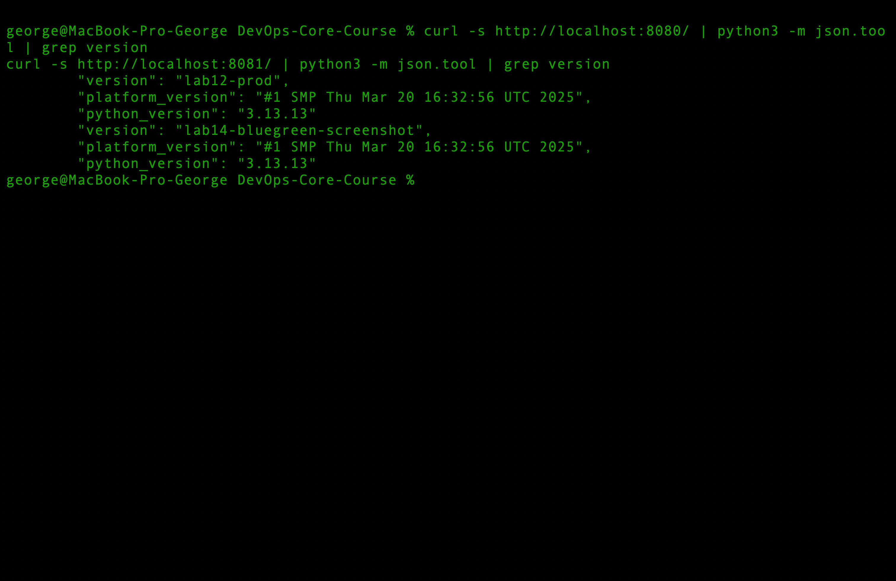

This confirms that the active service continued serving the old version, while the preview service exposed the new version.

## 3.5 Promotion to active

The green version was promoted manually:

```bash
kubectl argo rollouts promote prod-devops-info-service -n prod
```

Rollout state after promotion:

```text
Status:          ✔ Healthy
Strategy:        BlueGreen

revision:4 ReplicaSet Healthy stable,active
revision:3 ReplicaSet Healthy delay:25s
```

After the configured scale-down delay, the old ReplicaSet was scaled down.

### Evidence — Green Promoted to Active

After manual promotion, the green revision became stable and active. The previous revision stayed temporarily during the scale-down delay.

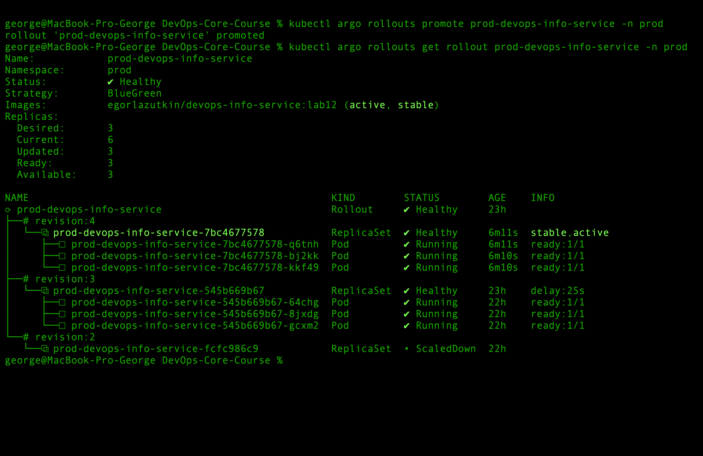

## 3.6 Instant rollback verification

Rollback was verified by returning the application configuration back to the previous version.

Final state after rollback:

```text
Name:            prod-devops-info-service
Namespace:       prod
Status:          ✔ Healthy
Strategy:        BlueGreen

revision:3 ReplicaSet Healthy stable,active
revision:2 ReplicaSet ScaledDown
```

Actual pods:

```text
prod-devops-info-service-545b669b67-64chg   1/1 Running
prod-devops-info-service-545b669b67-8jxdg   1/1 Running
prod-devops-info-service-545b669b67-gcxm2   1/1 Running
```

Active service check after rollback:

```bash
curl -s http://localhost:8080/ | python3 -m json.tool | grep version
```

Actual output:

```text
"version": "lab12-prod",
```

This confirms that traffic was switched back to the previous version.

### Evidence — Blue-Green Rollback

After rollback, the previous production version became stable and active again. The newer revision stayed temporarily during the scale-down delay.

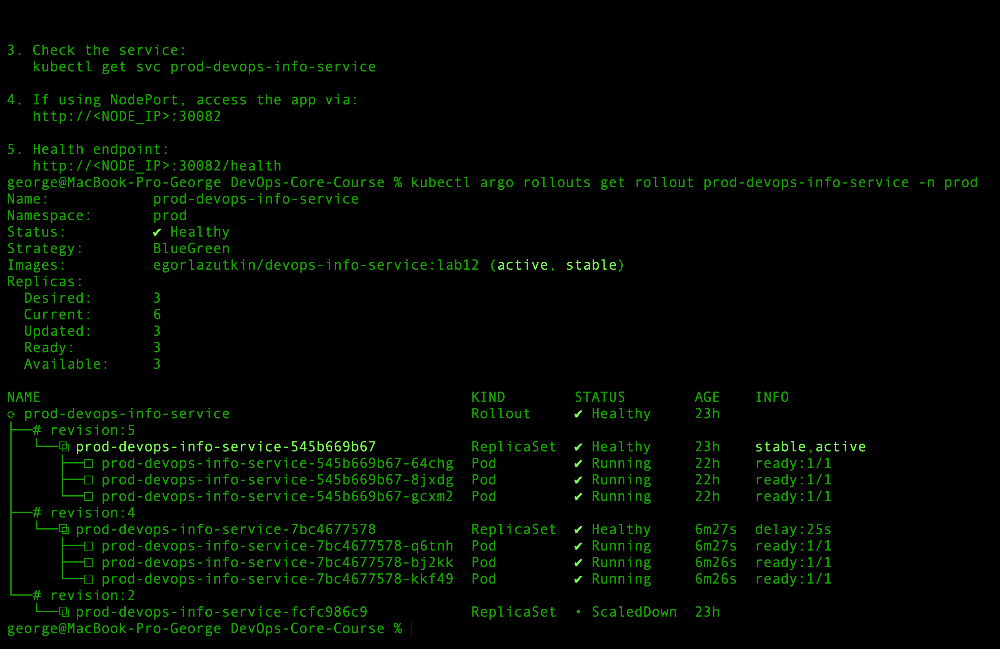

The active service returned the production version after rollback:

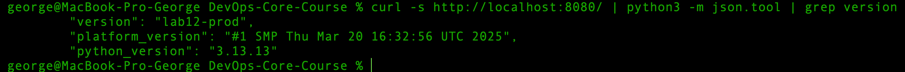

---

## 4.2 Canary vs Blue-Green

| Criteria | Canary | Blue-Green |
|---|---|---|
| Release style | Gradual | Instant switch |
| Traffic exposure | 20%, 40%, 60%, 80%, 100% | Active or preview |
| Manual promotion | Yes | Yes |
| Preview environment | No separate preview service | Yes |
| Rollback speed | Gradual/abort-based | Very fast service switch |
| Resource usage | Lower | Higher, because both versions run |
| Best for | Risk-controlled gradual rollout | Fast switch and fast rollback |

## 4.3 When to use canary

Canary is recommended when:

- the new version should be released gradually
- production risk should be reduced
- the team wants to observe behavior before full rollout
- automated analysis is available
- only a small portion of traffic should see the new version first

Pros:

```
[+] Gradual exposure
[+] Lower risk
[+] Works well with metrics and automated analysis
[+] Bad releases can be stopped early
```

Cons:

```text
[-] Slower than blue-green
[-] More complex rollout process
[-] Users may temporarily hit different versions
[-] Without ingress/service mesh, traffic percentages are approximated by pod scaling
```

## 4.4 When to use blue-green

Blue-green is recommended when:

- the new version must be tested before production traffic
- instant switch is needed
- instant rollback is important
- enough resources are available to run two versions at once
- the application is stateless or supports parallel versions safely

Pros:

```text
[+] Preview environment before promotion
[+] Fast promotion
[+] Fast rollback
[+] Production users do not see mixed versions before promotion
```

Cons:

```text
[-] Requires more resources
[-] Both versions run at the same time
[-] Database migrations must be backward compatible
[-] Service selector ownership must be handled carefully with Helm
```

## 4.5 Recommendation for this project

For this project:

```text
dev  -> canary
prod -> blue-green
```

Canary is useful in `dev` because it demonstrates step-based progressive delivery and integrates with the `/health` analysis.

Blue-green is useful in `prod` because it provides a preview environment and fast rollback.

For high-risk production releases, canary with automated analysis is preferable. For simple stateless production releases where fast rollback matters most, blue-green is preferable.

---

# Bonus — Automated Analysis

## 1. AnalysisTemplate

The bonus task was implemented with an `AnalysisTemplate`.

File:

```text
k8s/devops-info-service/templates/analysis-template.yaml
```

The application health endpoint is:

```text
/health
```

It returns:

```json
{
  "status": "healthy"
}
```

The AnalysisTemplate uses the Web provider:

```yaml
apiVersion: argoproj.io/v1alpha1
kind: AnalysisTemplate
metadata:
  name: {{ include "devops-info-service.fullname" . }}-health-check
spec:
  metrics:
    - name: web-health-check
      interval: {{ .Values.rollout.analysis.interval }}
      count: {{ .Values.rollout.analysis.count }}
      failureLimit: {{ .Values.rollout.analysis.failureLimit }}
      successCondition: result == {{ .Values.rollout.analysis.expectedStatus | quote }}
      provider:
        web:
          url: http://{{ include "devops-info-service.fullname" . }}.{{ .Release.Namespace }}.svc.cluster.local{{ .Values.readinessProbe.path }}
          timeoutSeconds: {{ .Values.rollout.analysis.timeoutSeconds }}
          jsonPath: "{$.status}"
```

The normal expected status in `values-dev.yaml`:

```yaml
rollout:
  analysis:
    enabled: true
    interval: 10s
    count: 3
    failureLimit: 1
    timeoutSeconds: 5
    expectedStatus: "healthy"
```

Rendered condition was verified:

```bash
helm template dev ./k8s/devops-info-service \
  -n dev \
  -f k8s/devops-info-service/values-dev.yaml | grep -n "successCondition"
```

Actual output:

```text
108:      successCondition: result == "healthy"
```

## 2. Successful analysis

During the successful canary rollout:

```bash
kubectl get analysisruns -n dev
```

Actual output:

```text
NAME                                    STATUS
dev-devops-info-service-575d97688-2-2   Successful
```

Detailed result:

```text
Name: web-health-check
Count: 3
Failure Limit: 1
Interval: 10s
URL: http://dev-devops-info-service.dev.svc.cluster.local/health
Success Condition: result == "healthy"

Measurements:
  Value: "healthy"
  Phase: Successful

Consecutive Success: 3
Successful: 3
Phase: Successful
```

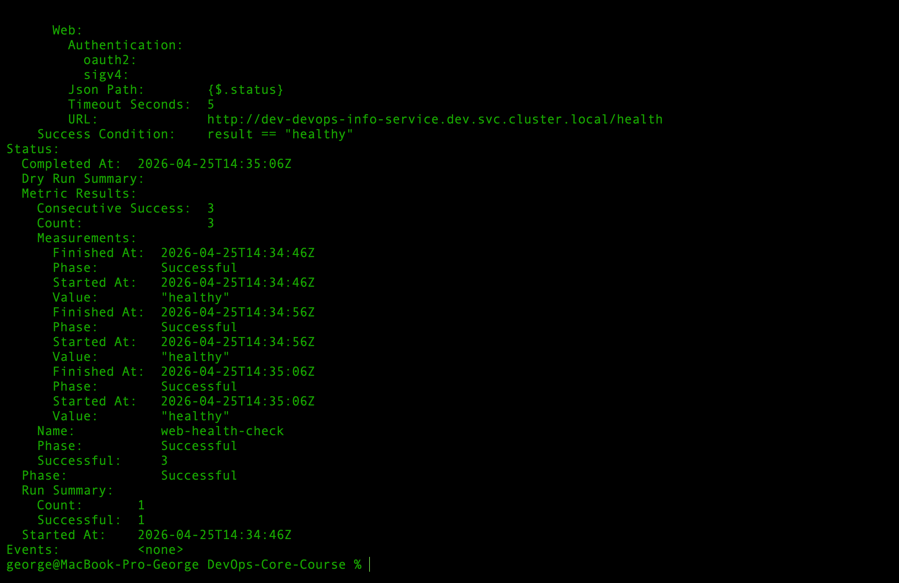

## 3. Intentional failure and auto-rollback

To test automatic rollback, the expected status was intentionally changed to `ok`:

```bash
helm upgrade --install dev ./k8s/devops-info-service \
  -n dev \
  -f k8s/devops-info-service/values-dev.yaml \
  --set env.RELEASE_VERSION=lab14-analysis-fail \
  --set rollout.analysis.expectedStatus=ok \
  --set rollout.analysis.failureLimit=0
```

The rollout paused at 20%:

```text
Status:          ॥ Paused
Message:         CanaryPauseStep
Step:            1/10
SetWeight:       20
ActualWeight:    20

revision:5 canary
revision:4 stable
```

It was promoted to start analysis:

```bash
kubectl argo rollouts promote dev-devops-info-service -n dev
```

The failed AnalysisRun:

```text
Name: dev-devops-info-service-6877c6fd7d-5-2
Status: Failed

Failure Limit: 0
Success Condition: result == "ok"
Value: "healthy"
Phase: Failed
```

Events:

```text
Metric 'web-health-check' Completed. Result: Failed
Analysis Completed. Result: Failed
```

Argo Rollouts automatically aborted the rollout:

```text
Status:          ✖ Degraded
Message:         RolloutAborted: Rollout aborted update to revision 5:
                 Step-based analysis phase error/failed:
                 Metric "web-health-check" assessed Failed due to failed (1) > failureLimit (0)

Step:            0/10
SetWeight:       0
ActualWeight:    0
```

The failed canary was scaled down:

```text
revision:5 ReplicaSet ScaledDown canary
AnalysisRun Failed
```

The previous stable version continued running:

```text
revision:4 ReplicaSet Healthy stable
Ready: 5
Available: 5
```

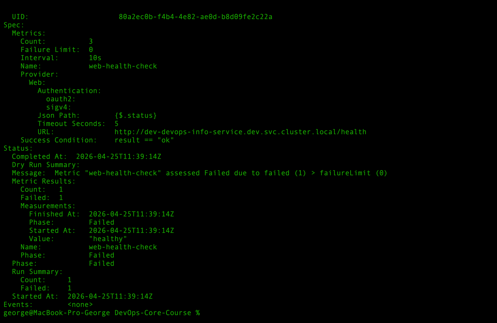

## 4. Recovery after failed analysis

After the failure demonstration, the rollout can be restored with:

```bash
helm upgrade --install dev ./k8s/devops-info-service \
  -n dev \
  -f k8s/devops-info-service/values-dev.yaml \
  --set env.RELEASE_VERSION=lab14-analysis-recovered \
  --set rollout.analysis.expectedStatus=healthy \
  --set rollout.analysis.failureLimit=1
```

Then promote from the manual pause:

```bash
kubectl argo rollouts promote dev-devops-info-service -n dev
```

Expected final state:

```text
Status: Healthy
Ready: 5
Available: 5
Step: 10/10
SetWeight: 100
ActualWeight: 100
```

---

# CLI Commands Reference

## Installation

```bash
kubectl create namespace argo-rollouts

kubectl apply -n argo-rollouts \
  -f https://github.com/argoproj/argo-rollouts/releases/latest/download/install.yaml
```

```bash
brew install argoproj/tap/kubectl-argo-rollouts
kubectl argo rollouts version
```

## Dashboard

```bash
kubectl apply -n argo-rollouts \
  -f https://github.com/argoproj/argo-rollouts/releases/latest/download/dashboard-install.yaml

kubectl port-forward svc/argo-rollouts-dashboard -n argo-rollouts 3100:3100
```

```text
http://localhost:3100/rollouts
```

## Helm validation

```bash
helm lint k8s/devops-info-service
```

```bash
helm template dev ./k8s/devops-info-service \
  -n dev \
  -f k8s/devops-info-service/values-dev.yaml
```

```bash
helm template prod ./k8s/devops-info-service \
  -n prod \
  -f k8s/devops-info-service/values-prod.yaml
```

## Canary

```bash
helm upgrade --install dev ./k8s/devops-info-service \
  -n dev \
  --create-namespace \
  -f k8s/devops-info-service/values-dev.yaml
```

```bash
kubectl argo rollouts get rollout dev-devops-info-service -n dev -w
```

```bash
kubectl argo rollouts promote dev-devops-info-service -n dev
```

```bash
kubectl argo rollouts abort dev-devops-info-service -n dev
```

```bash
helm history dev -n dev
helm rollback dev 2 -n dev
```

## Blue-green

```bash
helm upgrade --install prod ./k8s/devops-info-service \
  -n prod \
  --create-namespace \
  -f k8s/devops-info-service/values-prod.yaml
```

```bash
kubectl argo rollouts get rollout prod-devops-info-service -n prod -w
```

```bash
kubectl port-forward svc/prod-devops-info-service -n prod 8080:80
kubectl port-forward svc/prod-devops-info-service-preview -n prod 8081:80
```

```bash
curl -s http://localhost:8080/ | python3 -m json.tool | grep version
curl -s http://localhost:8081/ | python3 -m json.tool | grep version
```

```bash
kubectl argo rollouts promote prod-devops-info-service -n prod
```

## Analysis

```bash
kubectl get analysisruns -n dev
kubectl describe analysisrun -n dev
```

## Troubleshooting

```bash
kubectl get all -n dev
kubectl get all -n prod
```

```bash
kubectl get events -n dev --sort-by=.lastTimestamp
kubectl get events -n prod --sort-by=.lastTimestamp
```

```bash
kubectl describe pod -n dev <pod-name>
kubectl describe pod -n prod <pod-name>
```
