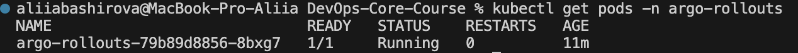
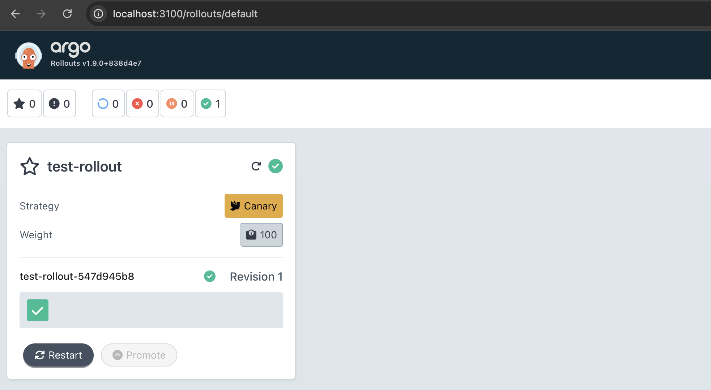
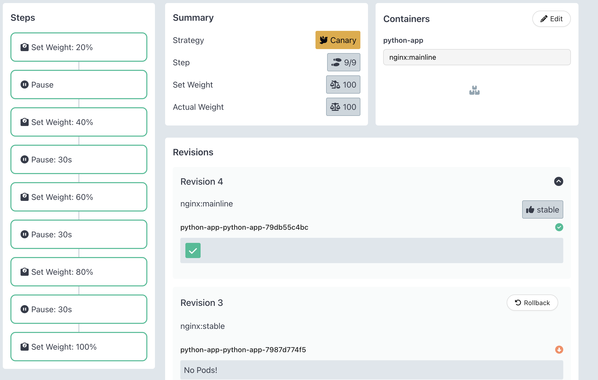
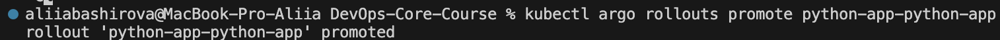
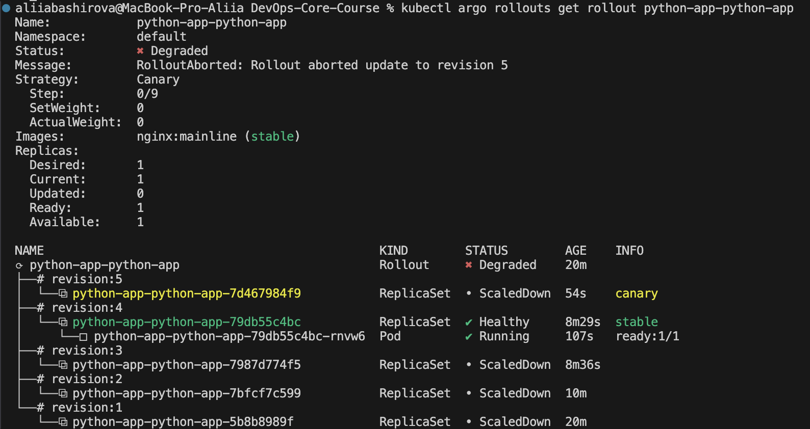
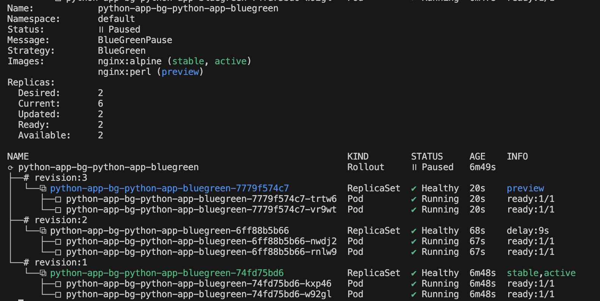
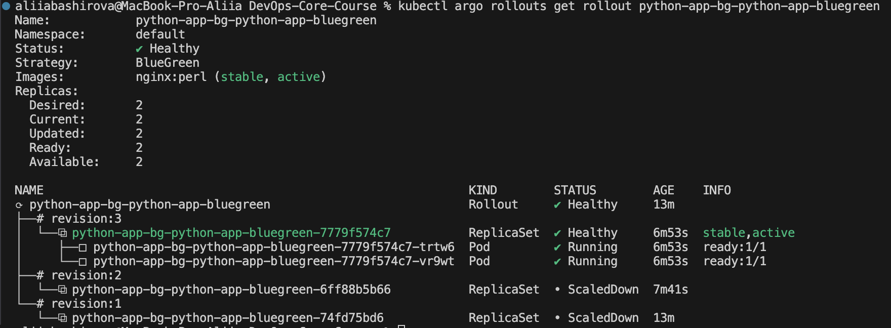

# Lab 14 — Progressive Delivery with Argo Rollouts

## Task 1 — Argo Rollouts Fundamentals

### Installation Verification


### Dashboard Access


### Rollout vs Deployment — Key Differences
| Feature	| Kubernetes Deployment	| Argo Rollout |
| --------- | --------------------- | ------------ |
| Rolling Update	| Yes	| Yes |
| Recreate Strategy	| Yes	| Yes |
| Canary Strategy	| No	| Yes (steps + traffic) |
| Blue-Green Strategy	|  No	| Yes (active/preview) |
| Analysis (metrics)	| No	| Yes |
| Automated Rollback	| No	| Yes |
| Traffic Shifting	| No	| Yes (weights) |

## Task 2 — Canary Deployment

### Canary Strategy Configuration
`values.yaml`:
```yaml
rollout:
  enabled: true
  strategy: canary
  canary:
    steps:
      - setWeight: 20
      - pause: {}
      - setWeight: 40
      - pause: { duration: 30s }
      - setWeight: 60
      - pause: { duration: 30s }
      - setWeight: 80
      - pause: { duration: 30s }
      - setWeight: 100
```

Rollout manifest (`rollout.yaml`):
```yaml
apiVersion: argoproj.io/v1alpha1
kind: Rollout
metadata:
  name: {{ include "python-app.fullname" . }}
  labels:
    {{- include "python-app.labels" . | nindent 4 }}
spec:
  replicas: {{ .Values.replicaCount }}
  selector:
    matchLabels:
      {{- include "python-app.selectorLabels" . | nindent 6 }}
  template:
    metadata:
      labels:
        {{- include "python-app.selectorLabels" . | nindent 8 }}
    spec:
      containers:
      - name: {{ .Chart.Name }}
        image: "{{ .Values.image.repository }}:{{ .Values.image.tag }}"
        imagePullPolicy: {{ .Values.image.pullPolicy }}
        ports:
        - containerPort: {{ .Values.service.targetPort }}
          name: http
        env:
        - name: VERSION
          value: "{{ .Values.image.tag }}"
        resources:
          {{- toYaml .Values.resources | nindent 10 }}
  strategy:
    canary:
      steps:
      - setWeight: 20
      - pause: {}                    # Manual promotion required
      - setWeight: 40
      - pause: { duration: 30s }
      - setWeight: 60
      - pause: { duration: 30s }
      - setWeight: 80
      - pause: { duration: 30s }
      - setWeight: 100
```

### Deployment and Testing
Steps:


Promotion command


Canary in action



## Task 3 — Blue-Green Deployment

### Blue-Green Strategy Configuration
`values-bluegreen.yaml`:
```yaml
replicaCount: 2

image:
  repository: nginx
  tag: alpine
  pullPolicy: IfNotPresent

service:
  type: ClusterIP
  port: 80
  targetPort: 80

resources:
  limits:
    cpu: 100m
    memory: 128Mi
  requests:
    cpu: 50m
    memory: 64Mi

strategy: bluegreen
```

### Services

| Service |	Purpose |
| ------- | ------- |
| python-app-bg-active |	Production traffic (active version) |
| python-app-bg-preview |	New version testing (preview) |

### Before promotion


### After promotion


### Blue-Green vs Canary Comparison
| Aspect |	Canary |	Blue-Green |
| ------ | ------- | ------------- |
| Traffic Shift | 	Gradual (20% → 100%)	| Instant (0% → 100%) |
| Resources	| Single set (shared)	| 2x during deployment |
| Rollback Speed |	Gradual (back through steps)	 | Instant |
| Testing Scope |	Mixed traffic (live)	| Isolated preview environment |
| Risk Profile |	Low (canary first)	| Medium (all-or-nothing) |
| Best For	| Critical apps, metric-based |	Fast rollback, UAT testing |

### Recommended Use Cases
| Scenario |	Strategy |	Why |
| -------- | ----------- | ---- |
| High-risk changes |	Canary |	Limit blast radius |
| Critical revenue apps | Canary	| Gradual validation |
| UI/layout changes |	Blue-Green |	Visual comparison |
| Database migrations	| Blue-Green	| Full testing before cutover |
| Emergency fixes	| Blue-Green	| Instant rollback |