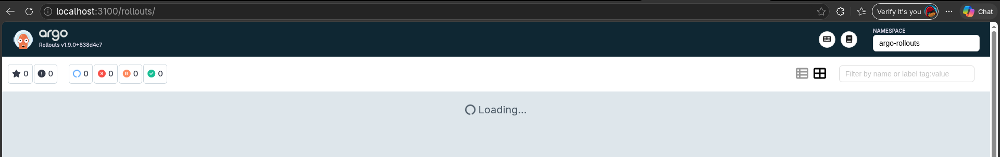
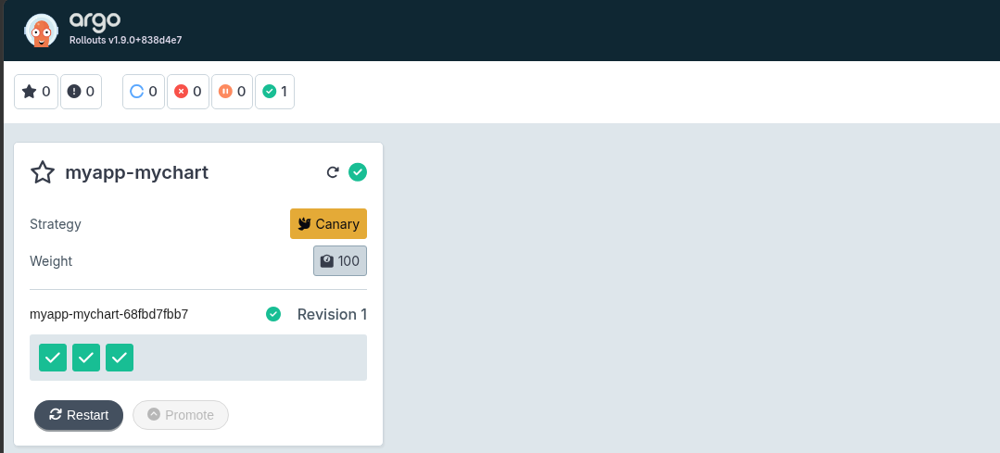
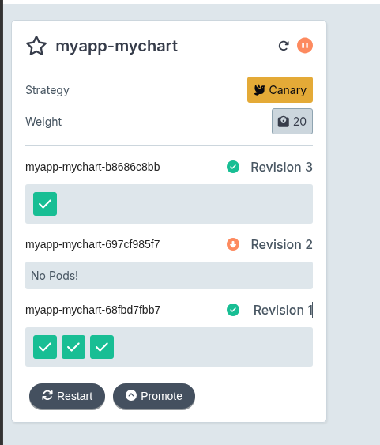
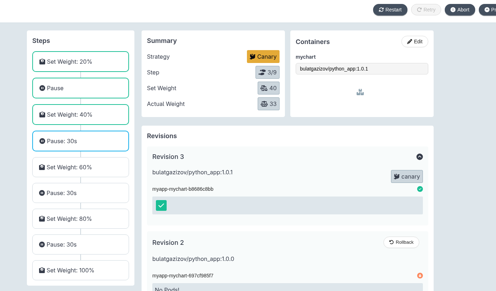
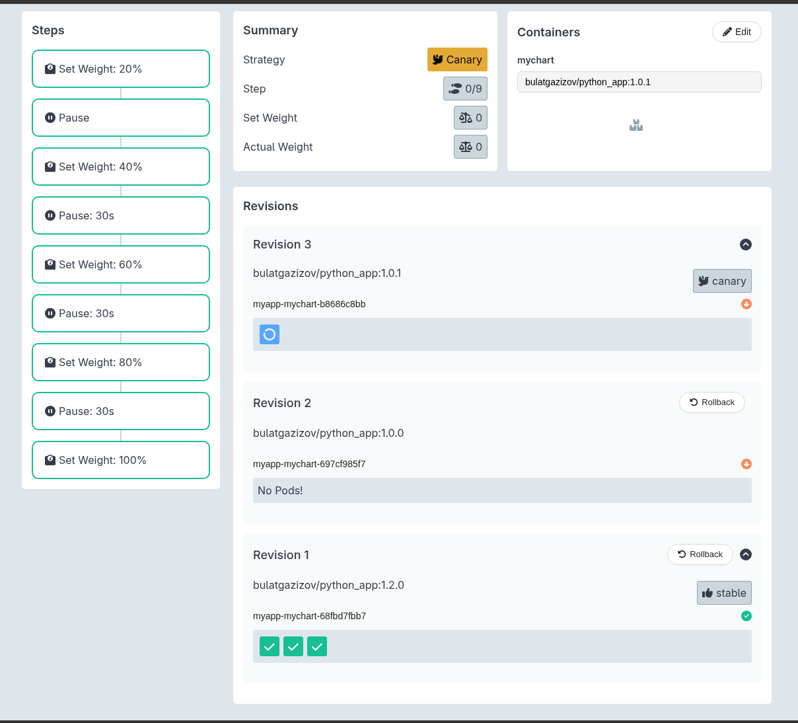
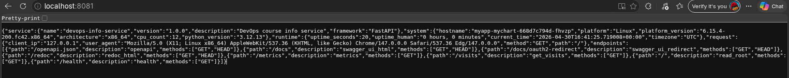
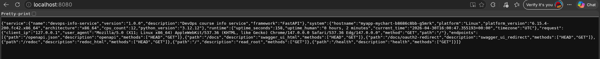
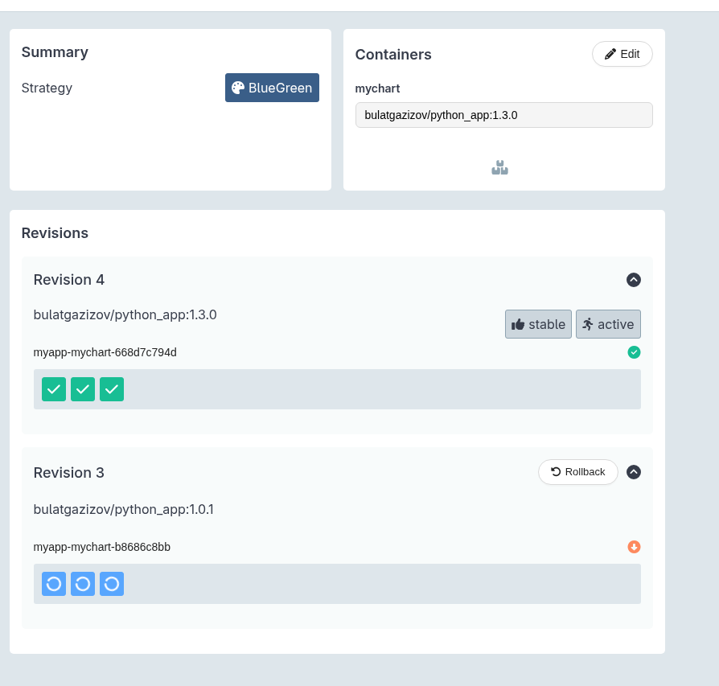
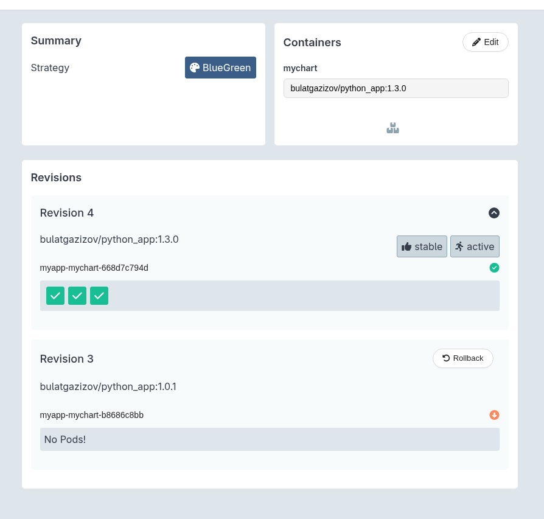

# Lab 14

## Argo Rollouts Setup

### Installation verification

```bash
$ kubectl argo rollouts version
kubectl-argo-rollouts: v1.9.0+838d4e7
  BuildDate: 2026-03-20T21:08:11Z
  GitCommit: 838d4e792be666ec11bd0c80331e0c5511b5010e
  GitTreeState: clean
  GoVersion: go1.24.13
  Compiler: gc
  Platform: linux/amd64
```

### Dashboard access



## Canary Deployment

```bash
helm install myapp ./mychart -n default
NAME: myapp
LAST DEPLOYED: Thu Apr 30 17:47:57 2026
NAMESPACE: default
STATUS: deployed
REVISION: 1
DESCRIPTION: Install complete
TEST SUITE: None
NOTES:
export NODE_PORT=$(kubectl get --namespace default -o jsonpath="{.spec.ports[0].nodePort}" services myapp-mychart)
  export NODE_IP=$(kubectl get nodes --namespace default -o jsonpath="{.items[0].status.addresses[0].address}")
  echo http://$NODE_IP:$NODE_PORT

kubectl get rollouts
NAME            DESIRED   CURRENT   UP-TO-DATE   AVAILABLE   AGE
myapp-mychart   3         3         3            3           52s
```

Strategy configuration explained

- setWeight: X - Routes X% of traffic to new version, (100-X)% to stable
- pause: {} - requires kubectl argo rollouts promote to continue
- pause: {duration: 30s} - waits 30 seconds, then automatically proceeds

The first pause requires manual approval (safety checkpoint), then the rest auto-progress.

Step-by-step rollout progression (screenshots from dashboard)



Promotion and abort demonstration

After promotion:


After abort:


## Blue-Green Deployment

### Strategy configuration explained

- Active Servic - Routes production traffic to current version (blue)
- Preview Service - Routes test traffic to new version (green)
- autoPromotionEnabled: false - Requires manual kubectl argo rollouts promote to switch traffic

### Preview vs active service

Preview version (has new endpoints):


Active service:


### Promotion process




## Strategy Comparison

| Aspect | Canary | Blue-Green |
|--------|--------|-----------|
| **Traffic Shift** | Gradual (20% → 40% → 60%...) | Instant (0% → 100%) |
| **Rollback Speed** | Instant | Instant |
| **Resource Usage** | 1.5x replicas | 2x replicas |
| **Testing Approach** | Monitor live traffic | Full preview before production |
| **Risk Level** | Lower (gradual exposure) | Higher (full switch at once) |
| **Downtime** | Zero | Zero |

### When to use canary vs blue-green

#### Use Canary When:

- **You need confidence** in code changes before full rollout
- **You want to catch issues early** with real traffic (10-20%)
- **You have metrics/analytics** to monitor during progression
- **You prefer graduated risk** over instant switches
- **Example:** API changes, database migrations, performance optimizations

#### Use Blue-Green When:

- **You need instant rollback capability** (database schema changes)
- **You want complete isolation** between versions before testing
- **You have sufficient resources** for 2x deployment
- **You prefer human approval** over automated progression
- **Example:** Major UI redesigns, critical infrastructure updates

### Your recommendation for different scenarios

| Scenario | Strategy | Reason |
|----------|----------|--------|
| New feature rollout | **Canary** | Monitor real user behavior safely |
| Hotfix for production bug | **Blue-Green** | Need instant rollback if issues arise |
| Database schema change | **Blue-Green** | Can't run both versions simultaneously |
| Performance optimization | **Canary** | Gradual traffic allows metric comparison |
| Security patch | **Canary** | Early detection of compatibility issues |
| UI redesign | **Blue-Green** | Full preview testing before customer exposure |

## CLI Commands Reference

Useful commands you used

```bash
helm install myapp ./mychart
helm upgrade myapp ./mychart

kubectl get rollouts

kubectl argo rollouts get rollout mychart --watch
```
