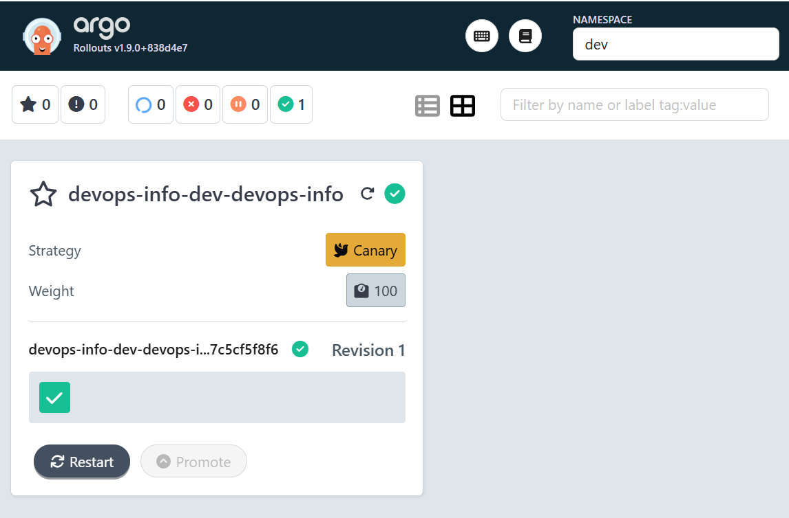
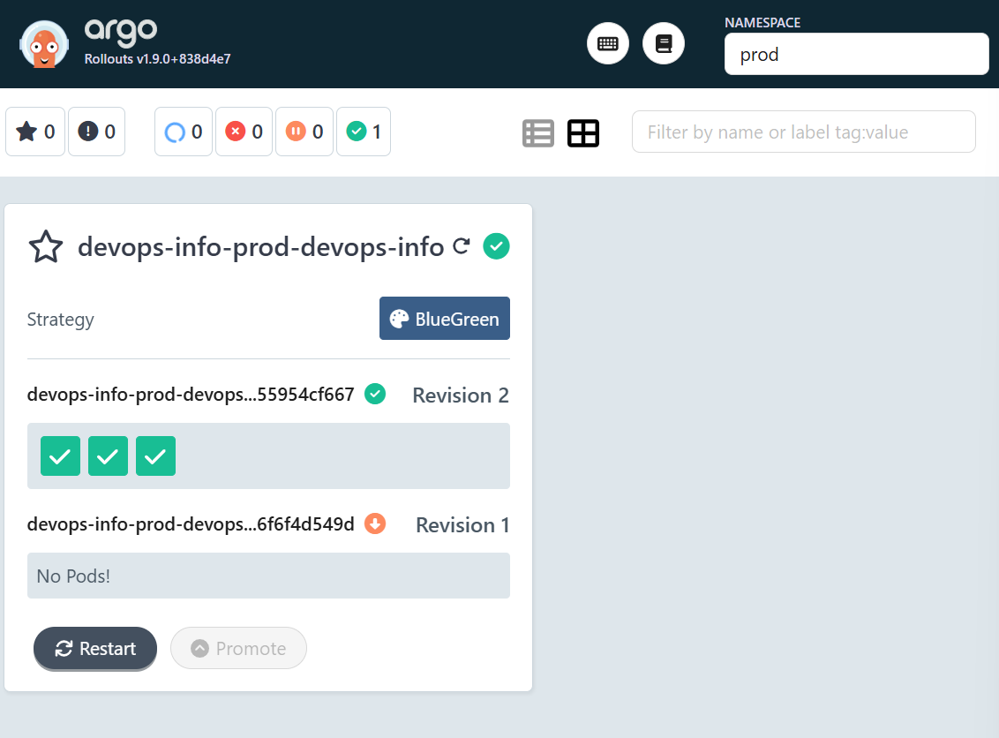
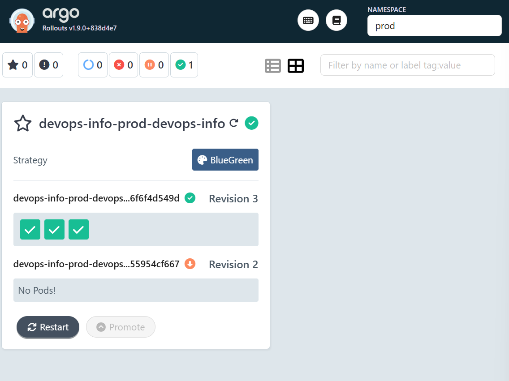
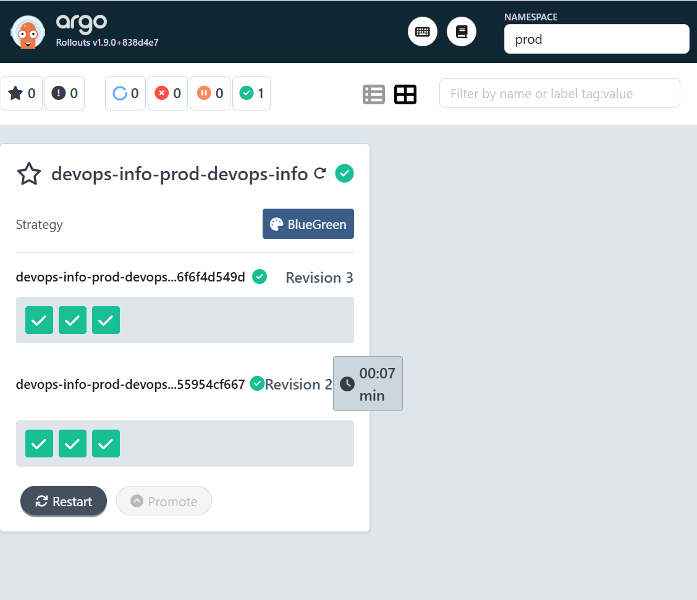

# Lab 14 — Progressive Delivery with Argo Rollouts

## Argo Rollouts Setup

### Installation verification
Argo Rollouts was installed in a dedicated namespace, and all required controller resources were created successfully (CRDs, RBAC, services, deployments).

The following environment setup was completed:

```bash
kind create cluster --name devops-lab14
kubectl config use-context kind-devops-lab14
kubectl create namespace argo-rollouts
kubectl apply -n argo-rollouts -f https://github.com/argoproj/argo-rollouts/releases/latest/download/install.yaml
kubectl apply -n argo-rollouts -f https://github.com/argoproj/argo-rollouts/releases/latest/download/dashboard-install.yaml
kubectl get pods -n argo-rollouts
kubectl get svc -n argo-rollouts
```

Verified result:
- `argo-rollouts` pod reached `1/1 Running`.
- `argo-rollouts-dashboard` pod reached `1/1 Running`.
- Services `argo-rollouts-dashboard` (`3100/TCP`) and `argo-rollouts-metrics` (`8090/TCP`) were available.

Output:

```text
$ kubectl get pods -n argo-rollouts
NAME                                       READY   STATUS    RESTARTS   AGE
argo-rollouts-5f64f8d68-rb9p7              1/1     Running   0          24m
argo-rollouts-dashboard-58bdfc967d-r8h7g   1/1     Running   0          109s

$ kubectl get svc -n argo-rollouts
NAME                      TYPE        CLUSTER-IP      EXTERNAL-IP   PORT(S)    AGE
argo-rollouts-dashboard   ClusterIP   10.96.140.141   <none>        3100/TCP   24m
argo-rollouts-metrics     ClusterIP   10.96.18.249    <none>        8090/TCP   24m
```

The CLI plugin was installed and verified:

```bash
curl -LO https://github.com/argoproj/argo-rollouts/releases/latest/download/kubectl-argo-rollouts-linux-amd64
chmod +x kubectl-argo-rollouts-linux-amd64
sudo mv kubectl-argo-rollouts-linux-amd64 /usr/local/bin/kubectl-argo-rollouts
kubectl argo rollouts version
```

Verified result:
- `kubectl-argo-rollouts: v1.9.0+838d4e7` was reported on `linux/amd64`.

Output:

```text
$ kubectl argo rollouts version
kubectl-argo-rollouts: v1.9.0+838d4e7
  BuildDate: 2026-03-20T21:08:11Z
  GitCommit: 838d4e792be666ec11bd0c80331e0c5511b5010e
  GitTreeState: clean
  GoVersion: go1.24.13
  Compiler: gc
  Platform: linux/amd64
```

### Dashboard access
Dashboard access was established through local port-forward:

```bash
kubectl port-forward svc/argo-rollouts-dashboard -n argo-rollouts 3100:3100
```

Verified result:
- Dashboard was reachable at `http://localhost:3100`.
- Active dashboard traffic was confirmed by repeated `Handling connection for 3100` entries.

Output:

```text
Forwarding from 127.0.0.1:3100 -> 3100
Forwarding from [::1]:3100 -> 3100
Handling connection for 3100
Handling connection for 3100
Handling connection for 3100
Handling connection for 3100
```

## Canary Deployment

### Strategy configuration explained
The Helm chart was converted from `Deployment` to `Rollout` resources. Canary strategy was configured and applied in default and dev profile values.

Implemented canary steps:
- `20%` traffic, then manual pause.
- `40%` traffic, then `30s` pause.
- `60%` traffic, then `30s` pause.
- `80%` traffic, then `30s` pause.
- `100%` traffic finalization.

Configuration location:
- `k8s/devops-info-chart/templates/rollout.yaml`
- `k8s/devops-info-chart/values.yaml`
- `k8s/devops-info-chart/values-dev.yaml`

### Step-by-step rollout progression (screenshots from dashboard)
Canary rollout progression was observed in Argo Rollouts dashboard and CLI in the `dev` namespace.

Evidence files:
- `k8s/dev-argo.png`
- `k8s/prog-argo.png`

Screenshots:





Observed final canary state:
- Rollout `devops-info-dev-devops-info` in `dev` namespace was `Healthy`.
- Step reached `9/9`.
- Set and actual weights reached `100/100`.
- Stable image `alsstarikova/devops-info-service:latest` was active.

Output:

```text
$ kubectl argo rollouts get rollout devops-info-dev-devops-info -n dev
Name:            devops-info-dev-devops-info
Namespace:       dev
Status:          ✔ Healthy
Strategy:        Canary
  Step:          9/9
  SetWeight:     100
  ActualWeight:  100
Images:          alsstarikova/devops-info-service:latest (stable)
Replicas:
  Desired:       1
  Current:       1
  Updated:       1
  Ready:         1
  Available:     1
```

### Promotion and abort demonstration
Promotion and abort operations were executed and validated:

```bash
kubectl argo rollouts promote devops-info-dev-devops-info -n dev
kubectl argo rollouts abort devops-info-dev-devops-info -n dev
kubectl argo rollouts get rollout devops-info-dev-devops-info -n dev
```

Observed result:
- Promotion command executed successfully.
- Abort command returned `rollout 'devops-info-dev-devops-info' aborted`.
- Rollout remained healthy and stable because abort was performed after full promotion, with stable traffic preserved.

Output:

```text
$ kubectl argo rollouts abort devops-info-dev-devops-info -n dev
rollout 'devops-info-dev-devops-info' aborted
```

## Blue-Green Deployment

### Strategy configuration explained
Blue-green strategy was configured for production profile values, including manual promotion behavior and scale-down delay.

Applied parameters:
- `rollout.strategy: blueGreen`
- `autoPromotionEnabled: false`
- `scaleDownDelaySeconds: 30`

Configuration location:
- `k8s/devops-info-chart/templates/rollout.yaml`
- `k8s/devops-info-chart/templates/service-preview.yaml`
- `k8s/devops-info-chart/values-prod.yaml`

### Preview vs active service
Blue-green service split was implemented and verified:
- Active service: `devops-info-prod-devops-info`
- Preview service: `devops-info-prod-devops-info-preview`

Validation was performed via separate port-forwards:

```bash
kubectl port-forward svc/devops-info-prod-devops-info -n prod 8080:80
kubectl port-forward svc/devops-info-prod-devops-info-preview -n prod 8081:80
```

Observed result:
- Both services were reachable.
- Active and preview targets were served independently during blue-green lifecycle phases.

Output:

```text
$ kubectl port-forward svc/devops-info-prod-devops-info -n prod 8080:80
Forwarding from 127.0.0.1:8080 -> 5000
Forwarding from [::1]:8080 -> 5000

$ kubectl port-forward svc/devops-info-prod-devops-info-preview -n prod 8081:80
Forwarding from 127.0.0.1:8081 -> 5000
Forwarding from [::1]:8081 -> 5000
```

### Promotion process
Blue-green promotion and rollback lifecycle was executed end-to-end:

```bash
helm upgrade devops-info-prod k8s/devops-info-chart -n prod -f k8s/devops-info-chart/values-prod.yaml --set image.tag=latest
kubectl argo rollouts promote devops-info-prod-devops-info -n prod
kubectl argo rollouts undo devops-info-prod-devops-info -n prod
kubectl argo rollouts get rollout devops-info-prod-devops-info -n prod
kubectl argo rollouts promote devops-info-prod-devops-info -n prod
kubectl argo rollouts get rollout devops-info-prod-devops-info -n prod
```

Observed result:
- Upgrade completed with Helm `STATUS: deployed`, `REVISION: 2`.
- Initial promotion completed successfully.
- `undo` moved rollback target into preview with status `Progressing` and message `active service cutover pending`.
- Final promotion completed cutover and returned rollout to `Healthy`.
- Final stable active image became `alsstarikova/devops-info-service:lab09`, confirming blue-green rollback completion.

Output:

```text
$ kubectl argo rollouts get rollout devops-info-prod-devops-info -n prod
Name:            devops-info-prod-devops-info
Namespace:       prod
Status:          ✔ Healthy
Strategy:        BlueGreen
Images:          alsstarikova/devops-info-service:lab09 (stable, active)
                 alsstarikova/devops-info-service:latest
Replicas:
  Desired:       3
  Current:       6
  Updated:       3
  Ready:         3
  Available:     3
```

Evidence files:
- `k8s/prod-no-rev2.png`
- `k8s/prod-rev2.png`

Screenshots:





## Strategy Comparison

### When to use canary vs blue-green
Canary is best suited for gradual exposure and controlled risk reduction in incremental traffic percentages. Blue-green is best suited for strict environment separation and fast cutover/rollback operations.

### Pros and cons of each
Canary advantages:
- Progressive risk control through staged traffic shifts.
- Better visibility of behavior across intermediate rollout stages.
- Reduced abrupt impact during problematic releases.

Canary limitations:
- Longer rollout duration.
- More operational monitoring points during each step.

Blue-green advantages:
- Clear active/preview separation.
- Fast promotion and rollback cutovers.
- Simple operational model for release approvals.

Blue-green limitations:
- Higher temporary resource usage during overlap.
- Less granular exposure than percentage-based canary rollout.

### Recommendation for different scenarios
- Development and staging flows were best aligned with canary strategy for progressive verification.
- Production rollback-critical flow was best aligned with blue-green strategy due to controlled preview validation and fast cutover.
- A mixed policy was validated as practical: canary for risk discovery, blue-green for deterministic rollback-sensitive releases.

## CLI Commands Reference

### Useful commands used

```bash
kubectl get rollouts -A
kubectl argo rollouts get rollout devops-info-dev-devops-info -n dev
kubectl argo rollouts get rollout devops-info-prod-devops-info -n prod
kubectl argo rollouts promote devops-info-dev-devops-info -n dev
kubectl argo rollouts promote devops-info-prod-devops-info -n prod
kubectl argo rollouts abort devops-info-dev-devops-info -n dev
kubectl argo rollouts undo devops-info-prod-devops-info -n prod
```

### Monitoring and troubleshooting

```bash
kubectl get pods -n argo-rollouts
kubectl get svc -n argo-rollouts
kubectl describe rollout devops-info-prod-devops-info -n prod
kubectl get rs -n dev
kubectl get rs -n prod
kubectl get events -n prod --sort-by=.metadata.creationTimestamp
kubectl logs -n argo-rollouts deploy/argo-rollouts
```

Validated outcome:
- Controller health, rollout status, ReplicaSet transitions, and service routing states were observable and consistent throughout canary and blue-green scenarios.
