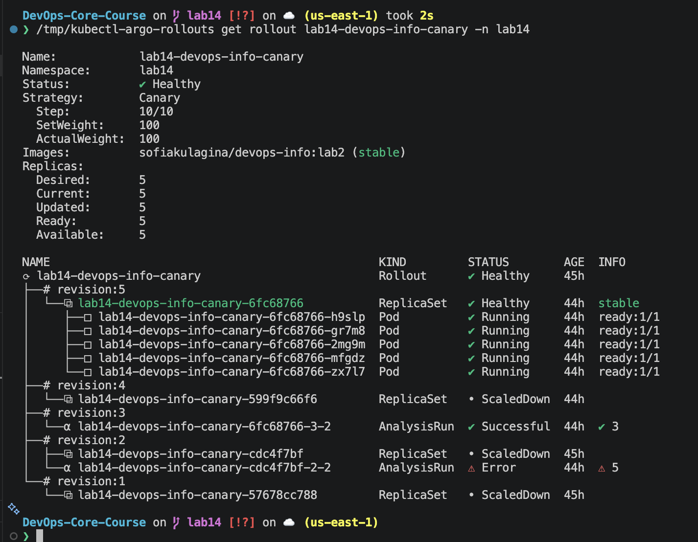
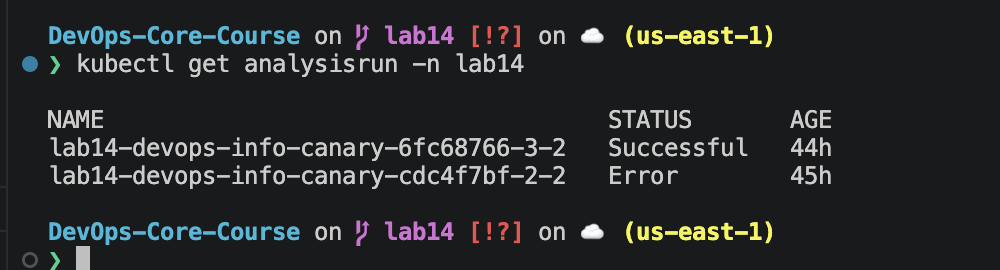
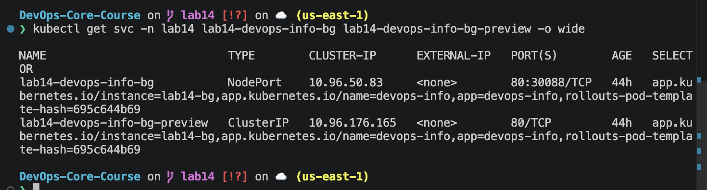
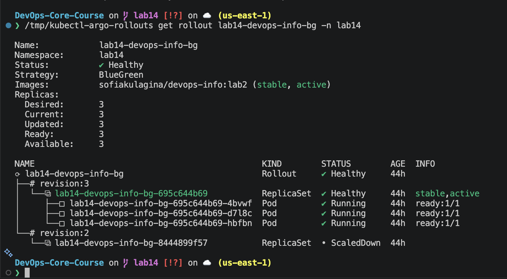
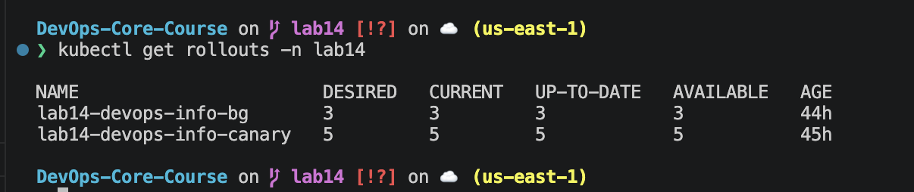
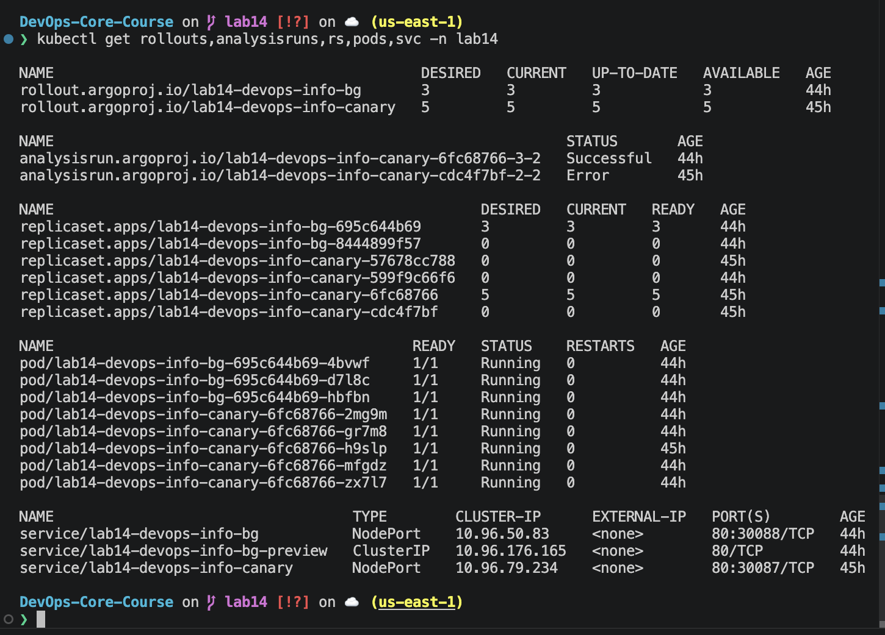

# Lab 14 Report — Progressive Delivery with Argo Rollouts

## 1. Overview

Lab 14 implements progressive delivery for the Helm chart `k8s/devops-info`.

The chart now supports:

- default Kubernetes `Deployment`
- Argo Rollouts `Rollout`
- canary deployment
- blue-green deployment
- web-based `AnalysisTemplate`

Relevant files:

```text
k8s/
├── ROLLOUTS.md
└── devops-info/
    ├── templates/
    │   ├── analysis-template.yaml
    │   ├── deployment.yaml
    │   ├── preview-service.yaml
    │   └── rollout.yaml
    ├── values-rollout-bluegreen.yaml
    ├── values-rollout-canary.yaml
    └── values.yaml
```

The old behavior is preserved:

```yaml
rollout:
  enabled: false
```

With this default, the chart still renders a normal `apps/v1 Deployment`, so earlier labs are not broken.

## 2. Argo Rollouts Setup

### 2.1 Standard installation commands

The normal in-cluster installation is:

```bash
kubectl create namespace argo-rollouts
kubectl apply -n argo-rollouts \
  -f https://github.com/argoproj/argo-rollouts/releases/latest/download/install.yaml

kubectl apply -n argo-rollouts \
  -f https://github.com/argoproj/argo-rollouts/releases/latest/download/dashboard-install.yaml
```

Verification:

```bash
kubectl get crd rollouts.argoproj.io analysistemplates.argoproj.io analysisruns.argoproj.io
kubectl get pods -n argo-rollouts
```

### 2.2 Local environment workaround

The local `kind` cluster could not pull official images from `quay.io`:

```text
Image: quay.io/argoproj/argo-rollouts:v1.9.0
Reason: ImagePullBackOff
Message: failed to do request ... quay.io ... EOF
```

To finish the lab without wasting resources on registry retries, I used the official Argo Rollouts source release:

```bash
curl -L -o /tmp/argo-rollouts-v1.9.0.tar.gz \
  https://github.com/argoproj/argo-rollouts/archive/refs/tags/v1.9.0.tar.gz

tar -xzf /tmp/argo-rollouts-v1.9.0.tar.gz -C /tmp

go build -o /tmp/rollouts-controller \
  /tmp/argo-rollouts-1.9.0/cmd/rollouts-controller

go build -o /tmp/kubectl-argo-rollouts \
  /tmp/argo-rollouts-1.9.0/cmd/kubectl-argo-rollouts
```

Installed CRDs from the same release:

```bash
kubectl apply -f /tmp/argo-rollouts-1.9.0/manifests/crds
```

Started the controller locally for namespace `lab14`:

```bash
/tmp/rollouts-controller \
  --leader-elect=false \
  --namespaced \
  --namespace lab14 \
  --metricsPort 18090 \
  --healthzPort 18080
```

Controller startup evidence:

```text
Argo Rollouts controller starting
Leader election is turned off. Running in single-instance mode
Starting Controllers
Started rollout workers
```

CLI evidence:

```bash
$ /tmp/kubectl-argo-rollouts version
kubectl-argo-rollouts: v99.99.99+unknown
Platform: darwin/arm64
```

The version is `unknown` because the binary was built from the source tarball, not from the official release build pipeline.

### 2.3 Dashboard

The dashboard was started through the CLI, avoiding the dashboard container image:

```bash
/tmp/kubectl-argo-rollouts dashboard -n lab14 --port 3100
```

Output:

```text
Argo Rollouts Dashboard is now available at http://localhost:3100/rollouts
```

HTTP check:

```bash
$ curl -sS -I http://127.0.0.1:3100/rollouts
HTTP/1.1 200 OK
Content-Type: text/html; charset=utf-8
```

Screenshot note: browser opening worked, but `screencapture` failed in this non-interactive display session with `could not create image from display`. The dashboard was still verified by HTTP and CLI.

## 3. Rollout vs Deployment

| Area | Deployment | Rollout |
|---|---|---|
| API | `apps/v1` | `argoproj.io/v1alpha1` |
| Controller | Kubernetes deployment controller | Argo Rollouts controller |
| Strategies | `RollingUpdate`, `Recreate` | `canary`, `blueGreen`, analysis, experiments |
| Manual gates | Not native | `pause`, `promote`, `abort` |
| Preview service | Not native | Native in blue-green |
| Automated checks | Not native | `AnalysisTemplate` and `AnalysisRun` |
| Rollback | Deployment revision rollback | abort, retry, undo, analysis-based rollback |

## 4. Canary Deployment

### 4.1 Configuration

Values file:

```text
k8s/devops-info/values-rollout-canary.yaml
```

Install:

```bash
kind load docker-image sofiakulagina/devops-info:lab2 --name devops-lab
kubectl create namespace lab14

helm upgrade --install lab14-canary k8s/devops-info \
  -n lab14 \
  -f k8s/devops-info/values-rollout-canary.yaml
```

Strategy:

```yaml
strategy:
  canary:
    steps:
      - setWeight: 20
      - pause: {}
      - analysis:
          templates:
            - templateName: lab14-devops-info-canary-healthcheck
      - setWeight: 40
      - pause:
          duration: 30s
      - setWeight: 60
      - pause:
          duration: 30s
      - setWeight: 80
      - pause:
          duration: 30s
      - setWeight: 100
```

### 4.2 Initial status

```bash
$ kubectl get rollouts,rs,pods,svc,analysistemplates -n lab14
rollout.argoproj.io/lab14-devops-info-canary   5   5   5   5
replicaset.apps/lab14-devops-info-canary-57678cc788   5   5   5
service/lab14-devops-info-canary   NodePort   80:30087/TCP
analysistemplate.argoproj.io/lab14-devops-info-canary-healthcheck
```

### 4.3 Manual pause and promotion

Triggered a new revision:

```bash
helm upgrade lab14-canary k8s/devops-info \
  -n lab14 \
  -f k8s/devops-info/values-rollout-canary.yaml \
  --set 'env[5].value=canary-v2'
```

Observed manual pause at 20%:

```text
Status:          Paused
Message:         CanaryPauseStep
Strategy:        Canary
Step:            1/10
SetWeight:       20
ActualWeight:    20
Replicas:
  Desired:       5
  Updated:       1
```

Canary rollout CLI evidence:



Promotion:

```bash
/tmp/kubectl-argo-rollouts promote lab14-devops-info-canary -n lab14
```

Result:

```text
rollout 'lab14-devops-info-canary' promoted
```

### 4.4 Automated analysis

Because the controller ran on the host, it could not resolve in-cluster DNS names like `*.svc`. The chart supports overriding the analysis URL:

```yaml
rollout:
  analysis:
    url: ""
```

For the local-controller run, I used a port-forward:

```bash
kubectl port-forward service/lab14-devops-info-canary -n lab14 5005:80
curl -sS http://127.0.0.1:5005/health
```

Health response:

```json
{"status":"healthy"}
```

Successful analysis run:

```bash
$ kubectl get analysisrun -n lab14 lab14-devops-info-canary-6fc68766-3-2 \
  -o jsonpath='{.status.phase} {.status.metricResults[0].successful} {.status.metricResults[0].count}'
Successful 3 3
```

AnalysisRun evidence:



Rollout after analysis and timed pauses:

```text
Status:          Healthy
Strategy:        Canary
Step:            10/10
SetWeight:       100
ActualWeight:    100
Replicas:
  Desired:       5
  Updated:       5
  Ready:         5
  Available:     5
AnalysisRun:     Successful 3/3
```

### 4.5 Abort test

Triggered another revision:

```bash
helm upgrade lab14-canary k8s/devops-info \
  -n lab14 \
  -f k8s/devops-info/values-rollout-canary.yaml \
  --set 'env[5].value=canary-v4-abort' \
  --set 'rollout.analysis.url=http://127.0.0.1:5005/health'
```

Before abort:

```text
Progressing 0 599f9c66f6 6fc68766 1 4
```

Abort:

```bash
/tmp/kubectl-argo-rollouts abort lab14-devops-info-canary -n lab14
```

Result:

```text
rollout 'lab14-devops-info-canary' aborted
```

Observed rollback to stable revision:

```text
Status:          Degraded
Message:         RolloutAborted: Rollout aborted update to revision 4
SetWeight:       0
Updated:         0
Ready:           5
Available:       5
revision:4       ScaledDown
revision:3       Healthy stable
```

After recording abort evidence, I restored the canary rollout to a healthy final state:

```bash
/tmp/kubectl-argo-rollouts undo lab14-devops-info-canary -n lab14
kubectl wait --for=jsonpath='{.status.phase}'=Healthy rollout/lab14-devops-info-canary -n lab14 --timeout=120s
```

Final canary state:

```text
Status:          Healthy
Step:            10/10
ActualWeight:    100
Ready:           5
Available:       5
```

## 5. Blue-Green Deployment

### 5.1 Configuration

Values file:

```text
k8s/devops-info/values-rollout-bluegreen.yaml
```

Install:

```bash
helm upgrade --install lab14-bg k8s/devops-info \
  -n lab14 \
  -f k8s/devops-info/values-rollout-bluegreen.yaml
```

Strategy:

```yaml
strategy:
  blueGreen:
    activeService: lab14-devops-info-bg
    previewService: lab14-devops-info-bg-preview
    autoPromotionEnabled: false
    scaleDownDelaySeconds: 30
```

Initial service selectors:

```bash
$ kubectl get svc -n lab14 lab14-devops-info-bg lab14-devops-info-bg-preview -o wide
lab14-devops-info-bg           NodePort    ... rollouts-pod-template-hash=695c644b69
lab14-devops-info-bg-preview   ClusterIP   ... rollouts-pod-template-hash=695c644b69
```

Blue-green active and preview services evidence:



### 5.2 Preview flow

Triggered green version:

```bash
helm upgrade lab14-bg k8s/devops-info \
  -n lab14 \
  -f k8s/devops-info/values-rollout-bluegreen.yaml \
  --set 'env[5].value=green-v2' \
  --server-side=false
```

`--server-side=false` is used with Helm 4 because Argo Rollouts intentionally owns and mutates the active/preview service selectors during blue-green deployment.

Paused blue-green state:

```text
Status:          Paused
Message:         BlueGreenPause
Strategy:        BlueGreen
Current:         6
Updated:         3
Ready:           3
Available:       3
revision:2       preview
revision:1       stable,active
```

Blue-green rollout CLI evidence:



Service selector split:

```bash
$ kubectl get svc -n lab14 lab14-devops-info-bg lab14-devops-info-bg-preview \
  -o custom-columns=NAME:.metadata.name,SELECTOR:.spec.selector.rollouts-pod-template-hash

NAME                           SELECTOR
lab14-devops-info-bg           695c644b69
lab14-devops-info-bg-preview   8444899f57
```

Active and preview versions:

```bash
$ kubectl exec -n lab14 lab14-devops-info-bg-695c644b69-4bvwf -- printenv APP_REVISION
blue-v1

$ kubectl exec -n lab14 lab14-devops-info-bg-8444899f57-89kcl -- printenv APP_REVISION
green-v2
```

### 5.3 Promotion

Promotion:

```bash
/tmp/kubectl-argo-rollouts promote lab14-devops-info-bg -n lab14
```

Result:

```text
rollout 'lab14-devops-info-bg' promoted
```

After promotion:

```text
Status:          Healthy
Strategy:        BlueGreen
revision:2       stable,active
revision:1       scaleDownDelay
```

Service selectors after promotion:

```text
NAME                           SELECTOR
lab14-devops-info-bg           8444899f57
lab14-devops-info-bg-preview   8444899f57
```

### 5.4 Instant rollback

Rollback:

```bash
/tmp/kubectl-argo-rollouts undo lab14-devops-info-bg -n lab14
```

Result:

```text
rollout 'lab14-devops-info-bg' undo
```

After rollback:

```text
Status:          Healthy
revision:3       stable,active
revision:2       scaleDownDelay
```

Service selectors switched back:

```text
NAME                           SELECTOR
lab14-devops-info-bg           695c644b69
lab14-devops-info-bg-preview   695c644b69
```

This demonstrates the key blue-green advantage: rollback is an immediate service selector switch while both ReplicaSets still exist.

## 6. Automated Analysis

Template:

```text
k8s/devops-info/templates/analysis-template.yaml
```

Rendered provider:

```yaml
provider:
  web:
    url: "http://lab14-devops-info-canary.lab14.svc:80/health"
    jsonPath: "{$.status}"
successCondition: "result == \"healthy\""
interval: 10s
count: 3
failureLimit: 1
```

For normal in-cluster controller deployment, the default service DNS URL is correct.

For the local host-controller workaround, the URL was overridden:

```bash
--set 'rollout.analysis.url=http://127.0.0.1:5005/health'
```

Successful run:

```text
AnalysisRun  lab14-devops-info-canary-6fc68766-3-2  Successful  3/3
```

Intentional failure was also observed when the local controller tried to use in-cluster DNS:

```text
Phase: Error
Message: lookup lab14-devops-info-canary.lab14.svc: no such host
```

That proves failed analysis blocks progression before full promotion.

## 7. Strategy Comparison

| Criteria | Canary | Blue-green |
|---|---|---|
| Release style | Gradual | All-at-once switch |
| User exposure | Percentage-based | Preview is private until promotion |
| Rollback | Abort returns traffic to stable | Service selector switches instantly |
| Resource usage | Lower | Higher, temporarily two full versions |
| Best use | Risky changes, metric gates | Manual preview validation, fast rollback |
| Weak point | Mixed versions during rollout | Needs spare capacity |

Recommendation:

- use canary for production user-facing changes where metrics should decide rollout progress
- use blue-green when a full preview environment and instant rollback matter more than resource cost
- keep production promotion manual unless monitoring and auto-rollback policies are mature

## 8. Validation

Helm lint:

```bash
$ helm lint k8s/devops-info -f k8s/devops-info/values-rollout-canary.yaml
1 chart(s) linted, 0 chart(s) failed

$ helm lint k8s/devops-info -f k8s/devops-info/values-rollout-bluegreen.yaml
1 chart(s) linted, 0 chart(s) failed
```

Render checks:

```bash
helm template lab14-canary k8s/devops-info \
  -n lab14 \
  -f k8s/devops-info/values-rollout-canary.yaml

helm template lab14-bg k8s/devops-info \
  -n lab14 \
  -f k8s/devops-info/values-rollout-bluegreen.yaml
```

Final runtime state:

```bash
$ kubectl get rollouts,analysisruns,svc -n lab14
rollout.argoproj.io/lab14-devops-info-bg       3   3   3   3
rollout.argoproj.io/lab14-devops-info-canary   5   5   5   5

analysisrun.argoproj.io/lab14-devops-info-canary-6fc68766-3-2   Successful

service/lab14-devops-info-bg           NodePort    80:30088/TCP
service/lab14-devops-info-bg-preview   ClusterIP   80/TCP
service/lab14-devops-info-canary       NodePort    80:30087/TCP
```

Rollouts list evidence:



All lab14 artifacts evidence:



Final canary:

```text
Status:          Healthy
Step:            10/10
ActualWeight:    100
Ready:           5
Available:       5
```

Final blue-green:

```text
Status:          Healthy
Strategy:        BlueGreen
Ready:           3
Available:       3
```

## 9. Command Reference

Controller and CLI:

```bash
/tmp/rollouts-controller --leader-elect=false --namespaced --namespace lab14
/tmp/kubectl-argo-rollouts version
/tmp/kubectl-argo-rollouts dashboard -n lab14 --port 3100
```

Canary:

```bash
/tmp/kubectl-argo-rollouts get rollout lab14-devops-info-canary -n lab14
/tmp/kubectl-argo-rollouts promote lab14-devops-info-canary -n lab14
/tmp/kubectl-argo-rollouts abort lab14-devops-info-canary -n lab14
/tmp/kubectl-argo-rollouts undo lab14-devops-info-canary -n lab14
```

Blue-green:

```bash
/tmp/kubectl-argo-rollouts get rollout lab14-devops-info-bg -n lab14
/tmp/kubectl-argo-rollouts promote lab14-devops-info-bg -n lab14
/tmp/kubectl-argo-rollouts undo lab14-devops-info-bg -n lab14
```

Troubleshooting:

```bash
kubectl get rollouts,analysisruns,rs,pods,svc -n lab14
kubectl describe analysisrun -n lab14 <analysisrun-name>
kubectl get svc -n lab14 -o wide
```
