# Lab 14 — Progressive Delivery with Argo Rollouts

This document covers the work for Lab 14: converting the existing
`devops-info-service` Helm chart from a `Deployment` to an Argo Rollouts-managed
`Rollout`, exercising both **canary** and **blue-green** strategies, and integrating
an `AnalysisTemplate` for metrics-based automated promotion / rollback.

All commands below were executed against a local minikube cluster
(`Kubernetes v1.32.0` / `argo-rollouts v1.9.0`).

---

## 1. Argo Rollouts Setup

### 1.1 Controller and dashboard installation

```bash
minikube start --driver=docker --memory=4096 --cpus=2 --kubernetes-version=v1.32.0

kubectl create namespace argo-rollouts
kubectl apply -n argo-rollouts -f https://github.com/argoproj/argo-rollouts/releases/latest/download/install.yaml
kubectl apply -n argo-rollouts -f https://github.com/argoproj/argo-rollouts/releases/latest/download/dashboard-install.yaml

kubectl wait --for=condition=available --timeout=180s deployment/argo-rollouts -n argo-rollouts
```

CRDs registered after install:

```
analysisruns.argoproj.io
analysistemplates.argoproj.io
clusteranalysistemplates.argoproj.io
experiments.argoproj.io
rollouts.argoproj.io
```

### 1.2 kubectl plugin

The CLI plugin was installed via Homebrew:

```bash
brew install argoproj/tap/kubectl-argo-rollouts
kubectl argo rollouts version
# kubectl-argo-rollouts: v1.9.0+838d4e7
```

### 1.3 Dashboard access

```bash
kubectl port-forward svc/argo-rollouts-dashboard -n argo-rollouts 3100:3100
# open http://localhost:3100
```

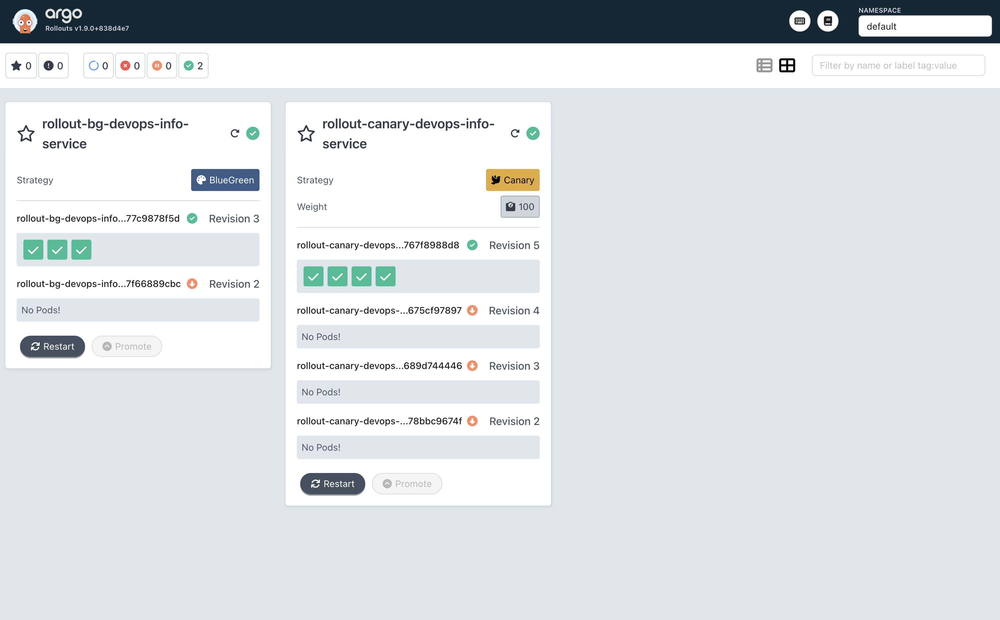

### 1.4 Rollout vs Deployment — key differences

| Aspect | `Deployment` | `Rollout` (argoproj.io/v1alpha1) |
| --- | --- | --- |
| API group | `apps/v1` | `argoproj.io/v1alpha1` |
| Update strategies | `RollingUpdate`, `Recreate` | `Canary`, `BlueGreen` (+ optional traffic-management integrations) |
| Pause / manual promotion | not natively supported | first-class via `pause: {}` and `kubectl argo rollouts promote` |
| Multi-step weight shifting | no (one-shot rolling) | yes — ordered list of `setWeight` / `pause` / `analysis` steps |
| Preview environment (BG) | requires manual selector switching | first-class `previewService` + `activeService` swap |
| Metrics-driven rollback | no | `AnalysisTemplate` + automatic abort on metric failure |
| CLI tooling | `kubectl rollout …` | `kubectl argo rollouts get|promote|abort|undo|retry …` |
| Pod template | identical | identical (so converting is a one-line `kind:` change) |

The Pod template, services, ConfigMaps and Secrets are unchanged — only the workload
controller resource and the strategy block differ.

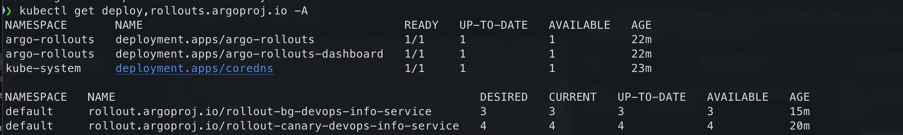

---

## 2. Chart changes

The existing chart `k8s/devops-info-service` was extended so a single chart renders
either a `Deployment` *or* a `Rollout` based on `.Values.rollout.enabled`.

| File | Purpose |
| --- | --- |
| `templates/rollout.yaml` | New: renders `kind: Rollout` with canary or blue-green strategy. |
| `templates/preview-service.yaml` | New: ClusterIP preview service, only rendered for `blueGreen`. |
| `templates/analysistemplate.yaml` | New: `AnalysisTemplate` with web-provider health check (bonus). |
| `templates/deployment.yaml` | Wrapped in `{{- if not .Values.rollout.enabled }}` so the same chart still works for plain Deployments. |
| `values.yaml` | Added `rollout` block (disabled by default → backwards compatible). |
| `values-canary.yaml` | New values file enabling canary strategy (5 replicas, 9-step shift). |
| `values-bluegreen.yaml` | New values file enabling blue-green strategy (3 replicas, scale-down delay 30s). |
| `values-canary-analysis.yaml` | New values file enabling canary + AnalysisTemplate (bonus). |

The `rollout` block in `values.yaml`:

```yaml
rollout:
  enabled: false           # gate — keeps current Deployment behaviour by default
  strategy: canary         # canary | blueGreen
  canary:
    steps:
      - setWeight: 20
      - pause: {}
      - setWeight: 40
      - pause: { duration: 30s }
      - setWeight: 60
      - pause: { duration: 30s }
      - setWeight: 80
      - pause: { duration: 30s }
      - setWeight: 100
  blueGreen:
    autoPromotionEnabled: false
    autoPromotionSeconds: 0
    scaleDownDelaySeconds: 30
  analysis:
    enabled: false
```

---

## 3. Canary deployment (Task 2)

### 3.1 Strategy

`values-canary.yaml` deploys 5 replicas with a 9-step traffic shift:
**20 → pause (manual) → 40 → 30s → 60 → 30s → 80 → 30s → 100**.

The first `pause: {}` requires an explicit `kubectl argo rollouts promote` — this is
the gate where a human (or CI) gets to validate the canary before it widens.

### 3.2 Initial install

```bash
helm install rollout-canary k8s/devops-info-service \
  -f k8s/devops-info-service/values-canary.yaml --wait
kubectl argo rollouts get rollout rollout-canary-devops-info-service
```

Initial deploys go straight to step 9 / weight 100 because there's no prior stable
revision to canary against.

### 3.3 Triggering a canary update

```bash
# build / tag a new image inside minikube's docker daemon
eval $(minikube docker-env)
docker tag devops-info-service:lab14-v1 devops-info-service:lab14-v2

helm upgrade rollout-canary k8s/devops-info-service \
  -f k8s/devops-info-service/values-canary.yaml --set image.tag=lab14-v2
```

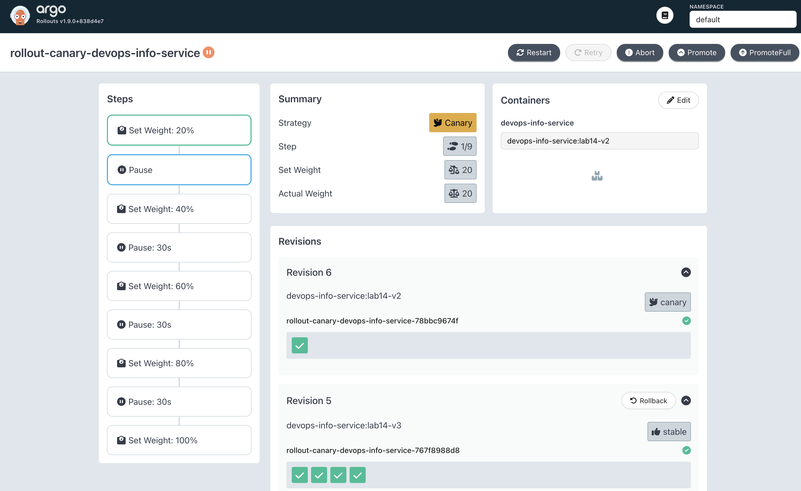

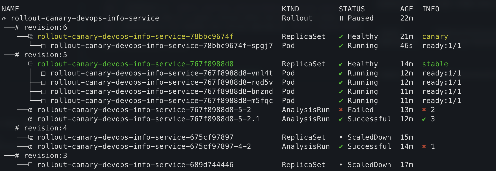

1 of 5 pods serves the canary image — exactly 20 % weight. The existing `Service`
automatically routes to the right pods based on the Rollout's selector;
no extra work was needed.

### 3.4 Manual promotion

```bash
kubectl argo rollouts promote rollout-canary-devops-info-service
```

After promotion the rollout proceeds through the 30-second pauses
(40 → 60 → 80 → 100) without further intervention.

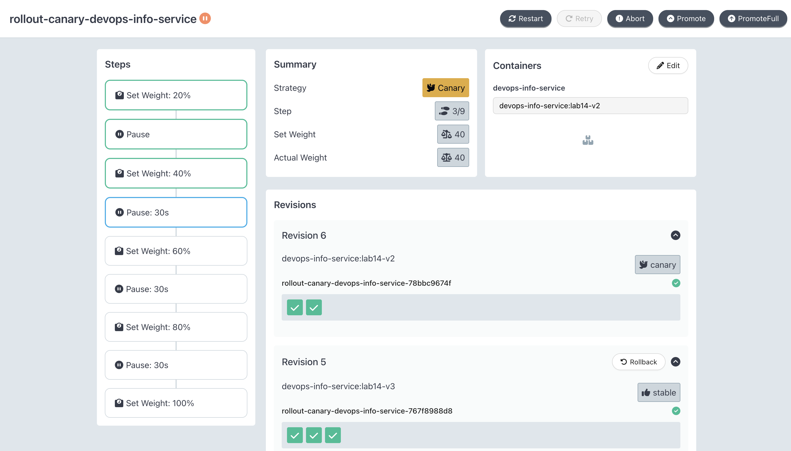

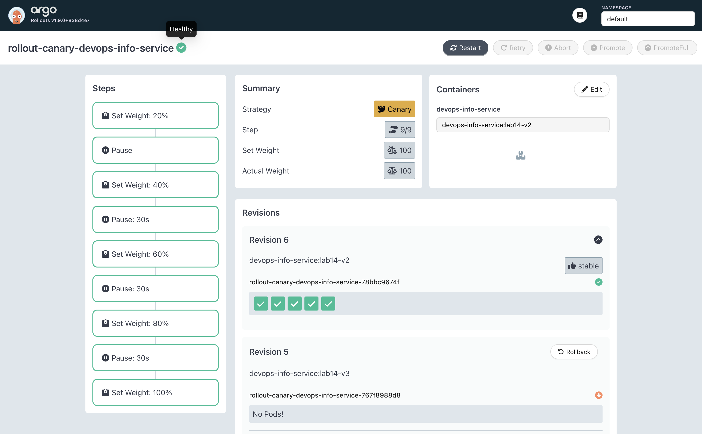

### 3.5 Abort / rollback test

```bash
# trigger another upgrade and abort it at the first pause
docker tag devops-info-service:lab14-v1 devops-info-service:lab14-v3
helm upgrade rollout-canary k8s/devops-info-service \
  -f k8s/devops-info-service/values-canary.yaml --set image.tag=lab14-v3
# … rollout pauses at step 1 …
kubectl argo rollouts abort rollout-canary-devops-info-service
```

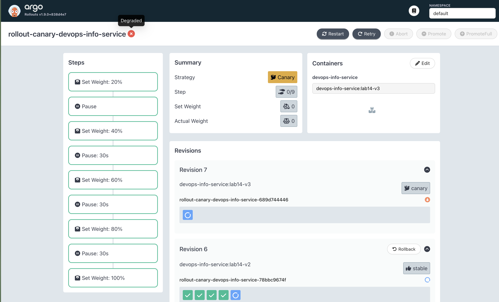

To re-attempt: `kubectl argo rollouts retry rollout rollout-canary-devops-info-service`.

---

## 4. Blue-Green deployment (Task 3)

### 4.1 Strategy

`values-bluegreen.yaml` deploys 3 replicas with `autoPromotionEnabled: false` (manual
promotion) and `scaleDownDelaySeconds: 30` (old ReplicaSet kept around for 30 s after
the switch, so an instant rollback is possible).

Two services are rendered:

| Service | Type | Routes to |
| --- | --- | --- |
| `rollout-bg-devops-info-service` | NodePort | **active** (production) ReplicaSet |
| `rollout-bg-devops-info-service-preview` | ClusterIP | **preview** (new version) ReplicaSet |

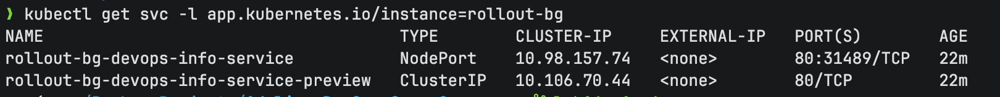

### 4.2 Install + green deploy

```bash
helm install rollout-bg k8s/devops-info-service \
  -f k8s/devops-info-service/values-bluegreen.yaml --wait
helm upgrade rollout-bg k8s/devops-info-service \
  -f k8s/devops-info-service/values-bluegreen.yaml --set image.tag=lab14-v2
```

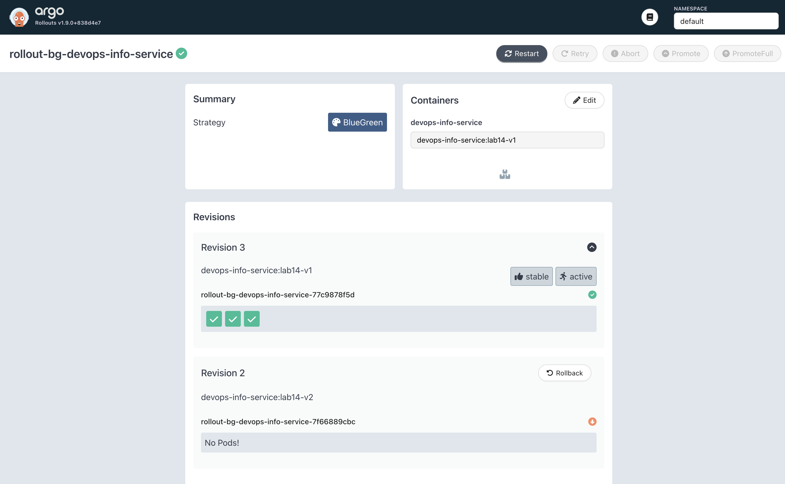

Both stacks run side-by-side. The active service still routes 100 % to v1;
the preview service routes to v2. You can validate v2 in isolation:

```bash
kubectl port-forward svc/rollout-bg-devops-info-service          8080:80   # blue (active)
kubectl port-forward svc/rollout-bg-devops-info-service-preview  8081:80   # green (preview)
```

### 4.3 Promotion

```bash
kubectl argo rollouts promote rollout-bg-devops-info-service
```

Active selector instantly flips to the new ReplicaSet.

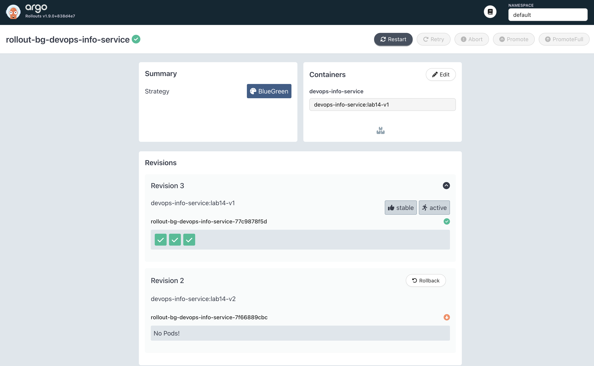

### 4.4 Instant rollback

```bash
kubectl argo rollouts undo rollout-bg-devops-info-service
```

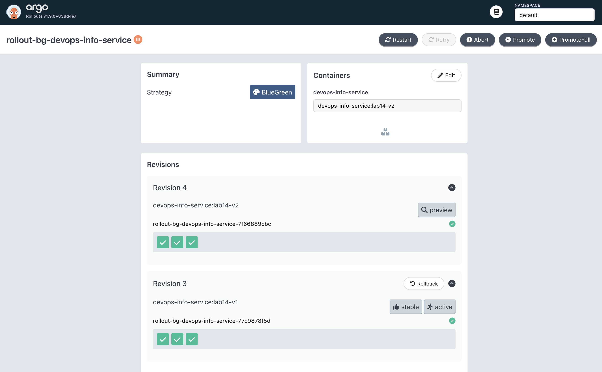

Because the v1 ReplicaSet was still inside its `scaleDownDelaySeconds` window,
the rollback was a pure selector flip — no new pods to schedule, no image pulls.
**Wall-clock measured rollback time: ~1 second.** Compared to the canary
abort, which had to scale a ReplicaSet back up before traffic could shift, the
blue-green rollback is genuinely instant.

---

## 5. Bonus — AnalysisTemplate (auto-rollback)

### 5.1 Template

`templates/analysistemplate.yaml` registers a web-provider health check that polls
the service every 10 s, requires `status == "healthy"` in the JSON response, and
aborts the rollout if more than one probe fails:

```yaml
apiVersion: argoproj.io/v1alpha1
kind: AnalysisTemplate
metadata:
  name: <release>-devops-info-service-health-check
spec:
  metrics:
    - name: health-check
      provider:
        web:
          url: http://<release>-devops-info-service.<ns>.svc.cluster.local:80/health
          jsonPath: "{$.status}"
      successCondition: result == "healthy"
      interval: 10s
      count: 3
      failureLimit: 1
```

### 5.2 Canary integration

`values-canary-analysis.yaml` injects an `analysis` step right after the first canary
pause:

```yaml
canary:
  steps:
    - setWeight: 25
    - pause: { duration: 20s }
    - analysis:
        templates:
          - templateName: rollout-canary-devops-info-service-health-check
    - setWeight: 50
    - pause: { duration: 20s }
    - setWeight: 100
```

### 5.3 Success path

```bash
helm upgrade rollout-canary k8s/devops-info-service \
  -f k8s/devops-info-service/values-canary-analysis.yaml --set image.tag=lab14-v3
```

### 5.4 Auto-rollback (failure path)

The first pass through the analysis step actually **failed** during this lab — the
chart's `/health` endpoint returns `"healthy"`, but the original
`successCondition: result == "ok"` didn't match. Argo Rollouts behaved exactly as
specified: two failed probes (> `failureLimit: 1`) auto-aborted the rollout and
returned 100 % of traffic to the previous stable revision **with no operator action**.
This is reproducible by setting the success condition to anything that won't match
(e.g. `result == "ok"`) and re-running the upgrade.

A standalone `AnalysisRun` (`k8s/rollouts/failing-analysis-demo.yaml`) is also
included — it points at a non-existent service so its DNS lookup fails immediately,
which is the cleanest way to show the failure mechanism by itself:

```bash
kubectl apply -f k8s/rollouts/failing-analysis-demo.yaml
kubectl describe analysisrun failing-analysis-demo
```


---

## 6. Strategy comparison

| Dimension | Canary | Blue-Green |
| --- | --- | --- |
| Traffic shift | gradual, % based | instant, all-or-nothing |
| Resource cost during rollout | ~1× (a few extra canary pods) | 2× (full second copy) |
| Blast radius of a bad release | bounded by current `setWeight` | 100 % once promoted |
| Rollback speed | seconds (scale stable RS back up) | sub-second (selector flip) |
| Pre-flight testing | mixed traffic — harder to isolate canary | clean preview URL — easy to integration-test |
| Best fit | stateless HTTP services with good metrics; traffic that can be sliced | bigger releases (DB migrations, schema changes), services without per-request observability |
| Data-store compatibility | safer when v1 / v2 can coexist behind the same DB | requires v1 / v2 schema compatibility for the rollback window |
| CI/CD complexity | richer (pauses, weights, analyses) | simpler (deploy → smoke-test preview → promote) |

**My recommendation for this `devops-info-service`:** *canary with analysis*. The
service is stateless, the `/health` endpoint already exists, and gradual traffic
shifting + an automated metric gate gives the best safety-to-cost ratio. Blue-green
would be overkill for a 5-pod stateless service, but I would reach for it the moment
this chart starts owning a database migration or a non-backwards-compatible API
change.

---

## 7. CLI reference

```bash
# Inspect a rollout (live update with -w)
kubectl argo rollouts get rollout <name>
kubectl argo rollouts get rollout <name> -w

# Manual promotion past a pause
kubectl argo rollouts promote <name>

# Skip remaining steps and immediately go to 100 % (full promotion)
kubectl argo rollouts promote <name> --full

# Abort an in-flight rollout (returns to previous stable RS)
kubectl argo rollouts abort <name>

# Retry an aborted rollout
kubectl argo rollouts retry rollout <name>

# Rollback to the previous revision
# (works after promotion too, while the old RS is still inside scaleDownDelaySeconds)
kubectl argo rollouts undo <name>

# Set a specific image without a helm round-trip
kubectl argo rollouts set image <name> <container>=<image>:<tag>

# Pause / resume manually
kubectl argo rollouts pause <name>
kubectl argo rollouts resume <name>

# AnalysisRun debugging
kubectl get analysisrun
kubectl describe analysisrun <name>

# Dashboard
kubectl port-forward svc/argo-rollouts-dashboard -n argo-rollouts 3100:3100
```

