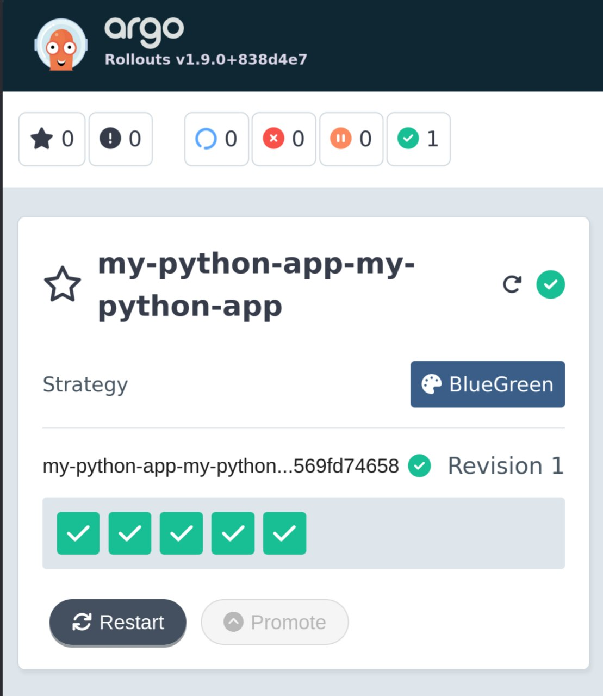
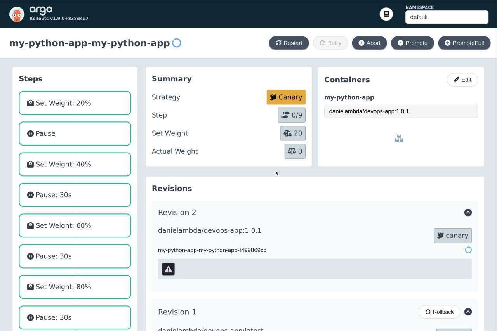
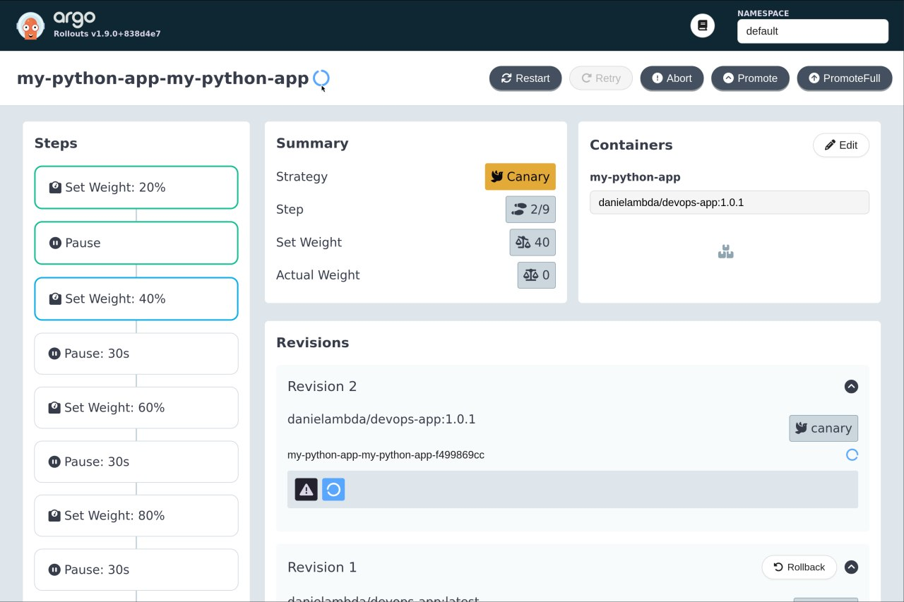
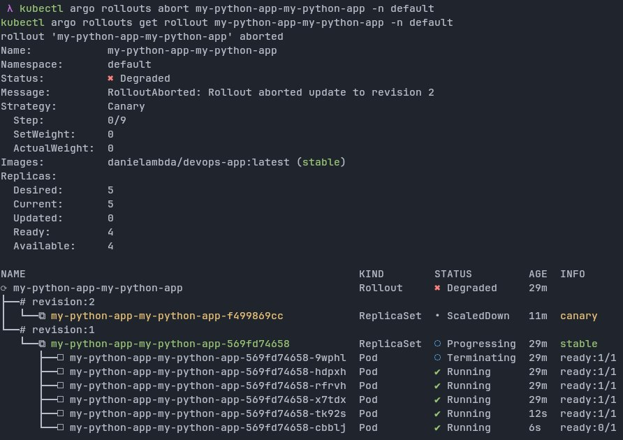
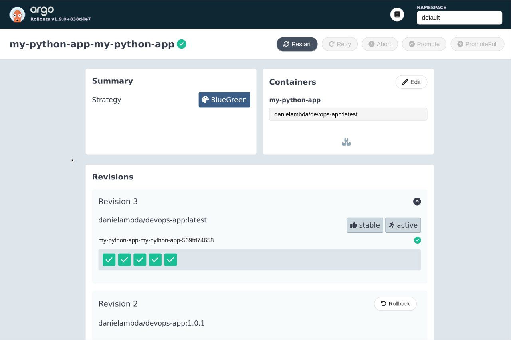

# Progressive Delivery with Argo Rollouts

This document captures Lab 14 implementation for canary and blue-green deployments using Argo Rollouts with the existing Helm chart in `k8s/`.

## 1) Argo Rollouts setup

### Install controller and dashboard

```bash
kubectl create namespace argo-rollouts
kubectl apply -n argo-rollouts -f https://github.com/argoproj/argo-rollouts/releases/latest/download/install.yaml
kubectl apply -n argo-rollouts -f https://github.com/argoproj/argo-rollouts/releases/latest/download/dashboard-install.yaml
```

### Install kubectl plugin (Linux)

```bash
curl -LO https://github.com/argoproj/argo-rollouts/releases/latest/download/kubectl-argo-rollouts-linux-amd64
chmod +x kubectl-argo-rollouts-linux-amd64
sudo mv kubectl-argo-rollouts-linux-amd64 /usr/local/bin/kubectl-argo-rollouts
```

### Verify installation

```bash
kubectl get pods -n argo-rollouts
kubectl argo rollouts version
kubectl get crd rollouts.argoproj.io
```

### Dashboard access

```bash
kubectl port-forward svc/argo-rollouts-dashboard -n argo-rollouts 3100:3100
```

Open `http://localhost:3100`.

### Evidence

Controller installation and runtime verification:



### Rollout vs Deployment: key differences

- `Rollout` is a CRD (`argoproj.io/v1alpha1`) instead of built-in `apps/v1` `Deployment`.
- Pod template, selector, and replicas are mostly the same as `Deployment`.
- `Rollout` adds progressive strategies:
  - `strategy.canary` for weighted traffic shifts and pause gates.
  - `strategy.blueGreen` for active/preview services and instant cutover.
- `Rollout` supports operational controls (`promote`, `abort`, `retry`, `undo`) through the Argo Rollouts CLI and dashboard.

## 2) Canary deployment

### Strategy configured in chart

The chart now uses `templates/rollout.yaml` and defaults to canary in `values.yaml`:

- 20% traffic, manual pause
- 40% traffic, pause 30s
- 60% traffic, pause 30s
- 80% traffic, pause 30s
- 100% traffic

### Deploy canary rollout

```bash
helm upgrade --install my-python-app ./k8s -n default
kubectl argo rollouts get rollout my-python-app-my-python-app -n default -w
```

### Trigger a new rollout

Any image tag or config change can trigger a new revision, for example:

```bash
helm upgrade --install my-python-app ./k8s -n default \
  --set image.tag=1.0.1
```

### Promotion and abort demo

```bash
# Manual promotion through first pause gate (20%)
kubectl argo rollouts promote my-python-app-my-python-app -n default

# Abort during rollout to shift traffic back to stable
kubectl argo rollouts abort my-python-app-my-python-app -n default

# Retry after an abort (optional)
kubectl argo rollouts retry rollout my-python-app-my-python-app -n default
```

### Evidence

Canary paused at 20%, promoted progression, and abort/rollback:





## 3) Blue-green deployment

### Strategy configured in chart

Blue-green is enabled through `values-bluegreen.yaml`:

- `strategy.blueGreen.activeService`: `my-python-app`
- `strategy.blueGreen.previewService`: `my-python-app-preview`
- `autoPromotionEnabled: false` (manual cutover)

The chart conditionally creates the preview service when `rollout.strategy=blueGreen`.

### Deploy blue-green rollout

```bash
helm upgrade --install my-python-app ./k8s -n default -f k8s/values-bluegreen.yaml
kubectl argo rollouts get rollout my-python-app-my-python-app -n default -w
```

### Test active vs preview services

```bash
# Active (production) version
kubectl port-forward svc/my-python-app-my-python-app 8080:80 -n default

# Preview (new version) before promotion
kubectl port-forward svc/my-python-app-my-python-app-preview 8081:80 -n default
```

Trigger a new revision (for example, update image tag), validate on preview, then promote:

```bash
helm upgrade --install my-python-app ./k8s -n default -f k8s/values-bluegreen.yaml \
  --set image.tag=1.0.2
kubectl argo rollouts promote my-python-app-my-python-app -n default
```

### Instant rollback

Rollback after promotion is immediate because traffic switches service selector targets in one step:

```bash
kubectl argo rollouts undo my-python-app-my-python-app -n default
```

Compared to canary rollback, blue-green rollback is generally faster because there is no step-by-step weight shift.

### Evidence

Blue-green service setup (active + preview):



Additional blue-green screenshots to include before final grading:

- `bluegreen-preview-ready` (preview revision healthy)
- `bluegreen-promoted` (green became active)
- `bluegreen-rollback` (instant switch back)

## 4) Strategy comparison

### When to use canary

- High-risk releases that need gradual exposure.
- Workloads where real-user behavior must be observed before full rollout.
- Teams that want staged confidence gates.

### When to use blue-green

- Fast cutover/rollback requirements.
- Releases validated through synthetic or preview testing before go-live.
- Environments that can afford duplicate capacity during rollout.

### Pros and cons

- **Canary pros:** lower blast radius, controlled progression, better for behavior validation.
- **Canary cons:** slower completion, operationally more complex.
- **Blue-green pros:** simple traffic switch, very fast rollback.
- **Blue-green cons:** requires extra capacity, no partial traffic split by default.

### Recommendation by scenario

- User-facing APIs with unknown runtime risk: prefer canary.
- Internal apps or low-variance workloads requiring speed: prefer blue-green.
- Critical production with strict SLOs: use canary for normal changes, blue-green for fast fallback events.

## 5) CLI command reference

### Monitoring

```bash
kubectl argo rollouts list rollouts -n default
kubectl argo rollouts get rollout my-python-app-my-python-app -n default -w
kubectl argo rollouts dashboard
```

### Lifecycle control

```bash
kubectl argo rollouts promote my-python-app-my-python-app -n default
kubectl argo rollouts abort my-python-app-my-python-app -n default
kubectl argo rollouts retry rollout my-python-app-my-python-app -n default
kubectl argo rollouts undo my-python-app-my-python-app -n default
```

### Troubleshooting

```bash
kubectl describe rollout my-python-app-my-python-app -n default
kubectl get rs,pods,svc -n default -l app.kubernetes.io/instance=my-python-app
kubectl logs -n argo-rollouts deployment/argo-rollouts
```
