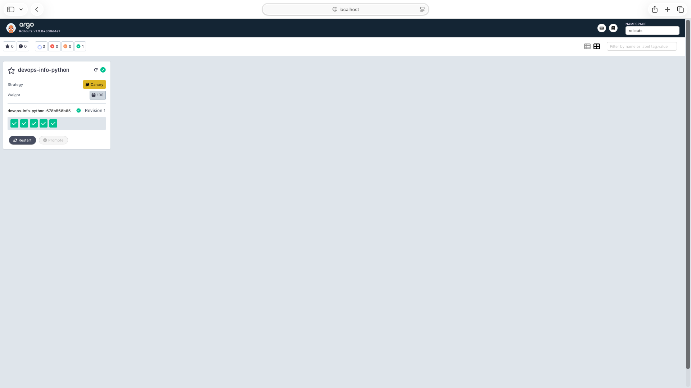
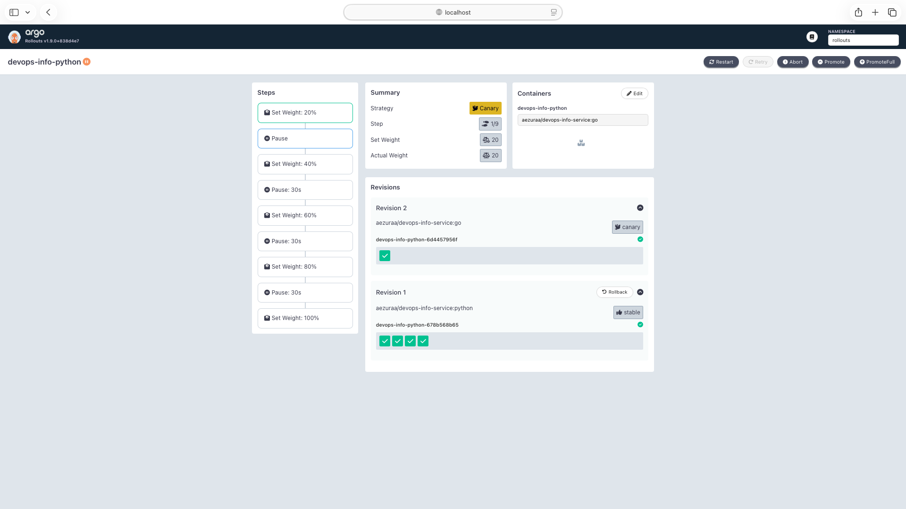
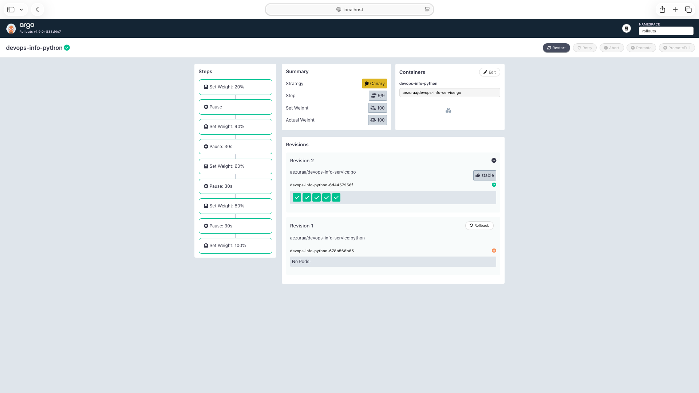
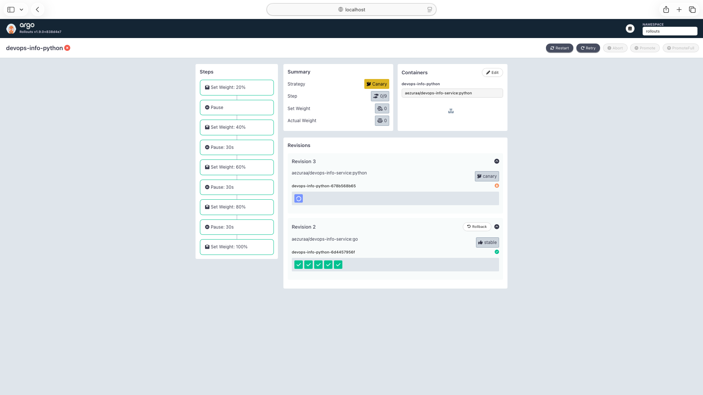
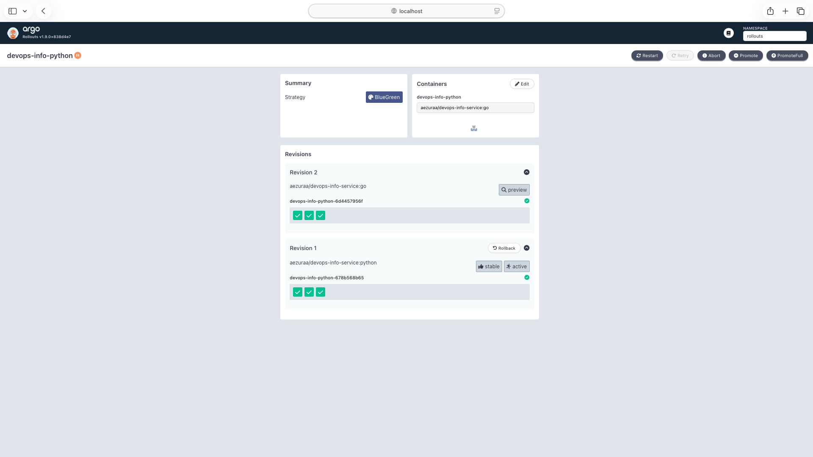
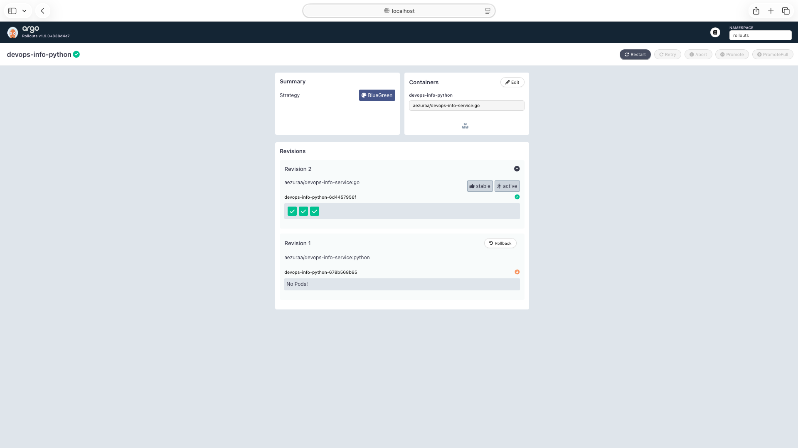
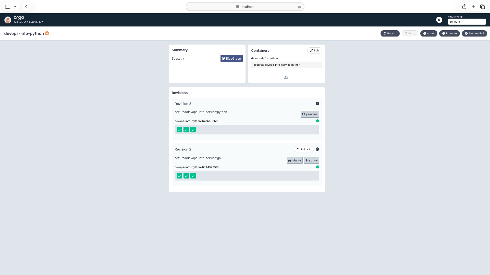
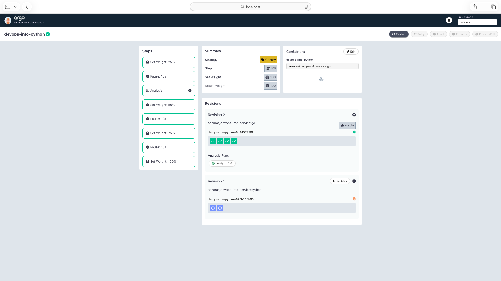
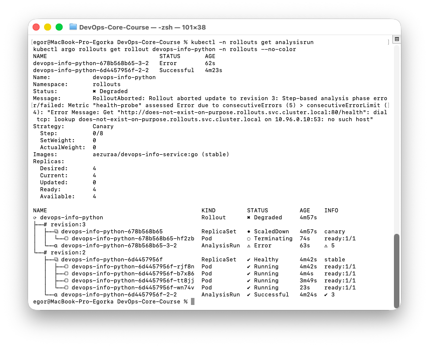

# Argo Rollouts — Progressive Delivery (Lab 14)

Canary and Blue-Green deployments of `devops-info-python` Helm chart powered by the Argo Rollouts controller.

## 1. Setup

### 1.1 Installation

Controller + CRDs + Dashboard + CLI plugin installed on minikube.

```bash
# Controller
kubectl create namespace argo-rollouts
kubectl apply -n argo-rollouts -f https://github.com/argoproj/argo-rollouts/releases/latest/download/install.yaml

# Dashboard
kubectl apply -n argo-rollouts -f https://github.com/argoproj/argo-rollouts/releases/latest/download/dashboard-install.yaml

# CLI plugin (macOS / Homebrew)
brew install argoproj/tap/kubectl-argo-rollouts
```

Verification:

```text
$ kubectl argo rollouts version
kubectl-argo-rollouts: v1.8.3+49fa151

$ kubectl -n argo-rollouts get deployments
NAME                      READY   UP-TO-DATE   AVAILABLE   AGE
argo-rollouts             1/1     1            1           23m
argo-rollouts-dashboard   1/1     1            1           23m

$ kubectl get crd | grep argoproj.io
analysisruns.argoproj.io
analysistemplates.argoproj.io
clusteranalysistemplates.argoproj.io
experiments.argoproj.io
rollouts.argoproj.io
```

### 1.2 Dashboard Access

```bash
kubectl port-forward svc/argo-rollouts-dashboard -n argo-rollouts 3100:3100
# http://localhost:3100
```



### 1.3 Rollout vs Deployment

| Field | Deployment | Rollout |
|---|---|---|
| `apiVersion` | `apps/v1` | `argoproj.io/v1alpha1` |
| `spec.strategy` | `RollingUpdate` \| `Recreate` | `canary` \| `blueGreen` (rich progressive config) |
| Traffic shifting | No | Yes (replica-based or traffic-manager based) |
| Manual gates | No | `pause: {}` between steps |
| Metric-based gating | No | `analysis` steps with `AnalysisTemplate` |
| Auto-rollback | No | Yes, on failed analysis or on `abort` |
| Preview env (B/G) | No | `previewService` separate from `activeService` |
| Pod template / selectors | Same | Same |

Everything else (`replicas`, `selector`, pod `template`, probes, volumes, env) is identical — the Deployment can be converted by swapping `kind` and adding `strategy:`.

---

## 2. Canary Deployment

### 2.1 Strategy

File: [k8s/devops-info-python/templates/rollout.yaml](devops-info-python/templates/rollout.yaml)
Values: [k8s/devops-info-python/values-canary.yaml](devops-info-python/values-canary.yaml)

```yaml
strategy:
  canary:
    steps:
      - setWeight: 20
      - pause: {}                      # step 1 — manual promote
      - setWeight: 40
      - pause: { duration: 30s }       # steps 3,5,7 — auto after 30s
      - setWeight: 60
      - pause: { duration: 30s }
      - setWeight: 80
      - pause: { duration: 30s }
      - setWeight: 100
```

With `replicas: 5`, traffic weight translates to pod count: 20 % ≈ 1 pod, 40 % ≈ 2, 60 % ≈ 3, 80 % ≈ 4, 100 % = 5.

### 2.2 Install

```bash
kubectl create ns rollouts
helm install devops-info-python k8s/devops-info-python \
  -n rollouts -f k8s/devops-info-python/values.yaml \
             -f k8s/devops-info-python/values-canary.yaml
```

Initial state — 5 stable pods serving 100 %:

```text
Status:          ✔ Healthy
Strategy:        Canary
  Step:          9/9
  SetWeight:     100
Images:          aezuraa/devops-info-service:python (stable)
Replicas: Desired 5 / Ready 5
```

### 2.3 Trigger and Observe

```bash
kubectl argo rollouts set image devops-info-python -n rollouts \
  devops-info-python=aezuraa/devops-info-service:go
```

Paused at step 1 (20 %) — **manual promotion required**:

```text
Status:          ॥ Paused
Message:         CanaryPauseStep
Strategy:        Canary
  Step:          1/9
  SetWeight:     20   ActualWeight: 20
Images:          aezuraa/devops-info-service:go (canary)
                 aezuraa/devops-info-service:python (stable)
├──# revision:2  devops-info-python-6d4457956f  ReplicaSet ✔ Healthy (1 pod, canary)
└──# revision:1  devops-info-python-678b568b65  ReplicaSet ✔ Healthy (4 pods, stable)
```



### 2.4 Manual Promotion

```bash
kubectl argo rollouts promote devops-info-python -n rollouts
```

Advanced to step 3 (40 %) → auto-progresses every 30 s through 60 % → 80 % → 100 %:

```text
Status:  ✔ Healthy
Step:    9/9   SetWeight: 100
Images:  aezuraa/devops-info-service:go (stable)
revision:2 — 5 pods stable   revision:1 — ScaledDown
```



### 2.5 Rollback (Abort)

Abort while a rollout is in progress — traffic returns to the previous stable revision instantly (no gradual shift, just scale down the canary RS).

```bash
# Start another rollout
kubectl argo rollouts set image devops-info-python -n rollouts \
  devops-info-python=aezuraa/devops-info-service:python
# Abort before finishing
kubectl argo rollouts abort devops-info-python -n rollouts
```

```text
Status:   ✖ Degraded
Message:  RolloutAborted: Rollout aborted update to revision 3
Step:     0/9   SetWeight: 0
Images:   aezuraa/devops-info-service:go (stable)
revision:3 canary — ScaledDown / Terminating
revision:2 stable — 5 pods Running (100 % traffic)
```



To resume: `kubectl argo rollouts retry rollout devops-info-python -n rollouts`.

---

## 3. Blue-Green Deployment

### 3.1 Strategy

Values: [k8s/devops-info-python/values-bluegreen.yaml](devops-info-python/values-bluegreen.yaml)

```yaml
strategy:
  blueGreen:
    activeService:  devops-info-python          # prod traffic
    previewService: devops-info-python-preview  # test the green version
    autoPromotionEnabled: false                  # manual promote
    scaleDownDelaySeconds: 30                    # keep old RS 30 s for rollback
```

Two Services are deployed simultaneously — the active one is always updated to the selector of whichever revision is "active"; the preview one to the "green" revision.

### 3.2 Install and Trigger

```bash
helm install devops-info-python k8s/devops-info-python \
  -n rollouts -f k8s/devops-info-python/values.yaml \
             -f k8s/devops-info-python/values-bluegreen.yaml

kubectl argo rollouts set image devops-info-python -n rollouts \
  devops-info-python=aezuraa/devops-info-service:go
```

Rollout paused — both versions running side-by-side:

```text
Status:    ॥ Paused   Message: BlueGreenPause
Strategy:  BlueGreen
Images:    aezuraa/devops-info-service:go     (preview)
           aezuraa/devops-info-service:python (stable, active)
Replicas:  Desired 3 / Current 6 (3 blue + 3 green)
```



### 3.3 Verify Preview vs Active

```bash
kubectl port-forward svc/devops-info-python         -n rollouts 8081:80 &
kubectl port-forward svc/devops-info-python-preview -n rollouts 8082:80 &
```

```text
# Active (8081) — Python / Flask
{"service":{"name":"devops-info-service", ... }, "runtime":{"framework":"Flask"} ...}

# Preview (8082) — Go / net/http
{"service":{"name":"devops-info-service","framework":"Go net/http"}, ...}
```

### 3.4 Promote

```bash
kubectl argo rollouts promote devops-info-python -n rollouts
```

The `activeService` selector is switched from the blue RS's pod-template-hash to the green one — **instantly**, no traffic shift, no multi-version mixing. Old pods stay for `scaleDownDelaySeconds` in case of rollback.

```text
Status:    ✔ Healthy
Images:    aezuraa/devops-info-service:go (stable, active)
           aezuraa/devops-info-service:python
revision:2 stable,active (3 pods)   revision:1 delay:5s (still present)
```



### 3.5 Instant Rollback

```bash
kubectl argo rollouts undo devops-info-python -n rollouts
```

Active selector is switched back to the original RS within a second. Because the old pods are still up (within `scaleDownDelaySeconds`), no pod re-creation is needed — latency is near-zero:

```text
Status:  ✔ Healthy
Images:  aezuraa/devops-info-service:go
         aezuraa/devops-info-service:python (stable, active)
```



---

## 4. Strategy Comparison

| | **Canary** | **Blue-Green** |
|---|---|---|
| Traffic shift | Gradual (replica % or traffic manager) | Instant switch |
| Resource cost | Shared pool (small overhead) | 2× during overlap |
| Rollback speed | Scale down canary RS (seconds) | Service selector flip (≤ 1 s) |
| User impact on fail | Some % got bad version | 100 % got bad version (until flip back) |
| Debuggability | Watch metrics across % | Test preview before promotion |
| Best for | Stateless APIs, UI apps where partial blast radius is fine | Risky releases, DB-schema-sensitive apps, easy pre-prod validation |
| When NOT to use | Breaking API changes between old and new (clients see both) | Tight resource budget; long-lived connections you cannot drain |

### Recommendation

- **Canary** for the default path — `devops-info-python`-style services with idempotent HTTP endpoints and metric-based validation.
- **Blue-Green** when a new build touches shared state (schema migrations, cache format) and mixing versions is dangerous — get preview correctness first, promote once.

---

## 5. Bonus — Automated Analysis

### 5.1 AnalysisTemplate

File: [k8s/devops-info-python/templates/analysistemplate.yaml](devops-info-python/templates/analysistemplate.yaml)
Values: [k8s/devops-info-python/values-canary-analysis.yaml](devops-info-python/values-canary-analysis.yaml)

```yaml
apiVersion: argoproj.io/v1alpha1
kind: AnalysisTemplate
metadata:
  name: devops-info-python-healthcheck
spec:
  args:
    - name: service-name
  metrics:
    - name: health-probe
      interval: 10s
      count: 3
      failureLimit: 1
      successCondition: 'result == "healthy"'
      provider:
        web:
          url: "http://{{args.service-name}}.rollouts.svc.cluster.local:80/health"
          timeoutSeconds: 5
          jsonPath: "{$.status}"
```

The probe hits `/health` every 10 s, 3 times in a row. Success = JSON `status` field equals `"healthy"`. One failure fails the analysis → rollout auto-aborted → traffic reverts to stable.

### 5.2 Canary with Analysis Step

```yaml
strategy:
  canary:
    steps:
      - setWeight: 25
      - pause: { duration: 10s }
      - analysis:
          templates:
            - templateName: devops-info-python-healthcheck
          args:
            - name: service-name
              value: devops-info-python
      - setWeight: 50
      - pause: { duration: 10s }
      - setWeight: 75
      - pause: { duration: 10s }
      - setWeight: 100
```

### 5.3 Success Path

```bash
helm install devops-info-python k8s/devops-info-python \
  -n rollouts -f k8s/devops-info-python/values.yaml \
             -f k8s/devops-info-python/values-canary-analysis.yaml

kubectl argo rollouts set image devops-info-python -n rollouts \
  devops-info-python=aezuraa/devops-info-service:go
```

```text
AnalysisRun devops-info-python-6d4457956f-2-2
  Metrics: health-probe  Phase: Successful
    Measurement 1  Phase: Successful  Value: "healthy"
    Measurement 2  Phase: Successful  Value: "healthy"
    Measurement 3  Phase: Successful  Value: "healthy"
→ Rollout advances through setWeight 50 → 75 → 100
→ Final Status: ✔ Healthy  Images: go (stable)
```



### 5.4 Auto-Rollback on Failure

Inject a failure by pointing the probe at a non-existent service:

```bash
kubectl -n rollouts patch rollout devops-info-python --type=merge -p '
spec:
  strategy:
    canary:
      steps:
        - setWeight: 25
        - pause: { duration: 5s }
        - analysis:
            templates: [{ templateName: devops-info-python-healthcheck }]
            args:
              - { name: service-name, value: does-not-exist-on-purpose }
        - setWeight: 50
        - pause: { duration: 10s }
        - setWeight: 75
        - pause: { duration: 10s }
        - setWeight: 100
'
kubectl argo rollouts set image devops-info-python -n rollouts \
  devops-info-python=aezuraa/devops-info-service:python
```

Outcome:

```text
AnalysisRun Phase: Error
  Consecutive Error: 5  (> consecutiveErrorLimit 4)
  Message: dial tcp: lookup does-not-exist-on-purpose.rollouts.svc.cluster.local on 10.96.0.10:53: no such host

Rollout Status: ✖ Degraded
Message: RolloutAborted: Rollout aborted update to revision 3:
         Step-based analysis phase error/failed: Metric "health-probe" assessed Error

revision:3 canary — ScaledDown / Terminating
revision:2 stable — 4 pods Running (go image)
```

→ The rollout **auto-aborted** and traffic stayed on the previous stable version — no human action required.



---

## 6. CLI Commands Reference

| Action | Command |
|---|---|
| Install controller | `kubectl apply -n argo-rollouts -f <install.yaml url>` |
| Install CLI | `brew install argoproj/tap/kubectl-argo-rollouts` |
| Dashboard | `kubectl port-forward svc/argo-rollouts-dashboard -n argo-rollouts 3100:3100` |
| Get rollout | `kubectl argo rollouts get rollout <name> -n <ns>` |
| Watch rollout | `kubectl argo rollouts get rollout <name> -n <ns> -w` |
| Update image | `kubectl argo rollouts set image <rollout> -n <ns> <ctr>=<repo>:<tag>` |
| Manual promote | `kubectl argo rollouts promote <name> -n <ns>` |
| Promote all skipping pauses | `kubectl argo rollouts promote <name> -n <ns> --full` |
| Abort | `kubectl argo rollouts abort <name> -n <ns>` |
| Retry aborted | `kubectl argo rollouts retry rollout <name> -n <ns>` |
| Undo to previous revision | `kubectl argo rollouts undo <name> -n <ns>` |
| Undo to specific revision | `kubectl argo rollouts undo <name> -n <ns> --to-revision=<N>` |
| Pause indefinitely | `kubectl argo rollouts pause <name> -n <ns>` |
| List AnalysisRuns | `kubectl -n <ns> get analysisrun` |
| Debug analysis | `kubectl -n <ns> describe analysisrun <name>` |

### Troubleshooting

- **`ErrImagePull` on minikube** — the image isn't on the node: `minikube image load <repo>:<tag>`.
- **Rollout stuck `Progressing`** — `kubectl argo rollouts get rollout ... -w` and check `Message`; usually pod probes failing or analysis not satisfied.
- **AnalysisRun `Error`** vs **`Failed`** — `Error` means the provider couldn't be evaluated (DNS, HTTP 5xx); `Failed` means `successCondition` evaluated to false. Both trigger rollback once the limit is exceeded.
- **Preview pods never appear (Blue-Green)** — ensure `previewService` exists before triggering the rollout; selectors are managed by the controller, not Helm.
