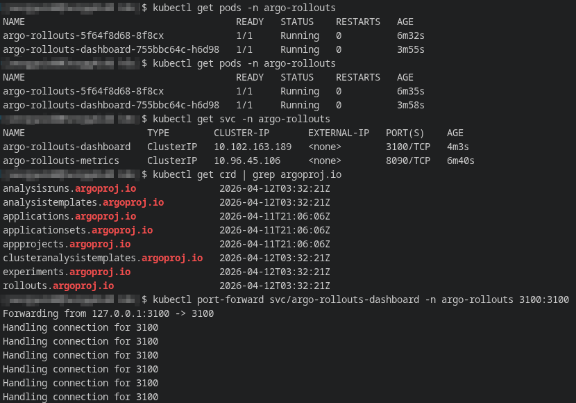
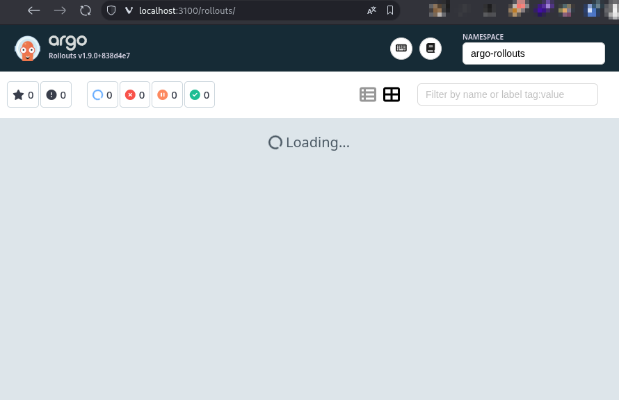
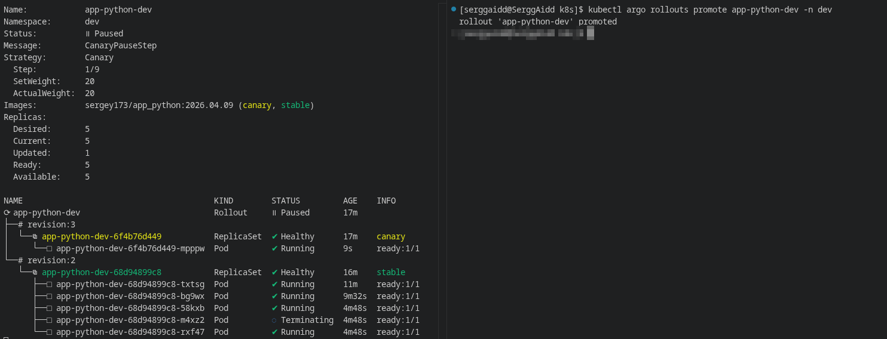
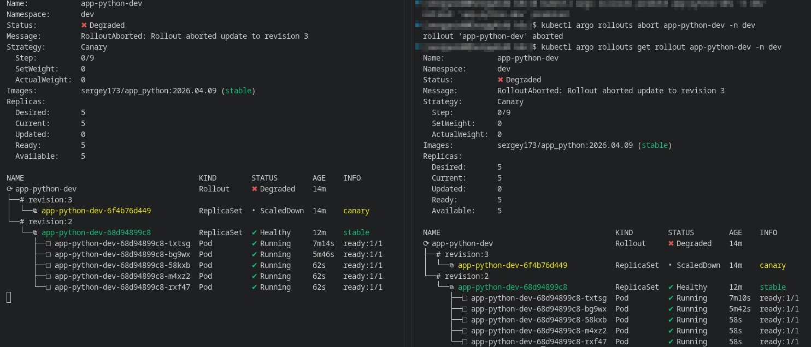
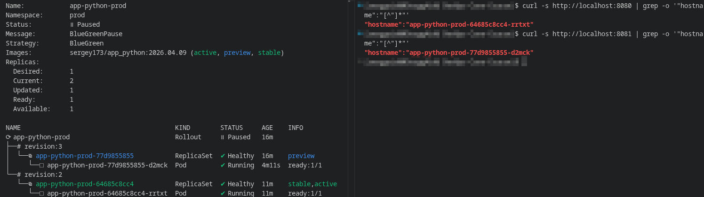
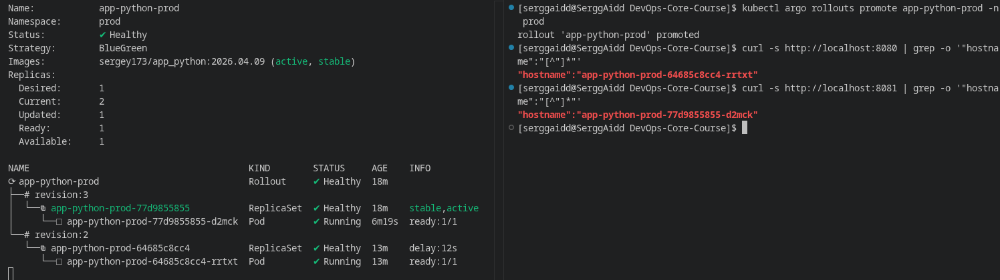
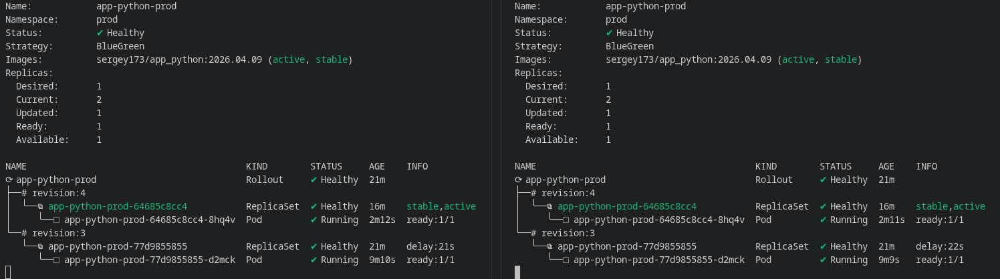

# ROLLOUTS.md

## 1. Argo Rollouts Setup
### Installation verification

The Argo Rollouts controller was installed in the `argo-rollouts` namespace using the official installation manifest. After installation, the pod status was checked, the presence of Argo Rollouts CRD resources was verified, and the `kubectl` plugin was running.

### Dashboard access

The Argo Rollouts Dashboard was installed separately and exposed via port-forward to localhost:3100 . This allowed visual monitoring of the status of rollout resources and progressive delivery steps.

---

## 2. Canary Deployment
For canary deployment, the default Kubernetes `Deployment` in the `app-python` Helm chart was replaced with the `Rollout` resource. For the `dev` environment, the `canary` strategy was enabled in `values-dev.yaml`, and the number of replicas was increased to 5 to clearly show the progressive rollout steps.

### Strategy Configuration
Canary logic was implemented in `templates/rollout.yaml` via the `strategy.canary.steps` block. The following rollout steps were configured:
- 20% traffic - manual pause;
- 40% traffic - 30-second pause;
- 60% traffic - 30-second pause;
- 80% traffic - 30-second pause;
- 100% traffic.

A new rollout was triggered by changing the `releaseVersion` value in `values-dev.yaml`, which resulted in the creation of a new revision ReplicaSet without changing the image tag.

### Rollout Progression

At this point, the canary rollout has reached its first control step. The new revision received 20% of traffic, after which the process was automatically switched to the `Paused` state with the `CanaryPauseStep` message. This confirms that the first stage of the progressive rollout worked correctly: the new version was deployed to only a portion of traffic, and further rollout required manual confirmation. This mechanism allows you to test the update's behavior before it is further rolled out to users.

### Promotion and Abort Demonstration

At this point, the canary rollout was stopped until the new revision was fully deployed. After the interruption, the process entered the `Degraded` state, the `RolloutAborted` flag appeared, and the canary ReplicaSet began to be decommissioned. The stable revision, however, remained the primary one and continued serving traffic. This confirms that the rollback mechanism for canary deployment worked correctly and the system returned to its previous stable state.

---

## 3. Blue-Green Deployment
For blue-green deployment, a separate `values-prod.yaml` configuration was used in the `prod` namespace.

### Strategy Configuration
Blue-green logic was implemented in `templates/rollout.yaml` via fields:
- `activeService`;
- `previewService`;
- `autoPromotionEnabled: false`;
- `scaleDownDelaySeconds: 30`.
In this setup, traffic isn't distributed based on percentages, as in canary deployments. Instead, the current stable version continues to serve production traffic through the `activeService`, while the new revision is deployed separately and made available through the `previewService`. This allowed the new version to be tested in isolation, without affecting production traffic, and then the active service to be manually switched to the new revision.

### Preview vs Active Service

At this point, rollout was in the `BlueGreenPause` state, meaning the new revision had already been deployed, but production traffic had not yet been switched to it. One revision remained `stable, active`, and the other was available as `preview`. An additional check using `curl` revealed that `localhost:8080` and `localhost:8081` pointed to different pods. This confirms that the active service and preview service were indeed serving different revisions, which is the basis of the blue-green approach before traffic was switched.

### Promotion Process

After the rollout was confirmed, the new revision was promoted to primary. At this point, it received the status `stable, active`, and the previous revision entered the `delay` state, meaning it began to be removed from the active loop. This confirms that the transition of production traffic to the new version was successful, and the blue-green rollout completed the cutover phase without any phased traffic distribution.

### Rollback

After rollback was initiated, the previous revision was restored and became `stable,active` again. This confirmed that blue-green rollback could return production traffic to the previous version through another controlled service switch.

---

## 4. Strategy Comparison

| Aspect | Canary | Blue-Green |
|---|---|---|
| How it works | Gradually increase traffic share | Complete traffic switching between two revisions |
| Risk at the start | Lower, since the new version only receives a portion of the requests | Higher at the time of switching, since active traffic changes immediately |
| New version testing | Gradually on real traffic | Through a separate preview service before switching |
| Rollback speed | Fast | Almost instantaneous after switching again |
| Resource consumption | Lower | Higher, since two revisions are running simultaneously |
| Convenient scenario | Regular releases and gradual validation | Major changes, manual acceptance, isolated preview testing |

Canary makes sense when you need to gradually test a new version on real traffic and reduce the blast radius of a potential error. Blue-green, on the other hand, is better suited for scenarios that require a clear separation between production and preview, manual validation of the new version before switching, and easier reversion after cutover. Accordingly, canary is more convenient for typical application updates and frequent releases, while blue-green is better suited for more important changes, configuration updates, and scenarios that require a separate preview endpoint.

---

## CLI Commands Reference
### Setup
```bash
kubectl create namespace argo-rollouts
kubectl apply -n argo-rollouts -f https://github.com/argoproj/argo-rollouts/releases/latest/download/install.yaml
kubectl apply -n argo-rollouts -f https://github.com/argoproj/argo-rollouts/releases/latest/download/dashboard-install.yaml
kubectl argo rollouts version
kubectl get pods -n argo-rollouts
kubectl get crd | grep argoproj.io
kubectl port-forward svc/argo-rollouts-dashboard -n argo-rollouts 3100:3100
```

### Helm Validation and Deploy
```bash
helm lint ./app-python
helm template app-python-dev ./app-python -f ./app-python/values-dev.yaml
helm template app-python-prod ./app-python -f ./app-python/values-prod.yaml

helm upgrade --install app-python-dev ./app-python -n dev --create-namespace -f ./app-python/values-dev.yaml
helm upgrade --install app-python-prod ./app-python -n prod --create-namespace -f ./app-python/values-prod.yaml
```

### Canary Monitoring and Control
```bash
kubectl get rollout -n dev
kubectl argo rollouts get rollout app-python-dev -n dev -w
kubectl argo rollouts promote app-python-dev -n dev
kubectl argo rollouts abort app-python-dev -n dev
kubectl argo rollouts retry rollout app-python-dev -n dev
```

### Blue-Green Monitoring and Control
```bash
kubectl get rollout -n prod
kubectl get svc -n prod
kubectl argo rollouts get rollout app-python-prod -n prod -w
kubectl argo rollouts promote app-python-prod -n prod
kubectl argo rollouts undo app-python-prod -n prod
```

### Preview and Active Verification
```bash
kubectl -n prod port-forward svc/app-python-prod 8080:80
kubectl -n prod port-forward svc/app-python-prod-preview 8081:80

curl -s http://localhost:8080 | grep -o '"hostname":"[^"]*"'
curl -s http://localhost:8081 | grep -o '"hostname":"[^"]*"'
```

### Troubleshooting
```bash
kubectl get pods -A
kubectl get svc -n dev
kubectl get svc -n prod
kubectl describe rollout app-python-dev -n dev
kubectl describe rollout app-python-prod -n prod
kubectl get endpoints -n prod app-python-prod app-python-prod-preview -o wide
```
