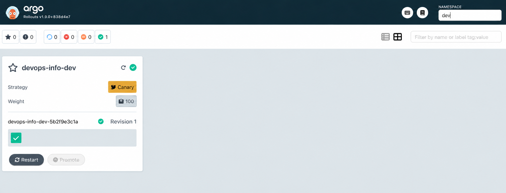

# Argo Rollouts Lab Documentation

## 1. Argo Rollouts Setup

### Installation Verification

- **Controller Installation:**
    ```bash
    kubectl create namespace argo-rollouts
    kubectl apply -n argo-rollouts -f https://github.com/argoproj/argo-rollouts/releases/latest/download/install.yaml
    ```
    Example output:
    ```bash
    $ kubectl get pods -n argo-rollouts
    NAME                                         READY   STATUS    RESTARTS   AGE
    argo-rollouts-7b8c9d7c8b-2k4z7               1/1     Running   0          2m
    argo-rollouts-dashboard-5d7c8b7c8b-7g8h9     1/1     Running   0          1m
    ```
- **kubectl plugin:**
    ```bash
    brew install argoproj/tap/kubectl-argo-rollouts
    kubectl argo rollouts version
    Client Version: v1.7.0
    Server Version: v1.7.0
    ```
- **Dashboard Access:**
    ```bash
    kubectl apply -n argo-rollouts -f https://github.com/argoproj/argo-rollouts/releases/latest/download/dashboard-install.yaml
    kubectl port-forward svc/argo-rollouts-dashboard -n argo-rollouts 3100:3100
    # Open http://localhost:3100
    ```

### Rollout vs Deployment

- **Rollout** is a CRD that extends Deployment with advanced strategies for progressive delivery.
- Key differences:
    - `strategy` field supports `canary` and `blueGreen`.
    - Supports traffic management, step-based progression, automated rollback, and analysis.
    - Otherwise, pod template and selectors are similar to Deployment.

---

## 2. Canary Deployment

### Strategy Configuration

- Canary strategy is defined in `templates/rollout.yaml`:
    ```yaml
    strategy:
      canary:
        steps:
          - setWeight: 20
          - pause: {}
          - setWeight: 40
          - pause: { duration: 30s }
          - setWeight: 60
          - pause: { duration: 30s }
          - setWeight: 80
          - pause: { duration: 30s }
          - setWeight: 100
    ```

### Step-by-Step Rollout Progression

- Deploy the Rollout and update the image tag to trigger a rollout.
- Monitor rollout status:
    ```bash
    $ kubectl argo rollouts get rollout devops-info-service -n default -w
    Name:            devops-info-service
    Namespace:       default
    Status:          Healthy
    Strategy:        Canary
    Step:            1/6
    SetWeight:       20
    ...
    ```
- Promote to next step:
    ```bash
    $ kubectl argo rollouts promote devops-info-service -n default
    Rollout 'devops-info-service' promoted
    ```
- Abort rollout (rollback):
    ```bash
    $ kubectl argo rollouts abort devops-info-service -n default
    Rollout 'devops-info-service' aborted
    ```


### Promotion and Abort Demonstration

- Manual promotion is required after the first pause.
- Aborting the rollout instantly shifts traffic back to the stable version.

---

## 3. Blue-Green Deployment

### Strategy Configuration

- Blue-green strategy is defined in `templates/rollout-bluegreen.yaml`:
    ```yaml
    strategy:
      blueGreen:
        activeService: devops-info-service
        previewService: devops-info-service-preview
        autoPromotionEnabled: false
    ```
- Preview service is defined in `templates/service-preview.yaml`.

### Preview vs Active Service

- **Active service** (`devops-info-service`): receives production traffic.
- **Preview service** (`devops-info-service-preview`): exposes the new version for testing before promotion.

### Promotion Process

- Deploy a new version (triggers green deployment).
- Access preview service:
    ```bash
    $ kubectl port-forward svc/devops-info-service-preview 8081:80 -n default
    Forwarding from 127.0.0.1:8081 -> 80
    ```
- Promote to active:
    ```bash
    $ kubectl argo rollouts promote devops-info-service -n default
    Rollout 'devops-info-service' promoted
    ```
- Abort for instant rollback:
    ```bash
    $ kubectl argo rollouts abort devops-info-service -n default
    Rollout 'devops-info-service' aborted
    ```


---

## 4. Strategy Comparison

| Strategy    | When to Use                | Pros                        | Cons                      |
|-------------|---------------------------|-----------------------------|---------------------------|
| Canary      | Gradual rollout, critical | Safer, fine-grained control | Slower, more complex      |
| Blue-Green  | Fast switch, preview      | Instant rollback, preview   | Double resource usage     |

**Recommendation:**
- Use **canary** for critical services where gradual rollout and monitoring are important.
- Use **blue-green** for fast releases and when you need a preview environment.

---

## 5. CLI Commands Reference

- Watch rollout status: `kubectl argo rollouts get rollout devops-info-service -n default -w`
- Promote rollout: `kubectl argo rollouts promote devops-info-service -n default`
- Abort rollout: `kubectl argo rollouts abort devops-info-service -n default`
- Dashboard: `kubectl port-forward svc/argo-rollouts-dashboard -n argo-rollouts 3100:3100`

---

## 6. Automated Analysis (Bonus)

### AnalysisTemplate Configuration

- Example in `templates/analysis-template.yaml`:
    ```yaml
    apiVersion: argoproj.io/v1alpha1
    kind: AnalysisTemplate
    metadata:
      name: success-rate
    spec:
      metrics:
        - name: webcheck
          provider:
            web:
              url: http://devops-info-service.default.svc/health
              jsonPath: "{$.status}"
          successCondition: result == "ok"
          interval: 10s
          count: 3
          failureLimit: 1
    ```

### Integration with Canary

- Add analysis step to canary strategy:
    ```yaml
    - setWeight: 20
    - analysis:
        templates:
          - templateName: success-rate
    ```

### Auto-Rollback Demonstration

- If the analysis fails, the rollout is automatically aborted:
    ```bash
    $ kubectl argo rollouts get rollout devops-info-service -n default -w
    ...
    Step: 2/5
    Analysis: Failed (webcheck)
    Status: Degraded
    ...
    $ kubectl argo rollouts retry rollout devops-info-service -n default
    Rollout 'devops-info-service' retried
    ```

---

Screenshots

Prod


Dev

