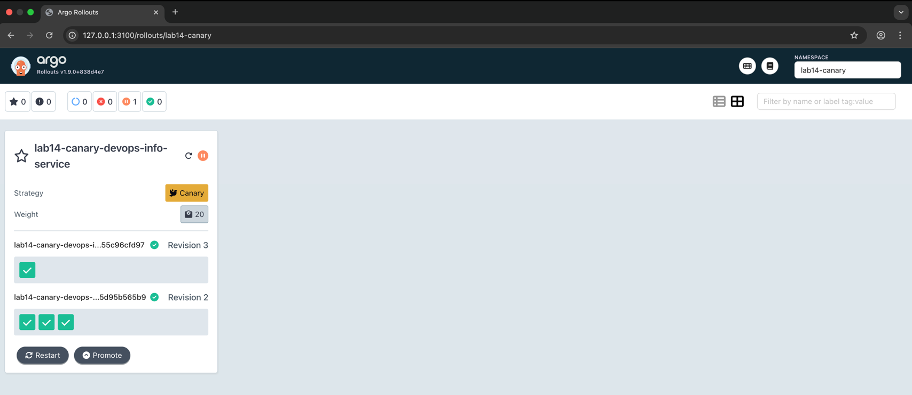
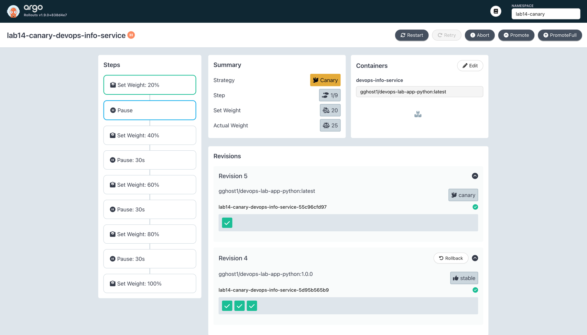
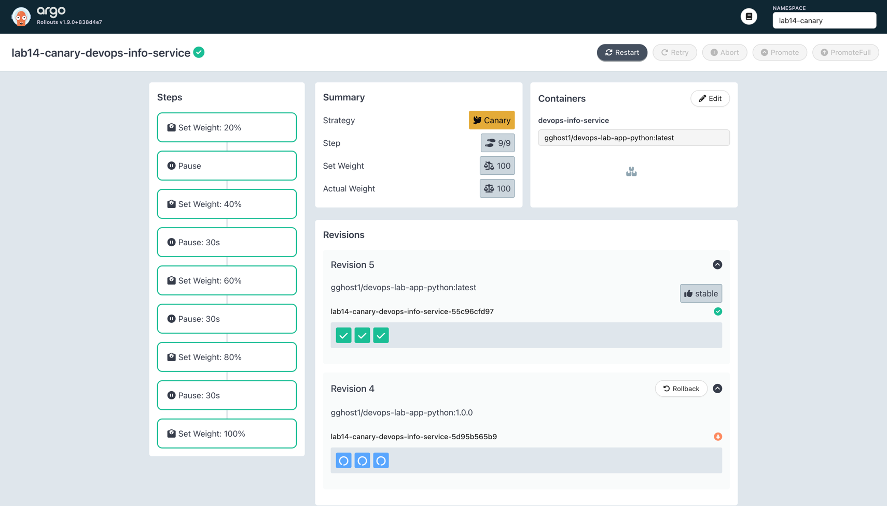
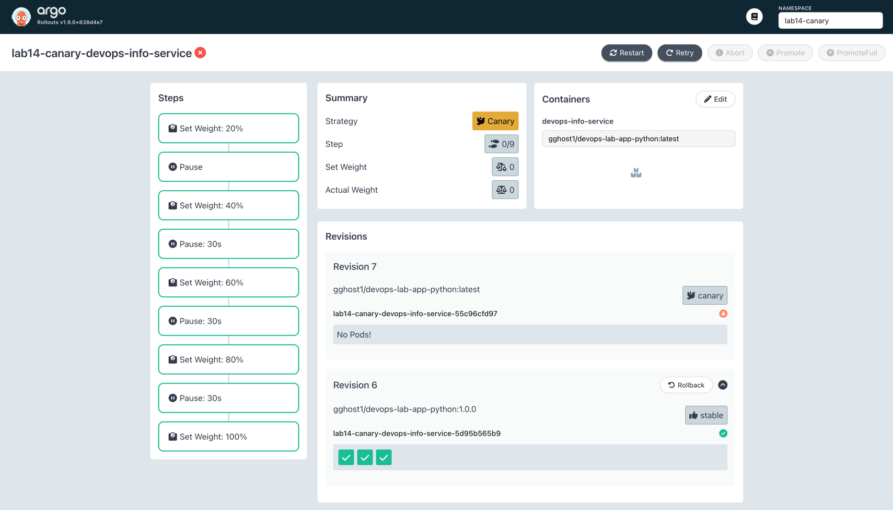
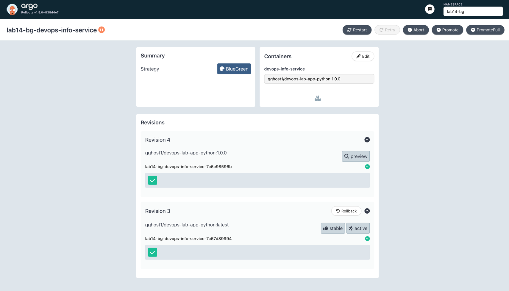
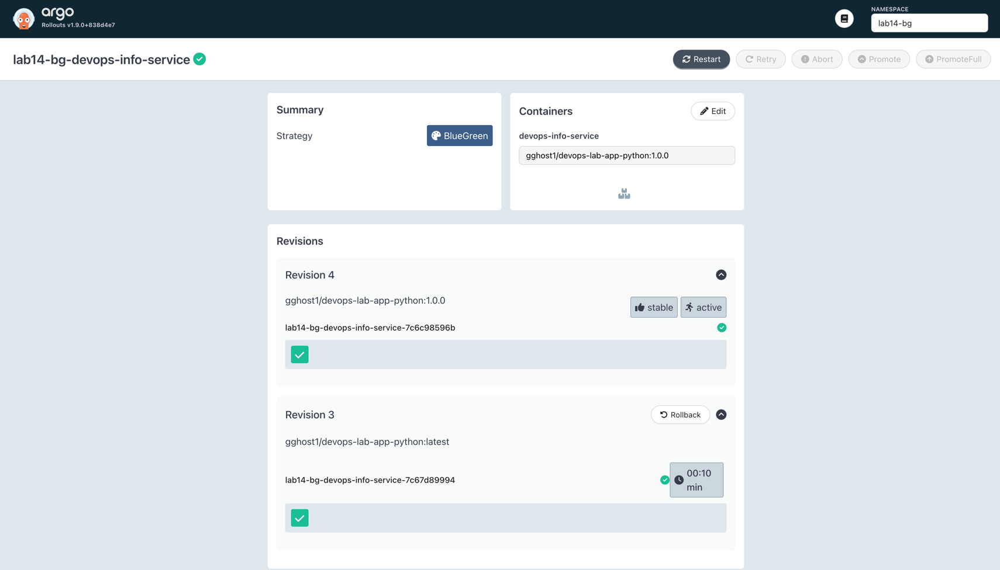
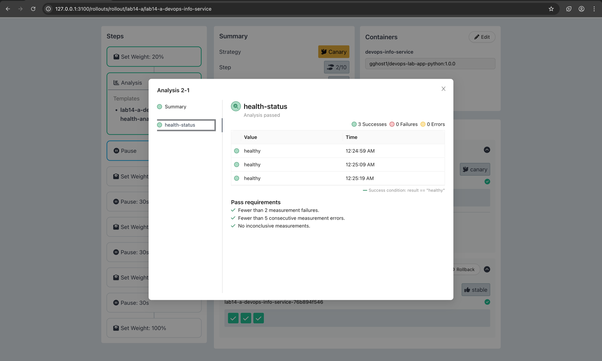

# Progressive Delivery with Argo Rollouts (Lab 14)

Lab 14 — progressive delivery with Argo Rollouts (`k8s/ROLLOUTS.md` per `labs/lab14.md` Task 4; bonus analysis in section 6).

---

## 1. Argo Rollouts Setup

### Installation (controller)

Per lab hints, the controller is installed into `argo-rollouts`:

```bash
kubectl create namespace argo-rollouts
kubectl apply -n argo-rollouts -f https://github.com/argoproj/argo-rollouts/releases/latest/download/install.yaml
```

### Installation verification

```bash
kubectl get pods -n argo-rollouts
```

Result:

```
NAME                                      READY   STATUS    RESTARTS   AGE
argo-rollouts-5f64f8d68-sgpkx             1/1     Running   0          20h
argo-rollouts-dashboard-755bbc64c-fdn7p   1/1     Running   0          20h
```

Conclusion: the Argo Rollouts controller and dashboard workloads are running.

### kubectl plugin

```bash
brew install argoproj/tap/kubectl-argo-rollouts
kubectl argo rollouts version
```

Evidence:

```
kubectl-argo-rollouts: v1.8.3+49fa151
  BuildDate: 2025-06-04T22:19:21Z
  GitCommit: 49fa1516cf71672b69e265267da4e1d16e1fe114
  GitTreeState: clean
  GoVersion: go1.23.9
  Compiler: gc
  Platform: darwin/amd64
```

### Dashboard

```bash
kubectl apply -n argo-rollouts -f https://github.com/argoproj/argo-rollouts/releases/latest/download/dashboard-install.yaml
kubectl argo rollouts dashboard
```

```
Argo Rollouts Dashboard is now available at http://localhost:3100/rollouts
```

Open **`http://127.0.0.1:3100/rollouts/`** in **Chrome or Edge** (the UI uses gRPC-Web; Safari shows an endless spinner).



### Rollout vs Deployment (Task 1 — concepts)

| Aspect                    | `Deployment` (`apps/v1`)     | `Rollout` (`argoproj.io/v1alpha1`)                            |
|---------------------------|------------------------------|---------------------------------------------------------------|
| Progressive delivery      | `RollingUpdate` / `Recreate` | `canary` or `blueGreen` with steps, pauses, optional analysis |
| Traffic / rollout control | ReplicaSet controller only   | Argo Rollouts controller + strategy fields                    |
| Typical use               | Standard app rollouts        | Canary, blue/green, experiments, analysis hooks               |

In this repo, the Helm chart uses `k8s/devops-info-service/templates/rollout.yaml` instead of a `Deployment` manifest, with strategy chosen via `values.yaml` (`rollout.strategy`: `canary` or `blueGreen`).

---

## 2. Canary Deployment

### Strategy configuration

Canary is configured in `k8s/devops-info-service/values.yaml` under `rollout.strategy: canary` and `rollout.canary.steps`, matching the lab requirement:

- **20%** → **pause** (manual promotion: empty `pause: {}`)
- **40%** → **pause 30s**
- **60%** → **pause 30s**
- **80%** → **pause 30s**
- **100%**

The rendered `Rollout` object is produced by `k8s/devops-info-service/templates/rollout.yaml`.

Example install:

```bash
helm upgrade --install lab14-canary ./k8s/devops-info-service -n lab14-canary --create-namespace \
  --set service.nodePort=30084
```

Result:

```
Release "lab14-canary" has been upgraded. Happy Helming!
NAME: lab14-canary
LAST DEPLOYED: Fri Apr 17 21:09:08 2026
NAMESPACE: lab14-canary
STATUS: deployed
REVISION: 2
DESCRIPTION: Upgrade complete
TEST SUITE: None
NOTES:
This chart deploys `devops-info-service` as an Argo Rollouts `Rollout` and `Service` (plus `Service` preview when `rollout.strategy=blueGreen`).

To check resources:
  kubectl get rollout -l app.kubernetes.io/name=devops-info-service
  kubectl get pods -l app.kubernetes.io/name=devops-info-service
  kubectl get svc -l app.kubernetes.io/name=devops-info-service

Rollouts CLI:
  kubectl argo rollouts get rollout lab14-canary-devops-info-service -n lab14-canary -w
  kubectl argo rollouts promote lab14-canary-devops-info-service -n lab14-canary
  kubectl argo rollouts abort lab14-canary-devops-info-service -n lab14-canary

Service access:
  NodePort: 30084
  In Minikube you can use:
    minikube service lab14-canary-devops-info-service --url
```

### Trigger a rollout (image change)

```bash
kubectl argo rollouts set image lab14-canary-devops-info-service \
  devops-info-service=gghost1/devops-lab-app-python:latest \
  -n lab14-canary
```

Result:

```
rollout "lab14-canary-devops-info-service" image updated
```

### Step-by-step progression (CLI evidence)

```bash
kubectl argo rollouts get rollout lab14-canary-devops-info-service -n lab14-canary
```

Evidence (paused at the first manual step):

```
Name:            lab14-canary-devops-info-service
Namespace:       lab14-canary
Status:          ॥ Paused
Message:         CanaryPauseStep
Strategy:        Canary
  Step:          1/9
  SetWeight:     20
  ActualWeight:  25
Images:          gghost1/devops-lab-app-python:1.0.0 (stable)
                 gghost1/devops-lab-app-python:latest (canary)
Replicas:
  Desired:       3
  Current:       4
  Updated:       1
  Ready:         4
  Available:     4

NAME                                                          KIND        STATUS     AGE  INFO
⟳ lab14-canary-devops-info-service                            Rollout     ॥ Paused   21h  
├──# revision:5                                                                           
│  └──⧉ lab14-canary-devops-info-service-55c96cfd97           ReplicaSet  ✔ Healthy  21h  canary
│     └──□ lab14-canary-devops-info-service-55c96cfd97-j4sjs  Pod         ✔ Running  65s  ready:1/1
└──# revision:4                                                                           
   └──⧉ lab14-canary-devops-info-service-5d95b565b9           ReplicaSet  ✔ Healthy  21h  stable
      ├──□ lab14-canary-devops-info-service-5d95b565b9-pjdtd  Pod         ✔ Running  21h  ready:1/1
      ├──□ lab14-canary-devops-info-service-5d95b565b9-2qhbv  Pod         ✔ Running  20h  ready:1/1
      └──□ lab14-canary-devops-info-service-5d95b565b9-q9bnt  Pod         ✔ Running  20h  ready:1/1
```



Manual promotion to continue:

```bash
kubectl argo rollouts promote lab14-canary-devops-info-service -n lab14-canary
```

Evidence (completed canary):

```
Name:            lab14-canary-devops-info-service
Namespace:       lab14-canary
Status:          ✔ Healthy
Strategy:        Canary
  Step:          9/9
  SetWeight:     100
  ActualWeight:  100
Images:          gghost1/devops-lab-app-python:latest (stable)
Replicas:
  Desired:       3
  Current:       3
  Updated:       3
  Ready:         3
  Available:     3

NAME                                                          KIND        STATUS        AGE    INFO
⟳ lab14-canary-devops-info-service                            Rollout     ✔ Healthy     21h    
├──# revision:5                                                                                
│  └──⧉ lab14-canary-devops-info-service-55c96cfd97           ReplicaSet  ✔ Healthy     21h    stable
│     ├──□ lab14-canary-devops-info-service-55c96cfd97-j4sjs  Pod         ✔ Running     2m48s  ready:1/1
│     ├──□ lab14-canary-devops-info-service-55c96cfd97-t5k7b  Pod         ✔ Running     46s    ready:1/1
│     └──□ lab14-canary-devops-info-service-55c96cfd97-b8zp6  Pod         ✔ Running     41s    ready:1/1
└──# revision:4                                                                                
   └──⧉ lab14-canary-devops-info-service-5d95b565b9           ReplicaSet  • ScaledDown  21h    
```



### Promotion and abort demonstration

**Abort during rollout:**

```bash
kubectl argo rollouts set image lab14-canary-devops-info-service \                
  devops-info-service=gghost1/devops-lab-app-python:latest \
  -n lab14-canary
kubectl argo rollouts abort lab14-canary-devops-info-service -n lab14-canary
kubectl argo rollouts get rollout lab14-canary-devops-info-service -n lab14-canary
```

Evidence:

```
rollout 'lab14-canary-devops-info-service' aborted
Name:            lab14-canary-devops-info-service
Namespace:       lab14-canary
Status:          ✖ Degraded
Message:         RolloutAborted: Rollout aborted update to revision 7
Strategy:        Canary
  Step:          0/9
  SetWeight:     0
  ActualWeight:  0
Images:          gghost1/devops-lab-app-python:1.0.0 (stable)
Replicas:
  Desired:       3
  Current:       3
  Updated:       0
  Ready:         3
  Available:     3

NAME                                                          KIND        STATUS         AGE   INFO
⟳ lab14-canary-devops-info-service                            Rollout     ✖ Degraded     21h   
├──# revision:7                                                                                
│  └──⧉ lab14-canary-devops-info-service-55c96cfd97           ReplicaSet  • ScaledDown   21h   canary
│     └──□ lab14-canary-devops-info-service-55c96cfd97-p8vww  Pod         ◌ Terminating  9s    ready:1/1
└──# revision:6                                                                                
   └──⧉ lab14-canary-devops-info-service-5d95b565b9           ReplicaSet  ✔ Healthy      21h   stable
      ├──□ lab14-canary-devops-info-service-5d95b565b9-dv8rg  Pod         ✔ Running      110s  ready:1/1
      ├──□ lab14-canary-devops-info-service-5d95b565b9-ncw2c  Pod         ✔ Running      78s   ready:1/1
      └──□ lab14-canary-devops-info-service-5d95b565b9-msn4k  Pod         ✔ Running      72s   ready:1/1
```



Conclusion: abort stops the progressive release and returns stable traffic to the previous ReplicaSet revision (per controller behavior observed in CLI output).

---

## 3. Blue-Green Deployment

### Strategy configuration

Blue/green is enabled via `k8s/devops-info-service/values-bluegreen.yaml` (overrides `rollout.strategy: blueGreen`).

Helm renders:

- **Active** Service: `{{ fullname }}` (same selector family as the `Rollout` pods; controller routes “active” traffic)
- **Preview** Service: `{{ fullname }}-preview` from `k8s/devops-info-service/templates/service-preview.yaml`
- **autoPromotionEnabled**: `false` (manual promotion), per `rollout.blueGreen.autoPromotionEnabled`

Example install:

```bash
helm upgrade --install lab14-bg ./k8s/devops-info-service -n lab14-bg --create-namespace \
  -f k8s/devops-info-service/values-bluegreen.yaml \
  --set service.nodePort=30085
```

### Preview vs active service

```bash
kubectl get svc -n lab14-bg
```

Evidence:

```
NAME                                   TYPE        CLUSTER-IP      EXTERNAL-IP   PORT(S)        AGE
lab14-bg-devops-info-service           NodePort    10.104.61.191   <none>        80:30085/TCP   21h
lab14-bg-devops-info-service-preview   ClusterIP   10.101.250.89   <none>        80/TCP         21h
```

```bash
kubectl port-forward svc/lab14-bg-devops-info-service -n lab14-bg 18080:80
kubectl port-forward svc/lab14-bg-devops-info-service-preview -n lab14-bg 18081:80
```

### Promotion process

Trigger a new version (preview stack):

```bash
kubectl argo rollouts set image lab14-bg-devops-info-service \
  devops-info-service=gghost1/devops-lab-app-python:1.0.0 \
  -n lab14-bg
kubectl argo rollouts get rollout lab14-bg-devops-info-service -n lab14-bg    
```

Evidence (paused for blue/green):

```
rollout "lab14-bg-devops-info-service" image updated
Name:            lab14-bg-devops-info-service
Namespace:       lab14-bg
Status:          ॥ Paused
Message:         BlueGreenPause
Strategy:        BlueGreen
Images:          gghost1/devops-lab-app-python:1.0.0 (preview)
                 gghost1/devops-lab-app-python:latest (stable, active)
Replicas:
  Desired:       1
  Current:       2
  Updated:       1
  Ready:         1
  Available:     1

NAME                                                      KIND        STATUS     AGE  INFO
⟳ lab14-bg-devops-info-service                            Rollout     ॥ Paused   21h  
├──# revision:4                                                                       
│  └──⧉ lab14-bg-devops-info-service-7c6c98596b           ReplicaSet  ✔ Healthy  21h  preview
│     └──□ lab14-bg-devops-info-service-7c6c98596b-xql4c  Pod         ✔ Running  41s  ready:1/1
└──# revision:3                                                                       
   └──⧉ lab14-bg-devops-info-service-7c67d89994           ReplicaSet  ✔ Healthy  21h  stable,active
      └──□ lab14-bg-devops-info-service-7c67d89994-27fnw  Pod         ✔ Running  21h  ready:1/1
```



Promote preview → active:

```bash
kubectl argo rollouts promote lab14-bg-devops-info-service -n lab14-bg
```



Instant rollback demonstration:

```bash
kubectl argo rollouts undo lab14-bg-devops-info-service -n lab14-bg
```


Conclusion: promotion performs a fast cutover compared to gradual canary steps; `undo` provides a quick rollback path after promotion.

---

## 4. Strategy Comparison

### When to use canary vs blue-green

| Situation                                                  | Prefer     | Reason                                                   |
|------------------------------------------------------------|------------|----------------------------------------------------------|
| Reduce blast radius; expose a % of traffic first           | Canary     | Gradual shift + pauses for validation                    |
| Need a dedicated “preview” endpoint before switching users | Blue/green | Separate preview Service from active                     |
| Resource budget is tight                                   | Canary     | Often fewer “full second stacks” than classic blue/green |
| Need an all-or-nothing switch after validation             | Blue/green | Clear promotion event                                    |

### Pros and cons

**Canary**

- Pros: incremental risk, supports manual gates, fits long-running validation.
- Cons: mixed traffic phases can complicate debugging; step tuning required.

**Blue/green**

- Pros: clear preview vs production; fast switch after promotion.
- Cons: can require more concurrent capacity while both stacks exist.

### Recommendation

- Use **canary** for production releases where you want measured exposure and time-bounded pauses.
- Use **blue/green** when stakeholders must validate the new build on a stable preview URL before a single cutover.

---

## 5. CLI Commands Reference

### Commands used in this lab

```bash
kubectl argo rollouts get rollout <rollout-name> -n <namespace> -w
kubectl argo rollouts set image <rollout-name> <container>=<image> -n <namespace>
kubectl argo rollouts promote <rollout-name> -n <namespace>
kubectl argo rollouts abort <rollout-name> -n <namespace>
kubectl argo rollouts retry rollout <rollout-name> -n <namespace>
kubectl argo rollouts undo <rollout-name> -n <namespace>
```

### Monitoring and troubleshooting

```bash
kubectl get rollout -n <namespace>
kubectl describe rollout <rollout-name> -n <namespace>
kubectl get replicaset -n <namespace>
kubectl get pods -n <namespace>
```

---

## 6. Bonus: Automated Analysis (Lab 14 Bonus)

### AnalysisTemplate configuration

When `rollout.analysis.enabled` is `true` (see `k8s/devops-info-service/values-canary-with-analysis.yaml`), Helm renders:

- `k8s/devops-info-service/templates/analysis-template.yaml`

The template uses a **web** provider to query the Service health endpoint and evaluate JSON:

- URL pattern: `http://<release-fullname>.<namespace>.svc.cluster.local:<service-port>/health`
- JSONPath: `{$.status}`
- Success: `result == "healthy"`
- Sampling: `interval`, `count`, `failureLimit` from `values.yaml` (`rollout.analysis.*`)

### Integration with canary

With analysis enabled, the canary steps include an `analysis` step after `setWeight: 20` (see `k8s/devops-info-service/templates/rollout.yaml`).

Example install:

```bash
helm upgrade --install lab14-a ./k8s/devops-info-service -n lab14-a --create-namespace \
  -f k8s/devops-info-service/values.yaml \
  -f k8s/devops-info-service/values-canary-with-analysis.yaml \
  --set service.nodePort=30086
```

### How success/failure is determined

- Each metric run fetches the web URL and evaluates `successCondition`.
- Failures increment toward `failureLimit`; success requires enough successful measurements (`count` at `interval`).

### Evidence (AnalysisRun)

```bash
kubectl get analysisrun -n lab14-a
```

Result:

```
NAME                                        STATUS       AGE
lab14-a-devops-info-service-99895cc9d-2-1   Successful   21h
```


