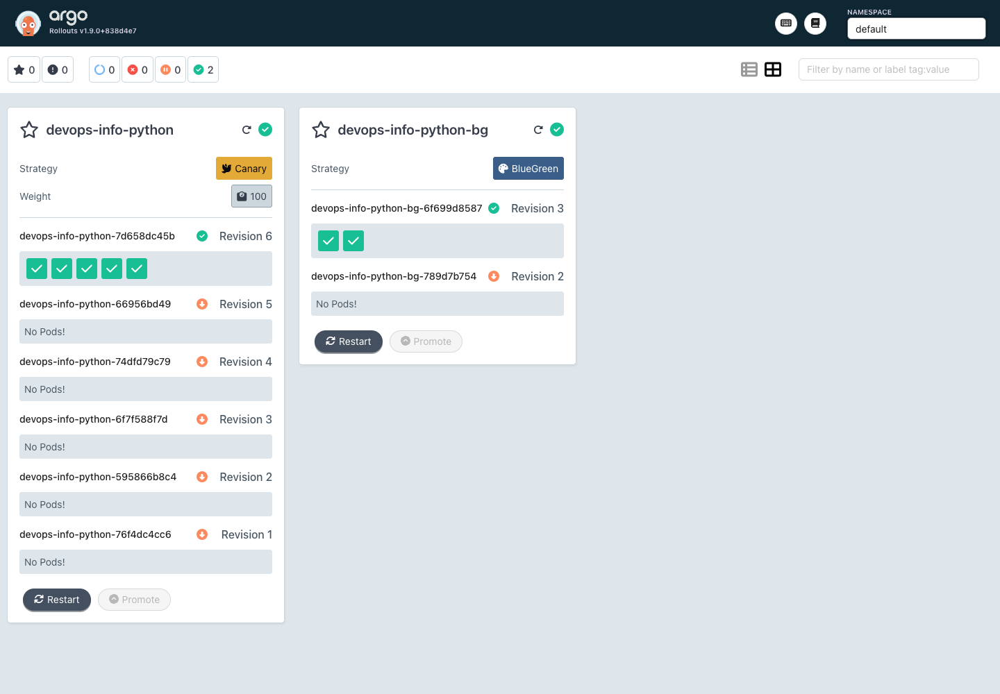
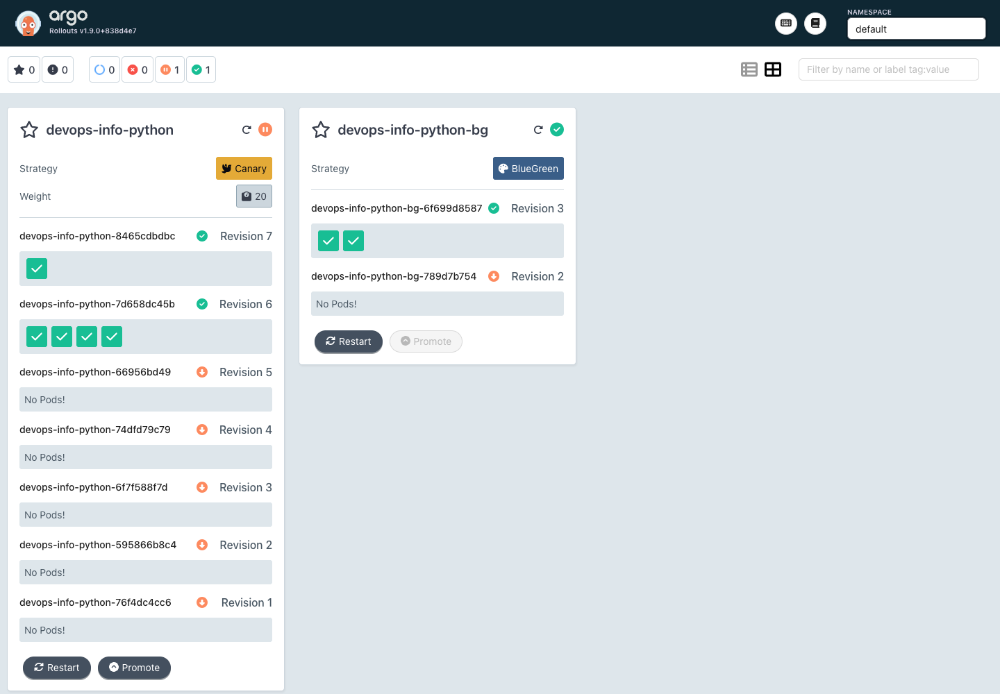

# Lab 14 - Progressive Delivery with Argo Rollouts

## Argo Rollouts Setup

Argo Rollouts is installed into a dedicated namespace:

```bash
kubectl create namespace argo-rollouts
kubectl apply -n argo-rollouts \
  -f https://github.com/argoproj/argo-rollouts/releases/latest/download/install.yaml
kubectl apply -n argo-rollouts \
  -f https://github.com/argoproj/argo-rollouts/releases/latest/download/dashboard-install.yaml
kubectl wait --for=condition=available deployment/argo-rollouts \
  -n argo-rollouts --timeout=180s
```

The dashboard is exposed locally with:

```bash
kubectl port-forward svc/argo-rollouts-dashboard -n argo-rollouts 3100:3100
```

Open `http://localhost:3100` to inspect Rollouts, ReplicaSets, AnalysisRuns, and promotion or abort state.

The kubectl plugin is installed with Homebrew on macOS:

```bash
brew install argoproj/tap/kubectl-argo-rollouts
kubectl argo rollouts version
```

Local verification on April 29, 2026:

```text
deployment.apps/argo-rollouts             1/1     1            1
deployment.apps/argo-rollouts-dashboard   1/1     1            1
kubectl-argo-rollouts: v1.8.3+49fa151
```

Dashboard view:



## Rollout vs Deployment

The Python Helm chart now renders a `Rollout` instead of a `Deployment` when `rollout.enabled=true` in `k8s/python-app/values.yaml`. A Rollout keeps the familiar Deployment fields: `replicas`, `selector`, pod template, probes, resource limits, service account, ConfigMaps, Secrets, and PVCs. The important difference is `spec.strategy`: Rollouts support canary and blue-green strategies, analysis gates, manual pauses, aborts, and promotions.

The old Deployment template is still available for compatibility:

```bash
helm template devops-info-python k8s/python-app --set rollout.enabled=false
```

## Canary Deployment

The default chart strategy is canary:

```yaml
rollout:
  enabled: true
  strategy: canary
  canary:
    maxSurge: 1
    maxUnavailable: 0
    steps:
      - setWeight: 20
      - pause: {}
      - analysis:
          templates:
            - templateName: '{{ include "common.fullname" . }}-success-rate'
      - setWeight: 40
      - pause:
          duration: 30s
      - setWeight: 60
      - pause:
          duration: 30s
      - setWeight: 80
      - pause:
          duration: 30s
      - setWeight: 100
```

The first pause is manual. This gives an operator a chance to inspect logs, metrics, and the dashboard before any automatic progression. After promotion, the rollout runs the health analysis and then advances through 40%, 60%, 80%, and 100% with 30 second pauses.

Deploy and watch the canary:

```bash
helm upgrade --install devops-info-python k8s/python-app --namespace default
kubectl argo rollouts get rollout devops-info-python -w
```

Trigger a new revision by changing a value that affects the pod template:

```bash
helm upgrade --install devops-info-python k8s/python-app \
  --namespace default \
  --set env.RELEASE_TRACK=canary-v2
```

Promote past the first manual gate:

```bash
kubectl argo rollouts promote devops-info-python
```

Abort test:

```bash
helm upgrade --install devops-info-python k8s/python-app \
  --namespace default \
  --set env.RELEASE_TRACK=canary-abort-test
kubectl argo rollouts abort devops-info-python
kubectl argo rollouts get rollout devops-info-python
```

After abort, Argo Rollouts scales the new ReplicaSet down and returns traffic to the stable ReplicaSet selected by the active Service.

Canary paused at the first 20% manual gate:



## Blue-Green Deployment

Blue-green is enabled with `k8s/python-app/values-bluegreen.yaml`:

```yaml
rollout:
  enabled: true
  strategy: blueGreen
  blueGreen:
    autoPromotionEnabled: false
    autoPromotionSeconds: null
    scaleDownDelaySeconds: 30
```

The existing Service is the active production Service. The chart adds a preview Service only for blue-green mode:

```text
devops-info-python-bg          active service
devops-info-python-bg-preview  preview service
```

In blue-green mode the Helm chart intentionally renders the active and preview Services without static selectors. The Argo Rollouts controller owns those selectors and adds `rollouts-pod-template-hash` to point each Service at the correct active or preview ReplicaSet. This avoids Helm fighting the controller during later upgrades.

Deploy blue-green:

```bash
helm upgrade --install devops-info-python-bg k8s/python-app \
  --namespace default \
  -f k8s/python-app/values-bluegreen.yaml
```

Trigger a green version:

```bash
helm upgrade --install devops-info-python-bg k8s/python-app \
  --namespace default \
  -f k8s/python-app/values-bluegreen.yaml \
  --set env.RELEASE_TRACK=green-preview
```

Test active and preview separately:

```bash
kubectl port-forward svc/devops-info-python-bg 8080:80
kubectl port-forward svc/devops-info-python-bg-preview 8081:80
curl -sS http://127.0.0.1:8080/
curl -sS http://127.0.0.1:8081/
```

Promote green to active:

```bash
kubectl argo rollouts promote devops-info-python-bg
```

Rollback after promotion:

```bash
kubectl argo rollouts undo devops-info-python-bg
```

Blue-green rollback is effectively an instant Service selector switch. Canary rollback is also automated, but traffic is usually already partially shifted and the rollout must scale the canary ReplicaSet down.

Local blue-green verification:

```text
Status:          ॥ Paused
Message:         BlueGreenPause
revision:2       preview
revision:1       stable,active
```

Before promotion the Service selectors were different:

```text
devops-info-python-bg selector={..., rollouts-pod-template-hash: 6f699d8587}
devops-info-python-bg-preview selector={..., rollouts-pod-template-hash: 789d7b754}
```

After promotion the active Service switched to the preview hash. `kubectl argo rollouts undo devops-info-python-bg` switched the active hash back to the previous ReplicaSet.

## Automated Analysis Bonus

The chart creates an `AnalysisTemplate` when `rollout.analysis.enabled=true`:

```yaml
apiVersion: argoproj.io/v1alpha1
kind: AnalysisTemplate
spec:
  metrics:
    - name: health-webcheck
      interval: 10s
      count: 3
      failureLimit: 1
      provider:
        web:
          url: http://<release-name>.<namespace>.svc/health
          jsonPath: "{$.status}"
      successCondition: result == "healthy"
```

The Python app returns this health payload:

```json
{"status":"healthy","timestamp":"...","uptime_seconds":42}
```

If the web metric cannot read `status=healthy`, the AnalysisRun fails. Because the analysis is part of the canary steps, a failed AnalysisRun marks the rollout degraded and prevents promotion to the next traffic weight.

Intentional failure test:

```bash
helm upgrade --install devops-info-python k8s/python-app \
  --namespace default \
  -f k8s/python-app/values-analysis-failure.yaml
kubectl argo rollouts get rollout devops-info-python -w
kubectl get analysisrun
```

`values-analysis-failure.yaml` sets `successCondition` to `result == "intentional-failure"`, so the healthy app deliberately fails analysis and demonstrates automated rollback behavior.

Local automated rollback verification:

```text
Degraded - RolloutAborted: Rollout aborted update to revision 4:
Step-based analysis phase error/failed: Metric "health-webcheck"
assessed Failed due to failed (2) > failureLimit (1)
```

After the failure, the failed canary ReplicaSet was scaled to `0` and the stable ReplicaSet stayed at `5` desired replicas.

## Strategy Comparison

Use canary when a release should be exposed gradually, when user impact must be limited, or when metric-based rollback needs time to detect regressions. Canary uses less extra capacity than blue-green and is safer for behavior changes, but users can temporarily see mixed versions and rollout completion is slower.

Use blue-green when the new version must be validated as a complete environment before receiving production traffic. It provides a very fast switch and fast rollback, but needs enough cluster capacity to run both old and new ReplicaSets during the transition.

For this app, canary is the better default because the `/health` endpoint and Prometheus metrics make it easy to automate release checks. Blue-green is useful for high-risk config or dependency changes where preview testing the full version before switching is more important than gradual exposure.

## CLI Commands Reference

```bash
kubectl argo rollouts version
kubectl argo rollouts list rollouts
kubectl argo rollouts get rollout devops-info-python
kubectl argo rollouts get rollout devops-info-python -w
kubectl argo rollouts promote devops-info-python
kubectl argo rollouts abort devops-info-python
kubectl argo rollouts retry rollout devops-info-python
kubectl argo rollouts undo devops-info-python
kubectl get analysisrun
kubectl describe analysisrun <analysisrun-name>
kubectl port-forward svc/argo-rollouts-dashboard -n argo-rollouts 3100:3100
```

## Screenshot Checklist

Capture these from the dashboard while the port-forward is active:

- Rollouts list showing `devops-info-python`.
- Canary rollout paused at 20%.
- AnalysisRun result after the health web check.
- Canary after manual promotion and automatic progression.
- Blue-green rollout showing active and preview ReplicaSets.
- Abort or undo event showing rollback to the stable ReplicaSet.
