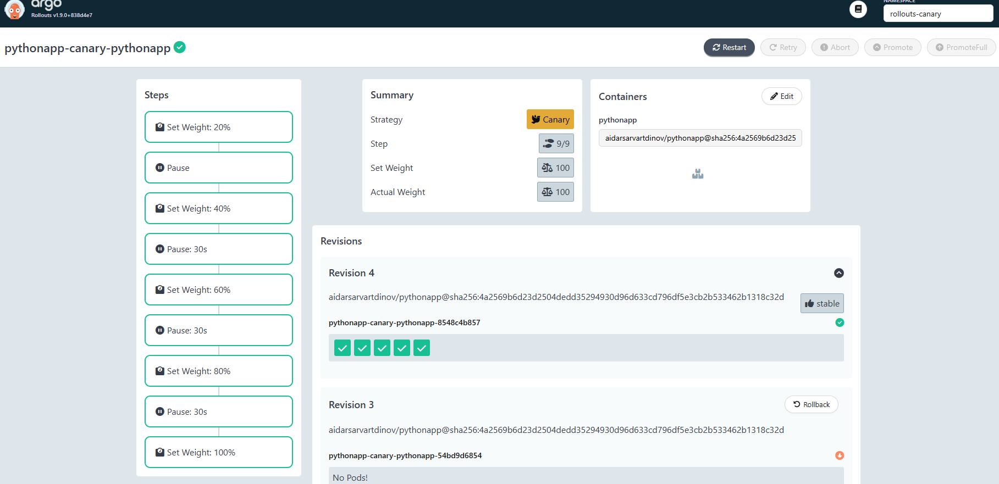
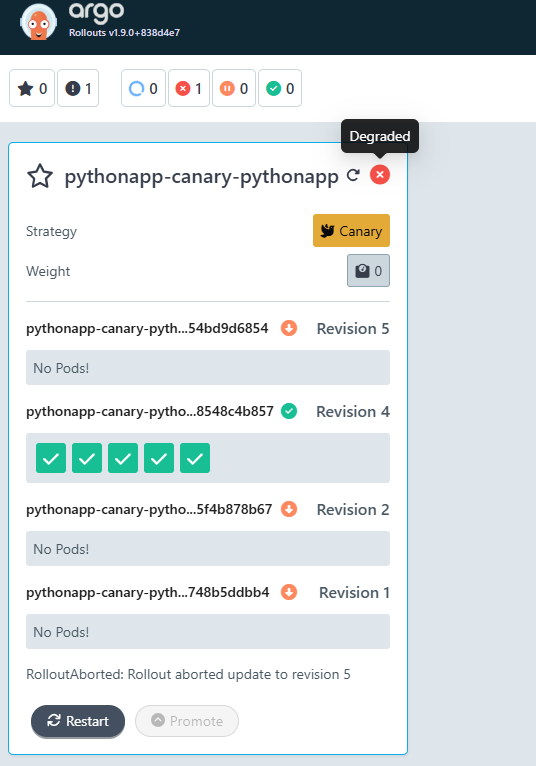
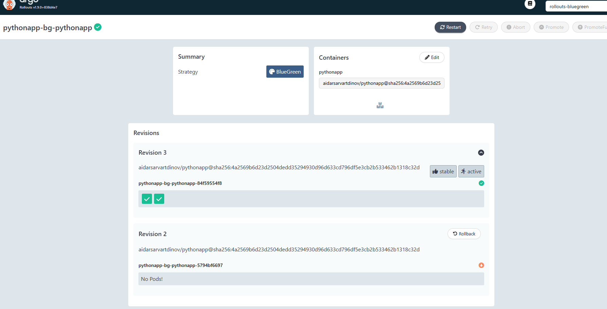

# Argo Rollouts

## 1) Argo Rollouts Setup

Argo Rollouts controller and dashboard were installed and verified.

```bash
kubectl get pods -n argo-rollouts
./kubectl-argo-rollouts.exe version
```

```text
NAME                                      READY   STATUS    RESTARTS   AGE
argo-rollouts-5f64f8d68-74dd6             1/1     Running   0          15m
argo-rollouts-dashboard-755bbc64c-kdnfm   1/1     Running   0          15m

kubectl-argo-rollouts: v1.9.0+838d4e7
Platform: windows/amd64
```

Dashboard access:

```bash
kubectl port-forward svc/argo-rollouts-dashboard -n argo-rollouts 3100:3100
```

Open: `http://localhost:3101/rollouts` (dashboard via local plugin).

Rollout vs Deployment (key difference):
- `Rollout` supports progressive delivery strategies (`canary`, `blueGreen`).
- `Deployment` only supports standard rolling update/recreate.
- Pod template/selector structure is otherwise very similar.

## 2) Canary Deployment

Implementation:
- Added `k8s/pythonapp/templates/rollout.yaml` (`kind: Rollout`) with canary steps:
  - `20% -> pause (manual)`
  - `40% -> pause 30s`
  - `60% -> pause 30s`
  - `80% -> pause 30s`
  - `100%`
- Added `k8s/pythonapp/values-canary.yaml`.
- Used namespace `rollouts-canary`.

Deploy:

```bash
helm upgrade --install pythonapp-canary ./k8s/pythonapp -n rollouts-canary -f ./k8s/pythonapp/values-canary.yaml
```

Manual promotion demo:

```bash
./kubectl-argo-rollouts.exe promote pythonapp-canary-pythonapp -n rollouts-canary
```

```text
rollout 'pythonapp-canary-pythonapp' promoted
```

Progression demo (after first manual promotion):

```text
Strategy: Canary
Step: 4/9
SetWeight: 60
Status: Progressing
```

Abort demo:

```bash
./kubectl-argo-rollouts.exe abort pythonapp-canary-pythonapp -n rollouts-canary
```

```text
rollout 'pythonapp-canary-pythonapp' aborted
Status: Degraded
Message: RolloutAborted
```

## 3) Blue-Green Deployment

Implementation:
- Added `blueGreen` strategy support in `k8s/pythonapp/templates/rollout.yaml`.
- Added preview service template: `k8s/pythonapp/templates/preview-service.yaml`.
- Added `k8s/pythonapp/values-bluegreen.yaml`.
- Used namespace `rollouts-bluegreen`.

Deploy:

```bash
helm upgrade --install pythonapp-bg ./k8s/pythonapp -n rollouts-bluegreen -f ./k8s/pythonapp/values-bluegreen.yaml
kubectl get svc -n rollouts-bluegreen
```

```text
pythonapp-bg-pythonapp           ClusterIP ... 80/TCP
pythonapp-bg-pythonapp-preview   ClusterIP ... 80/TCP
```

Preview vs active check:

```bash
kubectl port-forward svc/pythonapp-bg-pythonapp -n rollouts-bluegreen 18080:80
kubectl port-forward svc/pythonapp-bg-pythonapp-preview -n rollouts-bluegreen 18081:80
```

```bash
Invoke-WebRequest http://localhost:18080/health
Invoke-WebRequest http://localhost:18081/health
```

Both endpoints returned `{"status":"healthy", ...}`.

Promotion:

```bash
./kubectl-argo-rollouts.exe promote pythonapp-bg-pythonapp -n rollouts-bluegreen
```

Rollback demonstration:

```bash
./kubectl-argo-rollouts.exe undo pythonapp-bg-pythonapp -n rollouts-bluegreen
./kubectl-argo-rollouts.exe promote pythonapp-bg-pythonapp -n rollouts-bluegreen
```

Result: traffic switch between active/preview happened immediately after promotion of rollback revision.

## 4) Strategy Comparison

Canary:
- Pros: safer gradual rollout, easier risk control.
- Cons: longer rollout time, more operational steps.
- Best for: high-risk changes where gradual exposure is required.

Blue-Green:
- Pros: fast switching and rollback, simple validation via preview service.
- Cons: needs duplicated capacity during rollout.
- Best for: releases where fast cutover/rollback is more important than gradual exposure.

Recommendation:
- Use **Canary** for critical changes in production.
- Use **Blue-Green** for services requiring very fast rollback and easy preview testing.

## 5) CLI Commands Reference

```bash
# Install/verify
kubectl apply -f https://github.com/argoproj/argo-rollouts/releases/latest/download/install.yaml
kubectl apply -f https://github.com/argoproj/argo-rollouts/releases/latest/download/dashboard-install.yaml
./kubectl-argo-rollouts.exe version

# Observe rollout
./kubectl-argo-rollouts.exe get rollout <name> -n <namespace>
kubectl get rollout -n <namespace>

# Control rollout
./kubectl-argo-rollouts.exe promote <name> -n <namespace>
./kubectl-argo-rollouts.exe abort <name> -n <namespace>
./kubectl-argo-rollouts.exe undo <name> -n <namespace>
./kubectl-argo-rollouts.exe retry rollout <name> -n <namespace>
```

## 6) Screenshots

### Canary progression



### Canary abort



### Blue-green promotion/rollback state



### Blue-green preview vs active services (terminal evidence)

```bash
kubectl get svc -n rollouts-bluegreen
```

```text
NAME                             TYPE        CLUSTER-IP       EXTERNAL-IP   PORT(S)   AGE
pythonapp-bg-pythonapp           ClusterIP   10.98.242.29     <none>        80/TCP    54m
pythonapp-bg-pythonapp-preview   ClusterIP   10.102.186.197   <none>        80/TCP    54m
```

