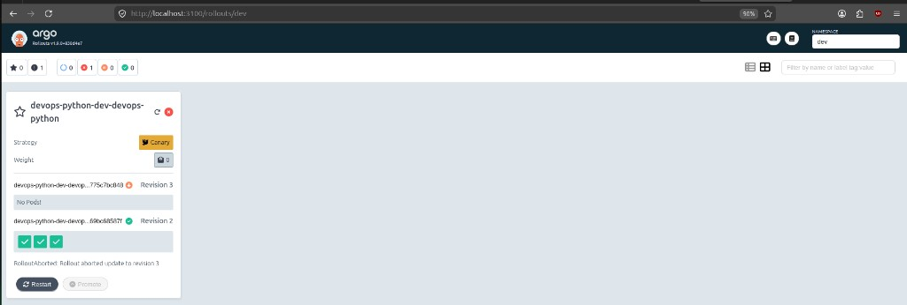
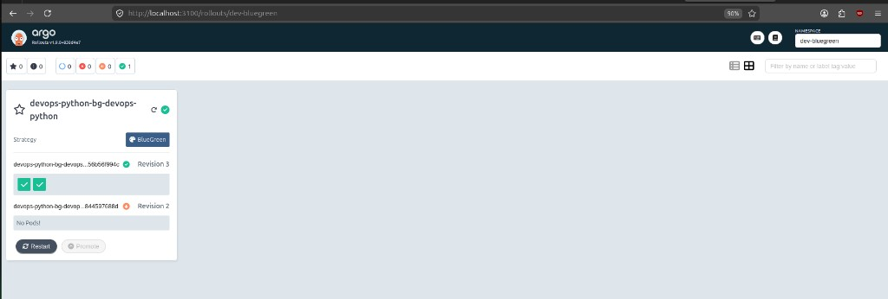

# Lab 14 — Progressive Delivery with Argo Rollouts

**Helm chart:** `k8s/devops-python`  
**Values profiles:** `values-dev.yaml` (canary), `values-bluegreen.yaml` (blue-green)  
**Evidence:** `k8s/lab14-evidence/` (`ev-1-canary-aborted.png`, `ev-2-bluegreen-healthy.png`)

| Release | Namespace | Strategy | Rollout name |
|---------|-----------|----------|--------------|
| `devops-python-dev` | `dev` | Canary | `devops-python-dev-devops-python` |
| `devops-python-bg` | `dev-bluegreen` | Blue-green | `devops-python-bg-devops-python` |

---

## 1. Argo Rollouts Setup

### Controller installation

The controller and CRDs were installed into the `argo-rollouts` namespace from the official release manifest.

**Commands:**

```bash
minikube start --driver=docker

kubectl create namespace argo-rollouts
kubectl apply -n argo-rollouts -f https://github.com/argoproj/argo-rollouts/releases/latest/download/install.yaml
kubectl rollout status deployment/argo-rollouts -n argo-rollouts --timeout=120s
```

**Verification:**

```bash
$ kubectl get pods,deploy -n argo-rollouts
NAME                                          READY   STATUS    RESTARTS   AGE
pod/argo-rollouts-5f64f8d68-f95h4             1/1     Running   0          2m20s
pod/argo-rollouts-dashboard-755bbc64c-5gjfs   1/1     Running   0          83s

NAME                                      READY   UP-TO-DATE   AVAILABLE   AGE
deployment.apps/argo-rollouts             1/1     1            1           2m20s
deployment.apps/argo-rollouts-dashboard   1/1     1            1           83s
```

**CRDs installed (progressive delivery resources):**

| CRD | Purpose |
|-----|---------|
| `rollouts.argoproj.io` | Main workload — replaces Deployment for progressive delivery |
| `analysistemplates.argoproj.io` | Reusable metric/analysis definitions |
| `analysisruns.argoproj.io` | Runtime analysis jobs during a rollout |
| `experiments.argoproj.io` | A/B style experiments (optional) |
| `clusteranalysistemplates.argoproj.io` | Cluster-scoped analysis templates |

```bash
$ kubectl api-resources | grep -i rollout
rollouts    ro    argoproj.io/v1alpha1    true    Rollout
```

Controller image: `quay.io/argoproj/argo-rollouts:v1.9.0`

---

### kubectl plugin

The `kubectl-argo-rollouts` plugin was installed locally under `.tools/bin/` (same pattern as the Argo CD CLI in this repo).

**Install:**

```bash
mkdir -p .tools/bin
curl -fsSL -o .tools/bin/kubectl-argo-rollouts \
  https://github.com/argoproj/argo-rollouts/releases/latest/download/kubectl-argo-rollouts-linux-amd64
chmod +x .tools/bin/kubectl-argo-rollouts
export PATH="$(pwd)/.tools/bin:$PATH"
```

**Verify:**

```bash
$ kubectl argo rollouts version
kubectl-argo-rollouts: v1.9.0+838d4e7
  BuildDate: 2026-03-20T21:08:11Z
  ...
```

Use the plugin for watching rollouts, promoting canary steps, aborting, and retrying — covered in Tasks 2–3.

---

### Dashboard access

**Install:**

```bash
kubectl apply -n argo-rollouts -f \
  https://github.com/argoproj/argo-rollouts/releases/latest/download/dashboard-install.yaml
kubectl rollout status deployment/argo-rollouts-dashboard -n argo-rollouts --timeout=120s
```

**Access (port-forward):**

```bash
kubectl port-forward svc/argo-rollouts-dashboard -n argo-rollouts 3100:3100
# Open http://localhost:3100  (redirects to /rollouts/)
```

**Important:** The UI defaults to the `default` namespace, which has no Rollouts. Select the correct namespace in the top-right dropdown:

| Namespace | Rollout |
|-----------|---------|
| `dev` | `devops-python-dev-devops-python` (canary) |
| `dev-bluegreen` | `devops-python-bg-devops-python` (blue-green) |

Direct links after port-forward:

- Canary: http://localhost:3100/rollouts/dev
- Blue-green: http://localhost:3100/rollouts/dev-bluegreen

Alternatively, use the plugin (starts port-forward automatically):

```bash
kubectl argo rollouts dashboard
```

The dashboard lists Rollouts, revision history, canary step progress, blue-green active/preview state, and supports **Promote**, **Abort**, **Restart**, and **Retry** from the UI.

---

### Rollout vs Deployment

The Helm chart uses `templates/rollout.yaml` instead of a standard Deployment. The pod template is identical to the Lab 13 Deployment; only the workload kind and update strategy differ.

| Aspect | `Deployment` (`apps/v1`) | `Rollout` (`argoproj.io/v1alpha1`) |
|--------|--------------------------|-------------------------------------|
| **Kind / API** | `apps/v1` `Deployment` | `argoproj.io/v1alpha1` `Rollout` |
| **Pod template** | `spec.template` | Same structure |
| **Replicas / selector** | `spec.replicas`, `spec.selector` | Same |
| **Update strategy** | `RollingUpdate` or `Recreate` only | `canary`, `blueGreen`, or basic `canary`/`rolling` variants |
| **Traffic control** | None (kube-proxy sends to all ready pods) | Weighted steps (`setWeight`), pause, promote/abort |
| **Analysis** | None | `AnalysisTemplate` / `AnalysisRun` for metric-based auto promote/rollback |
| **Services** | One Service typical | Blue-green: separate **active** and **preview** Services |
| **Rollback** | `kubectl rollout undo` (revision-based) | Instant abort / traffic shift back to stable ReplicaSet |
| **CLI** | `kubectl rollout …` | `kubectl argo rollouts …` |

**Previous Deployment pattern (Lab 13):**

```yaml
apiVersion: apps/v1
kind: Deployment
spec:
  strategy:
    type: RollingUpdate
    rollingUpdate:
      maxSurge: 1
      maxUnavailable: 0
```

**Current Rollout (Lab 14):**

```yaml
apiVersion: argoproj.io/v1alpha1
kind: Rollout
spec:
  # replicas, selector, template — same as Deployment
  strategy:
    canary:
      steps:
        - setWeight: 20
        - pause: {}                    # manual promotion
        - setWeight: 40
        - pause: { duration: 30s }
        # ...
```

**Rollout-only fields (progressive delivery):**

- `spec.strategy.canary` — `steps`, `trafficRouting`, `analysis`, `maxUnavailable`, `maxSurge`
- `spec.strategy.blueGreen` — `activeService`, `previewService`, `autoPromotionEnabled`, `scaleDownDelaySeconds`
- `spec.revisionHistoryLimit` — rollout revision history (like Deployment)
- Status: `status.canary.weights`, `status.blueGreen`, `status.phase`, `status.currentStepIndex`

**When to use which:**

- **Deployment** — simple rolling updates, internal tools, no traffic splitting.
- **Rollout** — production releases where you need canary %, blue-green preview, or automated rollback on metrics.

## 2. Canary Deployment

### Strategy configuration

`templates/rollout.yaml` replaces the Lab 13 Deployment (`kind: Rollout`, `apiVersion: argoproj.io/v1alpha1`). Pod spec, probes, volumes, and checksum annotation are unchanged; only the workload kind and strategy differ.

Canary steps live in `values.yaml` under `rollout.canary` and are rendered into the Rollout manifest.

**Strategy (default `values.yaml`):**

```yaml
rollout:
  revisionHistoryLimit: 3
  canary:
    maxSurge: 1
    maxUnavailable: 0
    steps:
      - setWeight: 20
      - pause: {}              # manual promotion
      - setWeight: 40
      - pause: { duration: 30s }
      - setWeight: 60
      - pause: { duration: 30s }
      - setWeight: 80
      - pause: { duration: 30s }
      - setWeight: 100
```

**Dev overrides (`values-dev.yaml`):** `replicaCount: 3` (needed for weight math), `image.tag: v2`, `service.nodePort: 30082` (30081 is used by the Argo CD `python-app-dev` release).

---

### Install and initial rollout

```bash
export PATH="$(pwd)/.tools/bin:$PATH"

# Images
cd lab_solutions/lab1/app_python
docker build -t devops-python:v1 .
docker tag devops-python:v1 devops-python:v2
minikube image load devops-python:v1 devops-python:v2

# Deploy
kubectl create namespace dev
helm upgrade --install devops-python-dev k8s/devops-python \
  -f k8s/devops-python/values-dev.yaml -n dev --wait --timeout 5m

kubectl argo rollouts status devops-python-dev-devops-python -n dev
# Healthy — stable image devops-python:v1 (first install used tag v1)
```

**How it works:** Without an ingress/service-mesh traffic router, Argo Rollouts achieves canary weights by scaling stable vs canary ReplicaSets. With 3 replicas at 20% weight, roughly 1 pod serves canary traffic and 2 serve stable. The existing Service selector is unchanged; the controller manages which pods receive traffic.

### Step-by-step rollout progression

| Step | Weight | Pause | Action |
|------|--------|-------|--------|
| 1 | 20% | Manual (`pause: {}`) | Observe metrics/logs; run `promote` to continue |
| 2 | 40% | 30s auto | Controller waits, then advances |
| 3 | 60% | 30s auto | Controller waits, then advances |
| 4 | 80% | 30s auto | Controller waits, then advances |
| 5 | 100% | — | Rollout complete; canary becomes stable |

**Timeline observed (v1 → v2):**

1. `helm upgrade … --set image.tag=v2` — new ReplicaSet created, canary pods start.
2. Step 1/9 — paused at 20% (`SetWeight: 20`, `ActualWeight: 25`). Stable on `v1`, canary on `v2`.
3. `kubectl argo rollouts promote` — auto-progression through 40 → 60 → 80 → 100% (~90s total with timed pauses).
4. Final state: Healthy, step 9/9, stable image `devops-python:v2`.

### Dashboard evidence (canary)



*Dashboard at `http://localhost:3100/rollouts/dev` after abort test: degraded status, revision 3 (aborted canary) with no pods, revision 2 (v2) serving traffic with 3 healthy pods.*

During an in-progress canary update, the dashboard shows **Step X/9**, **Weight**, stable vs canary ReplicaSets, and enabled **Promote** / **Abort** buttons.

### Promotion and abort demonstration

```bash
helm upgrade devops-python-dev k8s/devops-python \
  -f k8s/devops-python/values-dev.yaml --set image.tag=v2 -n dev

kubectl argo rollouts get rollout devops-python-dev-devops-python -n dev
```

**Observed at 20% (step 1/9, manual pause):**

```
Status:          ॥ Paused
Strategy:        Canary
  Step:          1/9
  SetWeight:     20
  ActualWeight:  25
Images:          devops-python:v1 (stable)
                 devops-python:v2 (canary)
```

**Promotion** (after manual pause at 20%):

```bash
kubectl argo rollouts promote devops-python-dev-devops-python -n dev
```

After promote, the controller advanced through 40% → 60% → 80% → 100% automatically (30s pauses between steps). Final state:

```
Status:          ✔ Healthy
  Step:          9/9
  SetWeight:     100
Images:          devops-python:v2 (stable)
```

View step progress in the dashboard: `kubectl port-forward svc/argo-rollouts-dashboard -n argo-rollouts 3100:3100` → http://localhost:3100/rollouts/

---

**Abort** (during rollback attempt v2 → v1, paused at 20%):

```bash
helm upgrade devops-python-dev k8s/devops-python \
  -f k8s/devops-python/values-dev.yaml --set image.tag=v1 -n dev

kubectl argo rollouts abort devops-python-dev-devops-python -n dev
```

**After abort:**

```
Status:          ✖ Degraded
Message:         RolloutAborted: Rollout aborted update to revision 3
  SetWeight:     0
  ActualWeight:  0
Images:          devops-python:v2 (stable)
```

Canary ReplicaSet scaled down; all traffic returned to the previous stable revision (v2). `Degraded` is expected until you retry or deploy again:

```bash
kubectl argo rollouts retry rollout devops-python-dev-devops-python -n dev
```

---

## 3. Blue-Green Deployment

### Strategy configuration

A separate values profile switches the Rollout from canary to blue-green without changing the canary setup in `values-dev.yaml`.

**Files:**

| File | Purpose |
|------|---------|
| `values-bluegreen.yaml` | `rollout.strategy: blueGreen`, preview NodePort, initial `bg-v1` image |
| `templates/service-preview.yaml` | Preview Service (rendered only for blue-green) |
| `templates/rollout.yaml` | Conditional `canary` or `blueGreen` strategy block |

**Blue-green strategy (from `rollout.yaml`):**

```yaml
strategy:
  blueGreen:
    activeService: {{ include "devops-python.fullname" . }}-service   # production
    previewService: {{ include "devops-python.fullname" . }}-preview  # new version
    autoPromotionEnabled: false   # manual promote required
    scaleDownDelaySeconds: 30
```

- **Active service** (`…-service`, NodePort **30083**): production traffic.
- **Preview service** (`…-preview`, NodePort **30084**): new version for testing before cutover.
- **`autoPromotionEnabled: false`**: after green pods are ready, the Rollout pauses at `BlueGreenPause` until you run `promote` (or set `autoPromotionSeconds` for timed promotion).

Canary profile remains the default in `values.yaml` (`rollout.strategy: canary`).

---

### Install (blue / initial version)

Deployed in a dedicated namespace so it does not conflict with the canary release in `dev`:

```bash
export PATH="$(pwd)/.tools/bin:$PATH"

kubectl create namespace dev-bluegreen

helm upgrade --install devops-python-bg k8s/devops-python \
  -f k8s/devops-python/values-bluegreen.yaml \
  -n dev-bluegreen --wait --timeout 5m

kubectl argo rollouts status devops-python-bg-devops-python -n dev-bluegreen
# Healthy — revision 1, image devops-python:bg-v1
```

### Preview vs active service

| Service | K8s name | NodePort | Role |
|---------|----------|----------|------|
| **Active** | `devops-python-bg-devops-python-service` | 30083 | Production traffic (blue / current stable) |
| **Preview** | `devops-python-bg-devops-python-preview` | 30084 | New version for testing (green / candidate) |

The Rollout controller patches Service selectors so active always points to the stable ReplicaSet and preview to the candidate. Both services share the same port mapping (`80 → 5000`).

### Promotion process

**Step 1: Deploy green candidate**

```bash
helm upgrade devops-python-bg k8s/devops-python \
  -f k8s/devops-python/values-bluegreen.yaml \
  --set image.tag=bg-v2 \
  --set app.name=devops-info-service-green \
  --set app.env.APP_ENV=green \
  -n dev-bluegreen
```

Rollout pauses at `BlueGreenPause` when preview pods are ready:

```
Status:          ॥ Paused
Message:         BlueGreenPause
Strategy:        BlueGreen
Images:          devops-python:bg-v1 (stable, active)
                 devops-python:bg-v2 (preview)
Replicas:        Desired 2, Current 4   # 2× pods during cutover window
```

Test preview without affecting production:

```bash
kubectl port-forward svc/devops-python-bg-devops-python-service -n dev-bluegreen 8080:80   # active
kubectl port-forward svc/devops-python-bg-devops-python-preview -n dev-bluegreen 8081:80  # preview
```

**Step 2: Promote (instant cutover)**

```bash
kubectl argo rollouts promote devops-python-bg-devops-python -n dev-bluegreen
```

Promotion completed in **~491 ms**. Active service immediately routed to green pods. No gradual weight steps — all-or-nothing switch.

**Step 3: Rollback after promotion**

```bash
kubectl argo rollouts undo devops-python-bg-devops-python -n dev-bluegreen
# Pauses with bg-v1 in preview; promote to swap active back
kubectl argo rollouts promote devops-python-bg-devops-python -n dev-bluegreen
```

Rollback promote completed in **~2.4 s** — active returned to blue (`56b56f994c` pods).

**Abort before promote** (discard green without touching production):

```bash
kubectl argo rollouts abort devops-python-bg-devops-python -n dev-bluegreen
```

Preview ReplicaSet is torn down; active never changes — instant and simpler than undo+promote after a completed promotion.

### Dashboard evidence (blue-green)



*Dashboard at `http://localhost:3100/rollouts/dev-bluegreen` after rollback promote: healthy status, revision 3 (bg-v1) active with 2 pods, revision 2 (bg-v2) scaled down with no pods. Promote is disabled because no pending preview release.*

Direct link: http://localhost:3100/rollouts/dev-bluegreen

---

## 4. Strategy Comparison

### When to use canary vs blue-green

| Scenario | Recommended strategy | Why |
|----------|---------------------|-----|
| High-traffic production API | **Canary** | Limit blast radius; catch errors affecting a small % of users first |
| Internal admin tool | **Deployment / simple rolling** | Low risk; progressive delivery adds overhead |
| Major version with schema/API changes | **Blue-green** | Validate full new stack on preview before any production traffic |
| Mobile/backend with long-lived connections | **Blue-green** | Avoid mixed-version sessions on the same endpoint |
| Frequent small releases | **Canary** | Fast iteration with automated weight steps |
| Strict compliance / QA sign-off | **Blue-green** | QA tests exact production candidate via preview URL |
| Cost-sensitive / small clusters | **Canary** | No temporary 2× pod count |
| Zero-downtime with instant rollback | **Blue-green** | Single promote/abort flips all traffic |

### Pros and cons

**Canary**

| Pros | Cons |
|------|------|
| Gradual traffic shift reduces risk | Mixed versions simultaneously — harder to debug |
| Lower resource usage (no full duplicate stack) | Requires enough replicas for meaningful weight % |
| Supports automated analysis between steps (bonus task) | Rollback mid-flight depends on current step weight |
| Good fit for continuous delivery | Without ingress/mesh, weight is approximate (ReplicaSet scaling) |

**Blue-green**

| Pros | Cons |
|------|------|
| Instant, all-or-nothing cutover on promote | **2× resources** while both colors run |
| Dedicated preview URL for full acceptance testing | No partial traffic — preview is 0% or 100% of that Service |
| Abort before promote = zero production impact | Post-promote rollback needs `undo` + `promote` (two steps) |
| Clear mental model (blue = live, green = candidate) | Database/state migration must be handled separately |

### Recommendations for this project

For **`devops-python`** (FastAPI info service, stateless HTTP, PVC for visit counter):

1. **Development / CI** — standard Helm rolling update or direct Rollout without pauses; speed matters more than safety.
2. **Staging** — **blue-green** with preview Service: run integration tests against `:8081` before promoting to active.
3. **Production** — **canary** with manual pause at 20% and Prometheus analysis (Lab 16 / bonus task): watch error rate before auto-promoting; abort if `/health` fails.
4. **Emergency hotfix** — **blue-green** with `autoPromotionEnabled: false`: deploy to preview, smoke-test, single promote for fastest controlled cutover.

### Observed timing (this lab)

| Action | Strategy | Time observed |
|--------|----------|---------------|
| Promote at 20% → 100% | Canary | ~90s (includes 3× 30s timed pauses) |
| Abort mid-canary | Canary | Immediate weight → 0 |
| Promote blue → green | Blue-green | **~491 ms** |
| Undo + promote (rollback) | Blue-green | **~2.4 s** |

Blue-green cutover is orders of magnitude faster than a full canary progression, but canary exposes problems earlier with less traffic at risk.

---

## 5. CLI Commands Reference

Set plugin path once per shell:

```bash
export PATH="$(pwd)/.tools/bin:$PATH"
```

### Installation and dashboard

```bash
kubectl apply -n argo-rollouts -f https://github.com/argoproj/argo-rollouts/releases/latest/download/install.yaml
kubectl apply -n argo-rollouts -f https://github.com/argoproj/argo-rollouts/releases/latest/download/dashboard-install.yaml
kubectl argo rollouts version
kubectl argo rollouts dashboard                    # UI at http://localhost:3100/rollouts/
kubectl port-forward svc/argo-rollouts-dashboard -n argo-rollouts 3100:3100
```

### Inspect rollouts

```bash
kubectl get rollouts -A
kubectl argo rollouts list rollouts -A
kubectl argo rollouts get rollout <name> -n <ns>
kubectl argo rollouts get rollout <name> -n <ns> -w    # watch
kubectl argo rollouts status <name> -n <ns>
kubectl argo rollouts history rollout <name> -n <ns>
```

### Canary operations (`dev` namespace)

```bash
ROLLOUT=devops-python-dev-devops-python
NS=dev

kubectl argo rollouts promote $ROLLOUT -n $NS
kubectl argo rollouts abort $ROLLOUT -n $NS
kubectl argo rollouts retry rollout $ROLLOUT -n $NS
helm upgrade devops-python-dev k8s/devops-python -f k8s/devops-python/values-dev.yaml \
  --set image.tag=v2 -n $NS
```

### Blue-green operations (`dev-bluegreen` namespace)

```bash
ROLLOUT=devops-python-bg-devops-python
NS=dev-bluegreen

kubectl argo rollouts promote $ROLLOUT -n $NS
kubectl argo rollouts abort $ROLLOUT -n $NS
kubectl argo rollouts undo $ROLLOUT -n $NS
helm upgrade devops-python-bg k8s/devops-python -f k8s/devops-python/values-bluegreen.yaml \
  --set image.tag=bg-v2 -n $NS
```

