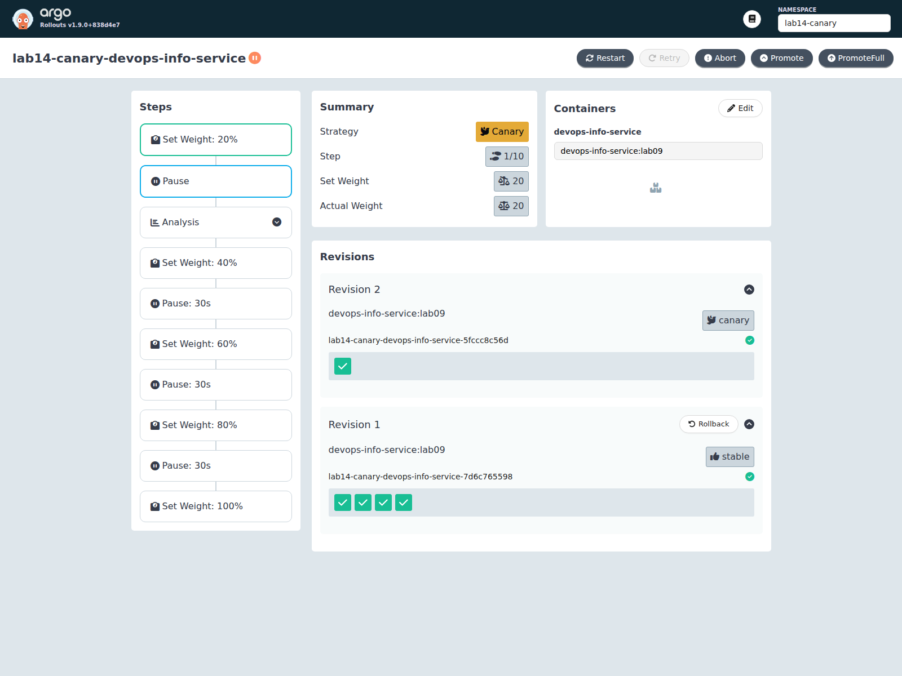
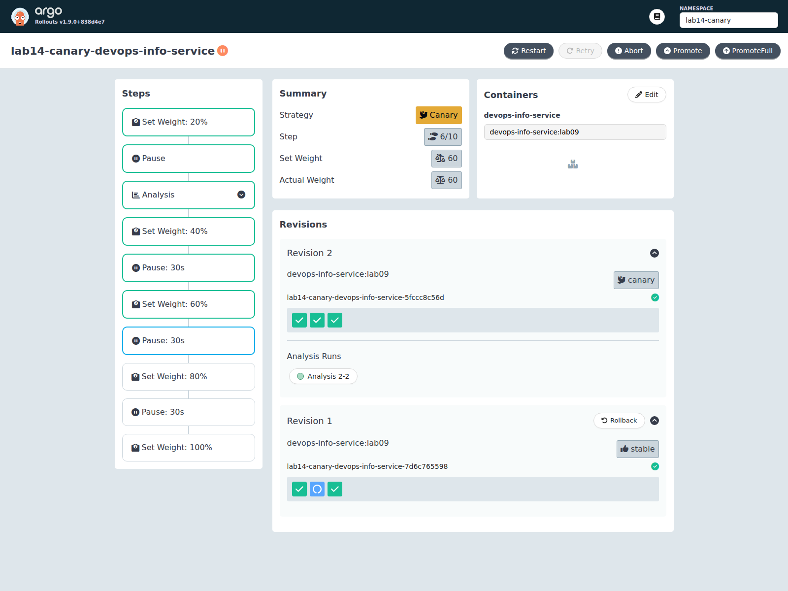
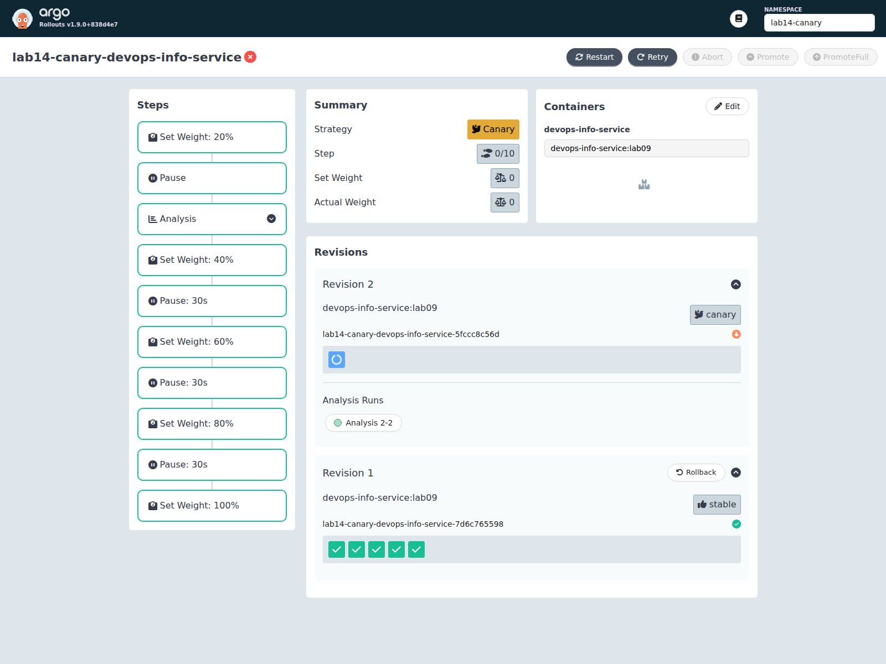
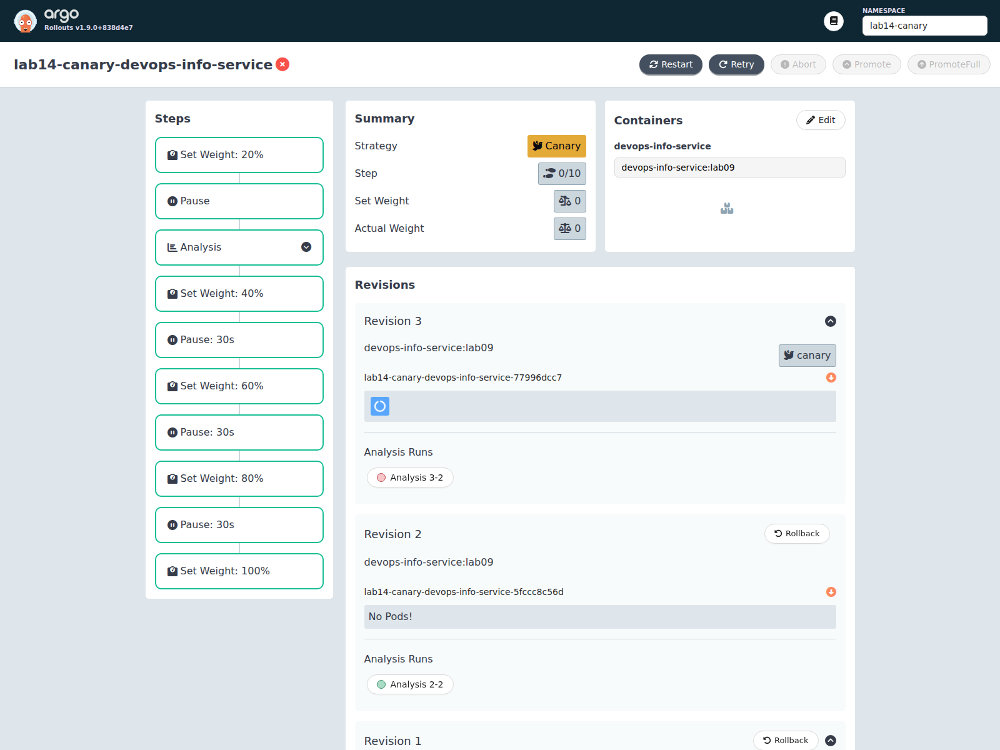
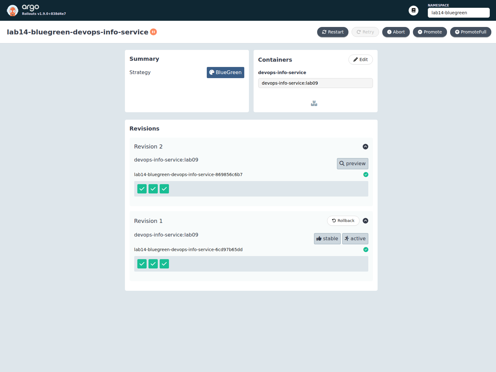
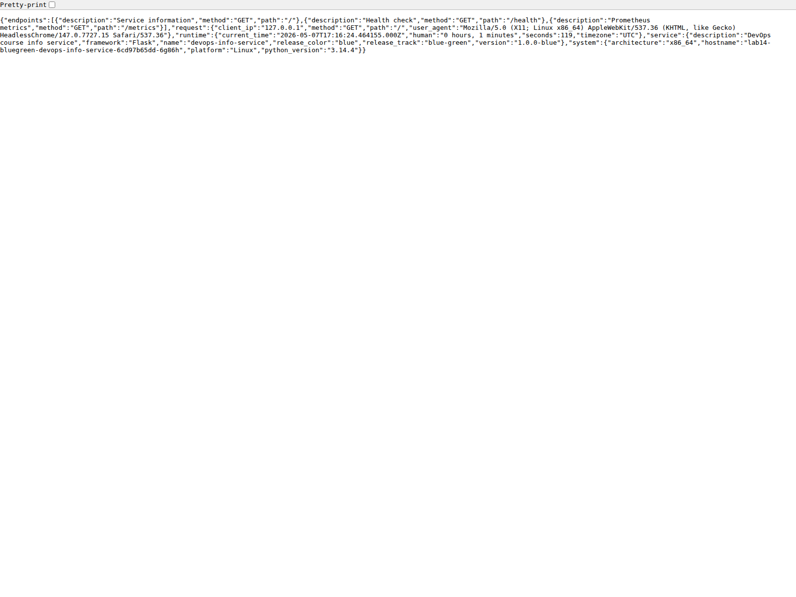
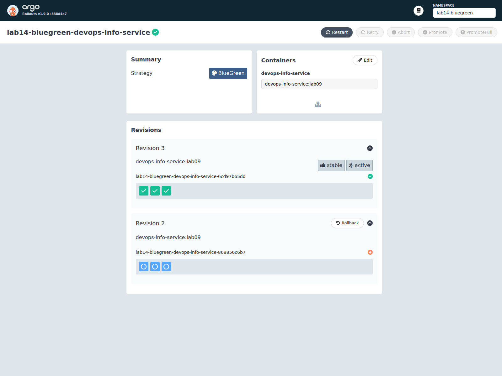

# Lab 14 - Progressive Delivery with Argo Rollouts

## 1. What I Changed

I converted the Helm workload from a standard `Deployment` to an Argo `Rollout` and added strategy-specific resources:

- `k8s/devops-info-service/templates/rollout.yaml`
- `k8s/devops-info-service/templates/preview-service.yaml`
- `k8s/devops-info-service/templates/analysis-template.yaml`
- `k8s/devops-info-service/values-canary*.yaml`
- `k8s/devops-info-service/values-bluegreen*.yaml`

I also added lightweight release metadata to the Flask app so active/preview revisions are visible in `/` responses:

- `DEVOPS_SERVICE_VERSION`
- `DEVOPS_RELEASE_TRACK`
- `DEVOPS_RELEASE_COLOR`

All live verification and screenshots below were captured on **May 7, 2026**.

## 2. Argo Rollouts Setup

### Installation

Controller and dashboard:

```bash
kubectl create namespace argo-rollouts --dry-run=client -o yaml | kubectl apply -f -
kubectl apply -n argo-rollouts -f https://github.com/argoproj/argo-rollouts/releases/latest/download/install.yaml
kubectl apply -n argo-rollouts -f https://github.com/argoproj/argo-rollouts/releases/latest/download/dashboard-install.yaml
kubectl wait --for=condition=available deployment/argo-rollouts -n argo-rollouts --timeout=240s
kubectl wait --for=condition=available deployment/argo-rollouts-dashboard -n argo-rollouts --timeout=240s
```

CLI plugin:

```bash
mkdir -p "$HOME/.local/bin"
curl -sSL -o "$HOME/.local/bin/kubectl-argo-rollouts" \
  https://github.com/argoproj/argo-rollouts/releases/latest/download/kubectl-argo-rollouts-linux-amd64
chmod +x "$HOME/.local/bin/kubectl-argo-rollouts"
PATH="$HOME/.local/bin:$PATH" kubectl argo rollouts version
```

Verification:

```text
kubectl-argo-rollouts: v1.9.0+838d4e7
  BuildDate: 2026-03-20T21:08:11Z
  Platform: linux/amd64
```

```text
NAME                                      READY   STATUS    AGE
argo-rollouts-5f64f8d68-r4ccj             1/1     Running   26s
argo-rollouts-dashboard-755bbc64c-ntvnr   1/1     Running   24s
```

Dashboard access:

```bash
kubectl port-forward svc/argo-rollouts-dashboard -n argo-rollouts 3100:3100
```

For the automated screenshots I used:

```bash
PATH="$HOME/.local/bin:$PATH" kubectl argo rollouts dashboard --port 3101
```

That local dashboard path rendered more reliably in headless Chromium while keeping the in-cluster dashboard installed and reachable.

### Rollout vs Deployment

Key differences between my old Helm `Deployment` and the new `Rollout`:

- `kind` changed from `Deployment` to `Rollout`
- `spec.strategy` now supports `canary` and `blueGreen`
- canary uses explicit `steps` with weights, pauses, and analysis
- blue-green uses `activeService` and `previewService`
- rollout controller rewrites service selectors with `rollouts-pod-template-hash`
- `AnalysisTemplate` enables automatic abort/rollback decisions

The pod template, probes, resources, service account, secrets, and service wiring stayed the same.

## 3. Canary Deployment

### Strategy Configuration

I used release `lab14-canary` in namespace `lab14-canary` with `k8s/devops-info-service/values-canary.yaml`.

Canary flow in the chart:

```yaml
strategy:
  canary:
    maxSurge: 1
    maxUnavailable: 0
    steps:
      - setWeight: 20
      - pause: {}
      - analysis:
          templates:
            - templateName: <release>-success-rate
      - setWeight: 40
      - pause: { duration: 30s }
      - setWeight: 60
      - pause: { duration: 30s }
      - setWeight: 80
      - pause: { duration: 30s }
      - setWeight: 100
```

The bonus `AnalysisTemplate` checks:

```yaml
provider:
  web:
    url: http://<service>.<namespace>.svc.cluster.local:80/health
    jsonPath: "{$.status}"
successCondition: "result == 'healthy'"
```

### Baseline Install

```bash
helm upgrade --install lab14-canary k8s/devops-info-service \
  -n lab14-canary --create-namespace \
  -f k8s/devops-info-service/values-canary.yaml
PATH="$HOME/.local/bin:$PATH" kubectl argo rollouts get rollout lab14-canary-devops-info-service -n lab14-canary
```

Baseline response:

```text
"release_track":"canary","version":"1.0.0-canary-v1"
```

### Manual Promotion at 20%

Upgrade:

```bash
helm upgrade lab14-canary k8s/devops-info-service \
  -n lab14-canary \
  -f k8s/devops-info-service/values-canary-v2.yaml
```

Paused state before promotion:

```text
Status:          Paused
Message:         CanaryPauseStep
Step:            1/10
SetWeight:       20
ActualWeight:    20
```

Dashboard evidence:



Promote:

```bash
PATH="$HOME/.local/bin:$PATH" kubectl argo rollouts promote lab14-canary-devops-info-service -n lab14-canary
```

After the manual gate, the rollout ran the analysis step and advanced into the timed stages automatically. One captured intermediate state:

```text
Status:          Paused
Message:         CanaryPauseStep
Step:            4/10
SetWeight:       40
ActualWeight:    40
```



Successful analysis evidence:

```text
AnalysisRun  Successful
```

### Manual Abort / Rollback

I aborted the rollout from the 40% pause:

```bash
PATH="$HOME/.local/bin:$PATH" kubectl argo rollouts abort lab14-canary-devops-info-service -n lab14-canary
```

Immediate result:

```text
Status:          Degraded
Message:         RolloutAborted: Rollout aborted update to revision 2
SetWeight:       0
ActualWeight:    40
```

After the stable ReplicaSet finished scaling back:

```text
SetWeight:       0
ActualWeight:    0
Images:          devops-info-service:lab09 (stable)
Desired:         5
Updated:         0
Ready:           5
```

Dashboard evidence:



### Bonus: Automated Analysis Failure

For the bonus test I deployed `values-canary-fail.yaml`, which intentionally pointed the analysis URL at `/does-not-exist`:

```yaml
analysis:
  web:
    path: /does-not-exist
```

Flow:

```bash
helm upgrade lab14-canary k8s/devops-info-service \
  -n lab14-canary \
  -f k8s/devops-info-service/values-canary-fail.yaml
PATH="$HOME/.local/bin:$PATH" kubectl argo rollouts promote lab14-canary-devops-info-service -n lab14-canary
```

Observed failure:

```text
Status:          Degraded
Message:         RolloutAborted: Rollout aborted update to revision 3:
                 Step-based analysis phase error/failed:
                 Metric "health-check" assessed Error due to consecutiveErrors (5)
                 ... received non 2xx response code: 404
```

```text
AnalysisRun  Error
```

Dashboard evidence:



After collecting evidence I restored the canary namespace to a healthy baseline:

```bash
helm upgrade lab14-canary k8s/devops-info-service \
  -n lab14-canary \
  -f k8s/devops-info-service/values-canary.yaml
```

## 4. Blue-Green Deployment

### Strategy Configuration

I used release `lab14-bluegreen` in namespace `lab14-bluegreen` with `k8s/devops-info-service/values-bluegreen.yaml`.

Blue-green strategy in the chart:

```yaml
strategy:
  blueGreen:
    activeService: <release>
    previewService: <release>-preview
    autoPromotionEnabled: false
    scaleDownDelaySeconds: 30
```

This creates two services:

- active: `lab14-bluegreen-devops-info-service`
- preview: `lab14-bluegreen-devops-info-service-preview`

### Initial Blue Release

```bash
helm upgrade --install lab14-bluegreen k8s/devops-info-service \
  -n lab14-bluegreen --create-namespace \
  -f k8s/devops-info-service/values-bluegreen.yaml
```

Initial response from both services:

```text
"release_color":"blue","version":"1.0.0-blue"
```

### Green Preview Before Promotion

Upgrade to the green revision:

```bash
helm upgrade lab14-bluegreen k8s/devops-info-service \
  -n lab14-bluegreen \
  -f k8s/devops-info-service/values-bluegreen-v2.yaml
```

Rollout state:

```text
Status:          Paused
Message:         BlueGreenPause
Images:          devops-info-service:lab09 (active, preview, stable)
```

Dashboard evidence:



I refreshed the service forwards after the selector change and verified the split:

```text
ACTIVE  -> "release_color":"blue","version":"1.0.0-blue"
PREVIEW -> "release_color":"green","version":"1.1.0-green"
```

Screenshots:




### Promotion to Active

```bash
PATH="$HOME/.local/bin:$PATH" kubectl argo rollouts promote lab14-bluegreen-devops-info-service -n lab14-bluegreen
```

After promotion:

```text
Status:          Healthy
Revision 2:      stable, active
```

Active service now returned:

```text
"release_color":"green","version":"1.1.0-green"
```

Screenshot:


### Instant Rollback

Because `autoPromotionEnabled: false`, the rollback flow is:

1. `undo` creates the previous revision as preview
2. `promote` switches active traffic back in one operation

Commands:

```bash
PATH="$HOME/.local/bin:$PATH" kubectl argo rollouts undo lab14-bluegreen-devops-info-service -n lab14-bluegreen
PATH="$HOME/.local/bin:$PATH" kubectl argo rollouts promote lab14-bluegreen-devops-info-service -n lab14-bluegreen
```

Final rollback state:

```text
Status:          Healthy
Revision 3:      stable, active
```

Active service after rollback:

```text
"release_color":"blue","version":"1.0.0-blue"
```

Screenshots:




## 5. Strategy Comparison

| Topic | Canary | Blue-Green |
|---|---|---|
| Traffic movement | Gradual by weight | One service switch |
| Risk profile | Lower blast radius | Fast rollback after preview is validated |
| Resource cost | Lower | Higher during overlap |
| Verification style | Real production subset | Dedicated preview environment |
| Best for | User-facing changes that need progressive confidence | Releases needing crisp cutover and rollback |

### Pros and Cons

Canary pros:

- gradual exposure
- easy to combine with analysis
- safer when behavior risk is unknown

Canary cons:

- slower to complete
- rollback is not a single instant switch
- harder to reason about mixed live traffic

Blue-green pros:

- preview is isolated and easy to compare
- promotion is operationally simple
- rollback is fast once the previous revision is ready

Blue-green cons:

- needs duplicate capacity during rollout
- with `autoPromotionEnabled: false`, both forward promotion and rollback require confirmation
- old client-side port-forwards can stay attached to the old pod, so I had to restart port-forwards after selector changes

### Recommendation

- Use **canary** for production changes where behavioral confidence matters more than speed.
- Use **blue-green** when you need a clear preview environment and a near-instant cutover/rollback.
- Add **analysis** whenever you can define a meaningful health signal; it turns rollout decisions into something measurable instead of purely manual.

## 6. Useful CLI Commands

```bash
# Rollout status
PATH="$HOME/.local/bin:$PATH" kubectl argo rollouts get rollout <name> -n <namespace>

# Promote one paused step
PATH="$HOME/.local/bin:$PATH" kubectl argo rollouts promote <name> -n <namespace>

# Abort canary rollout
PATH="$HOME/.local/bin:$PATH" kubectl argo rollouts abort <name> -n <namespace>

# Retry an aborted rollout
PATH="$HOME/.local/bin:$PATH" kubectl argo rollouts retry rollout <name> -n <namespace>

# Undo to the previous revision
PATH="$HOME/.local/bin:$PATH" kubectl argo rollouts undo <name> -n <namespace>

# Dashboard
PATH="$HOME/.local/bin:$PATH" kubectl argo rollouts dashboard --port 3101

# Raw Kubernetes inspection
kubectl get rollout,rs,pods,svc,analysisrun -n <namespace>
kubectl describe rollout <name> -n <namespace>
```

## 7. Verification Summary

- Argo Rollouts controller and dashboard installed successfully
- Helm chart now supports both canary and blue-green rollout strategies
- Canary manual pause, promotion, timed progression, and abort were tested
- Bonus web analysis ran successfully on the good revision and auto-aborted on the failing revision
- Blue-green preview, promotion, undo, and rollback switch were tested
- Screenshots were captured with Playwright from the live dashboard and forwarded services
