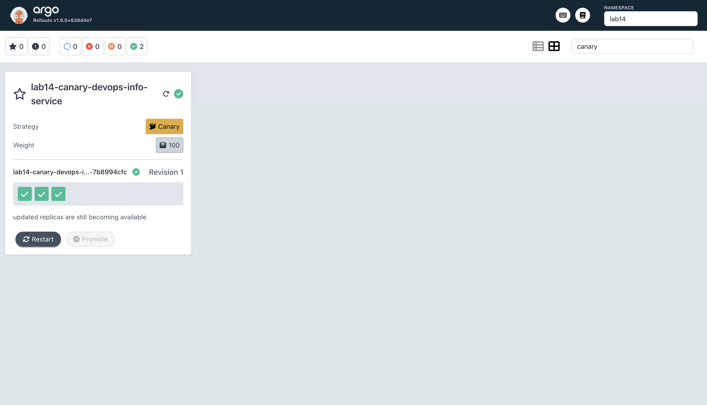
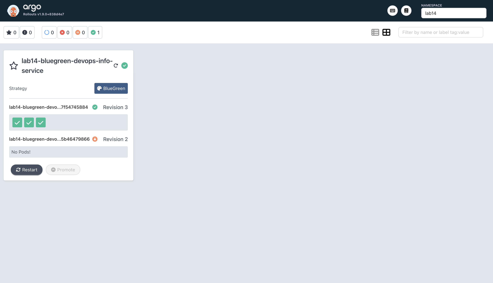
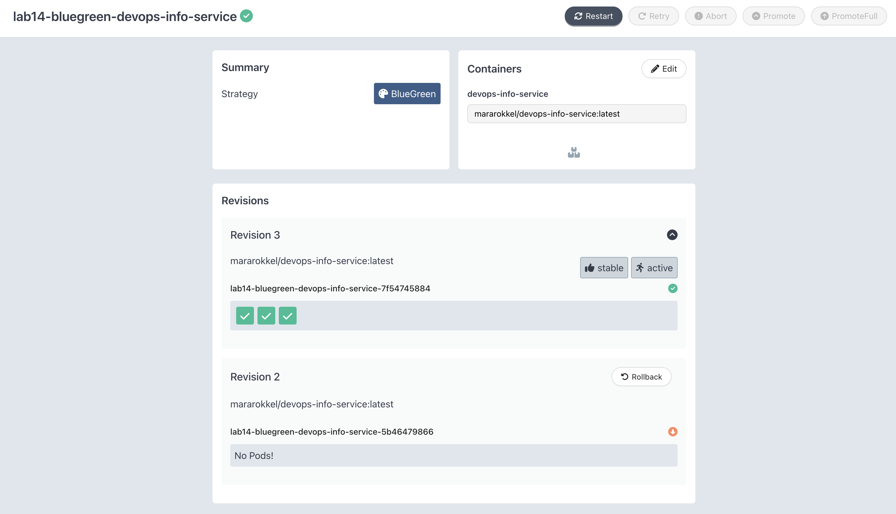

# Lab 14 — Progressive Delivery with Argo Rollouts

This document summarizes the implementation of canary and blue-green rollout strategies for `devops-info-service` using Argo Rollouts.

---

## 1. Argo Rollouts setup

### 1.1 Controller installation

```bash
kubectl create namespace argo-rollouts
kubectl apply -n argo-rollouts -f https://github.com/argoproj/argo-rollouts/releases/latest/download/install.yaml
```

During the first run on Minikube, API/etcd timeouts occurred (`request timed out`, `TLS handshake timeout`). The controller and dashboard were re-applied and stabilized.

Final healthy state:

```text
$ kubectl get pods -n argo-rollouts
NAME                                       READY   STATUS    RESTARTS   AGE
argo-rollouts-56f5544499-l27lr             1/1     Running   0          ...
argo-rollouts-dashboard-7b7bf46775-...     1/1     Running   0          ...
```

### 1.2 kubectl plugin installation

Homebrew install was blocked by outdated Command Line Tools, so the plugin was installed from release binary:

```bash
curl -LO https://github.com/argoproj/argo-rollouts/releases/latest/download/kubectl-argo-rollouts-darwin-arm64
chmod +x kubectl-argo-rollouts-darwin-arm64
sudo mv kubectl-argo-rollouts-darwin-arm64 /usr/local/bin/kubectl-argo-rollouts
```

Verification:

```text
$ kubectl argo rollouts version
kubectl-argo-rollouts: v1.9.0+838d4e7
Platform: darwin/arm64
```

### 1.3 Dashboard

Installed and accessed via:

```bash
kubectl apply -n argo-rollouts -f https://github.com/argoproj/argo-rollouts/releases/latest/download/dashboard-install.yaml
kubectl port-forward svc/argo-rollouts-dashboard -n argo-rollouts 3100:3100
```

Dashboard URL: `http://localhost:3100`.

---

## 2. Rollout CRD vs Deployment

The chart was updated to support both classic Deployment and Rollout:

- `templates/deployment.yaml` now renders only when `rollout.enabled: false`.
- `templates/rollout.yaml` renders when `rollout.enabled: true`.

Key Rollout capabilities added:

- `spec.strategy.canary` with traffic-weighted steps and pauses.
- `spec.strategy.blueGreen` with `activeService`, `previewService`, and manual promotion control.

Other pod specification sections remain equivalent to Deployment (container image, probes, env, volumes, resources).

---

## 3. Canary deployment

### 3.1 Chart configuration

Added:

- `k8s/devops-info-service/templates/rollout.yaml`
- `k8s/devops-info-service/values-rollout-canary.yaml`

Canary strategy steps:

- 20% -> manual pause
- 40% -> pause 30s
- 60% -> pause 30s
- 80% -> pause 30s
- 100%

### 3.2 Deployment and progression

Install:

```bash
helm upgrade --install lab14-canary ./k8s/devops-info-service \
  -f k8s/devops-info-service/values-dev.yaml \
  -f k8s/devops-info-service/values-rollout-canary.yaml \
  --namespace lab14 --create-namespace \
  --timeout 15m
```

Rollout creation:

```text
$ kubectl get rollout -n lab14
NAME                               DESIRED   CURRENT   UP-TO-DATE   AVAILABLE   AGE
lab14-canary-devops-info-service   3                                            ...
```

Observed canary status:

```text
Status: ◌ Progressing
Strategy: Canary
Step: 1/9
SetWeight: 20
ActualWeight: 25
```

### 3.3 Promote / abort / retry

Commands executed:

```bash
kubectl argo rollouts promote lab14-canary-devops-info-service -n lab14
kubectl argo rollouts abort lab14-canary-devops-info-service -n lab14
kubectl argo rollouts retry rollout lab14-canary-devops-info-service -n lab14
```

Outputs:

```text
rollout 'lab14-canary-devops-info-service' promoted
rollout 'lab14-canary-devops-info-service' aborted
rollout 'lab14-canary-devops-info-service' retried
```

Rollback behavior during canary was observed via the Rollout tree (`stable` and `canary` ReplicaSets with paused/progressing states).

---

## 4. Blue-green deployment

### 4.1 Chart configuration

Added:

- `k8s/devops-info-service/templates/service-preview.yaml`
- `k8s/devops-info-service/values-rollout-bluegreen.yaml`

Blue-green settings:

- `rollout.strategy: blueGreen`
- `activeService: <release>-devops-info-service`
- `previewService: <release>-devops-info-service-preview`
- `autoPromotionEnabled: false` (manual promotion)

### 4.2 Deploy and verify services

```bash
helm upgrade --install lab14-bluegreen ./k8s/devops-info-service \
  -f k8s/devops-info-service/values-prod.yaml \
  -f k8s/devops-info-service/values-rollout-bluegreen.yaml \
  --namespace lab14 --create-namespace \
  --no-hooks \
  --timeout 15m
```

Services:

```text
$ kubectl get svc -n lab14 | grep lab14-bluegreen
lab14-bluegreen-devops-info-service           NodePort    ...   80:30088/TCP
lab14-bluegreen-devops-info-service-preview   ClusterIP   ...   80/TCP
```

Health checks through both endpoints:

```text
$ curl -s http://localhost:8088/health
{"status":"healthy",...}

$ curl -s http://localhost:8089/health
{"status":"healthy",...}
```

### 4.3 Promotion and instant rollback

A new revision was triggered:

```bash
helm upgrade lab14-bluegreen ./k8s/devops-info-service \
  -f k8s/devops-info-service/values-prod.yaml \
  -f k8s/devops-info-service/values-rollout-bluegreen.yaml \
  --namespace lab14 \
  --set-string "podAnnotations.rollout-trigger=bg-v2" \
  --no-hooks \
  --timeout 15m
```

Promotion and rollback commands:

```bash
kubectl argo rollouts promote lab14-bluegreen-devops-info-service -n lab14
kubectl argo rollouts undo lab14-bluegreen-devops-info-service -n lab14
```

Outputs:

```text
rollout 'lab14-bluegreen-devops-info-service' promoted
rollout 'lab14-bluegreen-devops-info-service' undo
```

Rollout status after undo showed revision switch activity with stable/preview role changes, demonstrating blue-green instant traffic switch semantics.

---

## 5. Screenshots

The following dashboard screenshots were captured for this lab:

### 5.1 Canary rollout dashboard



### 5.2 Blue-green rollout dashboard



### 5.3 Blue-green rollback/details view



---

## 6. Strategy comparison

### Canary

**Pros**
- Gradual traffic shift (reduced blast radius)
- Fine-grained pause/promote/abort flow
- Good for incremental exposure

**Cons**
- Longer release flow
- More operator steps and monitoring during rollout

### Blue-Green

**Pros**
- Clear active vs preview separation
- Very fast promotion/rollback switch
- Simple operational model for manual approval gates

**Cons**
- Requires duplicate capacity during transition
- Less gradual than canary (larger cutover step)

### Recommendation

- Use **canary** for high-risk changes requiring staged exposure.
- Use **blue-green** when quick cutover and instant rollback are the primary goals.

---

## 7. Useful CLI commands

```bash
# Install / verify
kubectl argo rollouts version

# Rollout status
kubectl argo rollouts get rollout <name> -n <ns> -w

# Canary controls
kubectl argo rollouts promote <name> -n <ns>
kubectl argo rollouts abort <name> -n <ns>
kubectl argo rollouts retry rollout <name> -n <ns>

# Blue-green controls
kubectl argo rollouts promote <name> -n <ns>
kubectl argo rollouts undo <name> -n <ns>

# Dashboard
kubectl port-forward svc/argo-rollouts-dashboard -n argo-rollouts 3100:3100
```

---

## 8. Monitoring and troubleshooting notes

- Intermittent Minikube API instability occurred (`etcd request timed out`, `TLS handshake timeout`).
- Rollouts CRDs were temporarily removed during controller recovery; existing Rollout objects had to be re-created by `helm upgrade --install`.
- Hook jobs can delay Helm operations; `--no-hooks` was used for reliable rollout tests where hook behavior was not the focus.

Despite transient cluster instability, canary and blue-green rollout workflows were successfully validated end-to-end.
