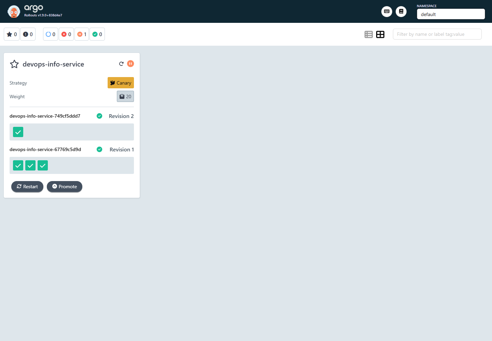
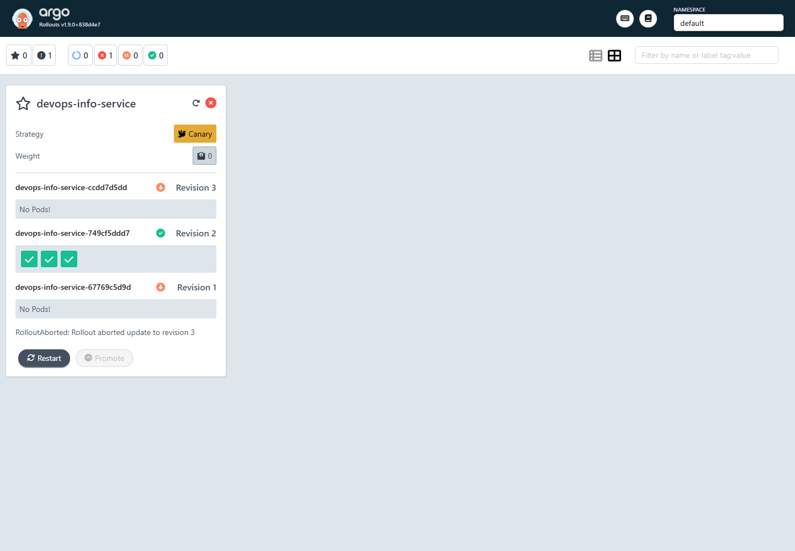
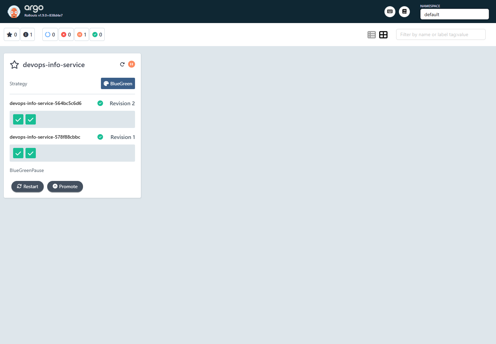
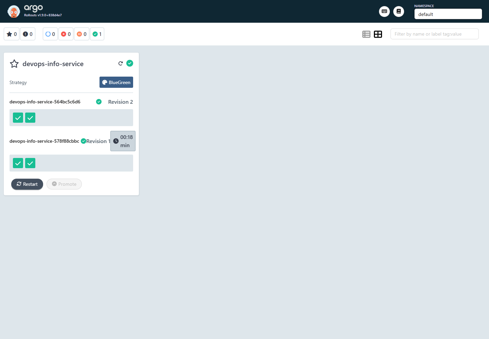
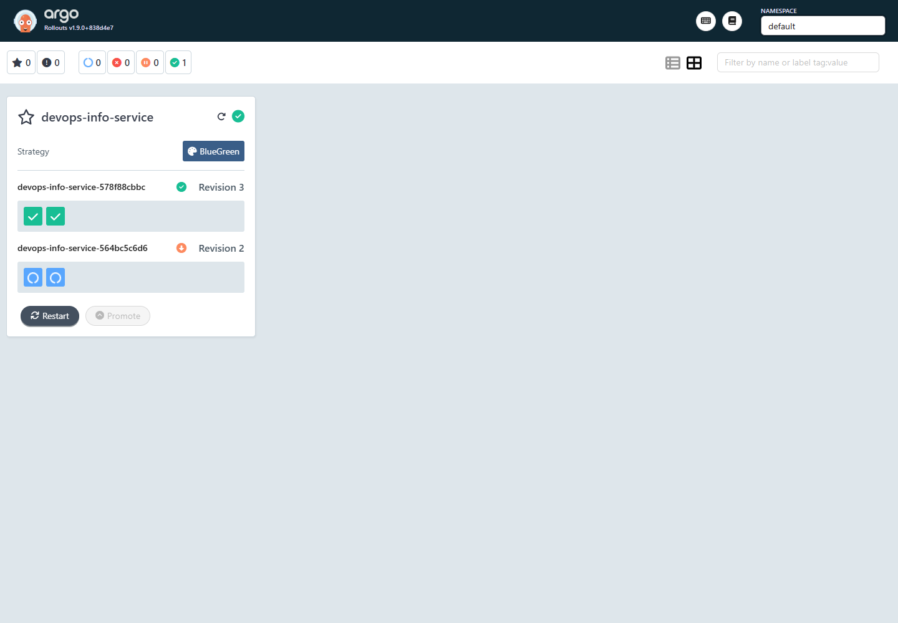
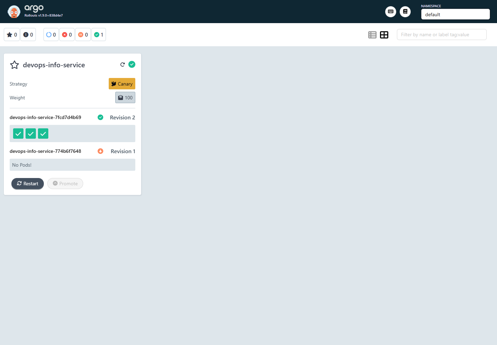
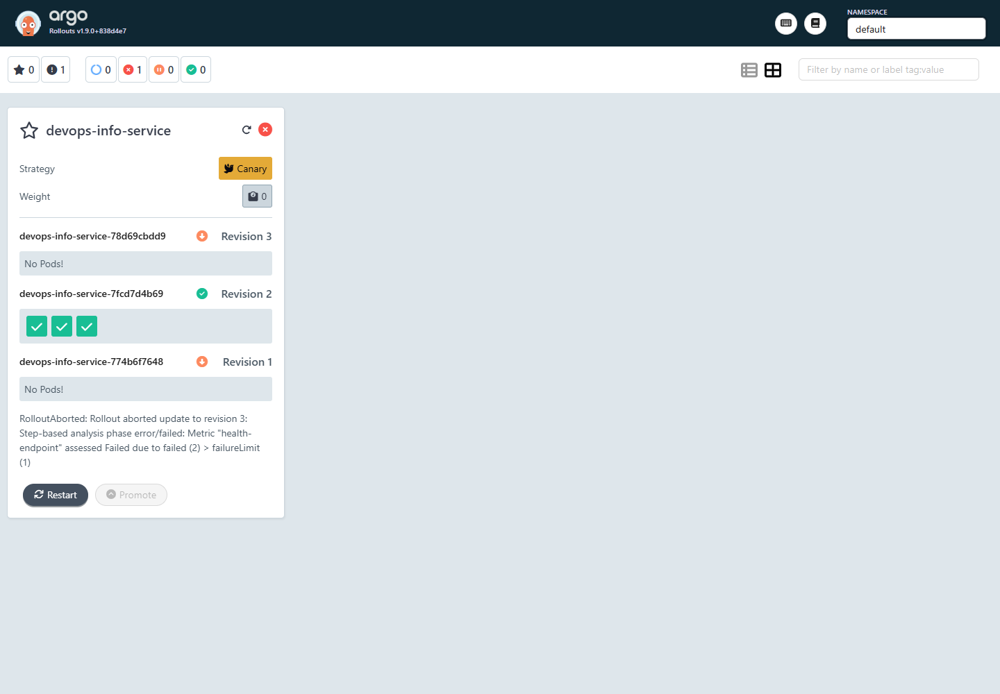

# Lab 14: Progressive Delivery with Argo Rollouts

## Scope

This lab replaces the regular Kubernetes `Deployment` from the Helm chart with an Argo Rollouts `Rollout` when progressive delivery is enabled. The implementation covers canary deployment, blue-green deployment, dashboard inspection, manual promotion, abort and rollback, plus a bonus AnalysisTemplate for automated rollback.

Main chart:

```text
solution/k8s/devops-info-service
```

Implemented files:

```text
solution/k8s/devops-info-service/templates/rollout.yaml
solution/k8s/devops-info-service/templates/service-preview.yaml
solution/k8s/devops-info-service/templates/analysis-template.yaml
solution/k8s/devops-info-service/values-canary.yaml
solution/k8s/devops-info-service/values-bluegreen.yaml
solution/k8s/devops-info-service/values-canary-analysis.yaml
solution/k8s/devops-info-service/values-canary-analysis-fail.yaml
```

The original `Deployment` is still available. It is rendered only when:

```yaml
workload:
  kind: Deployment
```

The Rollout is rendered when:

```yaml
workload:
  kind: Rollout
```

## Argo Rollouts Setup

Argo Rollouts was installed into the `argo-rollouts` namespace:

```powershell
kubectl create namespace argo-rollouts
kubectl apply -n argo-rollouts -f https://github.com/argoproj/argo-rollouts/releases/latest/download/install.yaml
kubectl apply -n argo-rollouts -f https://github.com/argoproj/argo-rollouts/releases/latest/download/dashboard-install.yaml
```

Verification:

```powershell
kubectl rollout status deployment/argo-rollouts -n argo-rollouts
kubectl rollout status deployment/argo-rollouts-dashboard -n argo-rollouts
kubectl get pods -n argo-rollouts
kubectl get crd rollouts.argoproj.io analysistemplates.argoproj.io analysisruns.argoproj.io
kubectl argo rollouts version --short
```

Observed result:

```text
argo-rollouts controller: Running
argo-rollouts dashboard: Running
kubectl-argo-rollouts: v1.9.0
```

Dashboard access:

```powershell
kubectl port-forward svc/argo-rollouts-dashboard -n argo-rollouts 13100:3100
```

Local URL:

```text
http://127.0.0.1:13100/rollouts/
```

Port `13100` was used locally because port `3100` was unavailable on the Windows host. The dashboard service still listens on port `3100` inside Kubernetes.

Evidence:


## Rollout vs Deployment

`Deployment` provides a standard rolling update. It can control surge and unavailable pods, but it does not provide built-in manual gates, preview traffic, analysis runs, or rich rollout-specific rollback controls.

`Rollout` keeps the familiar Deployment shape:

```yaml
replicas:
selector:
template:
```

It adds progressive delivery strategy configuration:

```yaml
strategy:
  canary:
    steps:
      - setWeight: 20
      - pause: {}
```

or:

```yaml
strategy:
  blueGreen:
    activeService: devops-info-service
    previewService: devops-info-service-preview
    autoPromotionEnabled: false
```

The practical difference is that Rollout controls ReplicaSets and service selectors during release, making promotion, abort, rollback, preview testing, and metric-based decisions explicit.

## Canary Deployment

Canary is enabled with:

```powershell
helm upgrade --install devops-info-service ./solution/k8s/devops-info-service `
  -f ./solution/k8s/devops-info-service/values-canary.yaml
```

Canary values:

```yaml
workload:
  kind: Rollout

replicaCount: 3

rollout:
  strategy: canary
```

Configured canary steps:

```yaml
steps:
  - setWeight: 20
  - pause: {}
  - setWeight: 40
  - pause:
      duration: 30s
  - setWeight: 60
  - pause:
      duration: 30s
  - setWeight: 80
  - pause:
      duration: 30s
  - setWeight: 100
```

Initial installation creates the first stable ReplicaSet directly. Canary behavior starts on the next pod template change:

```powershell
helm upgrade devops-info-service ./solution/k8s/devops-info-service `
  -f ./solution/k8s/devops-info-service/values-canary.yaml `
  --set env.releaseVersion=canary-v2
```

Monitoring:

```powershell
kubectl argo rollouts get rollout devops-info-service -w
```

Manual promotion from the first pause:

```powershell
kubectl argo rollouts promote devops-info-service
```

Abort test:

```powershell
kubectl argo rollouts abort devops-info-service
```

Observed behavior:

- Revision 2 stopped at the manual `20%` canary pause.
- Manual promotion allowed the rollout to continue through the timed `40%`, `60%`, and `80%` stages.
- A later canary update was aborted.
- The canary ReplicaSet was scaled down.
- The previous stable ReplicaSet continued serving traffic.

Evidence:






## Blue-Green Deployment

Blue-green is enabled with:

```powershell
helm upgrade --install devops-info-service ./solution/k8s/devops-info-service `
  -f ./solution/k8s/devops-info-service/values-bluegreen.yaml
```

Blue-green values:

```yaml
workload:
  kind: Rollout

replicaCount: 2

rollout:
  strategy: blueGreen
  blueGreen:
    autoPromotionEnabled: false
    scaleDownDelaySeconds: 30
```

Strategy:

```yaml
strategy:
  blueGreen:
    activeService: devops-info-service
    previewService: devops-info-service-preview
    autoPromotionEnabled: false
    scaleDownDelaySeconds: 30
```

Services:

```text
devops-info-service           active production service
devops-info-service-preview   preview service for the new ReplicaSet
```

The preview service is created by:

```text
solution/k8s/devops-info-service/templates/service-preview.yaml
```

Test flow:

```powershell
helm upgrade devops-info-service ./solution/k8s/devops-info-service `
  -f ./solution/k8s/devops-info-service/values-bluegreen.yaml `
  --set env.releaseVersion=bluegreen-v2

kubectl get svc devops-info-service devops-info-service-preview -o wide
kubectl argo rollouts get rollout devops-info-service
kubectl argo rollouts promote devops-info-service
kubectl argo rollouts undo devops-info-service
```

Observed service selectors before promotion:

```text
devops-info-service           rollouts-pod-template-hash=578f88cbbc
devops-info-service-preview   rollouts-pod-template-hash=564bc5c6d6
```

Observed service selectors after promotion:

```text
devops-info-service           rollouts-pod-template-hash=564bc5c6d6
devops-info-service-preview   rollouts-pod-template-hash=564bc5c6d6
```

Observed service selectors after rollback:

```text
devops-info-service           rollouts-pod-template-hash=578f88cbbc
devops-info-service-preview   rollouts-pod-template-hash=578f88cbbc
```

This confirms that blue-green promotion and rollback are service selector switches, so traffic moves immediately between ReplicaSets.

Evidence:







Service selector snapshots:

```text
k8s/screenshots/lab14/06-bluegreen-preview-services.txt
k8s/screenshots/lab14/07-bluegreen-promoted-services.txt
k8s/screenshots/lab14/08-bluegreen-rollback-services.txt
```

## Automated Analysis

The bonus task is implemented with a web-based `AnalysisTemplate`. It checks the application health endpoint through the Kubernetes service:

```yaml
apiVersion: argoproj.io/v1alpha1
kind: AnalysisTemplate
metadata:
  name: devops-info-service-health-check
spec:
  metrics:
    - name: health-endpoint
      interval: 10s
      count: 3
      failureLimit: 1
      successCondition: result == "healthy"
      provider:
        web:
          url: http://devops-info-service.default.svc/health
          jsonPath: "{$.status}"
```

The application returns:

```json
{
  "status": "healthy"
}
```

The analysis is part of the canary step sequence:

```yaml
steps:
  - setWeight: 20
  - analysis:
      templates:
        - templateName: devops-info-service-health-check
  - setWeight: 50
  - pause:
      duration: 30s
  - setWeight: 100
```

Successful analysis deployment:

```powershell
helm upgrade --install devops-info-service ./solution/k8s/devops-info-service `
  -f ./solution/k8s/devops-info-service/values-canary-analysis.yaml
```

Intentional failure deployment:

```powershell
helm upgrade devops-info-service ./solution/k8s/devops-info-service `
  -f ./solution/k8s/devops-info-service/values-canary-analysis-fail.yaml
```

The failure values file changes the success condition:

```yaml
successCondition: result == 'broken'
```

Observed result:

```text
devops-info-service-7fcd7d4b69-2-1   Successful
devops-info-service-78d69cbdd9-3-1   Failed
```

The failed AnalysisRun caused the rollout to abort revision 3, set canary weight back to `0`, scale down the failed canary ReplicaSet, and keep revision 2 as stable.

Evidence:





Text evidence:

```text
k8s/screenshots/lab14/09-analysis-success.txt
k8s/screenshots/lab14/10-analysis-auto-rollback.txt
k8s/screenshots/lab14/10-analysis-auto-rollback-rollout.txt
```

## Strategy Comparison

| Strategy | Best for | Strengths | Tradeoffs |
|---|---|---|---|
| Canary | Gradual exposure to users | Limits blast radius, supports metric gates, can pause and abort during rollout | Users can temporarily hit mixed versions unless traffic management is configured |
| Blue-green | Fast cutover after validation | Preview environment, instant promotion, instant rollback by switching service selectors | Requires duplicate capacity during release |

Recommendation:

- Use canary for user-facing services where gradual exposure and metric-based checks are important.
- Use blue-green when the new version needs full validation before receiving production traffic, or when rollback speed is the main concern.
- Add automated analysis to canary releases when reliable health, error-rate, or latency metrics are available.

## CLI Reference

Install controller and dashboard:

```powershell
kubectl create namespace argo-rollouts
kubectl apply -n argo-rollouts -f https://github.com/argoproj/argo-rollouts/releases/latest/download/install.yaml
kubectl apply -n argo-rollouts -f https://github.com/argoproj/argo-rollouts/releases/latest/download/dashboard-install.yaml
```

Open dashboard:

```powershell
kubectl port-forward svc/argo-rollouts-dashboard -n argo-rollouts 13100:3100
```

Deploy canary:

```powershell
helm upgrade --install devops-info-service ./solution/k8s/devops-info-service `
  -f ./solution/k8s/devops-info-service/values-canary.yaml
```

Deploy blue-green:

```powershell
helm upgrade --install devops-info-service ./solution/k8s/devops-info-service `
  -f ./solution/k8s/devops-info-service/values-bluegreen.yaml
```

Deploy canary with analysis:

```powershell
helm upgrade --install devops-info-service ./solution/k8s/devops-info-service `
  -f ./solution/k8s/devops-info-service/values-canary-analysis.yaml
```

Inspect rollout:

```powershell
kubectl argo rollouts get rollout devops-info-service
kubectl argo rollouts status devops-info-service
kubectl get analysisrun
kubectl get svc devops-info-service devops-info-service-preview -o wide
```

Operate rollout:

```powershell
kubectl argo rollouts promote devops-info-service
kubectl argo rollouts abort devops-info-service
kubectl argo rollouts retry rollout devops-info-service
kubectl argo rollouts undo devops-info-service
```

Validate chart:

```powershell
helm dependency build ./solution/k8s/devops-info-service
helm lint ./solution/k8s/devops-info-service
helm template devops-info-service ./solution/k8s/devops-info-service -f ./solution/k8s/devops-info-service/values-canary.yaml
helm template devops-info-service ./solution/k8s/devops-info-service -f ./solution/k8s/devops-info-service/values-bluegreen.yaml
helm template devops-info-service ./solution/k8s/devops-info-service -f ./solution/k8s/devops-info-service/values-canary-analysis.yaml
```

## Final Checklist

- Argo Rollouts controller installed and running.
- `kubectl-argo-rollouts` plugin installed and verified.
- Dashboard installed and accessed through port-forward.
- Helm chart supports both `Deployment` and `Rollout`.
- Canary strategy implemented with manual and timed pauses.
- Canary promotion tested.
- Canary abort and rollback tested.
- Blue-green strategy implemented with active and preview services.
- Blue-green preview, promotion, and rollback tested.
- AnalysisTemplate implemented.
- Analysis success and automatic rollback on failure tested.
- Report and evidence files are included.
